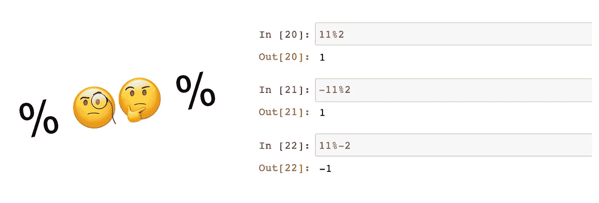

# Python 中负数的模运算(%)

> 原文：<https://betterprogramming.pub/modulo-operation-with-negative-numbers-in-python-38cb7256bb32>

## 你有没有想过它是如何工作的？



作者照片。

这是我最近学到的东西，我认为值得分享，因为它让我很惊讶，这是一个非常有用的学习事实。Python 如何处理负数的取模运算？所以，让我们长话短说，直奔主题。

> “Python 中的`%`符号被称为模运算符。它返回左操作数除以右操作数的余数。它用来得到除法问题的余数。”——*[freeCodeCamp](http://www.freecodecamp.org)*

*基本语法是:*

*   **a % b = r**

*在上例中， *a* 除以 *b* ，返回 *r* (即余数)。现在让我们看一个数字的例子:*

*   **7 % 2 = 1**

*上例的结果是 *1* 。 *2* 三次进入 *7* 还剩 *1* 。同样，如果我们选择两个数字，其中 *b > a* ，我们将得到以下结果:*

*   *3 % 4 = 3*

*这会导致 *3* 因为 *4* 在任何时候都不会进入 *3* ，所以原来的 *3* 仍然存在。*

*模运算符的兄弟称为整数除法运算(`//`)，其中小数部分(即余数)被丢弃。举以下例子:*

*   **5 // 2 = 2**

*对于正数，没有什么好惊讶的。然而，如果其中一个操作数为负，结果也将被 floored(即从 *0* 向负无穷大舍入)，返回小于或等于 *x* 的最大整数。例如:*

*   **-5 // 2 = -3**

*现在，有几种方法来执行这个操作。与 C 或 C++不同，Python 的模运算符总是返回一个与分母(除数)符号相同的数字，因此后面的等式如下:*

*   **mod = a—math . floor(a/b)* base**

*例如，使用我们之前的一个示例，我们会得到:*

*   **mod = 7—math . floor(7/2)* 2**
*   **mod = 7–3 * 2 = 1**

*并且整体逻辑根据以下前提工作:*

*   **a/b = q* 带余数 *r**
*   *使得: *b*q + r = a* 和 *0 < = r < b**

*现在，如果我们想让这种关系扩展到负数，有几种方法可以处理这种情况。根据[维基百科](http://en.wikipedia.org/wiki/Modulo_operation)的说法，在数学数论中，数学家们更喜欢遵循负无穷大的下限，如下例所示:*

*   **-500/27 = -18.51**
*   **math.floor(-500/27) = -19**

*Python 遵循同样的逻辑。为什么？根据 Python 的创始人吉多·范·罗苏姆的说法，这个标准有一些有趣的应用。例如，考虑获取一个 POSIX 时间戳(从 1970 年开始的秒数)并将其转换为一天中的时间。由于一天有*24 * 3600 = 86400*秒，所以这个计算简单来说就是*t % 86400*。但是，如果我们用负数来表示 1970 年以前的时间，那么使用其他标准会给出一个没有意义的结果，而使用下限规则就可以了。*

*最后，在处理负数时，请考虑以下几点:*

*   *如果 *a < 0* 那么 *0 < = r < b* 保持不变。*
*   *但是如果 *b < 0* 那么 *0 > = r > b* 。*

*最后，我们来看一个 *a = -500* 和 *b = 12* 的快速例子:*

*   **-500/12 = -41.67**
*   **-500 % 12 = 4**
*   **-500 // 12 = -42**

*然后我们可以检查 *b*q + r = a* :*

*   **12 * -42 + 4 = -500**

*在这篇文章的最后，让我们来看看负数模运算符的一个有趣的应用:将 24 小时制中的一个小时转换成 12 小时制。这个挑战看起来很简单，对吗？例如， *23%2* 会给我们 *11* 而 *15%12* 会给我们 *3* …正是我们想要的！现在，当我们点击数字 *12* 时，情节变得复杂了，因为 *12%12* 将给出 *0* ，这是午夜而不是中午。*

*这里的解决方案是对负数使用模运算符。比如 *-22%12* 会给我们 *2* 和 *-19/12* 会给我们 *5* 。根据经验，这种运算总会告诉我们，在下一个分母的倍数到来之前，我们还剩多少个单位。在我们的第一个例子中，我们在 *12x2* 之前缺少两个小时，以类似的方式， *-34%12* 也会给我们 *2* ，因为在 *12x3* 之前我们还有两个小时。*

*因此，回到我们最初的挑战，即将 24 小时制的一个小时转换成 12 小时制，我们可以写如下:*

```
*def convert24to12(hour):return 12 — ((- hour) % 12)*
```

*今天到此为止。别忘了看看我关于更好编程的其他一些故事:*

*[](https://medium.com/better-programming/facing-a-classification-project-in-machine-learning-462b319873de) [## 面对机器学习中的分类项目

### 温和的逐步指导

medium.com](https://medium.com/better-programming/facing-a-classification-project-in-machine-learning-462b319873de) [](https://medium.com/better-programming/how-to-divide-data-into-train-and-test-assuring-representativeness-c4c12c215d79) [## 使用随机森林将数据分成训练和测试以保证代表性

### 使用 Python 和 Sklearn

medium.com](https://medium.com/better-programming/how-to-divide-data-into-train-and-test-assuring-representativeness-c4c12c215d79) 

而我**如果你想直接在你的邮箱里收到我的最新文章，只需** [**订阅我的简讯**](https://gmail.us3.list-manage.com/subscribe?u=8190cded0d5e26657d9bc54d7&id=3e942158a2) **:)。**再见，感谢阅读！感谢阅读！*