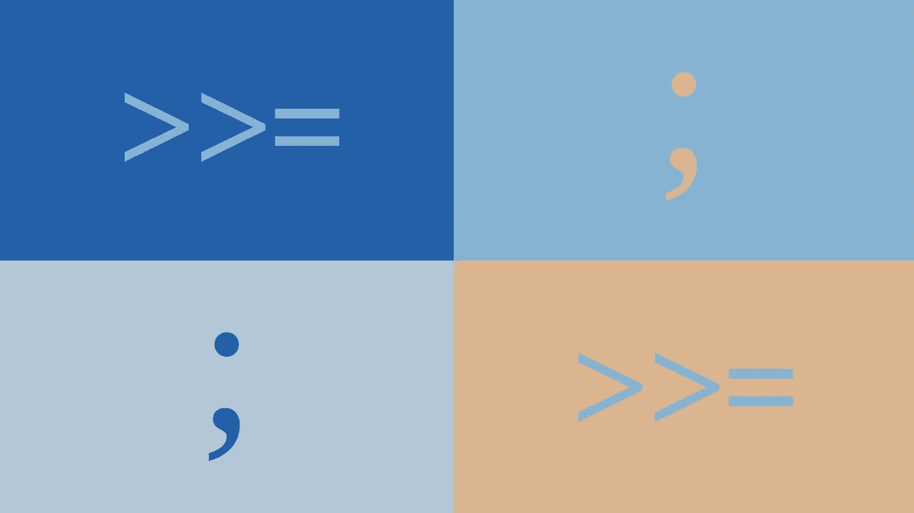

# 单子只是花哨的分号

> 原文：<https://betterprogramming.pub/monads-are-just-fancy-semicolons-ffe38401fd0e>

## 单子可能会令人害怕——把它们当作花哨的分号来对待会让它们变得有趣！

图片作者:Marcel Moosbrugger

单子是可编程的分号。就是这样。对于程序员来说，monad 提供了允许对动作进行排序的功能。此外，在每两个后续操作之间，会执行一个特定的代码片段。

*所以，单子是分号——但是你可以配置它的确切行为。*

# 让我们后退一步，慢慢开始

在 C 或 Java 这样的命令式语言中，分号被用来表示一系列操作。分号前面的代码在分号后面的代码之前执行。在像 Haskell 这样的语言中，一切或多或少只是一个表达式，乍一看，如何对程序的两个部分进行排序并不明显。

> **很高兴知道:**单子来源于一个叫做“范畴理论”的数学领域为了在 Haskell 中使用和理解单子，没有必要知道这个数学学科的定义和定理。

**那么，如果测序在其他语言中更容易做到，那么 Haskell 的设计是不是很糟糕？**

没有，一点也没有。有人可能会说，测序变得更加困难是故意的。Haskell 被设计成引用透明的，这只是一种奇特的说法，即每个函数调用都可以用它的返回值替换。

假设您有一个名为`doCalculation`的函数，它接受一个数字，进行一些计算并返回一个数字。在 Haskell 中，表达式`doCalculation(x) + doCalculation(x)` 可以替换为`*2 * doCalculation(x)*`，我们可以确信程序的行为不会改变。在 Java 中，一般来说这种替换是不可能的，因为不能保证`doCalculation` 在每次调用时都返回相同的结果。例如，该方法可以只调用一个随机数生成器，并总是返回不同的结果。此外，在像 Java 这样的语言中,`doCalculation`可能会包含一些常见的副作用，比如写入数据库或退出控制台。

引用透明有很多好处。参考透明语言的编译器更容易优化。此外，并行可以在一定程度上实现自动化。然而，所有这些特征都伴随着更难测序的代价。但就此而言，我们可以利用单子。

# 让我们成为一个单子

这样的分号怎么编程和使用？让我们用一个例子来回答这个问题:创建和编辑购物清单。购物清单被表示为字符串列表。我们可以实现一些功能，允许向购物列表中一个接一个地添加项目，以及删除列表中的第一个项目。此外，我们希望计算购物清单被操作(添加和删除商品)的次数。

首先，我们必须定义一个新的类型:

类型`Counter`由一个名为`counter`的整数和一个任意元素组成。对于我们的购物清单，元素将是一个字符串列表。计数器将表示对该列表进行的操作的次数。

让我们进入重要的部分。为了编程我们的分号，启用序列，我们做如下:

这是所有奇迹发生的地方。从更简单的函数开始，`return`只是为给定的元素构造一个新的`Counter`。它可以用来构建一个新的`Counter`，从给定购物清单的`0`操作开始。

`>>=` **是“可编程分号”**。和 Haskell 中的所有东西一样，这只是另一个函数。在我们的例子中，它的类型是`*Counter a -> (a -> Counter b) -> Counter b*`(对于我们的具体购物列表，a 和 b 都是字符串列表)。

我们慢慢来。

`>>=`得到一个带有元素的`Counter`(代码中称为 *x* )。它用一个给定的函数操纵元素，这个函数再次返回一个`Counter`。最后，`>>=`返回一个新的`Counter`，其中代表操作次数的整数是给定`Counter`的整数加上给定函数返回的`Counter`的整数加上`1`。

在我们的可编程分号的定义中至关重要的是，第二个参数中给出的函数之前的`Counter` 是已知的，可以进行求值。因此，如果第一个参数中的`Counter`(在`>>=`之前)只是一个产生具体`Counter`的表达式，我们可以确定这个表达式将在第二个参数中给出的函数(在`**>>=**`之后)被调用之前被求值。

为了能够在购物清单中添加和删除商品，我们需要再定义两个函数，这两个函数都是一行程序。此外，我们定义了我们的第一个购物清单——即空购物清单。

至此，我们已经准备好创建一个典型的购物清单，一次一个项目。

执行代码会产生以下输出:

这里发生了什么？

我们从空的购物清单开始，其中没有任何元素，它的计数器被初始化为`0`。我们的可编程分号`>>=`获取一行产生的列表，并将其传递给下一行的函数。

空购物清单本质上是通过线传递的，并且在每个阶段都被操纵。中心点是，我们可以确定，例如，“面包”加在“黄油”之前。如上所述，这要感谢我们的可编程分号的定义。

但是请注意，我们的“一元行为”中的一切都是由函数组成的。每一行都是匿名函数(第一行除外)，还有`>>=`。总之，我们已经实现了一种以纯函数方式对动作进行排序的方法。

Haskell 提供了很多语法上的好处，允许以更强调顺序属性的方式编写上面的一元操作:

这两个定义是完全等价的。最后，用哪一个是一个品味的问题。不过，首先，建议使用显式形式，以提醒您在幕后发生了什么。

关于操纵的计数还有一个重要的事实。一旦在可编程分号中定义，计数在一元操作中是完全不可见的。神奇的事情发生在我们的分号里面，`>>=`。因为这个函数的功能可以自由定义，所以它是隐藏各种东西的好地方。例如，预定义的 maybe monad 隐藏了对其可编程分号中的`null`的检查，并在`null`出现时跳过所有后续行。而且，日志可以以一元的方式实现，隐藏在`>>=`中。解析器是另一个应用程序，它利用了状态单子——但那是另一回事了。

因此，单子在很多情况下都是有用的。最终，它们只是可编程的分号**。**