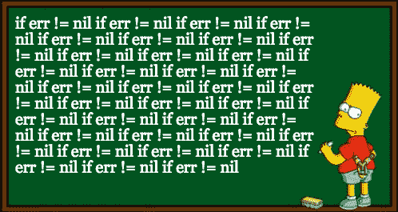

# 围棋程序员的单子

> 原文：<https://betterprogramming.pub/monads-for-go-programmers-6cda2b978cb1>

## 为什么？

单子是关于函数组合和隐藏它的乏味部分。

做了 7 年的 Go 程序员后，输入`if err != nil`会变得相当乏味。每次我输入`if err != nil`的时候，我都会感谢地鼠为我提供了一种可读性很强的语言和很棒的工具，但同时我也会诅咒他们让我觉得自己是被拘留的巴特·辛普森。

[我怀疑我不是唯一的一个](https://anvaka.github.io/common-words/#?lang=go)，但是

单子不仅仅用于隐藏一些错误处理，还可以用于列表理解和并发，这里仅举几个例子。

不要读这个

在埃里克·梅耶尔关于 Edx 的[函数式编程课程介绍中，他要求我们不要再写关于`monads`的文章，因为已经有很多了。](https://www.edx.org/course/introduction-functional-programming-delftx-fp101x-0)

我推荐你去看巴托兹·米莱斯基关于范畴理论的视频，它的高潮是一个视频，这是我见过的对单子的最好解释，而不是读这篇文章。

现在停止阅读！

# 函子

好吧，好吧…唉…记住我警告过你。

在我解释`monads`之前，我首先需要解释一下`functors`。A `functor`是 a `monad`的超类，这意味着所有的`monads`也是`functors`。我在解释`monads`的时候会用到`functors`，所以请不要粉饰这一节。

我们可以把一个`functor`看作一个容器，它包含一种类型的项目。

例子包括:

*   包含 T: `[]T`类型项目的片是一个容器，其中的项目被排序到一个列表中。
*   树:`type Node[T any] struct { Value T; Children []Node[T] }`是一个容器，它的项目被构造成一棵树；
*   一个通道:`<-chan T`是一个容器，像一个装水的管子；
*   指针:`*T`是一个容器，可以是空的，也可以包含一个项目；
*   一个函数:`func(A) T`是一个容器，就像一个锁箱，首先需要一把钥匙，才能看到物品；
*   多返回值:`func() (T, error)`是一个可能包含一个项目的容器。我们可以将错误视为容器的一部分。从这里开始，我们将把`(T, error)`称为一个元组。

> 非 Go 程序员:Go 没有代数数据类型或联合类型。这意味着不是函数返回值`*or*`错误，而是程序员返回值`*and*`错误，其中一个通常为零。有时我们打破惯例，返回一个值和一个错误，但两者都不为零，只是为了混淆彼此。哦，我们玩得很开心。
> 
> 在 Go 中拥有联合类型最流行的方法是拥有一个接口(抽象类)，然后在接口类型上拥有一个类型开关(一种非常简单的模式匹配形式)。

容器成为`functor`的另一个要求是，我们需要为该容器类型实现`fmap`函数。`fmap`函数将函数应用于容器中的每一项，而不会以任何方式修改容器或结构。

你可能从 Hadoop 的 MapReduce、Python、Ruby 或你能想到的几乎任何其他语言中认出了一个经典的例子，那就是 slice 的`map`函数:

我们也可以为一棵树实现`fmap`:

或者一个频道:

或者一个指针:

或者一个函数:

或者返回错误的函数:

所有这些容器及其各自的`fmap`实现都是`functors`的例子。

# 功能组成

既然我们知道 a `functor`只是:

*   容器的抽象名称，并且
*   我们可以对容器中的物品应用一个函数

，我们可以得到整个要点:a 的抽象概念`monad`。

A `monad`简单来说就是点缀型的。嗯……好吧，这无助于解释，太抽象了。这是试图解释什么是`monad`的典型问题。这就像试图解释什么是“副作用”,这太宽泛了。让我来解释一下抽象 a `monad`的原因。原因是要编写返回这些修饰类型的函数。

先说朴素的函数构成，没有修饰的类型。在本例中，我们想要组合两个函数`f`和`g`，并返回一个函数，该函数接受`f`所期望的输入，并返回来自`g`的输出:

显然，只有当`f`的输出类型与`g`的输入类型匹配时，这才会起作用。另一个版本是编写返回错误的函数。

现在我们可以尝试将这个错误抽象为一个修饰`M`,看看我们还剩下什么:

我们必须返回一个将`A`作为输入参数的函数，所以我们从声明返回函数开始。现在我们有了一个`A`，我们可以调用`f`并得到一个类型为`M[B]`的值`mb`，但是现在呢？

我们做得不够，因为它太抽象了。我的意思是现在我们有了`mb`，我们该做什么？当我们知道这是一个错误时，我们可以检查它，但是现在它被抽象掉了，我们就不能检查了。但是…如果我们知道我们的修饰`M`也是一个`functor`，那么我们可以`fmap`超过`M`:

我们想要对`fmap`使用的函数`g`不像`C`那样返回简单类型，而是返回`M[C]`。幸运的是这对`fmap`来说不是问题，但是它稍微改变了类型签名:

所以现在我们有了一个类型为`M[M[C]]`的值`mmc`:

我们需要一种从`M[M[C]]`到`M[C]`的方法。

我们需要我们的修饰`M`不仅仅是一个`functor`，还要有另一个属性。这个额外的属性是一个名为`join`的函数，为每个`monad`定义，就像为每个`functor`定义`fmap`一样。

给定 join，我们现在可以写:

这意味着如果修饰定义了`fmap`和`join`，我们可以组合两个返回修饰类型的函数。换句话说，对于要成为`monad`的类型，需要为它定义这两个函数。

# 加入

单子是`functors`，我们不需要再为它们定义`fmap`。我们只需要定义一下`join`。

我们现在将定义`join`为:

*   列表，这将导致列表理解，
*   错误，这将导致一元错误处理和
*   通道，这将产生一个并发管道。

## 列出理解

在切片上连接是最简单的，也可能是最容易开始的。`join`函数只是连接所有的切片。

让我们看看为什么我们再次需要`join`，但是这次特别关注切片。下面是我们的切片合成函数:

如果我们将`a`传递给`f`，我们将得到类型为`[]B`的`bs`。

我们现在可以用`g`覆盖`fmap`，这将给我们一个类型为`[][]C`而不是`[]C`的值:

这就是为什么我们需要`join`。我们需要从`css`到`cs`或者从`[][]C`到`[]C`。

让我们来看一个更具体的例子:

如果我们替换我们的类型:

*   `A`为`int`型，
*   `B`为类型`int64`和
*   `C`为`string`型。

那么我们的功能就变成了:

现在我们可以在一个例子中使用它们:

这让我们第一次有了切片`monad`。

有趣的是，这正是列表理解在 Haskell 中的工作方式:

但是您可能会从 Python 中更好地识别它:

## 一元错误处理

我们也可以在返回一个值和一个错误的函数上定义`join`。为此，我们首先需要再次回到`fmap`函数，因为 Go 中有一些特质。

这是我们的`fmap`函数，它返回一个值和一个错误:

我们知道我们的 compose 函数将使用函数`f`调用`fmap`，该函数也返回一个错误。这将导致我们的`fmap`签名看起来像这样:

不幸的是元组在围棋中不是一等公民，所以我们不能写:

有几种方法可以解决这个问题。我更喜欢使用函数，因为返回元组的函数仍然是一等公民:

现在我们可以为返回一个值和一个错误的函数定义我们的`fmap`,使用我们的工作:

这让我们回到了我们的要点，我们在`(func() (C, error), error)`上的`join`函数。它非常简单，只是为我们做了一个错误检查。

我们现在可以使用我们的 compose 函数，因为我们已经定义了`join`和`fmap`:

这导致我们必须做更少的错误检查，因为`monad`使用`join`函数在后台为我们做了这些。

这是另一个[例子](https://speakerdeck.com/rebeccaskinner/monadic-error-handling-in-go?slide=77)，我感觉像巴特·辛普森:

从技术上讲,`compose`可以接受两个以上的函数作为参数。这意味着我们可以在一次调用中将上述所有函数链接在一起，并重写上面的示例:

还有许多其他的`monads`。想出任何两个返回相同修饰类型的函数，并且您想要组合它们。再来做一个例子。

## 并行管道

我们也可以在通道上定义`join`。

这里我们有一个通道`in`，它将为我们提供更多类型`T`的通道。我们首先创建`out`通道，启动一个 go 例程，这个例程将被用来为它提供信息，然后返回它。在 go 例程中，我们为从`in`读取的每个通道启动一个新的 go 例程。这些 go 例程将它们的输入事件发送到`out`，将多个输入合并成一个流。最后，我们使用一个等待组来确保一旦接收到所有输入就关闭`out`通道。

简而言之，我们正在从`in`读取所有`T`并将它们全部推送到`out`通道。

> 非 go 程序员:我必须将`c`作为参数传递给内部 Go 例程，因为`c`是一个单一变量，它接受通道中每个元素的值。这意味着，如果我们只是在闭包内使用它，而不是通过将它作为参数传递来创建值的副本，我们可能只会从最新的通道中读取。这是围棋程序员常犯的错误。

这意味着我们可以在返回通道的函数上定义一个组合函数。

由于`join`的实现方式，我们几乎可以免费获得并发。

# 戈德里夫

如果你想使用这些工具，你可以在 Go right 中使用泛型或者用 [goderive](https://github.com/awalterschulze/goderive) 生成代码，这允许你一次编写两个以上的函数。

# 少挥手

这是对`monads`的一个非常粗略的解释，为了让事情更简单，我故意省略了很多东西，但是还有一件事我想讲一下。

从技术上讲，我们在上一节中定义的构造函数被称为`Kleisli Arrow`。

当人们谈论`monads`时，他们很少提到`Kleisli Arrow`，这是我理解`monads`的关键。如果你运气好，他们会用`fmap`和`join`来解释，但是如果你运气不好，像我一样，他们会用 bind 函数来解释。

为什么？

因为`bind`是 Haskell 中的函数，如果你想让它被认为是`Monad`的话，你需要为你的类型实现它。

让我们在这里重复一下 compose 函数的实现:

如果实现了`bind`函数，那么我们可以简单地调用它，而不是`fmap`和`join`。

也就是说`bind(mb, g)` = `join(fmap(g, mb))`。

根据语言的不同，列表的`bind`功能可能是`concatMap`或`flatMap`。

## 斜视

我发现 Go 开始模糊我在`bind`和`Kleisli Arrow`之间的界限。Go 返回元组中的错误，但元组不是一等公民。例如，这段代码将无法编译，因为您无法以内嵌的方式将`f`的结果传递给`g`:

你必须把它写出来:

或者你必须让`g`接受一个函数作为输入，因为函数是一等公民。

但这意味着我们的绑定函数:

错误定义如下:

使用起来并不有趣，除非我们将元组压缩成一个函数:

如果我们眯着眼睛看，我们可以看到我们返回的元组也是一个函数:

如果我们再眯着眼睛看，我们可以看到这是我们的合成函数，其中`f`只接受零个参数:

哒哒，我们有我们的`Kleisli Arrow`，只要眯几眼。

# 结论

单子抽象掉了一些用修饰类型构成函数的重复逻辑，这样你就不会觉得自己像是被拘留的巴特·辛普森，而是像是在滑板上的巴特·辛普森，在轮到他击球的时候投球。

如果你想在 Go 中尝试`monads`和其他函数式编程概念，那么你可以使用我的代码生成器 [GoDerive](https://www.youtube.com/watch?v=qFYByoGFIUE) 来实现。

> 警告:函数式编程的关键概念之一是不变性。这不仅使程序更容易推理，而且允许编译器优化。为了模拟这种不变性，在 Go 中，你将倾向于复制大量的结构，这将导致非最优的性能。函数式编程语言能够避免这种情况的原因正是因为它们可以依赖于不变性，并且总是指向旧的值，而不是再次复制它们。
> 
> 如果真的想过渡到函数式编程，我会推荐 [Elm](http://elm-lang.org/) 。它是一种用于前端的静态类型的函数式编程语言。学习函数式语言就像学习命令式语言一样简单。我在一天内完成了这个[指南](https://guide.elm-lang.org/),当天晚上我就能够开始高效工作了。造物主特意通过消除理解单子的需要，使学习语言变得容易。我个人发现`Elm`在前端与 Go 在后端结合使用非常有趣。如果你开始对 Go 和 Elm 感到厌烦，不要担心还有很多东西要学，Haskell 在等着你。

# 谢谢你

*   [Johan Brandhorst](https://jbrandhorst.com/) 负责校对，并督促我写博客。
*   [Ryan Lemmer](https://github.com/uroboros) 负责校对和“副作用”一行。
*   [安东·亨德里克斯](https://www.linkedin.com/in/anton-hendriks-1b549514/)校对和许多简化。
*   [Brink van der Merwe](http://www.cs.sun.ac.za/~abvdm/) 校对。

# 引用的

*   [戈朗周刊](https://golangweekly.com/issues/179)
*   [顶部](https://github.com/awalterschulze/blog/raw/main/waltercv/topofrhaskell.png)的[r/哈斯克尔](https://www.reddit.com/r/haskell/comments/73afpz/monads_for_go_programmers/)