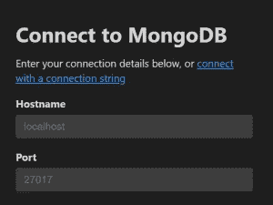
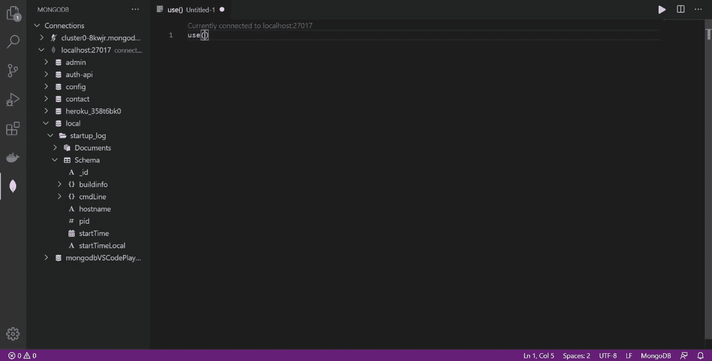

# MongoDB for VS Code:一种使用 Mongo 的新方法

> 原文：<https://betterprogramming.pub/mongodb-for-vs-code-a-better-way-to-work-with-mongo-e4de95c921c2>

## 一个 VS 代码扩展，用于在您的 IDE 中使用 Mongo


丹尼尔·麦金尼斯在 [Unsplash](https://unsplash.com?utm_source=medium&utm_medium=referral) 上的照片。

Visual Studio 代码已经成为开发人员最喜欢的编辑器。MongoDB 为 VS 代码引入了一个新的扩展，使得使用 Mongo 变得非常容易。

# 包里有什么？

VS 代码正在努力让开发人员更有效率。与此同时，MongoDB 已经为 VS 代码构建了一个名为 [MongoDB 的扩展，它允许您直接从编辑器连接到 MongoDB Shell 和 MongoDB Atlas。现在，您不必导航到您的终端来连接 Mongo Shell 或使用像 MongoDB Compass、Robomongo 等 GUI 工具。执行基本的蒙哥操作。](https://marketplace.visualstudio.com/items?itemName=mongodb.mongodb-vscode)

使用扩展，您可以:

*   从您的编辑器直接连接到 MongoDB shell 或 Atlas 集群。
*   浏览数据库、集合和文档。
*   查看和分析您的模式。
*   MongoDB Playground 中的原型 CRUD 操作和 MongoDB 命令，具有自动完成和语法突出显示功能。

# 安装延伸部分

要安装扩展，只需在 VS 代码的扩展搜索中搜索它，或者在市场中导航到 VS 代码的 [MongoDB。](https://marketplace.visualstudio.com/items?itemName=mongodb.mongodb-vscode)

# 正在连接到 MongoDB

该扩展允许您连接到多个 MongoDB 实例。您可以连接到本地 MongoDB 实例、Atlas 集群或任何自托管实例。



要进行连接，您可以输入主机名和端口，或者提供如下所示的连接字符串:

```
mongodb://localhost:27017/
```

一旦连接上，该扩展就为您提供了数据库、集合和文档的树形视图。此外，您还可以概述每个集合的模式。


在编写聚合和查询时，我们可能需要反复查看集合架构。在查询数据库时将模式放在面前会有很大帮助。

# 编辑器中的 MongoDB 游乐场

在终端中编写 Mongo 查询可能令人望而生畏。在终端中，您的查询没有自动完成和语法高亮显示。MongoDB Playground 允许您在 VS 代码中直接拥有查询自动完成和语法高亮显示等特性。这些特性使得编写、理解、执行和查看 MongoDB 查询的结果变得非常容易。它也是一个非常好的工具，可以将测试数据植入数据库，并与您的队友分享。

要创建操场，请单击 Connections 上方的三个水平点，然后选择 Create MongoDB Playground。这将打开一个只是 JavaScript 环境的游乐场，在这里您可以直接从编辑器编写和执行 MongoDB 查询。



游乐场让生活变得简单多了！

当您执行在操场上编写的查询时，扩展在 VS 代码的输出中显示结果。操场在编辑器中作为文件打开，因此您可以保存文件以供参考。有了这个平台，您还可以在编写其他应用程序代码时构建查询原型。

# 结论

MongoDB 刚刚为 VS 代码推出了这个扩展。与 MongoDB Compass 或其他工具相比，它的功能并不丰富，但它当前的特性已经让我使用 Mongo 变得容易多了。它必须不断发展，所以我们可以期待 MongoDB 很快会有许多新功能。