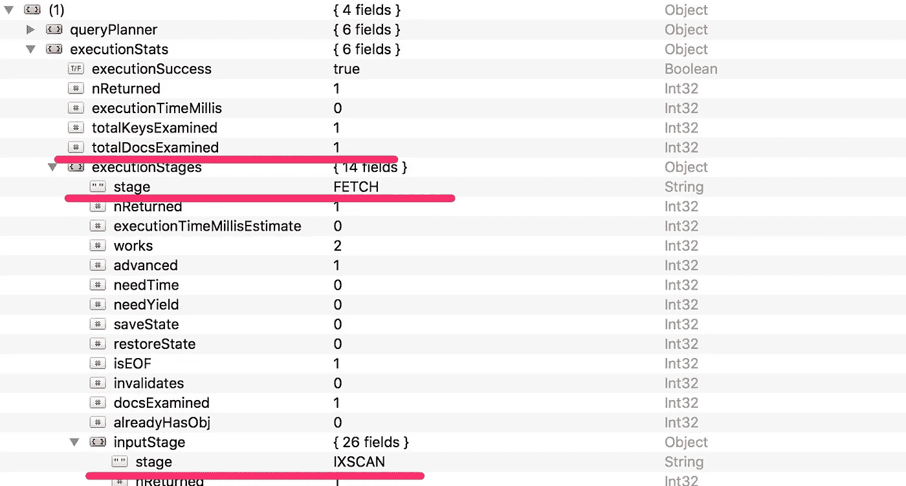

# MongoDB:利用索引和覆盖查询提高性能

> 原文：<https://betterprogramming.pub/mongodb-improve-performances-with-indexes-and-covered-queries-8fd1aa7f43e6>


约翰·施诺布里奇在 [Unsplash](https://unsplash.com/search/photos/computer?utm_source=unsplash&utm_medium=referral&utm_content=creditCopyText) 上的照片

在一个 [MongoDB](https://www.mongodb.com/) 集合上建立索引可能看起来是一个琐碎而基本的必要任务，因为我们经常在 Oracle 或 [MariaDB](https://mariadb.org/) / [MySQL](https://www.mysql.com/) 等 RDBMS 上这样做。

MongoDB 索引经常被误解，我经历过许多不正确的索引实现。与其他 DBMS 一样，MongoDB 索引也有自己的规范。

在这篇文章中，我想弄清楚 Mongo 中的基本索引是如何工作的，以及如何掌握它们，这样就涵盖了你的应用程序查询，增加了执行时间。


# MongoDB 索引类型

MongoDB 提供了多种索引类型，所以第一步是知道如何为您的应用程序上下文选择正确的索引。

## 单字段索引

这是集合中单个字段的基本索引集。

当您主要通过单个字段进行查询并根据该字段本身进行排序时，请使用像这样的简单索引。

单字段索引可以按升序和降序设置。这不是一个关键特性，因为我们是按单个字段选择的，所以 sort 方法可以按两种顺序读取索引(自然或反向)。

如果要索引整个嵌入文档，单字段索引会变得复杂。是的，如果您的查询大部分时间都试图匹配目标嵌入文档上的字段，这可能是合理的。

## 复合指数

这是一种涉及多个字段的索引，就像在 RDBMS 数据库中一样。

复合索引的行为类似于单字段索引，但是当我们耦合多个字段上的信息时，索引顺序成为一个关键的实现。

当您在目标集合上创建复合索引时，您可以选择在涉及的每个字段上是升序还是降序。

正确的选择取决于您将发送给引擎的查询，并且它必须是兼容的。例如，如果按升序对字段名进行索引，按降序对姓氏进行索引，则索引将只覆盖查询的一个子集。

## 多键索引

当你听说多键时，你是在和数组打交道。

数组在 MongoDB 集合中非常流行，因为它们是高效存储单个字段的多个值的好方法。

一旦我们使用数组，我们就开始考虑如何在数组中索引值。

当对保存数组值的字段进行索引时，MongoDB 会为数组中的每个元素创建一个索引键。这意味着索引大小增加了，但是它可以导致显著的性能改进。

## 文本索引

当您需要实现全文查询并按相关性对结果进行排序时，请使用文本索引。

文本索引是一个很棒的 MongoDB 特性，可以用来排除搜索查询中的单词，对多个单词进行完全匹配，并在文本字段上给出一个类似 Google 的搜索实现。

请记住，MongoDB 对文本索引有限制，一个集合最多只能有一个文本索引。

## 地理空间索引:二维球体和二维索引

这些种类的索引非常有趣。它们可用于索引纬度和经度坐标，以及 [GeoJSON](https://geojson.org/) 结构化数据。

使用这些索引来执行有效的查询，能够通过邻近、边界框等方式提取数据。

## 散列索引

散列索引将`hashed`指定为索引键值。

你可能想知道为什么我们需要这个。当您需要在多个 MongoDB 实例上分割您的集合时，散列索引在扩展中很受欢迎，因为它们改善了基数和值的分布。

# 涵盖的查询

只要查询是以某种方式组成的，MongoDB 就会认为查询是“覆盖的”,这样引擎就可以直接从索引中提取结果。

因此，覆盖查询是一个完全可以使用索引来满足的查询(它不需要检查任何文档)。

这意味着覆盖查询是我们的目标，因为它们可以由 MongoDB 3.2 以来可用的 MongoDB 引擎 [WiredTiger](http://www.wiredtiger.com/) 以最佳方式执行。

要记住的第一条规则是:以正确的方式在集合上建立索引。

选择索引类型和组成可能会成为一个陷阱，因为不容易理解查询何时被覆盖，何时未被覆盖。

`explain()`命令可能有用。您可以使用它来检查和理解查询执行，并检查在集合上设置索引后是否提高了性能。

# 运行覆盖查询

考虑一个名为 *users* 的简单集合和一个如下所示的简单文档:

```
{ 
    name : “Ivano”, 
    lastName : “Di Gese” 
}
```

目前，知道您可以在`name`字段上设置一个索引，并将匹配`name`字段值的查询转换为真正被索引覆盖是没有意义的。

只需在此集合上设置索引，我们就完成了:

现在，让我们看看 WiredTiger MongoDB 引擎如何使用`explain()`命令解释和执行查询。

我们将使用`executionStats`标志来显示相关信息:



`explain()`命令输出非常冗长，但是您可以过滤掉一些规范并注意突出显示的内容:

1.  `TotalDocsExamined`:显示光标所检查的文档数，与结果集的文档相匹配。
2.  `Stage`:这是输入阶段的`IXSCAN`，然后是执行阶段的`FETCH`。这意味着我们仅使用索引就完全覆盖了查询。`FETCH`意味着，即使我们使用索引来检索文档所属的内存地址，我们仍然需要从用户集合中获取它。

请记住，完全覆盖的查询是同时满足两个条件的查询([更多信息](https://docs.mongodb.com/manual/core/query-optimization/index.html#covered-query)):

1.  查询中的所有字段都是索引的一部分。
2.  结果中返回的所有字段都在同一个索引中。

由于我们不满足第二个条件，查询仍然没有被完全覆盖，因为我们仍然需要从用户集合中获取它。

这不是一个值得注意的实现。在检索了文档的内存位置后，从集合中提取单个文档并不复杂，也不会影响查询性能。

但是我们可以做得更好，我们只想使用指数。我们可以要求查询只检索一个精确的索引字段！

尝试执行以下查询:

```
db.users.find(
    { name : “Ivano” }, 
    { name : 1, _id : 0 }
).explain(“executionStats”)
```

你会注意到`TotalDocsExamined`现在最终为零。这意味着即使我们做了一个`PROJECTION`阶段(这是字段选择)，我们也不会访问集合，因为我们已经在索引中有了唯一需要的字段。

# 复合索引上的覆盖查询

上面的例子很简单。我们希望从索引本身提取数据，因此我们必须满足所涵盖的查询定义的两个条件。

现在，覆盖多个字段的索引会发生什么？

同样的故事，同样的行为。你自己试试。我们的目标始终是拥有最少的`TotalDocsExamined`，这意味着我们在执行`COLLSCAN`阶段时投入最少的努力和最少的比较数。

为了实现这个目标，要正确地使用索引，包括可能需要通过查找和聚合来检索的字段。

您的查询越复杂，索引设置阶段就越困难。

关于 MongoDB 索引还有很多需要了解的。我只是试图介绍索引类型和它们的基本行为。

掌握索引特性和机会需要做大量的工作，而且可能比看起来更困难，尤其是与 RDBMS 的索引策略相比。但是，正如你所知道的……没有付出就没有收获。