# MongoDB 性能 101:如何提高 MongoDB App 的速度

> 原文：<https://betterprogramming.pub/mongodb-performance-101-how-to-improve-the-speed-of-mongodb-app-a59f2390ee5>

## 用现实生活中的用例编制索引


克里斯蒂安·威迪格在 [Unsplash](https://unsplash.com?utm_source=medium&utm_medium=referral) 上拍摄的照片

这篇文章的灵感来自于我跟随 MongoDB 大学的 MongoDB 性能课程。这个课程给了我很多启发，让我知道在实际的生产项目中我可以在哪些地方改进以及如何优化查询。

在本文中，我将分享一个简单、常见但实用的用例来提高 MongoDB 的性能。

在开始之前，我将在本文中使用一些工具:

*   [MongoDB](https://www.mongodb.com/) (当然。我们正在讨论 MongoDB 性能优化)
*   MongoDB [指南针](https://www.mongodb.com/products/compass)(MongoDB 的 GUI)

# 用例:亚航 AVA 聊天机器人

在开始之前，我想发表一些免责声明:

*   我不在亚航工作。
*   我在这里建议和写的只是我个人的观点和解释，这意味着我可能是错的。

## 介绍

故事开始于我通过亚航预订了一张 11 月份去韩国的机票。然而，由于个人原因，我不得不取消航班，取消必须通过 [AVA 聊天机器人](https://newsroom.airasia.com/news/airasia-unveils-ai-chatbot-with-website-and-mobile-app-facelift)进行。

为了执行退款，它要求用户以连续的方式提供某些信息:

1.  订票号码(航班订票号码)
2.  姓氏/姓氏
3.  教名
4.  出生日期
5.  电子邮件地址

下面我也提供了一个截图。

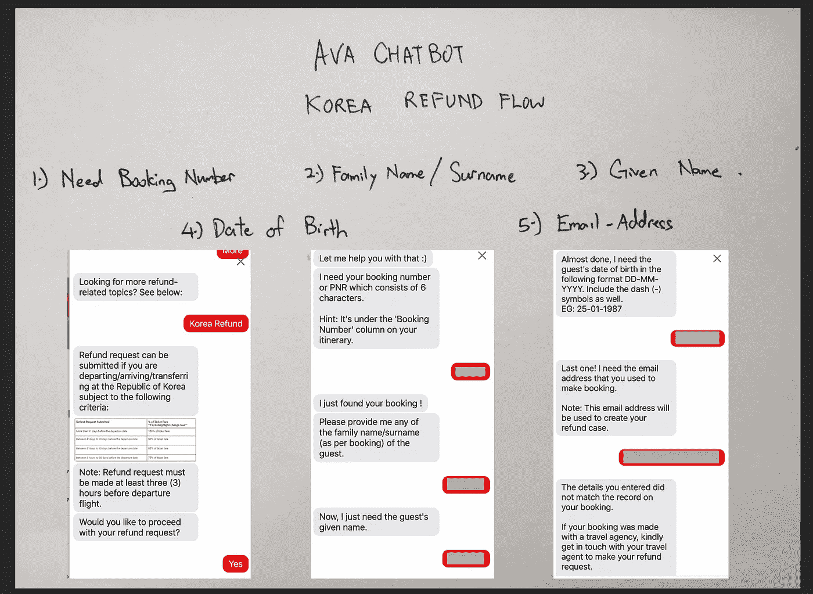

AVA 聊天机器人韩国退款流程

现在我们了解了退款流程及其所需的信息。让我们设计和模拟数据库。

## 数据准备

这一节解释了我如何准备数据库模型并将虚拟数据加载到我们的集合中，以便在后面的阶段进行性能优化。如果您来自 SQL 后台，那么表也可以识别集合。

我需要什么？

1.  我需要包含航班预订信息的记录列表。预订信息包括预订号、名字、姓氏、出生日期和电子邮件。这是我们集合中的必填字段。我还将创建另外两个字段，分别是 origin 和 destination，，只是为了使其更接近真实的生产数据。
2.  我还需要一个数据生成工具来生成一个百万文档数据集到我们的集合中，因为这允许我们发现更重要的发现，特别是在查询时间。在谷歌搜索了一番后，我在 GitHub 上发现了一个工具， [mgodatagen](https://github.com/feliixx/mgodatagen) ，它允许我用最少的配置在 MongoDB 中生成随机数据。

事不宜迟，让我们进入下一步。

**第一步。从数据生成库** [**下载工具发布**](https://github.com/feliixx/mgodatagen/releases) **页面**

请根据您的工作站操作系统下载该库。解压缩后，您将看到 mgodatagen 可执行文件。下面提供了一个截图。

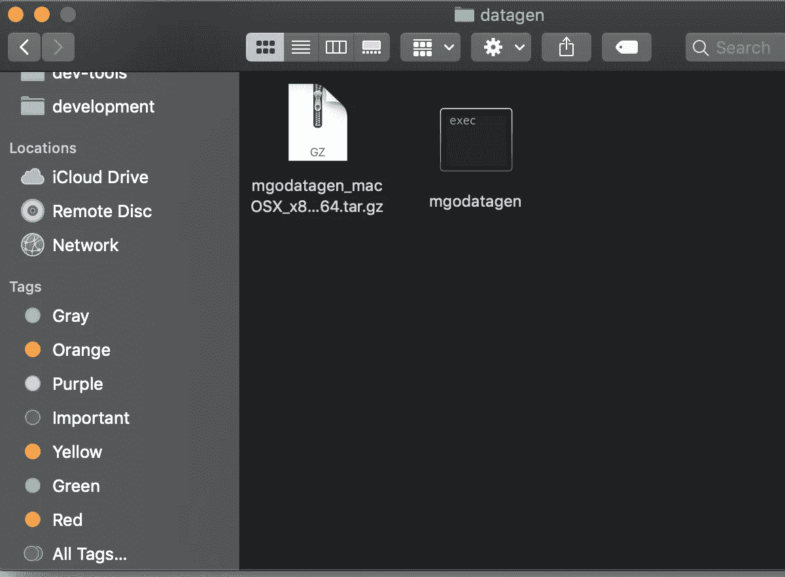

提取后的 mgodatagen 截图

**第二步。创建一个 config.json**

根据数据生成库，我们必须指定一些强制配置，例如，数据库的名称、集合名称、想要生成多少个文档等。

下面是我在同一级目录下创建的`config.json` 的要旨。

要点基本上告诉我们:

*   我们生成数据的地方——航班数据库和预订收集。如果这个数据库和集合还没有创建，不要担心，因为 MongoDB 会在数据插入之前为您创建它。
*   我们生成了多少数据——我们在 count 键中定义了一百万。
*   我们正在生成的文档和字段是什么。我们在内容密钥中定义了这一点。我们添加了我们需要的键以及它们各自的类型。例如，booking_no 是一个最小和最大 6 个字符的字符串。

现在我们已经准备好了所有的配置，让我们执行数据生成。对于数据生成，我们只需运行以下命令。

```
./mgodatagen -f config.json
```

它使用了我们之前定义的`config.json`并生成了数据。下面是生成数据的过程和成功生成数据的结果截图。

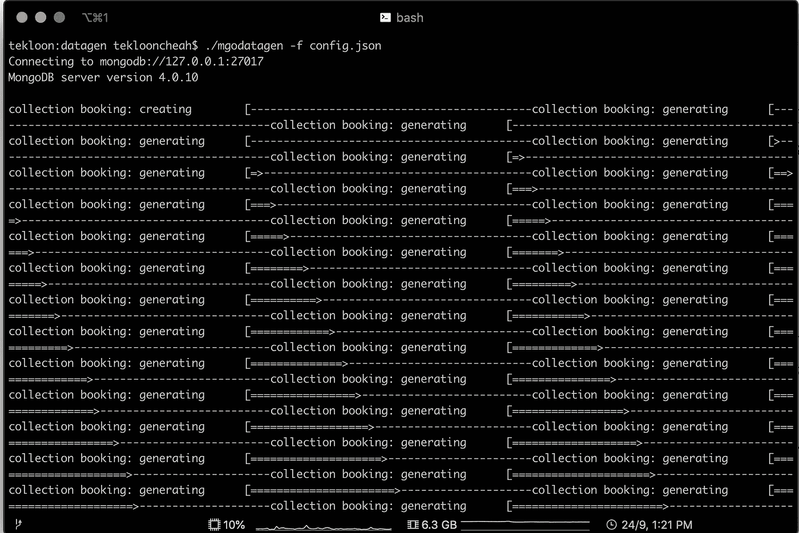

生成一百万个文档

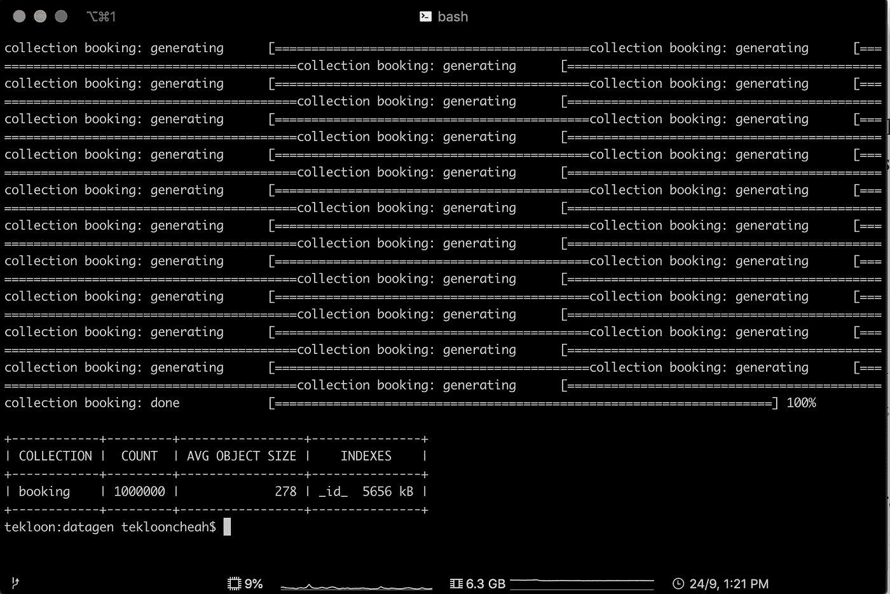

成功地在预订集合中生成了一百万个文档

**步骤三。验证数据生成**

现在让我们通过 Compass 验证数据库和集合是在您的本地 MongoDB 中生成的。参考下面的截图。

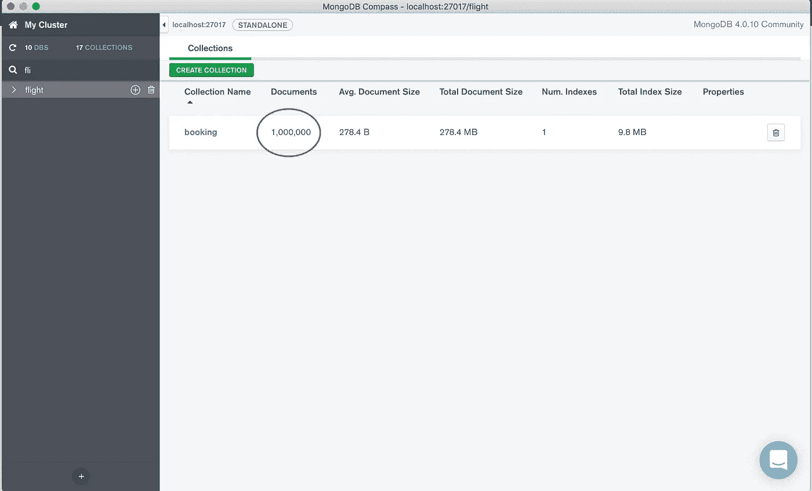

航班数据库，预订集合包含 100 万个文档

## 问题标识

这一节描述了我们遇到了什么样的性能问题。在优化性能之前，我们必须知道我们遇到了什么样的性能问题。

让我们尝试以下场景:

*   使用 booking_no 查询航班预订
*   使用姓氏查询航班预订
*   使用名字查询航班预订

让我们看看他们有什么共同点。

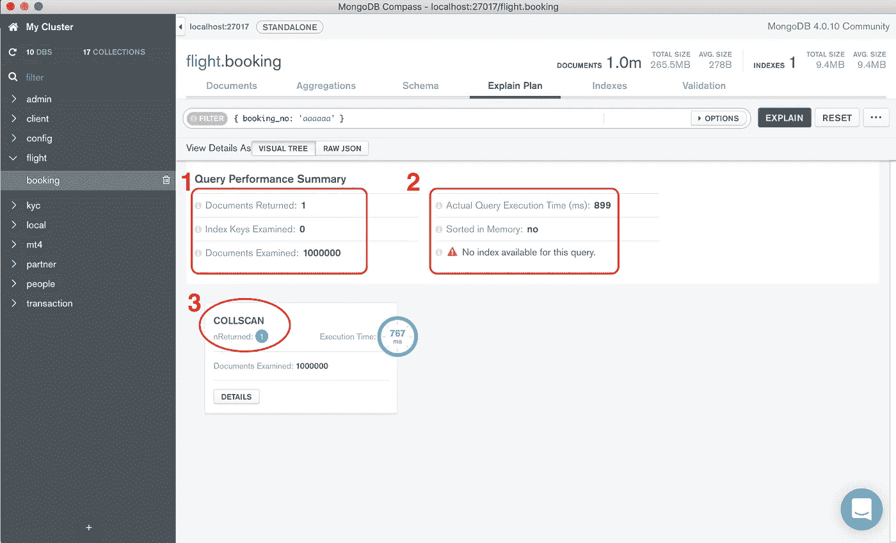

查询性能摘要的屏幕截图

对于 MongoDB 的性能，我们需要考虑三个关键因素。

1.  返回的文档与检查的文档之间的比率。为了找到这个订单，我们必须扫描一百万个文档，这是一个非常糟糕的比例。
2.  实际的查询执行时间。为了找到这个预订，花了 899 毫秒，已经接近 1 秒了。这被认为是一个非常糟糕的结果。
3.  MongoDB 用于文档查询的方法。默认情况下，MongoDB 使用集合扫描，我们可以通过实现索引扫描来优化它，这将在后面的小节中讨论。

## 解决方案实施

本节描述了我们如何通过使用索引来提高查询性能。

如果你有一个标准操作流程(SOP ),那么优化你的数据库查询就非常容易。如果您的用例看起来也是这样，那么您可能会实现与我们在这里所做的相同的解决方案。

在这种情况下，我们知道亚航在退款流程中始终遵循以下 SOP。他们会按顺序询问信息，即:

*   订房号
*   姓
*   西方人名的第一个字

**第一步:为预约号**创建索引

让我们为 booking_no 字段创建一个索引。如果你的索引只涉及单个字段，我们称之为[单字段索引](https://docs.mongodb.com/manual/core/index-single/)。使用 MongoDB Compass 创建索引很容易。你可以按照下面截图中的步骤指南进行操作。

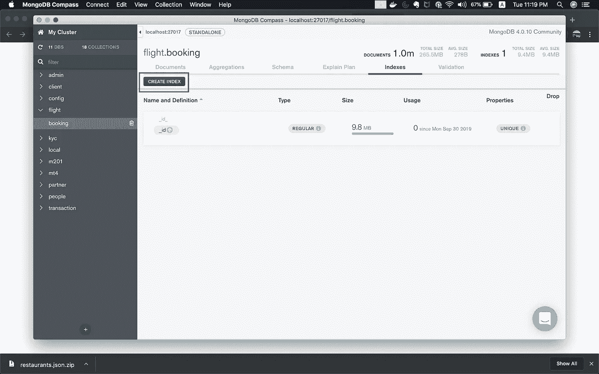

单击“索引”选项卡上的“创建索引”按钮。

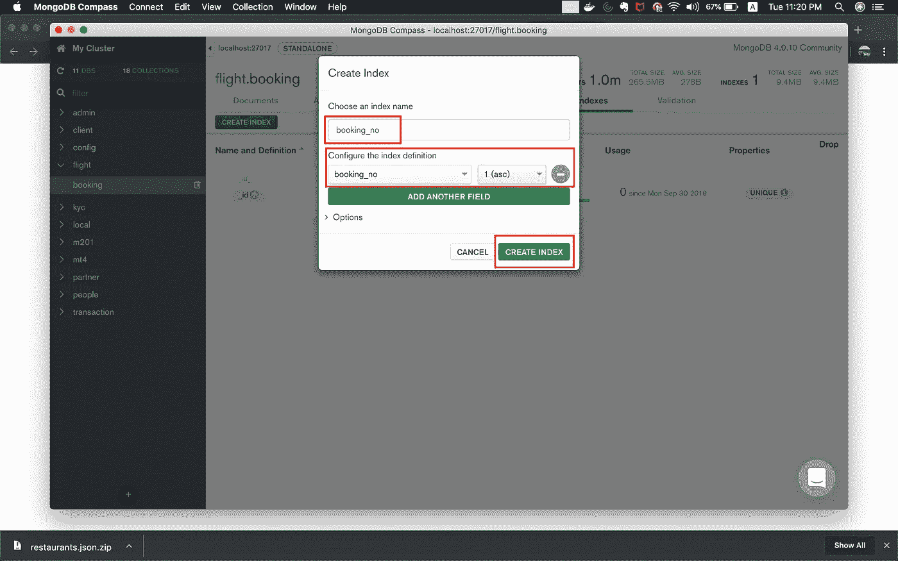

创建预订 _ 无索引

写下您的索引名称，并配置哪个字段是索引定义。在这种情况下，我们将 booking_no *配置为索引字段。我们先按升序排列。*

您准备好看看在这个简单的配置之后查询性能提高了多少了吗？(地狱耶！)

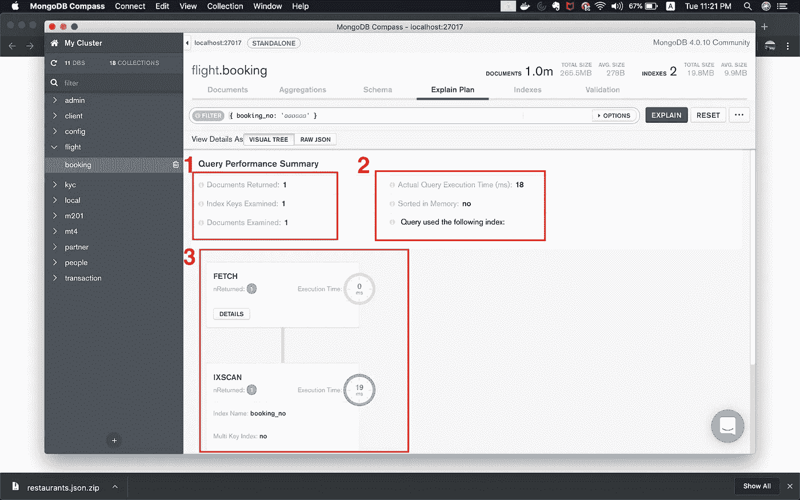

实施 booking_no 索引后查询结果截图

只需在索引中进行简单的配置，查询性能就有了巨大的提高。

1.  我们只检查一个文档并返回一个文档。这个比率(返回的文档除以检查的文档)为 1 是完美的。
2.  平均查询执行时间减少了近 50 倍。现在只有 18 毫秒，而以前是 899 毫秒。
3.  我们正在使用一种更好的方法，这是一种索引扫描，而不是整个集合扫描。这导致了更好的性能。

**步骤 2:使用姓氏和名字创建一个复合索引**

现在，如果我们尝试使用 booking_no *进行查询，我们已经提高了查询性能。但是假设客服告诉你，我们的大部分客户都不记得他们的订房号了。他们建议用客户的名字来代替。*

如果您现在尝试使用姓氏字段进行查询，您将会看到下面的屏幕截图。

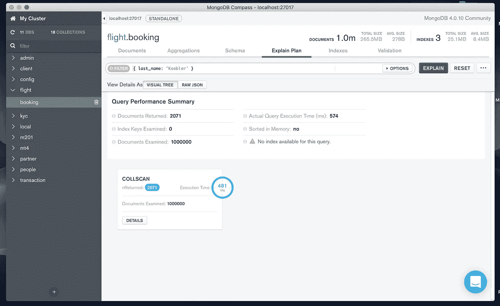

使用姓氏屏幕截图进行查询

我们在这里面临着什么样的问题？

*   在创建任何索引之前，我们面临着与以前完全相同的性能问题，使用集合扫描方法会花费很长的查询执行时间。
*   我们面临的另一个问题是，用户名分为两个字段，名和姓。尝试只使用姓氏进行查询会返回太多不相关的记录。这就是我们必须创建一个复合指数的地方。

让我们尝试创建一个复合指数来解决我们面临的问题。

创建复合索引就像创建单字段索引一样简单。你所要做的只是在 MongoDB compass 中添加另一个字段。你可以跟着下面的截图走。

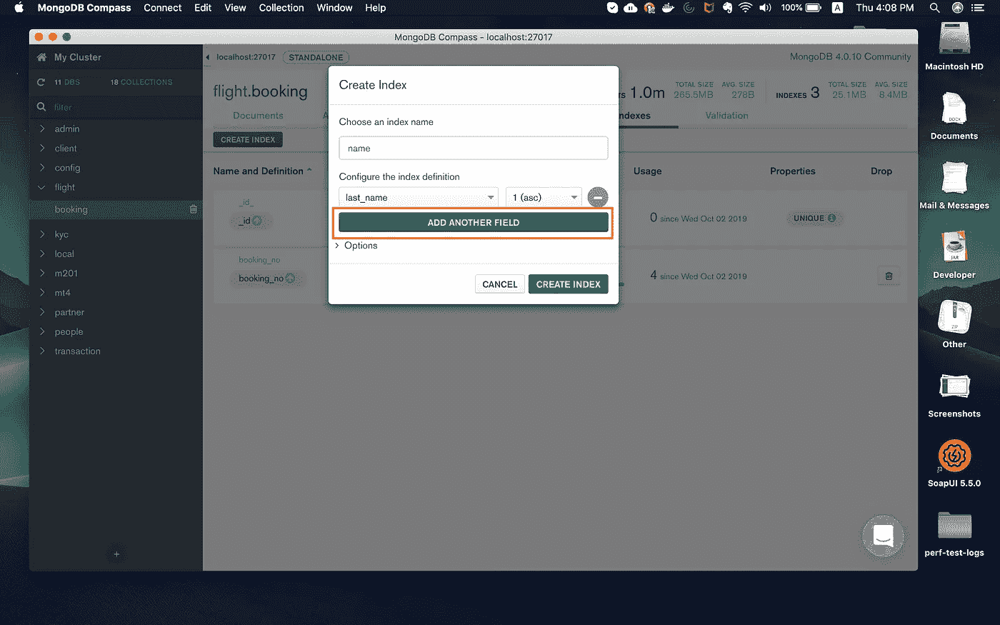

点击“添加另一个字段”添加名字。

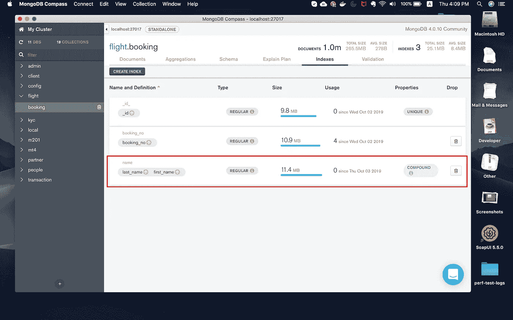

复合索引已成功创建

现在，我们已经为这个名字创建了复合索引。让我们验证一下查询性能。

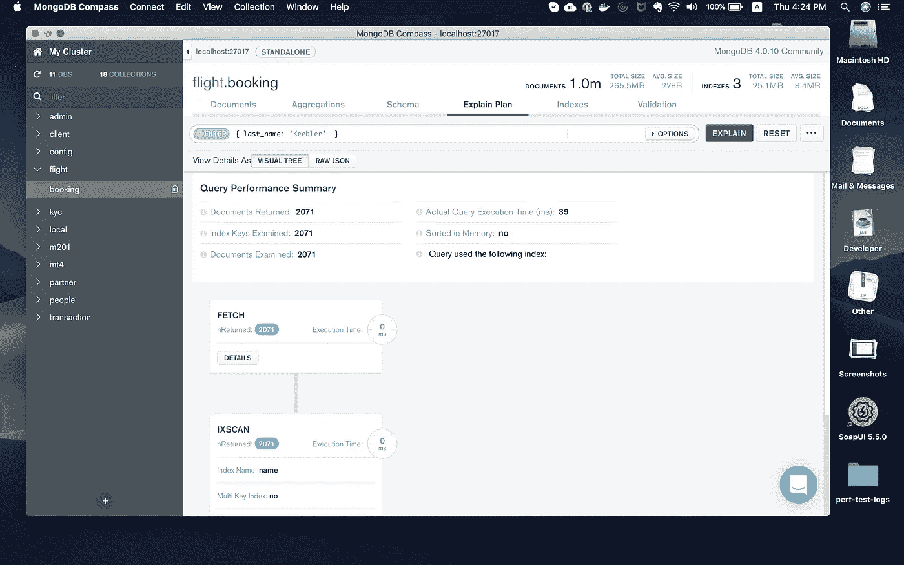

仅使用姓氏的查询(优化)


使用姓氏和名字进行查询(优化)

如上面的第二个屏幕截图所示，通过在查询中同时使用姓氏和名字，我们能够将查询性能优化到接近 0 毫秒。

当查询涉及以下内容时，我们优化了案例:

*   仅姓氏
*   姓氏和名字

然而，有一件额外的事情需要小心。如果只使用名字进行查询，性能不会得到优化。参考下面的截图。

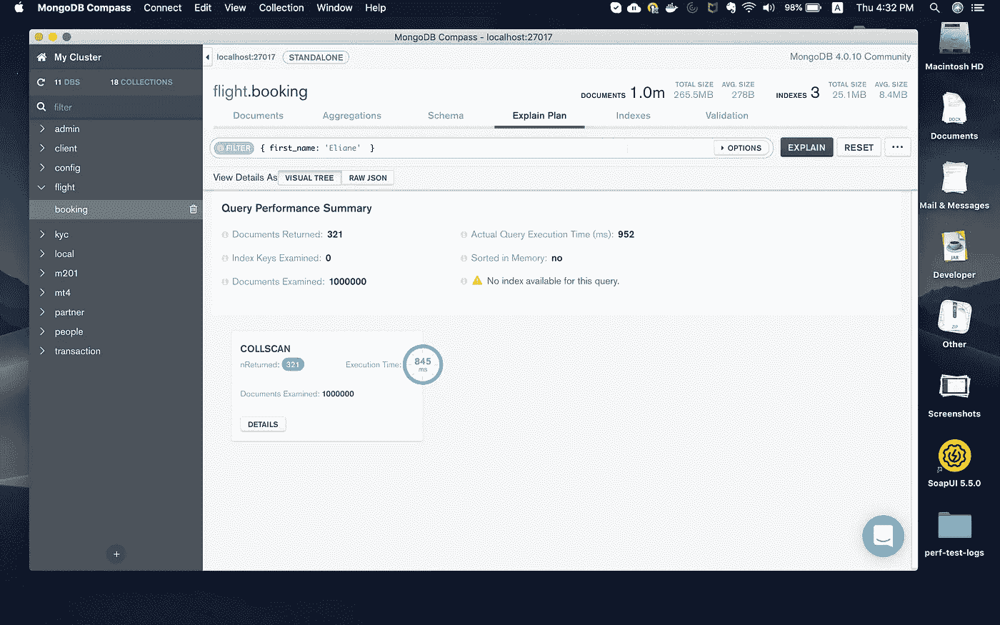

这是因为复合索引在创建索引时会考虑字段的顺序。当我们创建这个索引时，我们把姓放在名的前面。

因此，如果您想要利用刚刚创建的复合索引，那么总是需要首先指定姓氏。

# 结论

本文的关键要点是，如果您了解自己的业务流程，数据库性能可以很容易地得到提高。具体来说，在 MongoDB 中，我们可以使用以下方法来提高查询性能:

*   单字段索引
*   复合字段索引

在 MongoDB 中还有很多不同类型的索引可以探索，但目前就这些了。

优化愉快，感谢阅读。

# 参考

*   MongoDB 大学 [M201 表演课程](https://university.mongodb.com/courses/M201/about)
*   MongoDB [索引文档](https://docs.mongodb.com/manual/indexes/)
*   [亚航 AVA 聊天机器人](https://www.airasia.com/en/gb)