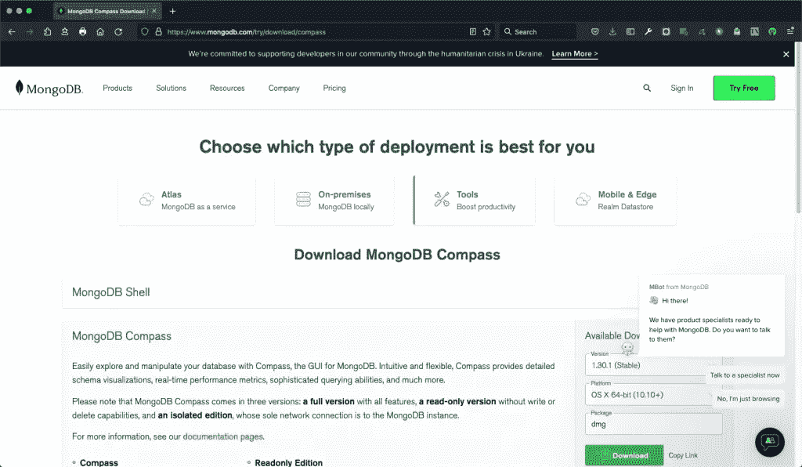
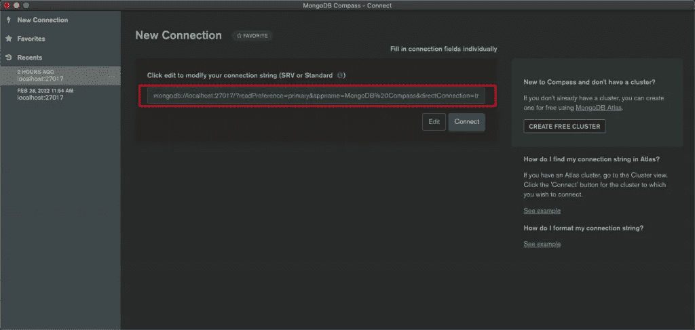
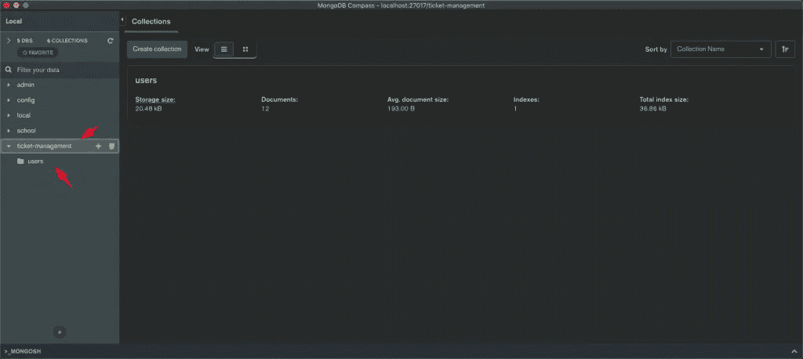
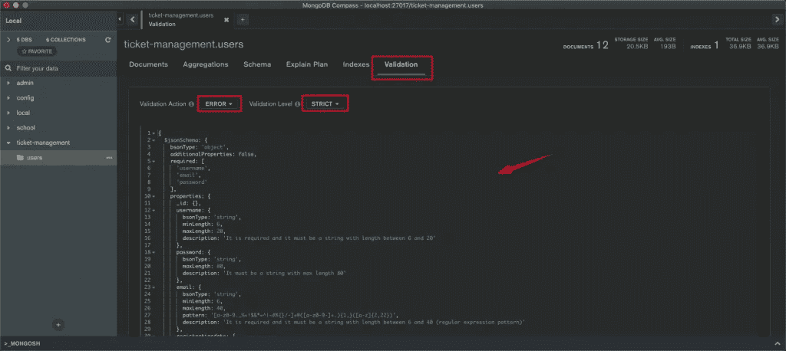
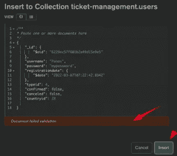
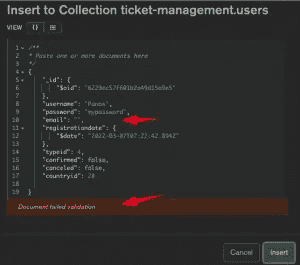

# MongoDB 模式验证规则

> 原文：<https://betterprogramming.pub/mongodb-schema-validation-rules-8a1afc6ea67b>

## 如何在集合中应用架构验证规则


Jan Kahánek 在 [Unsplash](https://unsplash.com?utm_source=medium&utm_medium=referral) 上的照片

# 简短介绍

[MongoDB](https://www.mongodb.com/) 是一个非常流行的免费开源跨平台[面向文档的数据库](https://en.wikipedia.org/wiki/Document-oriented_database)。这是一个 [NoSQL](https://en.wikipedia.org/wiki/NoSQL) 数据库，它基于 [JSON](https://en.wikipedia.org/wiki/JSON) 类文档。基于文档的数据库要么是无模式的，要么在使用模式验证规则定义模式时提供了一定程度的灵活性。

对于那些来自 RDBMS 世界的人来说，在 RDBMS 世界中，表结构的特征是具有严格定义的属性(类型、大小等)的列。，)，定义模式的能力被证明是一个非常有用的选择。

通常，我们可以认为 MongoDB 数据库对象类似于包含表、视图和其他 RDBMS 对象的 RDBMS 模式。MongoDB 集合类似于一个表，而 MongoDB 文档可以被视为一个表行。

MongoDB 数据库可以将集合组合在一起，一个集合包含文档，一个文档包含许多键值对对象，甚至包含其他文档。

这篇文章的目的是演示我们如何在集合中应用一些模式验证规则。为此，有必要用 MongoDB 集合创建一个示例 MongoDB 数据库。

# 先决条件和假设

在这里，你可以得到一个概述。

假设您有一个可用且可访问的正在运行的 MongoDB 实例。如果你没有，那么你也可以通过使用 Docker 和官方 MongoDB Docker 映像来运行 MongoDB 容器。在 https://www.mongodb.com/compatibility/docker 阅读更多信息。

为了方便起见，我们还将使用 MongoDB 的官方 GUI[MongoDB Compass](https://www.mongodb.com/products/compass)。

# 运行 MongoDB Docker 容器

您可以通过运行以下命令来创建并运行名为“mongodb”的 Docker 容器:

```
docker run --name mongodb -p 27017:27017 -d mongo
```

创建容器后，可以分别使用以下命令停止和启动它:

```
docker stop mongodb
docker start mongodb
```

此外，您可以通过以下方式随时检查正在运行的容器:

```
docker ps
```

# 获取 MongoDB Compass Gui 并定义一个数据库和一个集合

您可以从以下链接下载 GUI 指南针:[https://www.mongodb.com/try/download/compass](https://www.mongodb.com/try/download/compass)



安装后，运行它。确保 mongodb 容器启动并运行，并使用连接字符串创建一个新的连接，在我们的例子中，它可以是:

```
mongodb://localhost:27017/?readPreference=primary&appname=MongoDB%20Compass&directConnection=true&ssl=false
```



然后，在成功连接到 MongoDB docker 实例之后，您可以创建一个新的数据库和一个新的集合。分别将它们命名为“票证管理”和“用户”。



“用户”集合将存储用户文档，这些文档应该通过我们的验证规则进行验证。

## **定义一个 MongoDB 文档属性**

正如我们之前说过的，MongoDB 文档是一组有序的键值对。与 RDBMS 的一个关键区别是，MongoDB 文档可以存储任意大小的键值对文档以及嵌套文档。

但是，在我们的例子中，我们希望强制使用“users”集合来保存严格相同属性(键)的文档。这类似于 RDBMS 中表的字段(列)。例如，我们希望每个文档都有完全相同的属性/字段。

## **mongo _id**

在我们确定“用户”集合的字段之前，值得一提的是，每次在集合中插入新文档时，MongoDB 都会自动生成一个特殊的`_id`属性/字段。

`_id`是 MongoDB 的一种特殊数据类型。它实际上是一个 12 字节大小的 BSON 类型的 MongoDB 对象( [ObjectID](https://docs.mongodb.com/manual/reference/method/ObjectId/) )。12 字节的`_id`由以下部分组成:

*   4 个字节表示自 Unix 纪元以来的秒数
*   特定于主机的 3 个字节—机器标识符
*   2 字节的进程 id，以及
*   3 个字节代表一个计数器，从一个随机值开始

甚至自动生成的`_id`实际上并不是标准的 UUID。可以认为`_id`字段[是唯一的](https://www.mongodb.com/blog/post/generating-globally-unique-identifiers-for-use-with-mongodb)。它们是有序的，可以作为我们收藏的‘主键’。

之后，这是“用户”集合的字段列表示例:

```
_id
username,
password,
email,
registrationdate,
confirmed,
cancelled,
typeid,
countryid
```

目标是确保(嗯，尽我们所能)所有旨在插入到“用户”集合中的文档都应该包含这些字段。

# MongoDB 模式验证规则

为了实现所有文档都符合上述字段，我们将使用特定的 MongoDB 模式。您可以认为 MongoDB 模式只不过是一组文档属性(键)和值的规则。这些规则是基于每个集合的。在特定集合中插入或更新每个文档的过程中，应该遵循这些规则。

这样一组规则应该根据 BSON 标准使用 JSON 文件来定义。

我们不打算在这里讨论更多的细节，但是您可以使用官方文档阅读更多关于 MongoDB 模式及其工作原理的内容。例如，您可以访问以下链接:

*   [https://docs.mongodb.com/compass/current/validation/](https://docs.mongodb.com/compass/current/validation/)
*   [https://docs . MongoDB . com/manual/core/schema-validation/# schema-validation](https://docs.mongodb.com/manual/core/schema-validation/#schema-validation)
*   [https://docs . MongoDB . com/manual/core/schema-validation/# specify-validation-rules](https://docs.mongodb.com/manual/core/schema-validation/#specify-validation-rules)
*   [https://docs . MongoDB . com/manual/reference/command/coll mod/# add-document-validation-to-an-existing-collection](https://docs.mongodb.com/manual/reference/command/collMod/#add-document-validation-to-an-existing-collection)
*   [https://docs.mongodb.com/manual/reference/bson-types/](https://docs.mongodb.com/manual/reference/bson-types/)

在上面给出的简短介绍之后，现在是时候定义我们的 MongoDB 验证模式了。我们实际想要定义的内容总结如下:

*   字段:`username`、`email`和`password` 应该出现在每个文档中(它们是必需的)。
*   字段:`username`、`email`和`password` 应为字符串类型，其字符串长度应在最小和最大限制之间。
*   字段`email` 应该符合特定的正则表达式模式。
*   字段:`registrationdate`应该是日期类型。
*   字段:`confirmed` 和`canceled`应该是 bool 类型(Boolean: true 或 false)。
*   字段`typeid` 和`countryid` 应该是 int(整数)类型，它们的值应该在最小和最大值之间。

我们通过 [mongo shell CLI](https://docs.mongodb.com/v4.4/mongo/) 或 [mongosh CLI](https://docs.mongodb.com/mongodb-shell/) 通过各种方法定义我们的规则，但是由于我们已经在 Compass 中创建了我们的“用户”集合，使用 Compass 的 GUI 似乎是最方便的方式。

因此，选择“users”集合，单击 Validation 选项卡并放置您的 JSON 模式(将验证操作和验证级别分别保留为 ERROR 和 STRICT 选项)。下面是我们将使用的验证规则示例:

**mongodb (compass)集合验证模式**



# 通过 Mongosh 和 Mongo Shell CLIs 检查验证规则

在我们将验证规则保存在 Compass 中之后，我们可以使用 mongosh 来体验一下它们的样子。Compass 为我们提供了 mongosh CLI 的嵌入式版本。

默认情况下，mongosh 连接到“测试”数据库，正如您在上面看到的。因此，切换到`tickets-management`数据库，并使用`[db.getCollectionInfos()](https://docs.mongodb.com/manual/reference/method/db.getCollectionInfos/)`函数导航到验证规则:

似乎我们不能使用嵌入式 mongosh 更深入地查看/检查“属性”对象。

但是，我们可以跳到容器外壳中:

```
docker ps
CONTAINER ID   IMAGE     COMMAND                  CREATED        STATUS       PORTS                      NAMES
11b9a599c13e   mongodb   "docker-entrypoint.s…"   3 months ago   Up 4 hours   0.0.0.0:27017->27017/tcp   mongodb
. . .
docker exec -it mongodb bash
root@11b9a599c13e:/#
```

并使用以下命令在其中运行 mongosh:

```
root@11b9a599c13e:/# 
root@11b9a599c13e:/# mongosh
Current Mongosh Log ID:    6229dc064130345cc3d542bf
Connecting to:        mongodb://127.0.0.1:27017/?directConnection=true&serverSelectionTimeoutMS=2000
Using MongoDB:        5.0.5
Using Mongosh:        1.1.6
For mongosh info see: [https://docs.mongodb.com/mongodb-shell/](https://docs.mongodb.com/mongodb-shell/)
To help improve our products, anonymous usage data is collected and sent to MongoDB periodically ([https://www.mongodb.com/legal/privacy-policy](https://www.mongodb.com/legal/privacy-policy)).
You can opt-out by running the disableTelemetry() command.
------
   The server generated these startup warnings when booting:
   2022-03-10T05:41:44.202+00:00: Using the XFS filesystem is strongly recommended with the WiredTiger storage engine. See [http://dochub.mongodb.org/core/prodnotes-filesystem](http://dochub.mongodb.org/core/prodnotes-filesystem)
   2022-03-10T05:41:45.856+00:00: Access control is not enabled for the database. Read and write access to data and configuration is unrestricted
------
Warning: Found ~/.mongorc.js, but not ~/.mongoshrc.js. ~/.mongorc.js will not be loaded.
  You may want to copy or rename ~/.mongorc.js to ~/.mongoshrc.js.
test>
```

然后，我们可以切换到`ticket-management`数据库并执行`db.collectionInfos()`来获取“用户”集合的验证规则信息，如下所示:

这一次，我们的验证规则被清楚地呈现出来。

或者，我们可以只运行 mongo CLI(而不是 mongosh ),如下所示:

```
root@11b9a599c13e:/# mongo
MongoDB shell version v5.0.5
connecting to: mongodb://127.0.0.1:27017/?compressors=disabled&gssapiServiceName=mongodb
Implicit session: session { "id" : UUID("bb023c59-6160-461d-b022-4d88658fb890") }
MongoDB server version: 5.0.5
================
Warning: the "mongo" shell has been superseded by "mongosh",
which delivers improved usability and compatibility.The "mongo" shell has been deprecated and will be removed in
an upcoming release.
For installation instructions, see
[https://docs.mongodb.com/mongodb-shell/install/](https://docs.mongodb.com/mongodb-shell/install/)
================
Welcome to the MongoDB shell.
For interactive help, type "help".
For more comprehensive documentation, see
    [https://docs.mongodb.com/](https://docs.mongodb.com/)
Questions? Try the MongoDB Developer Community Forums
    [https://community.mongodb.com](https://community.mongodb.com)
---
The server generated these startup warnings when booting: 
        2022-03-10T05:41:44.202+00:00: Using the XFS filesystem is strongly recommended with the WiredTiger storage engine. See [http://dochub.mongodb.org/core/prodnotes-filesystem](http://dochub.mongodb.org/core/prodnotes-filesystem)
        2022-03-10T05:41:45.856+00:00: Access control is not enabled for the database. Read and write access to data and configuration is unrestricted
---
---
        Enable MongoDB's free cloud-based monitoring service, which will then receive and display
        metrics about your deployment (disk utilization, CPU, operation statistics, etc).
        The monitoring data will be available on a MongoDB website with a unique URL accessible to you
        and anyone you share the URL with. MongoDB may use this information to make product
        improvements and to suggest MongoDB products and deployment options to you.
        To enable free monitoring, run the following command: db.enableFreeMonitoring()
        To permanently disable this reminder, run the following command: db.disableFreeMonitoring()
---
>
```

请注意，mongo shell 已经贬值，并且已经被 mongosh 取代。

然后，我们可以切换到`ticket-management`数据库并执行`db.collectionInfos()`来获取“用户”集合的信息:

正如你在上面看到的，结果几乎是一样的。

# 测试我们的验证规则

在我们定义了验证规则之后，我们可以使用任何可用的工具(Compass GUI、mongosh CLI、mongo CLI)并测试它们是否正常工作。为此，我们可以尝试插入一些不符合验证规则要求的文档，并确认它们的失败。下面，有一些这样的例子，你自己也可以用。

## 使用蒙哥语

让我们尝试插入一个空文档:

现在让我们用一个带有无效电子邮件的文档再试一次:

您可以继续尝试插入带有无效值的文档，例如，使用`typeid` 字段的值—例如，值 0，而它至少应该是:

## 使用指南针

类似地，试图插入不符合我们的验证规则的文档，您将不断得到失败错误，例如:



# 警告

使用 MongoDB 验证规则非常有用，让我们免去了许多麻烦。然而，它不是万能的。作为一个缺点的例子，我们可以提到不能用字段定义唯一性，例如，我们不能防止插入(或更新)一个文档，而这个文档的用户名值已经存在于另一个文档中。

另一个例子是，我们不能阻止插入没有所有字段的文档(除了必需的字段)。诸如此类。

然而，正如 MongoDB 所建议的，这样的挑战可以在我们的中间件业务逻辑中解决，但这是另一篇文章的主题。所以，敬请期待！

就是这样！

感谢您的阅读，祝您编码愉快！