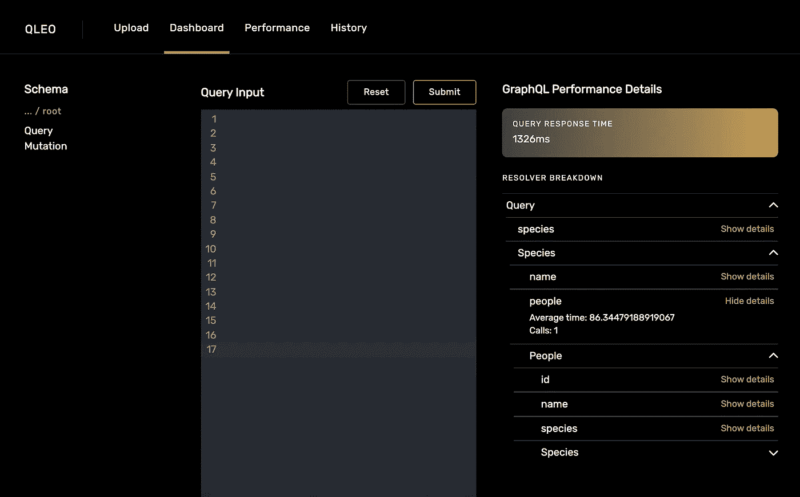
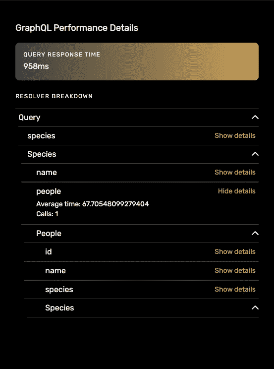
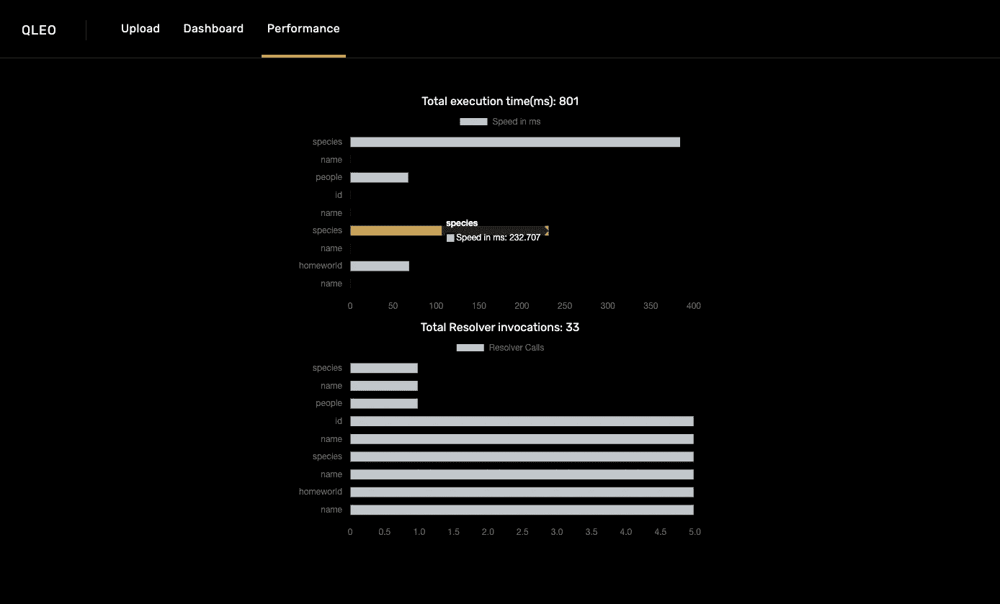

# 使用 QLeo 监控和优化您的 GraphQL API 调用

> 原文：<https://betterprogramming.pub/monitor-and-optimize-your-graphql-api-calls-with-qleo-af9ef6a4b95d>

## 请看这个可视化 GraphQL 性能的开源应用程序


在 [Unsplash](https://unsplash.com?utm_source=medium&utm_medium=referral) 上由 [TETrebbien](https://unsplash.com/@tetrebbien?utm_source=medium&utm_medium=referral) 拍摄的照片

QLeo 是一个本地开源桌面应用程序，用于在解析器级别可视化 GraphQL API 性能。QLeo 是在开源实验室技术加速器下开发的。

# **背景**

GraphQL 是一种查询操作语言和 API 的服务器端运行时，使开发人员能够处理由客户端发起并为客户端定制的各种获取请求。因此，客户机可以进行简洁的查询，准确地提取它们需要的内容，从而消除了常见的提取问题，比如使用 REST APIs 的过量提取和不足提取。

由于其固有的灵活性和效率，GraphQL 越来越受开发人员的欢迎。然而，由于 GraphQL 在数据获取方面提供的灵活性和精确性，它可能会使跟踪性能变得复杂和难以衡量。

GraphQL 通过使用解析器来处理查询，解析器是对相应请求生成响应的函数集合。随着数据集的增长，查询变得越来越复杂，在设计解析器时很容易失去对性能的跟踪。创建 QLeo 是为了缓解这种潜在的低效率问题，并改善开发人员的体验。

# **为什么选择 QLeo？**

QLeo 提供了必要的指标，以确保您的应用程序的 GraphQL 数据获取架构的设置能够获得最佳结果。对于每个变异和查询，可以看到关键指标的图形表示，包括解析器花费的时间以及被调用的次数。只需上传一个 GraphQL 模式，QLeo 将提供所需的信息，以确定在哪些方面可以提高效率。

# **开始使用 QLeo**

QLeo 作为一个本地桌面应用程序在 Electron 上运行。目前，QLeo 只兼容 macOS 用户(英特尔和 M1 芯片)。

请参见以下步骤开始:

1.  在 QLeo 的[官网](https://qleo.app/)或[这里](https://github.com/oslabs-beta/QLeo/releases/download/v0.1.0/QLeo-darwin-x64.zip)下载我们的申请。
2.  打开应用程序并授予访问权限。

3.开始为任何 GraphQL 请求收集性能数据。

一旦 QLeo 打开，用户必须从他们想要测试的应用程序上传一个模式文件。他们现在可以导航到显示模式的交互式结构、用于测试查询的代码编辑器以及单个解析器性能分析的仪表板。



仪表盘

QLeo 将根据给定的方案动态生成一个 GraphQL 服务器，并显示性能指标。模式模型和类型将可以在左侧面板上查看，以便于参考。

人们可以开始在代码编辑器中编写他们的 GraphQL 查询和/或变体。提交后，QLeo 将开始运行，并允许用户根据上传的模式模型生成性能指标。为了便于可视化，用户将在顶部看到总的查询响应时间，在下面看到解析器的分解。为了监视每个字段，用户可以切换“显示细节”按钮来查看性能，并提高每个解析器函数调用的效率。



韵律学

要查看请求-响应周期的图形表示，请导航至 Performance 选项卡。在这里，可以直观地分析和发现查询时间和解析器调用的潜在瓶颈



航行

所有以前的请求都将保存在 History 选项卡中—只需选择相应的查询，就可以引用任何请求的性能指标。

# **QLeo 的未来**

计划实现的下一个特性是错误日志和查询跟踪。与 REST APIs 不同的是，不管查询是否成功，GraphQL APIs 总是会给出一个状态码 200，这对于开发人员理解他们的查询的健康状况没有帮助。

QLeo 将通过使其更具用户交互性来改进图形表示。目前，该图单独显示解析器的时间，因此很难看出该解析器来自哪个字段。然而，使图形具有交互性将改善开发人员跟踪其 GraphQL APIs 健康状况的体验。

感谢您花时间了解我们为 GraphQL 用户提供的开源工具。这是我们的 [GitHub](https://github.com/oslabs-beta/QLeo) 库

```
**Want to Connect?**Here's our team:Andrew Talle: [Github](https://github.com/ogAndrew) || [Linkedin](https://www.linkedin.com/in/andrewtalle/)Chon Hou Ho: [Github](https://github.com/chon-h) || [Linkedin](https://www.linkedin.com/in/chon-hou-ho/)Irine Kang: [Github](https://github.com/irinekangg) || [Linkedin](https://www.linkedin.com/in/irinekang/)Jack Fitzgerald: [Github](https://github.com/jcf7) || [Linkedin](https://www.linkedin.com/in/jcf7/)
```

## **资源**

[](https://www.apollographql.com/) [## 阿波罗图表

### Apollo Graph Platform——将 API、微服务和数据库统一到一个可以用 GraphQL 查询的图形中

www.apollographql.com](https://www.apollographql.com/) [](https://www.howtographql.com/basics/1-graphql-is-the-better-rest/) [## GraphQL 与 REST 的比较

### 在过去的十年中，已经成为设计 web APIs 的标准(尽管还很模糊)。它提供了一些很棒的想法…

www.howtographql.com](https://www.howtographql.com/basics/1-graphql-is-the-better-rest/)