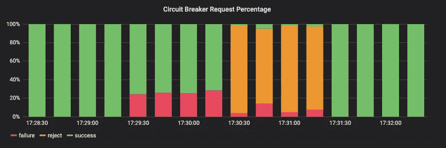
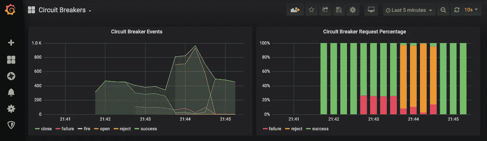

# 使用负鼠和普罗米修斯监控 Node.js 断路器

> 原文：<https://betterprogramming.pub/monitor-node-js-circuit-breakers-using-opossum-and-prometheus-5c66d516de3d>

## 改善应用程序的故障流程



作者照片。

断路器是在故障情况下保护您的应用程序的好方法。你应该预料到事情会失败。这在微服务/Kubernetes 世界中更为重要，因为事物总是在不断变化。本文向您介绍如何使用 Prometheus 监控负鼠断路器。

马丁·福勒的博客提供了关于断路器的大量背景资料。本文的其余部分是关于如何使用[负鼠](https://nodeshift.dev/opossum/)和[普罗米修斯](https://prometheus.io/)有效地实现它们。负鼠是 Node.js 断路器的一种实现，可在 [NPM](https://www.npmjs.com/package/opossum) 上获得。Prometheus 是一个为监控而构建的时序数据库，提供查询和警报功能。

# 创建断路器

断路器构造器接受对返回`Promise`的函数的引用。您还可以传入一个 options 对象来配置阈值之类的东西，阈值是断路器断开所需的错误百分比。

要通过断路器执行原来的功能，需要调用断路器对象上的`fire()`功能。传递给`fire()`的任何参数都将被传递给原始函数使用。请记住，之前的测试可能会打开断路器，导致后面的测试失败。

更多信息参见[负鼠文档](https://nodeshift.dev/opossum/)。

# 仪表断路器

[opossum-prometheus](https://www.npmjs.com/package/opossum-prometheus) 库使用 [prom-client](https://www.npmjs.com/package/prom-client) 为 opossum 提供工具。上面的例子显示了一个简单的实现，它添加了一个要检测的断路器。在实际应用中，`PrometheusMetrics`对象应该被多个断路器重用。

默认情况下，`PrometheusMetrics`将创建一个新的 Prometheus 存储库，并收集默认的系统指标。如果您的应用程序中有其他指标，您应该将 Prometheus 存储库传递到`PrometheusMetrics`选项中。

对于展示如何配置的示例应用程序，[转到 GitHub](https://github.com/HarryEMartland/monitoring-opossum-circuit-breakers-with-prometheus/blob/master/app.js) 。

# 监视

为了使我们的指标可访问，我们需要公开普罗米修斯指标。如果您使用的是 [Express](https://expressjs.com/) ，可以通过为普罗米修斯创建一条`/metrics`路线来实现，如下所示:

```
*app*.get(‘/metrics’, (_, res)=>res.end(*register*.metrics()))
```

您还需要设置普罗米修斯，以便它知道刮这个端点。下面的示例应用程序已经完成了所有的设置。

Prometheus 使用 PromQL 来询问它的数据。在图形中可视化查询的一个很好的工具是 Grafana。`opossum-prometheus`有一个指标，其中包含每个断路器及其发出的事件的标签。这个指标被称为`circuit`，标签为`name`和`event`，分别代表断路器的名称和它发出的事件。

下面的示例应用程序预配置了一个显示事件数量和事件百分比的仪表板。百分比图对于查看断路器是否断开特别有用。

要查看每个断路器触发了多少个事件，可以使用 PromQL 查询`rate(circuit[15s])`。

# 示例应用程序

在 GitHub 上可以找到一个示例应用程序和 docker-compose 文件来设置带有仪表板的 Prometheus 和 Grafana。下载完成后，运行`docker-compose up`启动应用程序、Prometheus 和 Grafana，并发送一些示例请求。



Grafana 仪表板显示断路器在不同错误率下发出的事件。

首先，断路器功能被配置为 100%时间工作。60 秒后，这个值变为 75%，然后 25%，再回到 100%。这模拟了服务降级到断路器将打开的程度。你可以在 Grafana 仪表盘上看到这一点。请注意，当 75%的请求成功时，没有拒绝事件。只有当 25%成功时，断路器才会打开，并触发拒绝事件。这是因为默认阈值为 50%。

看看这个项目并看看它是如何运作的。