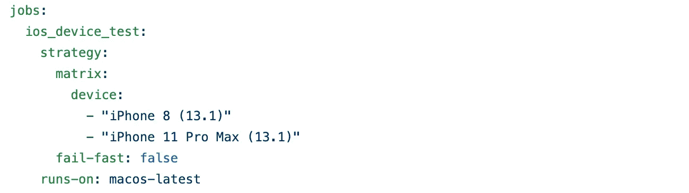
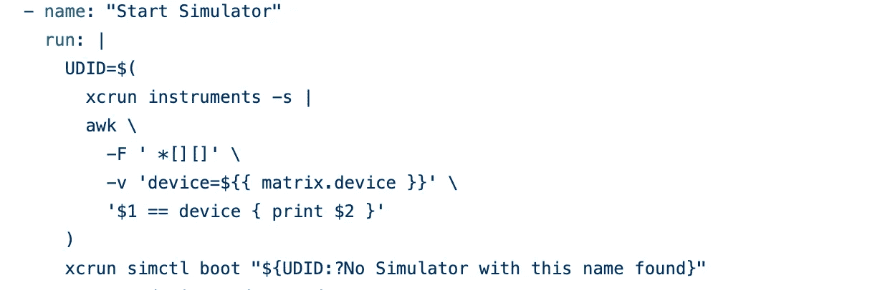
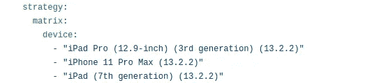
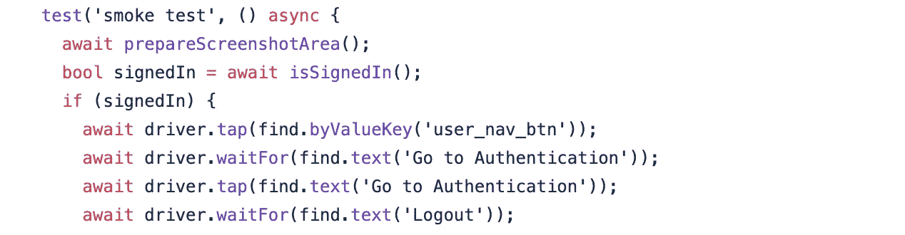
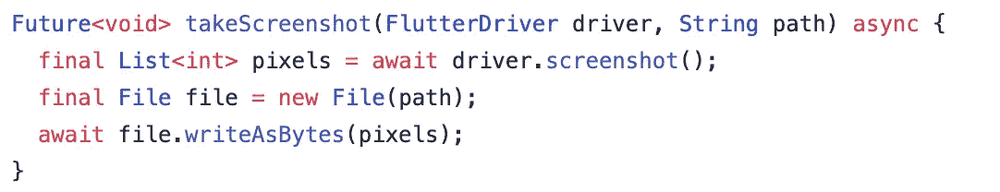
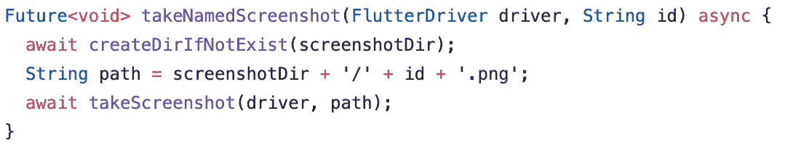
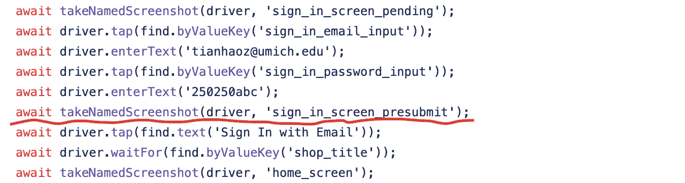
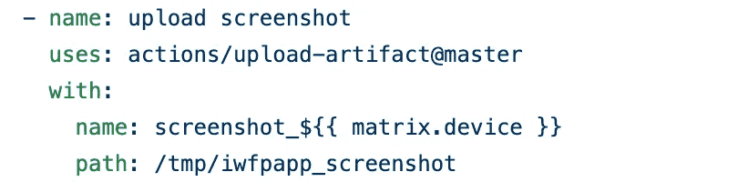
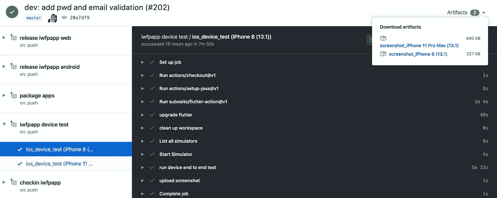

# 使用 GitHub 操作端到端监控您的 Flutter 应用程序的健康状况

> 原文：<https://betterprogramming.pub/monitor-your-flutter-apps-health-end-to-end-with-github-actions-8a9fb1889c6a>

## 详细的指南

[儿童马戏团](https://unsplash.com/@kidcircus?utm_source=unsplash&utm_medium=referral&utm_content=creditCopyText)在 [Unsplash](https://unsplash.com/s/photos/action?utm_source=unsplash&utm_medium=referral&utm_content=creditCopyText) 拍摄的照片

[Flutter](https://flutter.dev/) 是最新的跨平台应用框架，提供声明式 UI 方法、工具和同类最佳的平台覆盖。

然而，为颤振项目构建设备端对端测试并不容易，因为 CI 和测试平台还没有跟上。

我一直在探索在设备上运行自动端到端测试的方法，以确保我的应用程序的质量。

经过反复试验，我找到了一种可靠的方法，用 [GitHub Action](https://github.com/features/actions) 在设备上运行 Flutter 应用的端到端测试。

这篇文章中使用的代码来自我的 Flutter 项目，可以在这里找到:

 [## 天昊 95/iwfp

### 愿百分之五的原力与你同在。iwfp(我要百分之五)是一个帮助每个使用信用卡的人的工具…

github.com](https://github.com/tianhaoz95/iwfp) 

**注:**对于那些想知道`iwfp`是什么的人来说:它是*我想要百分之五*——我制作的一个应用程序记录了我所有的信用卡，并使用算法根据每次购买的返现奖励对卡进行排序，这样我就可以总是获得最佳的返现奖励。它是开源的，可以在[谷歌 Play 商店](https://play.google.com/store/apps/details?id=com.jacksonz.iwfpapp&hl=en_US)上获得。请随意使用/贡献。

# 步骤 1:在 GitHub Action 中启动模拟器

首先，我们需要用模拟器构建一个测试环境。

在下面的[工作流脚本](https://help.github.com/en/actions/automating-your-workflow-with-github-actions)中，我们定义了:

*   我们想在哪些设备上测试我们的应用程序(iPhone 8 和 11)
*   我们想要运行测试的平台(macOS)

**注意:**这很重要，因为 macOS 是唯一支持 iOS 模拟器的操作系统。运行 Android 模拟器是不可能的，因为它需要容器中没有的硬件加速。

来自[天昊 95/iwfp](https://github.com/tianhaoz95/iwfp) 的[杰克逊兹](https://github.com/tianhaoz95)的代码(署名[卡塔琳娜的帖子](https://medium.com/flutter-community/run-flutter-driver-tests-on-github-actions-13c639c7e4ab))

以下脚本将在后台启动 iOS 模拟器:

由[天昊 95/iwfp](https://github.com/tianhaoz95/iwfp) 的 [JacksonZ](https://github.com/tianhaoz95) 编码(署名 [Katarina 的帖子](https://medium.com/flutter-community/run-flutter-driver-tests-on-github-actions-13c639c7e4ab))

**更新(2020 年 1 月 10 日):**

最近的 Xcode 更新更改了设备命名方案。更新后的战略矩阵应该是:

来自[天昊 95/iwfp](https://github.com/tianhaoz95/iwfp) 的 [JacksonZ](https://github.com/tianhaoz95) 编码(来源 [Katarina 的帖子](https://medium.com/flutter-community/run-flutter-driver-tests-on-github-actions-13c639c7e4ab)

# 步骤 2:运行集成测试

既然已经有了一个模拟器运行的测试环境，我们需要构建测试来利用它。

Flutter 提供了一个驱动包来轻松编写设备上的测试。详情请阅读[文档](https://flutter.dev/docs/cookbook/testing/integration/introduction)。

下面是一个[颤振设备测试](https://flutter.dev/docs/cookbook/testing/integration/introduction)的片段:

由[天昊 95/iwfp](https://github.com/tianhaoz95/iwfp) 的 [JacksonZ](https://github.com/tianhaoz95) 编码

通过将以下脚本添加到工作流中，设备上测试将在每次触发工作流时运行:

来自[天昊 95/iwfp](https://github.com/tianhaoz95/iwfp) 的 [JacksonZ](https://github.com/tianhaoz95) 编码

# 步骤 3:生成感兴趣的截图(可选)

为了做得更好，我们可以在运行设备测试时截取我们感兴趣的屏幕截图，并将它们上传到 GitHub Action [artifacts](https://help.github.com/en/actions/automating-your-workflow-with-github-actions/persisting-workflow-data-using-artifacts) 来检查 UI 回归。

下面的代码片段显示了一个实用函数，该函数使用 Flutter 驱动程序包截取屏幕截图，并将其保存到由`path`定义的位置:

来自[天昊 95/iwfp](https://github.com/tianhaoz95/iwfp) 的[杰克逊兹](https://github.com/tianhaoz95)编码

为了更容易使用，我们将最后一个函数封装到另一个实用函数中，该函数隐藏了重复的位置和后缀:

来自[天昊 95/iwfp](https://github.com/tianhaoz95/iwfp) 的 [JacksonZ](https://github.com/tianhaoz95) 编码

有了助手功能，我们可以在设备上测试时抓图:

来自[天昊 95/iwfp](https://github.com/tianhaoz95/iwfp) 的 [JacksonZ](https://github.com/tianhaoz95) 编码

# 步骤 4:打包截图并上传(可选)

有了最后一步，现在每次测试都会生成一组截图。

为了让开发人员更容易检查，我们将使用以下脚本将截图作为工件上传到 GitHub Action:

来自[天昊 95/iwfp](https://github.com/tianhaoz95/iwfp) 的 [JacksonZ](https://github.com/tianhaoz95) 编码

# 第五步:喝杯咖啡(非可选)

下面快速浏览一下完整的工作流程，以及在哪里可以找到您的截图工件:

来自[天昊 95/iwfp](https://github.com/tianhaoz95/iwfp) 的 [JacksonZ](https://github.com/tianhaoz95) 编码

一如既往，编码快乐！