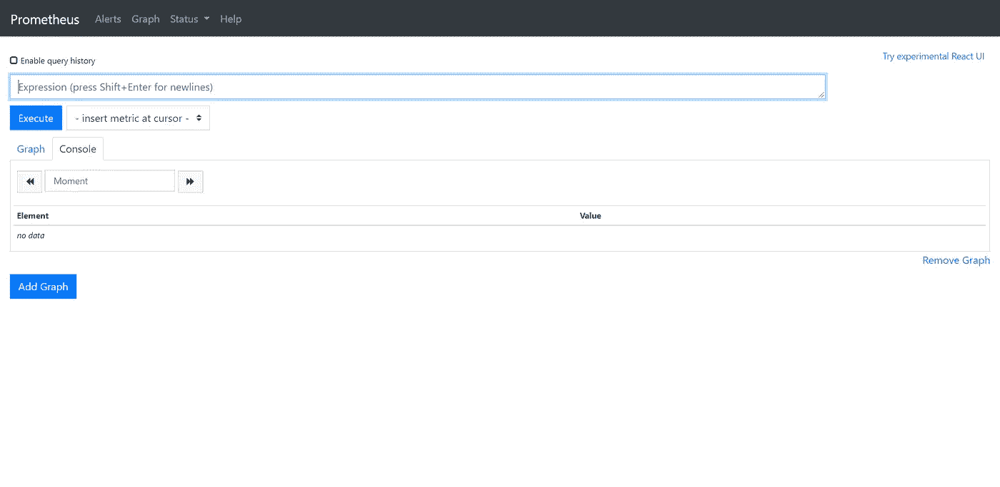
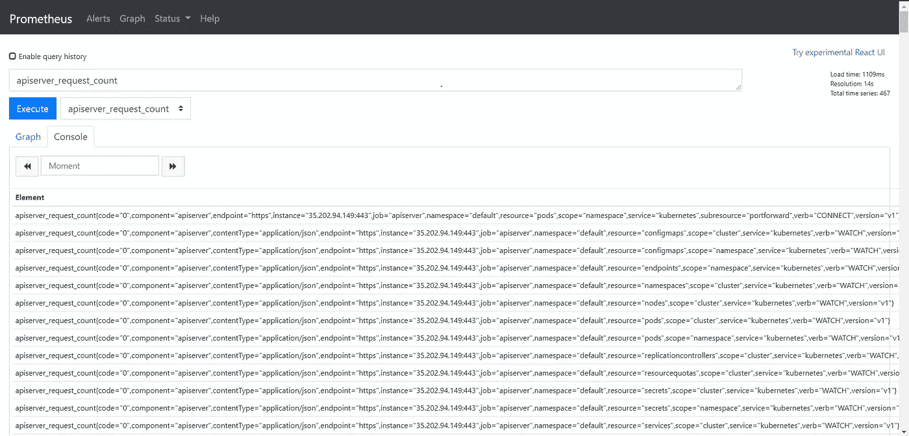
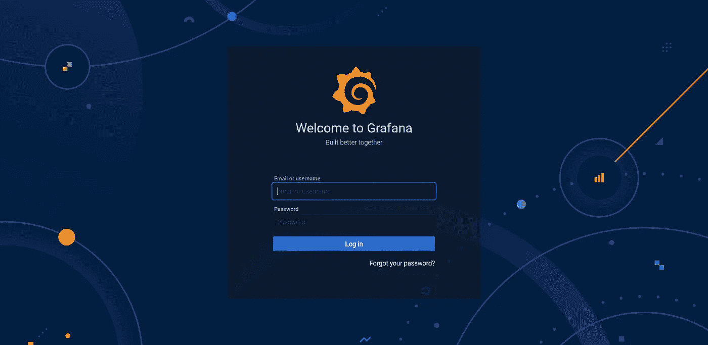
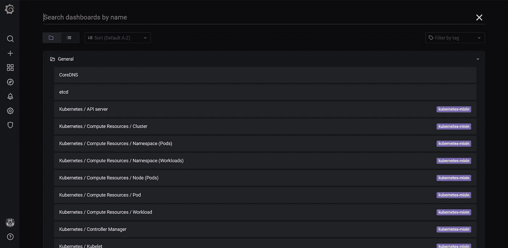
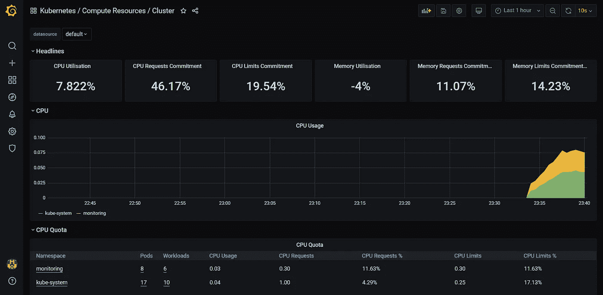
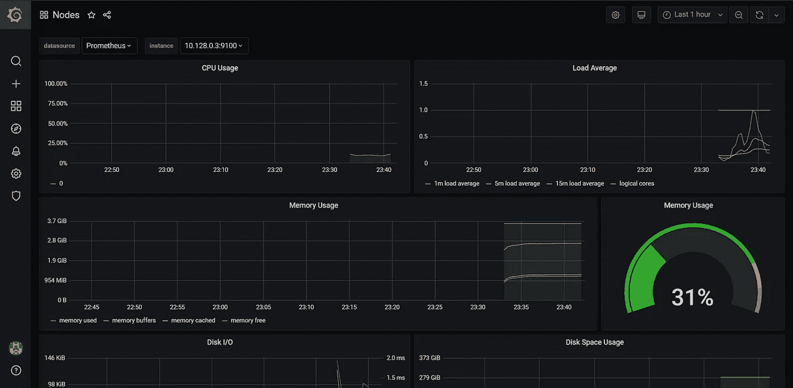

# 使用 Prometheus 和 Grafana 监控您的 Kubernetes 集群

> 原文：<https://betterprogramming.pub/monitor-your-kubernetes-cluster-with-prometheus-and-grafana-1f7d0195e59>

## 使用头盔在你的 Kubernetes 集群上设置普罗米修斯和格拉夫纳


查尔斯·德鲁维奥在 [Unsplash](https://unsplash.com?utm_source=medium&utm_medium=referral) 上拍摄的照片。

[Prometheus](https://prometheus.io/) 和 [Grafana](https://grafana.com/) 是 Kubernetes 最受欢迎的监控解决方案，它们现在在大多数托管集群(如 GKE)中默认使用。

这些工具最近已经从 Cloud Native Computing Foundation 毕业，这意味着它们已经可以投入生产使用，是开源监控工具中的一等公民。

有了 [Helm](https://helm.sh/) ，在您的 Kubernetes 集群上安装和管理 Prometheus 和 Grafana 变得简单多了。它不仅为您提供了一个经过强化和充分测试的设置，还提供了许多预配置的控制面板，让您可以立即开始使用。

它还为您提供了根据您的用例来调整这两种工具的灵活性，这是一个优点。Prometheus 提供了收集和接收日志、索引日志和优化存储的核心监控功能，而 Grafana 提供了在图形仪表板中可视化指标的方法。

在本次动手演示中，让我们看看如何在几分钟内为您的 Kubernetes 集群设置一个有效的监控解决方案。

# 先决条件

您将需要以下内容:

*   运行中的 Kubernetes 星团。在这个演示中，我们将使用一个托管的 GKE 集群，但是它在任何 Kubernetes 设置上都可以很好地工作。
*   如果使用自托管安装，则在集群上预先安装和配置 Kubernetes Metrics server。

# 安装舵

对于那些不知道 Helm 的人来说，它是 Kubernetes 的一个包管理器，允许你安装和管理你的 Kubernetes 应用程序。类似于 apt 之于 Ubuntu 或者 yum 之于 Red Hat。

安装 Helm 是小菜一碟，因为您只需要下载最新的版本，解压缩内容，并将 Helm 二进制文件移动到您的 bin 目录或设置适当的路径。Helm v3 不需要舵杆，因此更轻便，更易于管理:

由于是全新安装，我们需要在 Helm 配置中定义公共的 Kubernetes 图表存储库:

```
$ helm repo add stable [https://kubernetes-charts.storage.googleapis.com](https://kubernetes-charts.storage.googleapis.com)
```

我们现在可以使用舵图安装普罗米修斯操作器。

# 安装普罗米修斯图表

有了 Helm，你不需要担心编写清单和布线的内部问题。Helm 为您提供久经沙场的生产级设置，经过多种场景和用例的广泛测试。

为此，我们将使用`stable/prometheus-operator`图表。

将 Prometheus 操作符安装在一个单独的名称空间中是一个好主意，因为这样很容易管理它。

创建一个名为`monitoring`的新名称空间:

```
$ kubectl create ns monitoring
namespace/monitoring created
```

在集群的`monitoring`名称空间中安装普罗米修斯操作员图表:

让我们检查一下 Helm 是否正确推出了操作器:

如我们所见，所有的豆荚都已启动并运行。

# 接近普罗米修斯

现在让我们进入普罗米修斯仪表板，看看我们自己得到了什么。我们将使用 Kubernetes 代理来访问它。Kube 代理允许我们通过 Kube API 服务器使用 TLS 安全地建立到 Prometheus 的隧道连接。

```
$ kubectl port-forward -n monitoring prometheus-prometheus-prometheus-oper-prometheus-0 9090
Forwarding from 127.0.0.1:9090 -> 9090
```

现在访问普罗米修斯仪表板:



正如我们所见，普罗米修斯号已经启动并运行。您可以使用 Prometheus 查询语言以老式的极客方式查询 Kubernetes 指标。

例如，让我们看看 API 服务器请求计数的时间序列:



# 访问 Grafana 仪表板

对于更喜欢图形的人，让我们尝试访问 Grafana 仪表板。首先，我们需要定位 Grafana pod，然后通过 Kube 代理进行端口转发以访问它:

```
$ kubectl get pod -n monitoring|grep grafana
prometheus-grafana-85b4dbb556-8v8dw    2/2     Running   0     7m45s
$ kubectl port-forward -n monitoring prometheus-grafana-85b4dbb556-8v8dw 3000
Forwarding from 127.0.0.1:3000 -> 3000
```

访问位于[的 Grafana 仪表盘:](http://127.0.0.1:3000)



现在，我们需要登录 Grafana 的凭证。为此，我们将从 Helm 为我们安装的秘密中获取用户名和密码:

```
$ kubectl get secret -n monitoring grafana-credentials -o yaml
```

从 YAML 中，选择`admin-user`和`admin-password`字段的值，base64 解码它们以获得登录 Grafana 的明文凭证。

登录后，您将获得如下所示的默认仪表板。正如你所看到的，舵轮图表附带了几个预定义的仪表板，这是一个很好的开始。如果您愿意，您可以根据您的使用情况进一步定制它们。



让我们来看看`Kubernetes/Compute Resources/Cluster`仪表盘:



如您所见，它为我们提供了与一般群集的运行状况和利用率相关的各种指标。

让我们来看看特定节点的统计数据:



这为我们提供了另一种统计数据，例如特定节点的当前 CPU 利用率、内存利用率及其时间序列。

恭喜你！你已经设置好了，可以开始了。

# 结论

您可以发现许多其他仪表板，这些仪表板为您提供了关于集群健康状况、特定应用程序 pod 的资源使用模式、跨集群流动的网络流量等等的宝贵见解。

Prometheus 和 Grafana 是监控 Kubernetes 集群的强大工具，有了 Helm，它们的设置也变得简单多了。

感谢阅读！我希望你喜欢这篇文章。