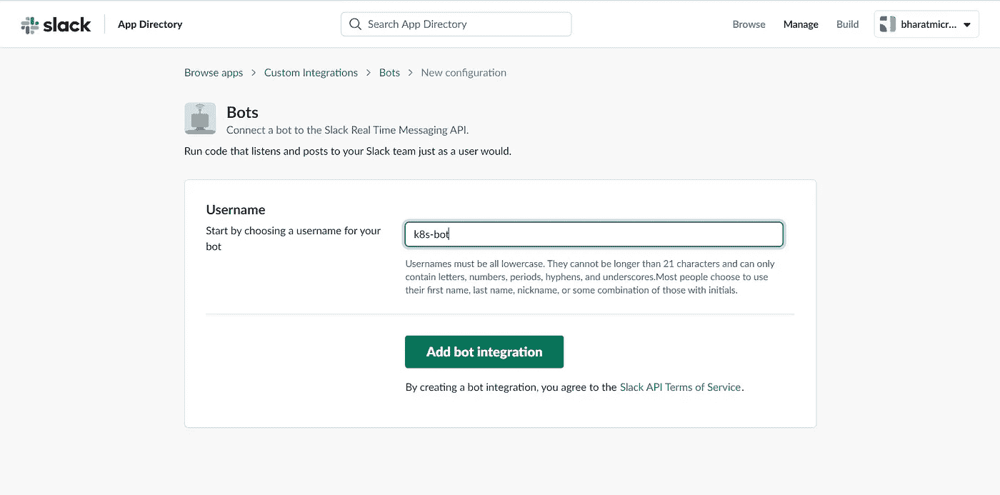
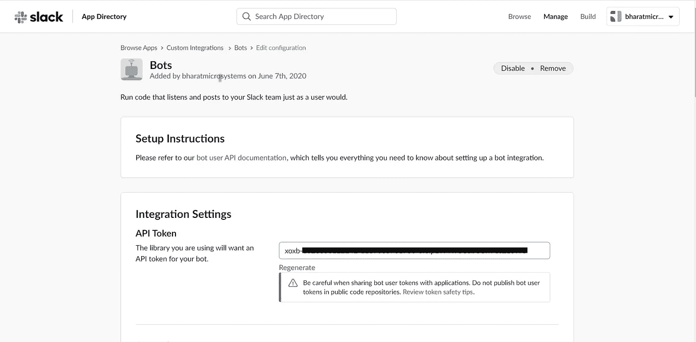
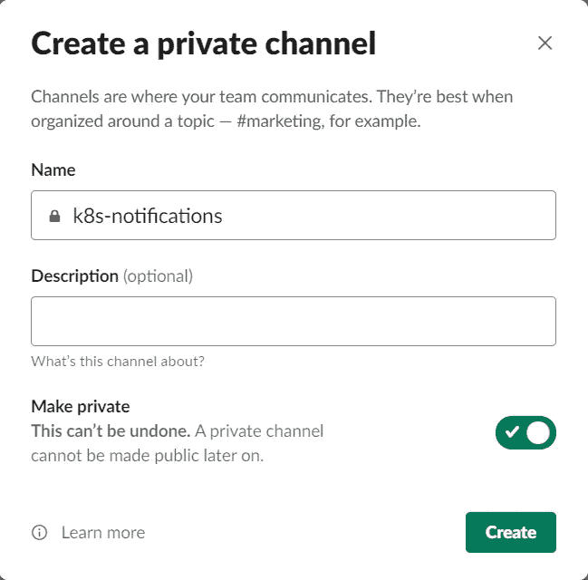
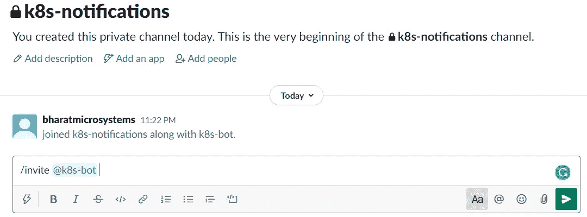
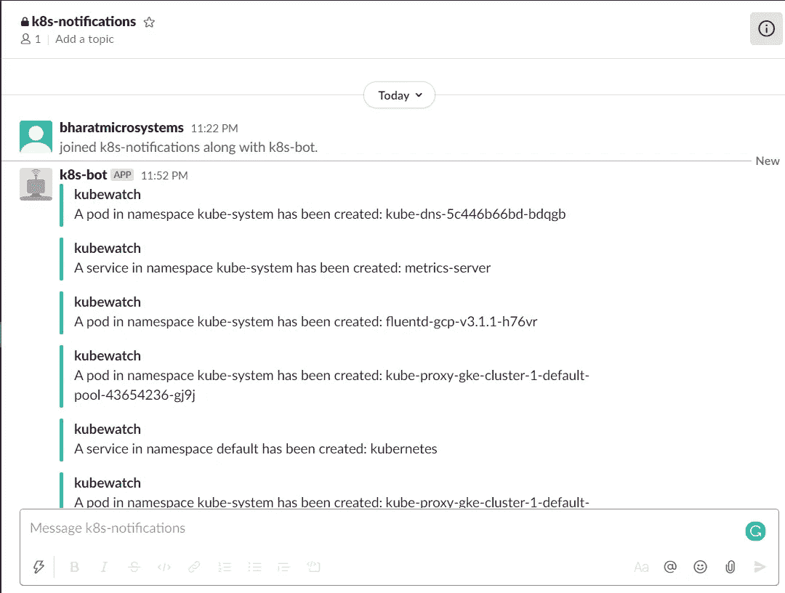

# 使用 kubewatch 监控您的 Kubernetes 资源

> 原文：<https://betterprogramming.pub/monitor-your-kubernetes-resources-with-kubewatch-d40ecf420f28>

## 观看 Kubernetes 活动，并向 Slack 发送通知

照片由[克里斯蒂娜@ wocintechchat.com](https://unsplash.com/@wocintechchat?utm_source=unsplash&utm_medium=referral&utm_content=creditCopyText)在 [Unsplash](/collections/10646975/wise-humanity?utm_source=unsplash&utm_medium=referral&utm_content=creditCopyText) 上拍摄

Kubernetes 是一个强大的容器编排器，它为您提供了许多管理应用程序工作负载的特性。Kubernetes 的绝对灵活性进一步普及了容器，现在它是大多数设置的标准。

尽管 Kubernetes 功能丰富，但它没有提供开箱即用的监控解决方案。您需要在集群上安装 Prometheus 或 Datadog 等监控工具。

[Kubewatch](https://github.com/bitnami-labs/kubewatch) 是一款开源的 Kubernetes watcher，用 Go 编写，由 Bitnami Labs 开发。它通过在 Kubernetes 集群和 Slack 通道之间提供一个简单易用的接口来补充监控解决方案。它监视指定的 Kubernetes 资源的变化，并将其报告给 Slack 通道。

虽然 Prometheus 和 Datadog 是全面的监控解决方案，为您提供了许多功能，但它们的安装和操作更加复杂。如果您希望获得 Kubernetes 配置更改的警报，kubewatch 是一个很好的候选，它是对它们的补充。

Kubewatch 还支持其他协作平台，如 HipChat、Mattermost 和 Flock。您还可以为您的定制集成触发通用 webhooks，例如使用像 ServiceNow 这样的 ITSM 工具。

它很容易安装并作为 Kubernetes 部署运行。你可以安装它作为一个舵图或通过 kubectl。让我们通过一个动手练习来更详细地了解 kubewatch。

# 先决条件

您将需要以下内容:

*   一个正在运行的 Kubernetes 集群，您需要拥有集群管理权限
*   呆滞账户

# 配置时差

让我们从配置 Slack 开始。我们需要创建一个 Slack 机器人，并邀请机器人到 Slack 通道，我们希望 kubewatch 在其中发布通知。Kubewatch 使用 webhooks 来显示通知。

点击[这个](https://my.slack.com/services/new/bot)链接创建一个 Slack bot

点击“添加机器人集成”在下一页检索生成的 bot 令牌。

转到您的 Slack 工作区，为 Kubernetes 通知创建一个新的通道(或者使用一个现有的通道来发布通知)。

在空闲消息区输入`/invite @name_of_your_bot`邀请机器人加入你的频道。

您的 Slack 频道现在可以接收来自 kubewatch 的通知了。

# 安装 kubewatch

Kubewatch 使用一个配置映射来保存 kubewatch 配置。用 Slack 令牌和通道名创建一个 kubewatch 配置映射。您还可以修改标志来配置 kubewatch，以通知特定类型的 Kubernetes 资源的更改。以下配置仅监控 pod 和服务。

为 kubewatch 创建一个服务帐户，以便与 Kubernetes 资源进行交互，并通过一个`ClusterRole`和一个`ClusterRoleBinding`分配相关权限。

现在创建一个 kubewatch 部署

检查 pod 是否正在运行:

让我们来查看 kubewatch 容器日志:

观察松弛频道的通知:

就是这样！恭喜你！Kubewatch 现在正在监视整个集群，并向您的 Slack 通道发送数据。

# 结论

感谢阅读！我希望你喜欢这篇文章。

设置 kubewatch 非常简单，可以为您的团队提供关于 Kubernetes 集群状态和可能发生的任何变化的持续警报。这是在你的团队中开始建立监控和协作的一个很好的工具。