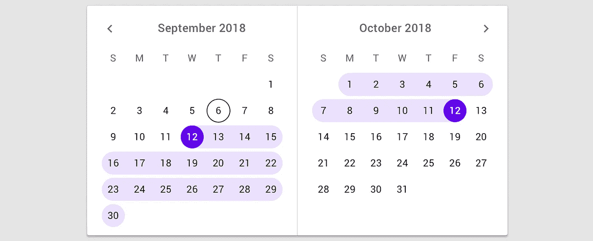

# 在 Angular 8 中构建月份范围选择器

> 原文：<https://betterprogramming.pub/month-range-picker-in-angular-8-4ce93ef7d76b>

## 制作一个漂亮的日期选择器，就像你最喜欢的旅游网站一样



材料设计日期选择器

Material Design 提供了非常酷的用于日期范围选择的[小部件](https://material.io/components/pickers/#mobile-pickers)，但是如果你像我一样，是一个好奇的学习者，你可以用一些 CSS/HTML 和 TypeScript 实现这样的小部件。

# 第一步。设计体验


让我们用一个用例来约束自己，这个用例是[发现](https://stackoverflow.com/a/59329596/4005366)并帮助解决堆栈溢出的，它有以下标准:

*   用户可以在不同的年份之间切换。
*   用户可以看到今年的 12 个月(黑色)、去年的 6 个月以及明年的 6 个月(灰色)。
*   将鼠标悬停在每个月上，会用蓝色圆圈突出显示。
*   用户可以选择任何月份之间的范围，以任何顺序。
*   第一次单击突出显示该范围的开始，第二次单击绘制该范围，在所选月份之间用较柔和的蓝色突出显示。

概括地说，这里似乎有几个组件:

*   带阴影的外卡。
*   顶部面板有两个按钮，可以在年份之间切换。
*   视图中包含 24 (6+12+6)个月的内容面板。
*   每个月份都有一个圆形突出显示和一个暗突出显示。

# 第二步。实施所有组件

在第一次迭代中实现上面提到的所有组件，以大致定位所有内容。

如上所述，我们根据提到的组件创建了基本元素并添加了类。现在，让我们添加一些 CSS，使它看起来接近我们所需要的:

以上的一些亮点:

*   我们使用`touch-action: none`来防止默认动作，比如文本选择。由于我们将自己添加侦听器，这使得与组件的交互更加清晰。
*   我们使用`text-align`、`line-height`和`margin: 0 auto`魔法来水平和垂直居中定位文本元素。
*   我们在这里使用`inline-block`创建一个简单的列表——这有助于一行一行地呈现所有 24 个月，形成一个类似表格的视图(不实际创建表格)，这样我们的月份只是一个有序的列表，我们不必担心实际的行和列。
*   我们将上下页边距设为 1px，因为月份行之间应该有一些间隔。
*   最后，对于左右箭头，我们使用一个简单的 45 度旋转变换技巧。

让我们添加一些打字稿，并在模板中使用`*ngFor`来复制所有 24 个月，看看会是什么样子:

我们用它们的类型声明属性，并初始化`ngOnInit`钩子中的值。让我们暂时不要担心这些被“硬编码”了。这确实是一个技术债务，我们将在文章的后面处理它。

我们的模板现在是一个东西，但我们需要开始应对下一组挑战:

*   创建一个数据模型，可以帮助我们跟踪每个月的状态。(在范围内吗？它是在范围的开始吗？它是在范围的尽头吗？这个月属于哪一年？它的`label`是什么？)
*   实现我们产品系列的状态。(第一条边选中了吗？是否选择了第二条边，我们有范围吗？它又重置了吗？)
*   弄清楚我们如何只显示所有年份中所有月份的整个列表的一部分。(请记住，我想将月份的数据层实现为平面数组。)

# 第三步。实现所需的数据结构

首先，让我们创建`monthsData`属性，该属性将存储所有月份及其当前状态的列表:

它是一个对象(月)数组，可以帮助我们跟踪重要的状态。接下来，我们将创建到目前为止所有年份(2018–2024)的所有月份列表:

在上面的代码片段中，我们迭代了初始的`months`和`years`属性，以创建初始状态的`monthsData`数组。由于我们可能需要在组件中使用这样的数据“重置”,我们将该操作包装在`initMonthsData`方法中。

接下来，我们可以更新我们的视图(HTML)来读取整个(巨大的)列表:

好吧，好东西。接下来，我们需要一种简单的方法来跟踪我们的`range`的状态，为此我选择(稍后您将看到为什么)使用一个简单的数组，该数组包含两个值，分别代表所选的“范围开始”月份和“范围结束”月份的索引:

```
rangeIndexes: Array<number>;initRangeIndexes() {
    this.rangeIndexes = [ null, null ];
};
```

空值是有意的，它将帮助我们跟踪范围的状态。与我们的`monthsData`一样，我们将这个方法添加到我们的`ngOnInit`钩子中。

# 第四步。让我们把它变成互动的

好了，现在我们需要添加一个方法，用户每次点击一个月时我们都会调用这个方法:

这里的逻辑应该很简单:

*   我们检查我们的范围的第一个索引是否为空，这意味着我们的月份处于它们的初始状态，然后我们将选择的月份索引添加到`rangeIndexes`。
*   如果第一个索引现在存在(不是空值)，我们有理由相信已经选择了一个月，现在我们可以:a)捕获第二个选择的月的索引，b)对数组排序(因为用户可以返回到过去的一个月，这就是数组在这里有用的原因)，或者 c)知道了范围索引，我们现在可以浏览整个列表并相应地更新月份(在范围中，是下边缘，是上边缘)。
*   最后，如果已经有一个范围->我们重置并开始一个新的。

好了，上面给出了数据模型的变化，但是我们的小部件还不能处理任何基于模型变化的变化。我们将利用`ngClass`将数据状态绑定到 CSS 类，这将有助于改变视图:

`isEdge`等级现在将在`.monthItem`级别自动添加到我们的月份中，如果它等于我们范围边缘的指数。

月份高光有点棘手:这里我们需要知道哪个月份代表下边缘和上边缘，因为我们添加的类是特定的——我们使用“渐变”CSS 技巧只给高光 div 的一半着色。

点击这里查看完整的 CSS 类:

酷，现在我们的范围是可操作的，我们实际上可以选择一个月的范围。然而，还有三个问题需要我们去解决:

1.  我们需要以某种方式将列表的呈现限制为最多 24 个月，今年的 12 个月为黑色，相邻的 6 个月(上一年和下一年)为灰色。
2.  我们需要实现在年份之间切换的逻辑。
3.  我们需要一些基本的逻辑来将选择发送给其他组件。

让我们推进最后几步，我们就快到了！

# 第五步。将视图限制为总列表的“一部分”

因为我们需要显示每年的 6+12+6 = 24 个月，所以我决定利用`Array.slice`方法，定期分割我们的真实来源(`monthsData`)并显示给我们的用户，这将需要新的功能和对我们已经创建的内容进行一些重构:

*   是时候去掉硬编码的值，重构我们获取月份和年份标签的方式了。
*   我们还需要一种程序化的方法来获取当前年份。
*   然后，我们需要一个方法来初始化/配置那些视图切片(`initViewSlices`)。
*   而且，非常重要的是，一个实际分割我们的`monthsData`数组的方法，以及我们的箭头按钮在视图中递增/递减当前年份的新方法。
*   最后，我们需要添加一个新的 CSS 类来支持“不在当前年份”的月份被涂成灰色，并添加`[ngClass]`对模板的修改。

好像很多。让我们开始:

1.  去掉硬编码的数组，允许它们在用户当前的实际日期生成:

2.获取当年指标:

```
this.currentYearIndex = this.years.findIndex(year => year === (new Date()).getFullYear());
```

3.`InitViewSlices`方法将创建一个简单的数组，包含每年的偏移量(0，6，18，30，42，54，66)。偏移量基本上告诉我们从哪里开始分割我们的全局数据模型(`monthsData`)，并且我们已经知道在哪里结束它(它总是== 24，这是我们视图中的月代表的数量):

4.将数据分割到视图中并实现每年递增/递减:

5.添加了缺少的`notCurrentYear`类(`.notCurrentYear { color: #c4cbd6;}`)并添加了对我们的模板的所有修改，现在模板是最终版本:

# 第六步。最后一档

最后一步实际上是重构一切(只是一点点)以支持切片视图的逻辑。具体来说，我们需要对`onClick`方法进行修改，现在看起来是这样的:

如上所述，现在我们支持全局索引偏移，并在每个新范围之前重置视图。

为了方便起见，我还添加了一个简单的事件发射器…

唷。现在这个小部件完全可以运行了，并且符合我们设定的每一个验收标准！万岁！

# 资源

*   下面是它的动作:[https://angular-ryd 73 I . stack blitz . io](https://angular-ryd73i.stackblitz.io)
*   编辑网址:[https://stackblitz.com/edit/angular-ryd73i](https://stackblitz.com/edit/angular-ryd73i)
*   gist:[https://gist . github . com/cmer 4/3c B4 B3 D5 A8 e 38054602 f 550681 a6 ce 75](https://gist.github.com/cmer4/3cb4b3d5a8e38054602f550681a6ce75)