# 更像这样:用 AWS 个性化推荐类似的网飞秀

> 原文：<https://betterprogramming.pub/more-like-this-recommending-similar-netflix-shows-with-aws-personalize-feb829e1e1c6>

## 更个性化电影的逐步指南


照片由[格伦·卡斯滕斯-彼得斯](https://unsplash.com/@glenncarstenspeters?utm_source=medium&utm_medium=referral)在 [Unsplash](https://unsplash.com?utm_source=medium&utm_medium=referral) 拍摄

指尖上有大量的节目，浏览新内容可能是一个有趣的探索过程，但当我们花太多时间搜索却没有找到任何感兴趣的内容时，就会变得令人厌倦。应用良好的推荐可以填补这一空白，根据我们的活动历史以及其他人如何与类似内容交互来推荐项目。

这样的推荐器可以用 Sagemaker 和 TensorFlow 这样的工具自建，或者我们可以使用即插即用的选项，几乎可以立即应用。

在这个项目中，我从网飞官方 YouTube 频道的[预告片播放列表](https://www.youtube.com/playlist?list=PLvahqwMqN4M2N01FfQy2wXkyVyucAL86b)中提取了网飞节目的数据，并使用 [AWS 个性化](https://aws.amazon.com/personalize/)基于每个视频上留下的评论中的用户交互模式来推荐类似的标题。

```
Table of Contents[Part 1: Preparing the Data](#bc01)
[Part 2: Generating the Recommendations](#35ae)
[Part 3: Results](#6a57)
```

# 第 1 部分:准备数据

输入数据是来自[网飞预告片播放列表](https://www.youtube.com/playlist?list=PLvahqwMqN4M2N01FfQy2wXkyVyucAL86b)的评论和视频数据，通过 YouTube 数据 API v3 提取。这个 API 可以免费使用，但是有使用限额。因此，数据是在 2022 年 9 月至 10 月的多个日期提取的。

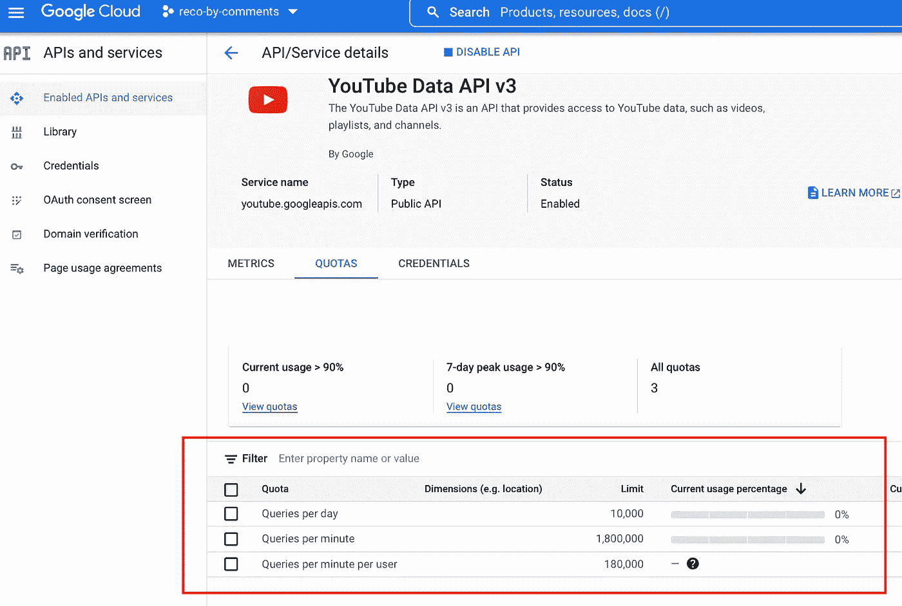

在云控制台上跟踪 API 使用水平

[YouTube 数据 API](https://developers.google.com/youtube/v3/docs) 提供对多种资源类型和方法的访问。这里使用的是:

*   `playlistItems.list`获取预告片播放列表中所有视频 id 的列表
*   `videos.list`获取每个视频的详细信息(标题、描述、上传日期等。)
*   `comments.list`获取评论回复/子级评论
*   `commentThreads.list`获取每个视频的主要/顶级评论列表

这产生了来自 1，254 个视频的总共 1，181，917 条评论的数据集。

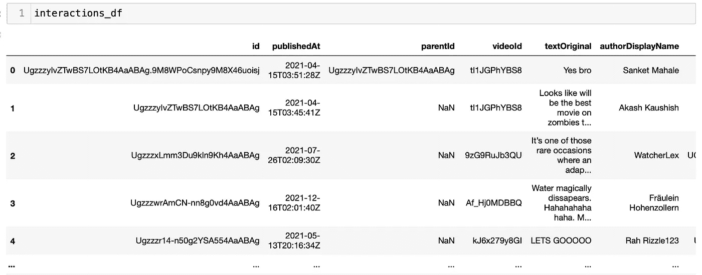

接下来，根据 AWS 个性化[模式需求](https://docs.aws.amazon.com/personalize/latest/dg/how-it-works-dataset-schema.html)对原始数据进行清理和格式化。这包括:

*   将时间数据字段转换为 UNIX 时间戳格式
*   解析视频标题，删除不相关的词，如“预告片”、“网飞”等。
*   非结构化文本字段必须用双引号括起来，值本身中的任何双引号都必须删除或用转义符格式化

未使用或未正确清理的字段在此步骤中被删除，但在原始数据中仍然可用，以供将来迭代使用。这是最终的数据集:

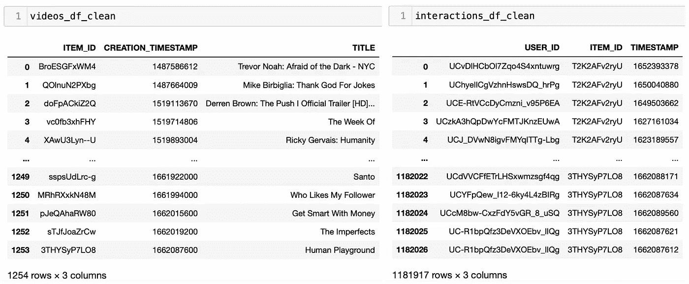

# 第 2 部分:生成建议

准备好格式化的数据后，现在进入 AWS 控制台来构建建议！

这两个文件首先以 CSV 格式上传到 S3 存储桶:

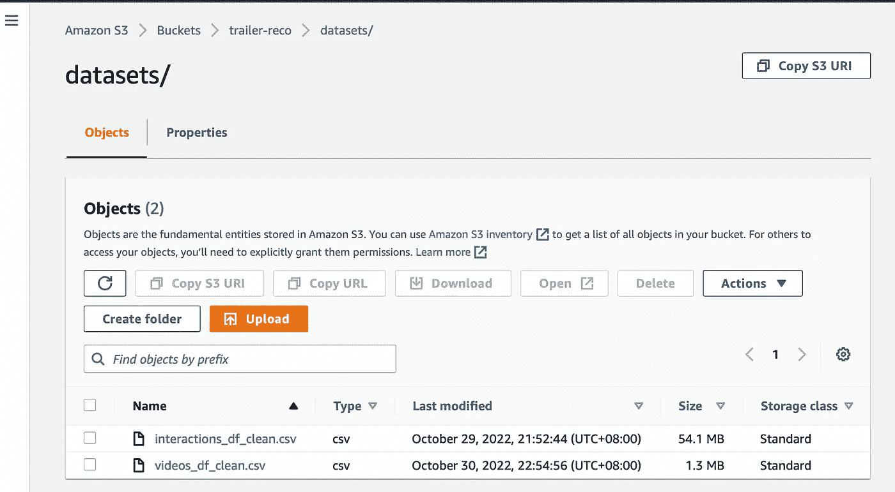

还必须设置权限和访问——为 AWS Personalize 创建一个 IAM 角色，并添加一个 S3 存储桶策略以允许个性化读写访问。

接下来，我们可以从 AWS 个性化服务开始构建推荐器:

首先，创建一个数据集组，并选择用例域。个性化提供不同的食谱，包括用户细分、个性化排名和相关项目。对于这个项目，我在“自定义”域下使用了一个`similar-items`食谱。

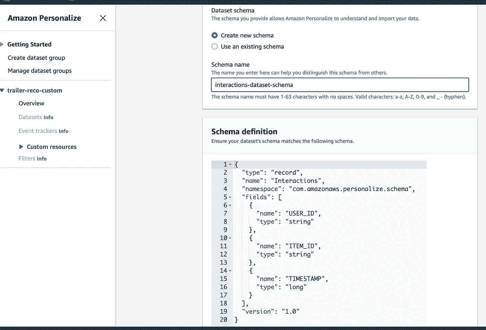

通过指定数据上载的 S3 位置并提供必须与导入的数据匹配的方案，导入数据以进行个性化。

数据集创建并成功导入后，创建一个解决方案并选择要使用的配方类型(`aws-similar-items`)。

有了这个设置，我们可以通过活动或批处理检索推荐结果——这里，我使用一个批处理作业来获取所有视频的结果。提供输入数据(JSON 文件格式的视频 id[列表)和输出目录(结果将被写入的文件夹)以启动批处理作业:](https://docs.aws.amazon.com/personalize/latest/dg/batch-data-upload.html#batch-inference-job-json-examples)

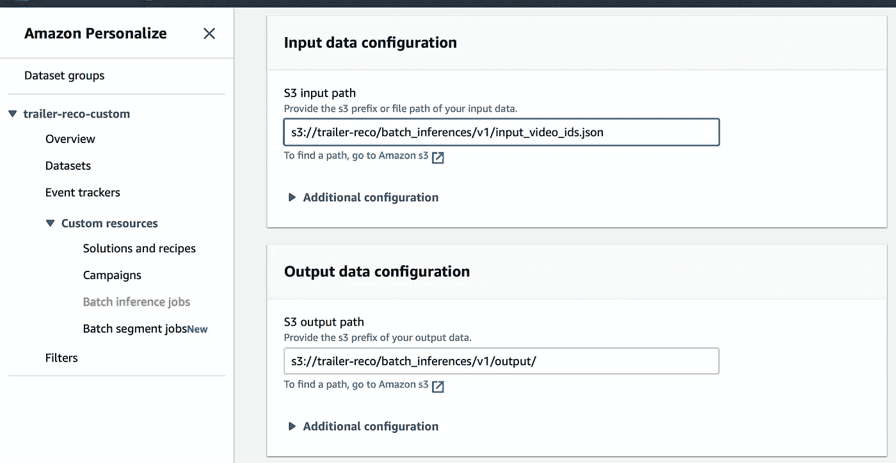

一旦批处理作业完成，推荐器结果应该在提供的输出 s3 位置可用。默认情况下，为每个项目生成 25 条建议，可在批处理作业中配置。

# 第 3 部分:结果

在对输出数据进行一些格式化和清理之后，下面是一些生成的类似项目建议的示例:

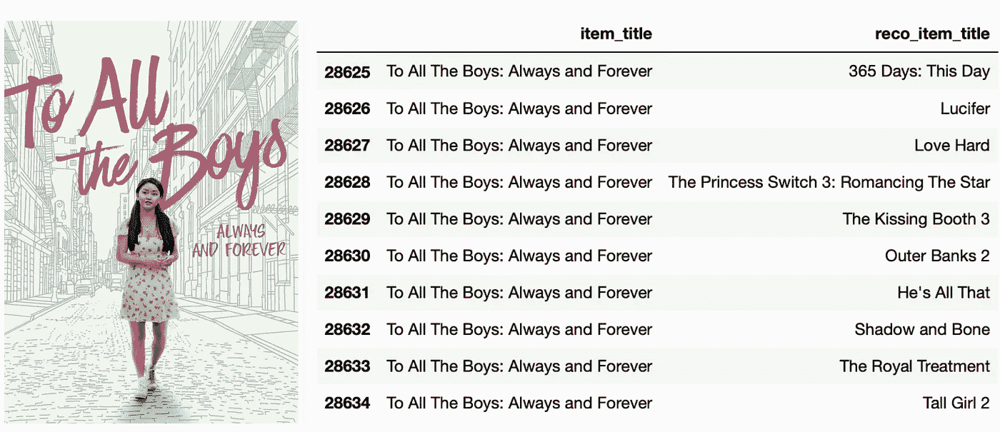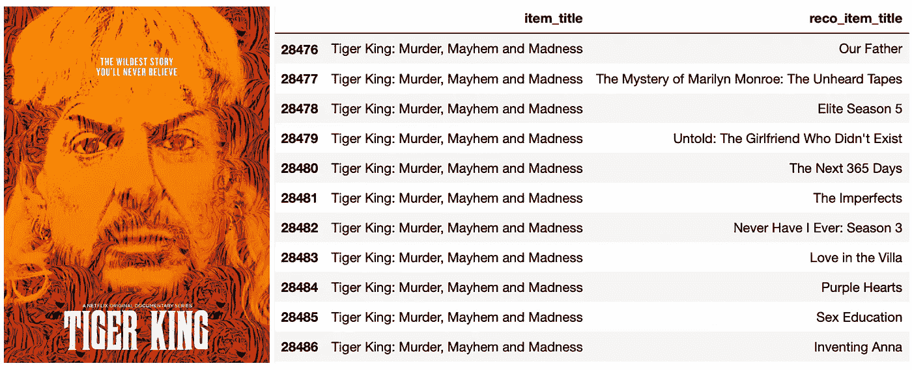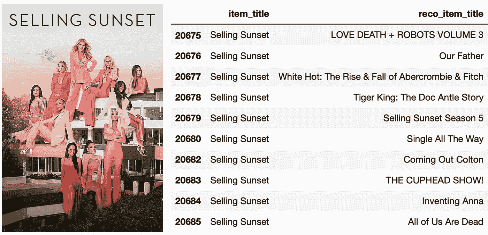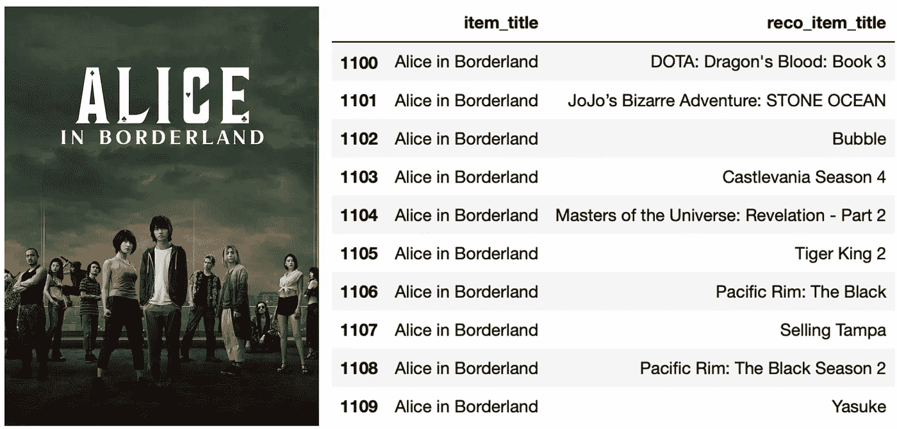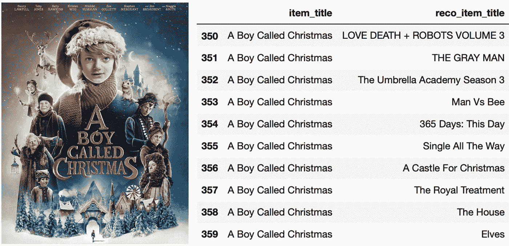

乍一看，推荐的几本书有明显的相似之处。*致所有男生:永远永远*与其他浪漫爱情片(*爱得狠*、*他就是那个*、*公主开关*)；*爱丽丝在边疆*与其他电子游戏和漫画启发的动作秀( *DOTA* 、*恶魔城*、*亚介*、*虎王*与其他调查纪录片(*我们的父亲*、*未披露的*、*发明安娜*)。*一个叫圣诞的男孩*也回报了各种圣诞题材的电影像*一路单身*、*圣诞城堡*、*精灵*。

然而，对其他人来说，这种联系并不那么明显。首先，*卖《日落》*和*吸引同样观众的《杯具秀》*有什么共同点？

最近非常受欢迎的标题也被推荐了不成比例的次数——我们的视频列表中有一半的节目被推荐<10 times, but *仅灰人*就被推荐了总共 370 次！

总的来说，最初的结果看起来很有希望，但要为生产部署做好准备，还需要更多的微调。可探索潜在后续步骤的一些领域包括:

1.  添加项目元数据:这个解决方案完全基于交互(评论)，几乎不包含任何项目元数据。演员、流派和描述等附加信息可以极大地提高结果的相关性。
2.  推荐没有互动的项目:一些节目几乎没有互动数据，即面临冷启动问题或特殊情况的新标题-在该数据集中，儿童节目的评论计数为`0`，因为儿童内容的评论已被禁用。

还有哪些领域值得研究？如果你有任何建议，请告诉我！

感谢阅读。