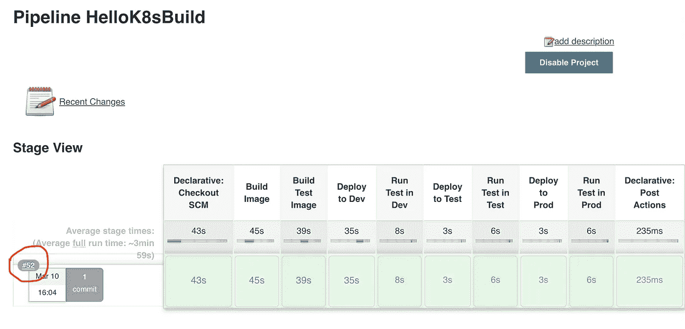
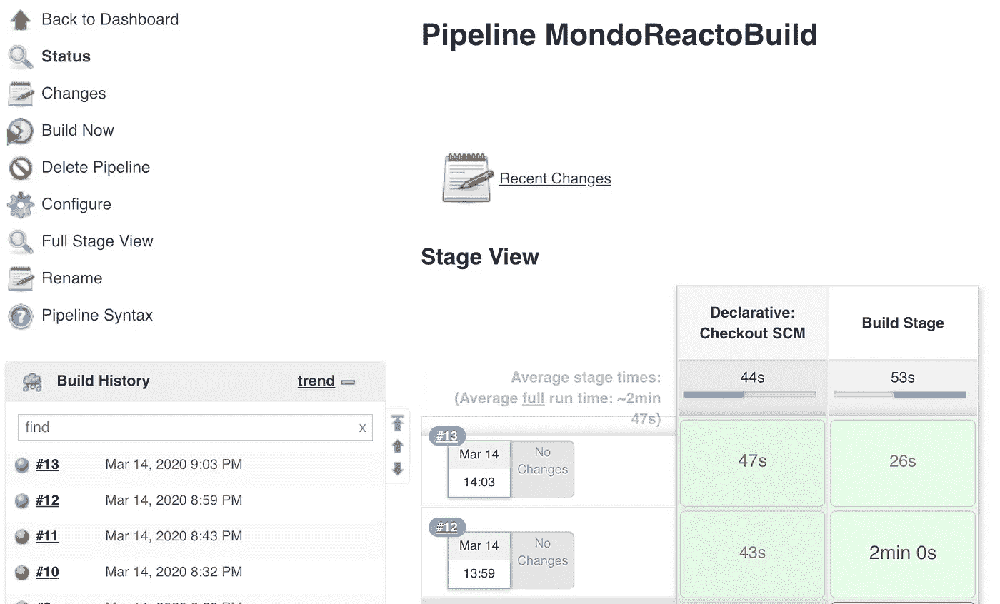

# 使用管道(第 2 部分)

> 原文：<https://betterprogramming.pub/more-playing-with-pipelines-24a97f136722>

## 构建和部署现有项目


图片来自 [Pixabay](https://pixabay.com/?utm_source=link-attribution&utm_medium=referral&utm_campaign=image&utm_content=569145)

在我的[上一篇文章](https://medium.com/better-programming/playing-with-pipelines-b5cf357ddd06)中，我使用 [Jenkins](https://jenkins.io/) 创建了一个构建和部署单个(伪)微服务的管道。但是一个微服务不是一个系统。微服务的全部意义在于，您可以根据需要单独扩展和缩小系统的各个部分。其他好处包括隔离、使用不同表达式语言的能力，以及更好地控制系统中的数据流。我要用一个我创建的更复杂的系统，制作一系列管道。

本文假设您已经阅读了我的前两篇文章，[使用 VMs 和 Kubernetes](https://medium.com/better-programming/playing-with-vms-and-kubernetes-26ef93019c22) 和[使用管道](https://medium.com/@rlkamradt/playing-with-pipelines-b5cf357ddd06)。您需要对 Linux 和命令行有一个基本的了解，以及对使用容器的基本了解，再加上我前两篇文章中收集的所有知识。

我的大部分文章都是关于玩耍的，我坚信玩耍是最好的学习方式。就在昨天，一位寻求软件帮助的同事最终表示，她将继续使用这个系统，直到她弄明白为止。有时候玩游戏在特定的时间点并不有趣，比如当你试图找出如何在末日地牢中杀死老板时，但它几乎总是令人满意的。我应该指出我为我的最后一点拍摄的截图，看看圈起来的数字:



我运行这个管道 52 次，才最终解决了所有的错误！说到一个难对付的老板！

但是哲学已经足够了。我要接一个演示几个微服务的项目，建立一些管道。这个项目叫做 [MondoReacto](https://github.com/rkamradt/MondoReacto) ，它是用 Java 编写的。它已经有了一个`Jenkinsfile`和`build-pod.yaml`，但是我将忽略它们，并可能在以后删除它们以避免混淆。正如我在之前的构建中所做的那样，我将创建一个新的 MondoReactoBuilder 存储库来保存所有的构建代码。我几乎不会改变 MondoReacto 项目本身，而是专注于在新项目中建立管道。

MondoReacto 的一个优点是它使用了谷歌的 [Jib 项目](https://github.com/GoogleContainerTools/jib)。这是专门针对用 [Maven](https://maven.apache.org/guides/getting-started/maven-in-five-minutes.html) 构建的 Java [Spring](https://spring.io/) 项目的，只需要插件包含在`pom`文件中。它不需要一个`Dockerfile`或 Docker 守护进程，所以没有 Docker-in-Docker 的问题，而且它只需要很少的配置。不利的一面是，它内置于 Maven 构建中，因此您无法将微服务的构建与管道构建分开。但是我们可以很容易地绕过它。

我们先做一个简单的管道。这将只是提取源回购并运行构建。这里是`Jenkinsfile`:

```
pipeline {
    agent any
    stages {
        stage('Build Stage') {
            agent {
              kubernetes {
              label 'maven'
              idleMinutes 10
              yamlFile 'pods/maven-pod.yaml'
              defaultContainer 'maven'
              }
            }
            steps {
              git '[https://github.com/rkamradt/MondoReacto.git'](https://github.com/rkamradt/MondoReacto.git')
              container('maven') {
                sh 'mvn -B clean install'
              }
            }
        }
    }
}
```

这里我们创建一个装载了 Maven 的 Kubernetes pod，检查代码，然后运行 Maven 构建。我们还没有创建图像。这将是下一步。下面是`pods/maven-pod.yaml`的定义:

现在我们可以创建 Jenkins 作业。这是一个非常简单的管道:您只需要指定存储库 URL、凭证和 Jenkins 文件的位置。使用声明性管道的最大好处是，如果您不小心删除了管道(因为构建和删除链接就在旁边)，很容易重新创建。这是目前为止的管道:



一个问题:第一次构建需要两分钟，但是第二次构建只需要 26 秒。这是因为第一个构建必须从 Maven Central 获取世界，但是第二个构建可以使用仍然包含在 pod 中的本地缓存。由于 pod 会在闲置十分钟后消失，这将是一个持续的问题。

两种可能的解决方案是将一个持久卷附加到 pod 并将本地缓存定向到那里，或者添加一个本地工件服务器，至少可以减轻 Maven Central 的负担。在本文中，我不会讨论这些策略，但是如果您打算将这些设置用于演示软件之外的其他用途，那么应该讨论一下。

你会注意到的另一件事是第一步大约是 45 秒，这太长了。看来默认的詹金斯从吊舱不会闲置很久。通过将空闲时间设置为 60 分钟，我可以将这个速度提高到大约 1 秒。单击管理 Jenkins 链接，然后配置系统。向下滚动到“云”部分，单击“窗格模板”按钮，然后单击“窗格详细信息”按钮。找到“空闲时保留代理的时间(分钟)”并将其设置为某个合理的值。那么你的第一阶段应该会减少很多。

下一步是将所有图像部署到本地存储库。目前，Maven 构建部署到 Docker Hub，因此这将意味着更改 MondoReacto 项目。因为我希望 MondoReacto 项目可以在这个新管道之外构建，所以我将参数化容器 repo 并将其默认为 Docker Hub。我还将允许不安全的注册，因为 Kubernetes 容器注册本质上是不安全的。下面是新的`Jib`插件配置:

```
<plugin>
  <groupId>com.google.cloud.tools</groupId>
  <artifactId>jib-maven-plugin</artifactId>
  <version>1.6.1</version>
  <configuration>
  <to>
    <image>${container-repo}/incoming-persist:${project.version}</image>
  </to>    
  <allowInsecureRegistries>true</allowInsecureRegistries>  </configuration>
</plugin>
```

像这样的插件是如何在没有`Dockerfile`的情况下创建图像的？它创建了三层:一层用于 jar 依赖项，一层用于本地类文件，一层用于资源。然后它找到你的 Spring 主文件并执行它。通过对您的 Spring 应用程序进行大量假设，不需要任何配置。它确实使用了谷歌无发行版的基本映像，但是你可以改变它。

实际上，通过添加更多的配置，您可以改变很多东西，但是这种做法违背了约定优于配置的目的。我主要使用它，因为我想在 Kubernetes 中进行构建，而不是在 Docker 中与 Docker 纠缠。一个小小的不便是，它只部署到外部容器存储库。如果您正在使用 Docker 或 Docker Compose，您需要在使用它之前将其拉出。

为了使用它来构建图像，我们必须进入应用程序模块并运行`mvn jib:build -Dcontainer-repo=registry.container-registry:5000`。这将为我们在 MondoReacto 的三个微服务构建映像。(我们也将为测试创建图像，但这还不在项目中。)

因为我们没有外部化的 Maven 依赖缓存，所以构建映像必须和构建一起完成。下面是新的`Jenkinsfile`部分:

```
container('maven') {
  sh """
    mvn -B clean install
    cd incoming-persist
    mvn -B jib:build -Dcontainer-repo=registry.container-registry:5000
    cd ../incoming-read-service
    mvn -B jib:build -Dcontainer-repo=registry.container-registry:5000
    cd incoming-service
    mvn -B jib:build -Dcontainer-repo=registry.container-registry:5000
  """
}
```

运行它，看看它是否工作。在修复了十几个愚蠢的错误后，成功了！

接下来，让我们部署和每个微服务。因为所有的部署都非常相似，所以我将使用一个管道来部署每个部署并对其进行参数化。我可以使用我上一篇文章中的`Jenkinsfile`并修改它以使用参数。我还将删除测试阶段，因为我们还没有准备好作为映像运行测试。然后我可以在 Jenkins 中创建一个运行参数化管道的新作业，并对其进行测试。部署`yaml`文件看起来会像这样:

注意带有 IP 地址的`loadBalancerIP`。这是我最初设置 Metallb(我在上一篇文章中安装的负载平衡器)时从 IP 地址范围中设置的。我设置它是因为我的入口是通过外部 nginx 的，我想保持外部 IP 稳定，这样我就不必在每次重新部署时重新配置 nginx。

我创建了三个`yaml`文件:`incoming-service.yaml`、`incoming-persist.yaml`和`incoming-read-service.yaml`——根据需要替换名称。另外，`incoming-persist.yaml`不需要服务部分，只需要部署部分，因为它从消息队列中读取。对于完整的`Jenkinsfile`，我将添加一个到 repo 的链接，以便您可以看到它，但是它看起来很像我在上一篇文章中创建的`Jenkinsfile`，没有构建或测试部分。

我用一个名为`DEPLOYMENTNAME`的选择参数来参数化新的 Jenkins 作业，有三个选择:`incoming-service`、`incoming-persis` t 和`incoming-read-service`。然后在`Jenkinsfile`中，我用`${parameters.DEPLOYMENTNAME}.yaml`替换了所有的部署`yaml`文件，这样一个管道就可以在所有的环境(开发、测试、生产)中构建所有的服务。这是我对詹金斯工作的唯一修改；其他的都是从构建作业中复制的，到`Jenkinsfile`的路径被改为`pipelines/deploy/Jenkinsfile`。

在纠正了一些拼写错误后，我能够运行并部署所有的服务了。查看`kubectl get services --all-namespaces`的输出，我可以看到它们都在运行。

```
NAMESPACE            NAME                    TYPE           CLUSTER-IP       EXTERNAL-IP       PORT(S)                  AGE
container-registry   registry                NodePort       10.152.183.65    <none>            5000:32000/TCP           3h9m
default              jenkins                 LoadBalancer   10.152.183.138   192.168.122.240   8080:30816/TCP           9d
default              jenkins-agent           ClusterIP      10.152.183.166   <none>            50000/TCP                9d
default              kubernetes              ClusterIP      10.152.183.1     <none>            443/TCP                  9d
kube-system          kube-dns                ClusterIP      10.152.183.10    <none>            53/UDP,53/TCP,9153/TCP   9d
kube-system          kubelet                 ClusterIP      None             <none>            10250/TCP                40h
mondoreacto-dev      incoming-read-service   LoadBalancer   10.152.183.230   192.168.122.244   80:31517/TCP             15m
mondoreacto-dev      incoming-service        LoadBalancer   10.152.183.19    192.168.122.241   80:31560/TCP             67m
mondoreacto-prod     incoming-read-service   LoadBalancer   10.152.183.120   192.168.122.246   80:31432/TCP             15m
mondoreacto-prod     incoming-service        LoadBalancer   10.152.183.116   192.168.122.243   80:31086/TCP             67m
mondoreacto-test     incoming-read-service   LoadBalancer   10.152.183.108   192.168.122.245   80:31285/TCP             15m
mondoreacto-test     incoming-service        LoadBalancer   10.152.183.124   192.168.122.242   80:31581/TCP             67m
```

请注意，`incoming-persist`没有服务，因为它没有服务定义。

如果我们看看豆荚，我们可以看到他们都在运行。然而，如果我们查看日志，我们可以看到他们失败得很惨。

服务有一些要求，Kafka 和 MongoDB。我们应该将它们安装到不同的名称空间中，看看这样是否会让这些服务更好用。

就像我们用 helm 文件安装 Jenkins 一样，我们也可以用 Helm 文件安装 MongoDB 和 Kafka。要安装 MongoDB，请运行以下命令:

```
helm install mongodb stable/mongodb -n mondoreacto-dev
helm install mongodb stable/mongodb -n mondoreacto-test
helm install mongodb stable/mongodb -n mondoreacto-prod
```

Kafka 来自不同的 Helm 库，所以我们必须先添加它，但除此之外，都是一样的。

```
helm repo add incubator [http://storage.googleapis.com/kubernetes-charts-incubator](http://storage.googleapis.com/kubernetes-charts-incubator)
helm install kafka incubator/kafka -n mondoreacto-dev
helm install kafka incubator/kafka -n mondoreacto-test
helm install kafka incubator/kafka -n mondoreacto-prod
```

为了访问这些新服务，我们可以将它们放在不同的`yaml`文件中。这里是`incoming-persist.yaml`:

类似的`env`部分将被添加到`incoming-service.yaml`和`incoming-read-service.yaml`中。由于我们构建应用程序的方式，`incoming-persist`服务需要访问 MongoDB，即使它不使用它。Spring 在类路径中寻找感兴趣的组件，并试图启动它们，即使我们从来不使用它们。我们需要重新构建我们的应用程序，从类路径中排除 MongoDB 组件，或者在类扫描中加入排除项。目前，我们不会担心这个问题。

用`kubectl get services -n mondoreacto-dev`找到`incoming-read-service`的外部 IP 地址，看看能不能用`http://<ipaddress>/incoming`把它卷起来，应该会返回一个空列表(因为我们还没有给`incoming-service`发送任何东西)。但是，它会返回一条错误消息，这是我们应该预料到的:

```
curl [http://192.168.122.242/incoming](http://192.168.122.242/incoming)
{
  "timestamp":"2020-03-17T20:32:36.273+0000",
  "path":"/incoming",
  "status":500,
  "error":"Internal Server Error",
  "message":"Query failed with error code 13 and error message 'command find requires authentication' on server mongodb:27017; nested exception is com.mongodb.MongoQueryException: Query failed with error code 13 and error message 'command find requires authentication' on server mongodb:27017",
  "requestId":"9807dc29"
}
```

我们需要提供凭证来访问 MongoDB。但至少我们知道可以和 MongoDB 对话。

当您为 MongoDB 安装 Helm chart 时，它应该已经打印出了一些关于如何使用它的说明。

```
NAME: mongodb
LAST DEPLOYED: Tue Mar 17 00:46:25 2020
NAMESPACE: mondoreacto-prod
STATUS: deployed
REVISION: 1
TEST SUITE: None
NOTES:
** Please be patient while the chart is being deployed **MongoDB can be accessed via port 27017 on the following DNS name from within your cluster:mongodb.mondoreacto-prod.svc.cluster.localTo get the root password run:export MONGODB_ROOT_PASSWORD=$(kubectl get secret --namespace mondoreacto-prod mongodb -o jsonpath="{.data.mongodb-root-password}" | base64 --decode)To connect to your database run the following command:kubectl run --namespace mondoreacto-prod mongodb-client --rm --tty -i --restart='Never' --image docker.io/bitnami/mongodb:4.2.3-debian-10-r31 --command -- mongo admin --host mongodb --authenticationDatabase admin -u root -p $MONGODB_ROOT_PASSWORDTo connect to your database from outside the cluster execute the following commands:kubectl port-forward --namespace mondoreacto-prod svc/mongodb 27017:27017 &
    mongo --host 127.0.0.1 --authenticationDatabase admin -p $MONGODB_ROOT_PASSWORD
```

值得注意的是描述如何设置`MONGODB_ROOT_PASSWORD`环境变量的那一行。您可以看到，它已经将其密码嵌入到 Kubernetes 的一个秘密中，因此我们只需将该秘密传递给我们的服务。

在中运行 MongoDB 和 Kafka 时，需要添加一些属性来配置如何访问它们。在 MondoReacto 项目中，一切都在运行，每个人都信任每个人。所以现在我们必须为 MondoReacto 项目中的服务对`application.properties`进行更改。即使不是所有的服务都使用 MongoDB 和 Kafka，我们也可以对每个人使用相同的属性文件。这是我想到的:

```
spring.data.mongodb.host=mongodb
spring.data.mongodb.password=${MONGODB_ROOT_PASSWORD}
spring.data.mongodb.authentication-database=admin
spring.data.mongodb.username=root
spring.data.mongodb.database=incoming
spring.data.mongodb.port=27017
kafka.bootstrap.address=kafka:9092
```

现在我们需要确保这些设置在`yaml`文件中。这里是`incoming-read-service.yaml`环境部分:

desc 目录中的所有`yaml`文件应该有相似的环境设置。

这里需要注意一些事情。我们设置`SPRING_DATA_MONGODB_HOST`，并将其设置为 Kubernetes 提供的主机 DNS 名称。由于 MongoDB、Kafka 和我们的微服务之间的名称空间是相同的，所以只需要服务名。这也意味着对于`-dev`、`-test`和`-prod`名称空间，每个人只与运行在同一个名称空间中的服务对话。

Spring 会自动将`SPRING_DATA_MONGODB_HOST`映射到`application.properties`文件中的`spring.data.mongodb.host`属性。我总是尝试用大写/下划线表示环境变量，用小写/点表示属性。

最后要注意的是`MONGODB_ROOT_PASSWORD`是从存储在 Kubernetes 中的秘密值中收集的。您的密码再也不应该存储在四处传递的文件中，最终不可避免地会出现在您的 Git 存储库中。

现在我们应该从 Jenkins 重新运行构建作业，然后从 Jenkins 运行各种部署作业(每个服务一个)。这样做之后，我们就可以设置 nginx 反向代理了。这个设置的反向代理与我们到目前为止设置的略有不同。这是因为我们希望`POST`和`GET`访问看起来来自同一个服务器，即使它们由不同的微服务处理。因此，使用一点路径技巧，我们可以像这样完成:

```
server {
  listen 80;
  listen [::]:80;#Server DNS name
  server_name incoming;
  ignore_invalid_headers off; #pass through headers from Jenkins which are considered invalid by Nginx server.location /read/incoming {
      # use the name from the upstream section (no ip:port necessary)
      proxy_pass [http://192.168.122.245:80/incoming](http://192.168.122.245:80/incoming);
      sendfile off;
      proxy_redirect     default;
      proxy_http_version 1.1;proxy_set_header   Host              $host;
      proxy_set_header   X-Real-IP         $remote_addr;
      proxy_set_header   X-Forwarded-For   $proxy_add_x_forwarded_for;
      proxy_set_header   X-Forwarded-Proto $scheme;
      proxy_max_temp_file_size 0;#this is the maximum upload size
      client_max_body_size       10m;
      client_body_buffer_size    128k;proxy_connect_timeout      90;
      proxy_send_timeout         90;
      proxy_read_timeout         90;
      proxy_buffering            off;
      proxy_request_buffering    off; # Required for HTTP CLI commands in Jenkins > 2.54
      proxy_set_header Connection ""; # Clear for keepalive
   }
   location /post/incoming {
      # use the name from the upstream section (no ip:port necessary)
      proxy_pass [http://192.168.122.241:80/incoming](http://192.168.122.241:80/incoming);
      sendfile off;
      proxy_redirect     default;
      proxy_http_version 1.1;proxy_set_header   Host              $host;
      proxy_set_header   X-Real-IP         $remote_addr;
      proxy_set_header   X-Forwarded-For   $proxy_add_x_forwarded_for;
      proxy_set_header   X-Forwarded-Proto $scheme;
      proxy_max_temp_file_size 0;#this is the maximum upload size
      client_max_body_size       10m;
      client_body_buffer_size    128k;proxy_connect_timeout      90;
      proxy_send_timeout         90;
      proxy_read_timeout         90;
      proxy_buffering            off;
      proxy_request_buffering    off; # Required for HTTP CLI commands in Jenkins > 2.54
      proxy_set_header Connection ""; # Clear for keepalive
   }

}
```

我留下了一些对于像 Jenkins 这样的老式 MVC 客户机-服务器系统来说最必要的东西。我确信有一个 nginx 天才可以用三行代码做到这一点。但是这个管用，我就不去管了。

所以一旦这些都准备好了，我就让邮递员出来试一试，非常失望地发现什么都没用。似乎 MondoReacto 项目处于建设中，所以我不得不进去做一些调试和检测工作。但是一旦解决了这个问题，我就有了两个端点:对[http://incoming/POST/incoming](http://incoming/post/incoming)的 POST 将在数据库中存储一些 JSON，对[http://incoming/read/incoming](http://incoming/read/incoming)的 GET 将返回所有数据，或者对[http://incoming/read/incoming/{ key }](http://incoming/read/incoming/{key})的 GET 将返回一个条目。

我们离这个系统还远着呢。构建应该启动部署。部署应该运行测试。我们也许应该有某种日志嗅探器，这样我们就不会沦落到`kubectl logs`。图像标签之间可能应该有一些协调，以便当图像从开发到测试再到生产时，它们被必要地标记。但这篇文章我看完了。

概括地说，我们已经取得了一个现有的项目，并创建了一个构建/部署管道，对代码进行了最小的更改。

构建脚本的代码可以在这里找到:[https://github . com/rkamradt/mondoreactbuild/releases/tag/v 1.0](https://github.com/rkamradt/MondoReactoBuild/releases/tag/v1.0)

实际运行的 MondoReacto 项目可以在这里找到:[https://github.com/rkamradt/MondoReacto/releases/tag/v1.0](https://github.com/rkamradt/MondoReacto/releases/tag/v1.0)

我确信我很快就会再次写作，只要我能找到我下一步想改进的领域。