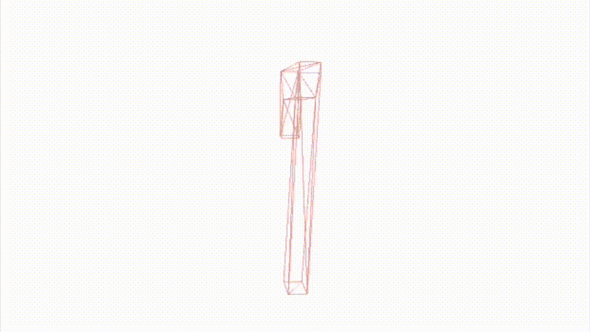
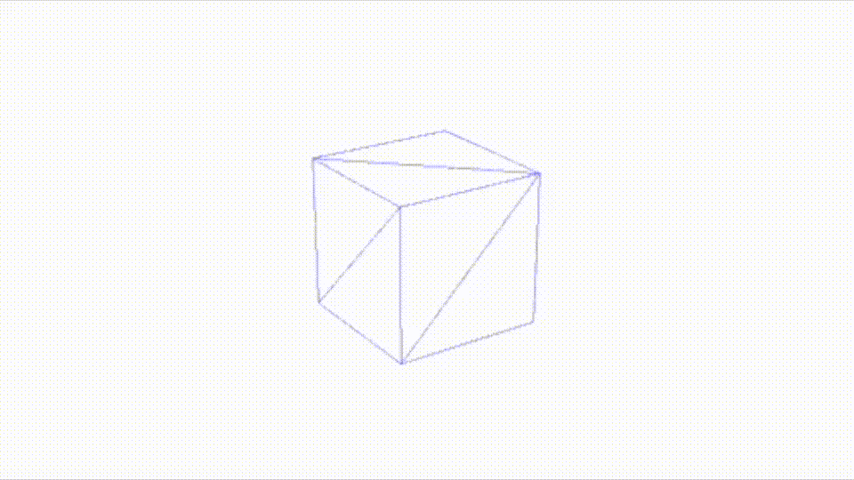
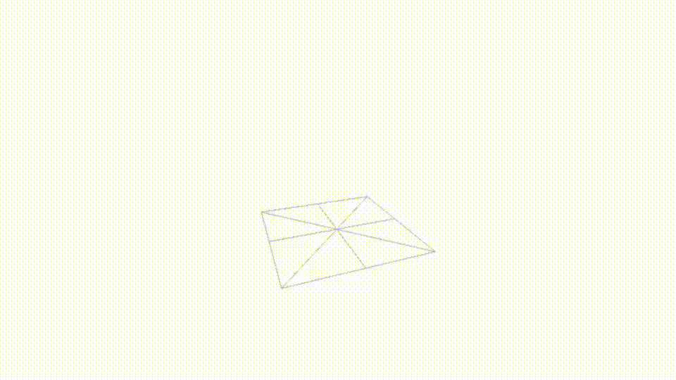
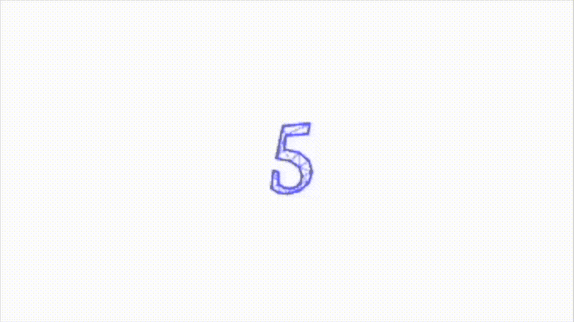

# 在 SceneKit 下变形节点

> 原文：<https://betterprogramming.pub/morphing-nodes-under-scenekit-b6c72784265a>

## 如何在场景中改变物体的几何形状



作者创建的 SceneKit | GIFs 中的数字之间的变形

我最近又看了一遍史蒂夫·乔布斯的电影，不禁反思这个人如何改变了他一生中的两个行业。计算机产业和电影产业——后者是皮克斯公司的创立，该公司于 1995 年制作了第一部全 3D 动画长片《玩具总动员》。

这家公司当时肯定会使用苹果电脑及其早期版本的动画框架，如 Core Image、SceneKit 和现在的 Metal，其中一个关键元素是 morphers 将两个形状从一个融合到另一个。

和我一起在这篇文章中学习在 SceneKit 中这样做的基本知识，这个过程没有我认为苹果公司关于这个主题的手册页所建议的那么明显。

# 基本变形

先说一个简单的动画 GIF。



一个在场景下从小变大再变回来的盒子

在图像中，你看到一个简单的蓝色立方体；在变小变蓝之前变大变红。我通过下面的代码片段实现了一种效果:

我已经创建并添加了一个具有`cubeGeometry`布局的立方体，这个配置后来被我改成了`cubeGeometry2`。当我完成最后一个时，通过删除添加的原始节点并用新节点替换它来更改节点。

整个过程是由我前几个月在这篇[文章](/16-useful-extensions-for-swiftui-88aae6ff8909)中描述的订阅设置触发的。

# 自定义变形

在此图像中，您可以看到两个自定义几何图形从一个变形到另一个。



一个平面在场景中变形为一个尖角

这需要更多的代码。更多的代码，因为你需要几个我之前在这篇[文章](/custom-geometry-in-scenekit-under-swiftui-35a95520e6d9)中描述的扩展。构建自定义几何图形的扩展。代码如下:

用于创建自定义形状的代码，您可以随后使用前面显示的变形代码对其进行变形。

# 组合变形

最后，在这张图片中，我将数字 1 的几何形状变形为多个立方体，这是一种爆炸效果。



在 SceneKit 下将 textNode 变形为 cubeNode

我确实试着用了一个圆，但是说实话，一塌糊涂。你也可以尝试其他形状。只要顶点匹配的数量，它可以是任何值。

> 不幸的是，你似乎不能直接访问组成 TextNode 的顶点，所以我不能直接变形一个数字，尽管当你尝试这样做时，morphing 命令会崩溃并告诉你需要多少个顶点。

不同的数有不同的顶点数:一个基本数有 230 个顶点；两个具有 322 个顶点，三个具有 636 个顶点，四个具有 322 个顶点，五个具有 404 个顶点。如果你使用不同的字体，我也怀疑这个数字会改变。通过改变所绘制图形的不同属性，可以增加顶点数。所以，像这样的代码:

```
let rect3 = CGRect(x: 0, y: 0, width: 2, height: 2)
let roundedRect3 = UIBezierPath(roundedRect: rect3, cornerRadius: 2)
neuText.chamferRadius = 0.5
neuText.flatness = 0.2
neuText.chamferProfile = roundedRect3
neuText.chamferRadius = 0.5
```

我在这里详细描述代码给`textNode`。看起来是这样的:

除了创建`textNode`(以及您计划将其变形到的节点)，您只需填充后者。代码如下:

```
var vertex = cubeNode.geometry?.vertices(multiple: 3.0)
var cvertex = vertex!for i in 0...7 {
  vertex!.append(contentsOf: cvertex)
}
for i in 0...13 {
  vertex!.append(SCNVector3(x: 1, y: 1, z: 0))
}
```

首先提取顶点的代码如下所示:

但是等等，我还没说完。

# 变形魔法

我继续在这方面瞎折腾，发现我可以访问一个`textNode` 的顶点，如果我创建它，然后使用所说的`textNode`的几何图形制作第二个节点。新节点看起来不错——也许不完美，但足够接近了。现在我可以直接从一个数字转换到另一个数字。


在 SceneKit 下将一个数字直接变形为另一个数字

没有火箭科学。我找出哪个图形有最多的顶点(在所示的例子中是 8 号),并填充所有其他图形，使它们都有相同的数字，这意味着我可以使用已经显示的变形代码。

同样的方法，我用来填补一个形状，使顶点的数量匹配，这一次我把重点放在数字上。

感谢阅读！