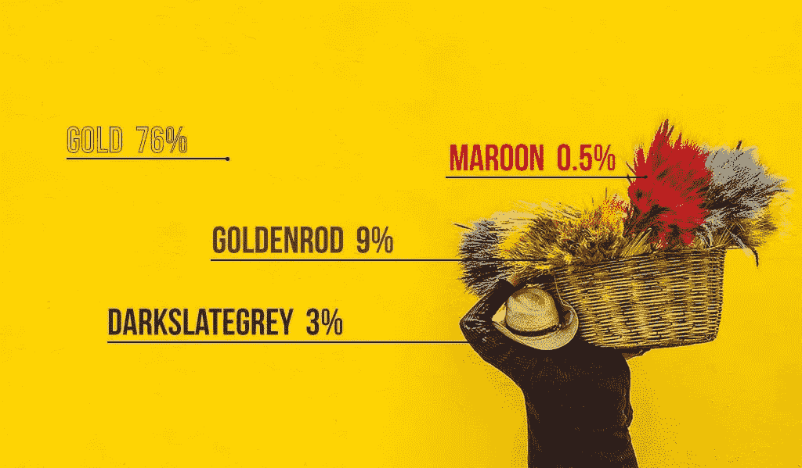

# 如何获得图像的最主要颜色

> 原文：<https://betterprogramming.pub/most-dominant-color-of-an-image-4645419af9ce>

## 获取图像最主要颜色的名称，将其用作机器学习模型中的一个特征

照片由[预测黑客](https://predictivehacks.com/wp-content/uploads/2019/08/COLORS.jpg)拍摄。

 [## 用我的推荐链接加入媒体-乔治皮皮斯

### 阅读乔治·皮皮斯(以及媒体上成千上万的其他作家)的每一个故事。您的会员费直接支持…

jorgepit-14189.medium.com](https://jorgepit-14189.medium.com/membership) 

当我们在图像上建立机器学习模型时，除了图像标签，我们还希望获得它们的颜色名称——通常作为分类变量。出于这个原因，我们需要将 [RGB 像素转换成颜色标签](https://predictivehacks.com/how-to-use-rgb-codes-as-features-in-a-machine-learning-algorithm/)。

# 如何获得最主要颜色的名称

逻辑是迭代所有图像像素并得到它们的标签[。然后基于频率，我们会得到 *n* 个最频繁出现的颜色名称。](https://predictivehacks.com/iterate-over-image-pixels/)

图片由[幻想米洛斯](https://www.fantasy-milos.com/slider/69/slider_image.jpg)提供。

这是将 RGB 像素转换为颜色名称的函数:

现在让我们编写一个函数，该函数将图像作为输入，并返回图像中顶部的 *n* 种颜色以及它们相应的权重/比例:

我们可以看到，最主要的三种颜色分别是“钢蓝”(10.74%)、“亮绿”(10.3%)和“矢车菊蓝”(8.98%)！