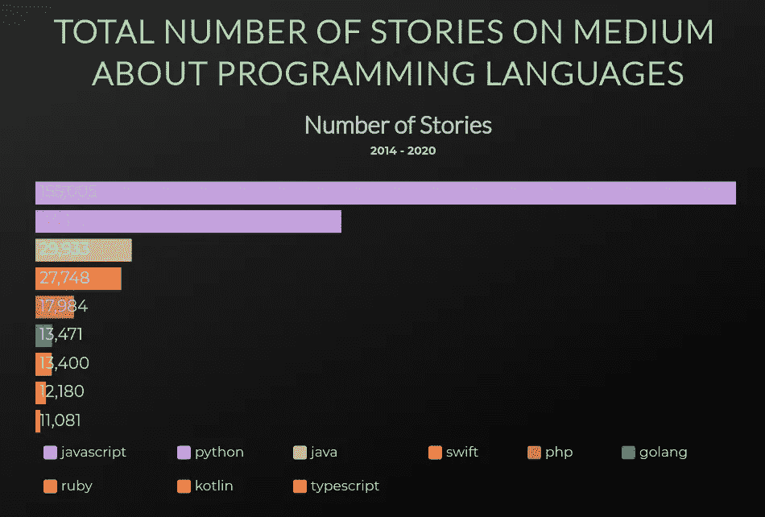
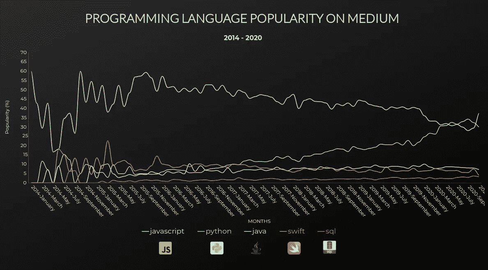
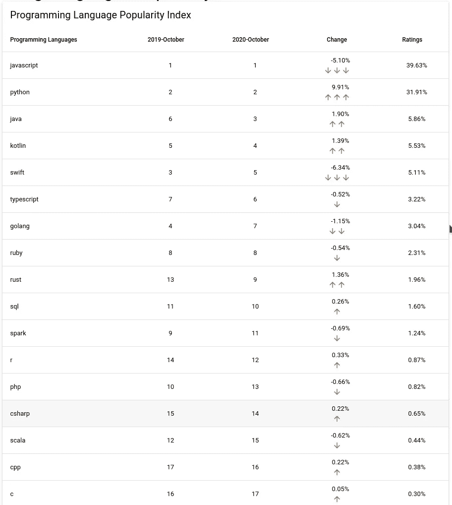

# 媒体上最流行的编程语言

> 原文：<https://betterprogramming.pub/most-popular-programming-languages-on-medium-eba40ed68513>

## 我分析了 378，588 个中型故事



编程语言的故事总数(图片来源:作者)

技术继续加速发展。软件世界也获得了它的份额。

有几十种编程语言，这些语言的使用率随着技术的发展而变化。虽然一些语言的名气在迅速增加，但一些语言正在慢慢消失。

正如赫拉克利特所说，唯一不变的是变化。当然，编程语言与这种深刻的信念是一致的。

因此，我认为对于一个软件开发人员或软件开发候选人来说，跟踪当前技术的发展，尤其是编程语言的发展，并相应地回顾自己的职业规划是非常重要的。

虽然我经常专注于我正在做的工作，而忽略了关注大局，但我会尽可能地让自己跟上时代。

在这方面，Medium.com 是最重要的渠道之一。Medium 是一个巨大的博客平台，每月拥有大约 1 亿活跃用户，它鼓励用户通过其附属计划制作优质内容。

前一阵子，我想知道在 Medium 上发表的故事中有多少是关于编程语言的，于是我决定做一个这方面的研究。

虽然它们与我的职业没有直接关系，但这类与数据科学相关的研究总是让我兴奋不已。

# 我是如何获得媒介故事的

对我来说，手动做这件事是不可能的，因为有成千上万的故事。为了让我的工作更容易，我开发了一个小型通用软件来下载故事的元数据。有了我用 Python 开发的这个软件，你可以通过指定任何你想要的标签来下载 JSON 格式的故事元数据。

例如，要下载 Python 标记的故事的元数据，只需运行以下命令:

```
python medium_query.py collect-archive -t python
```

或者，您可以通过在文本文件的每一行中键入标记来下载带有这些标记的数据:

```
python medium_query.py collect-archive -f <filename>
```

您可以从这个 [GitHub 存储库](https://github.com/yahyacivelek/medium-query)中找到研究的源代码。

用这个软件，我下载了 378588 个故事的数据，这些故事根据 [TIOBE 索引](https://www.tiobe.com/tiobe-index/)被标记为 25 个最受欢迎的节目。

我花了大约六个小时来下载数据，当我压缩它的时候大约有 115 MB。

# 我是如何分析**378588 个故事**

利用这些数据，我分析了 2014 年至 2020 年间编程语言的统计数据，以及这些语言的受欢迎程度随时间的变化。

为此，我使用了 Python 及其最重要的库之一， [pandas](https://pandas.pydata.org/) 。

在下面的图表中，你可以找到前十种编程语言的文章总数。


编程语言的故事总数(图片来源:作者)

自 2014 年以来，JavaScript 在故事数量上以压倒性的差异领先。

在下图中，你可以看到编程语言的流行程度随时间变化的图表。



编程语言在介质上的流行趋势(图片来源:作者)

如图所示，Python 的流行程度超过了 JavaScript。

为了清楚起见，我只需要画出到 2020 年 11 月前五种编程语言的变化。

你可以在这个网页上访问这些图形的互动版本，包括所有语言等等。

在创建这个图表时，我使用了与 TIOBE 索引类似的方法。对于每种编程语言，在一个月的时间范围内:

1.  计算带有特定编程语言名称标签的文章总数。
2.  将该数字除以文章总数，然后乘以 100。(每个月的总价值将是 100。)

还有，受 TIOBE 的启发，我把 2020 年 10 月到 2019 年 10 月之间的编程语言从最喜欢的到最不喜欢的排列了出来。你可以在下表中看到。



根据媒体报道的编程语言流行指数(图片来源:作者)

你可以在 GitHub 上访问我的分析的[源代码](https://github.com/yahyacivelek/medium-data-analysis)和我从 Medium 获得的数据。

我不会在这里彻底评价结果。这是因为它值得一个额外的文章，我还没有准备好。

然而，我不能不表达我对两个问题的浅见。

# Python 和 C 的舞蹈

我的第一个观点是关于 Python，它在图表中不断上升，直追 JavaScript。众所周知，Python 是一种越来越流行的语言。

有了这些成果，我亲身见证了 Python 的这种崛起。

第二，当与 TIOBE 指数比较时，结果包含一些大的差异。

举个例子，C 语言虽然在 TIOBE 指数中排名第一，但是根据我得到的结果，它排名第 17。这是一个巨大的差异。

作为一名经常使用 C 语言的嵌入式软件开发人员，我想知道我们是否会观察到我和我的同事在讨论中抱怨的一个问题。考虑到 TIOBE——一本被引用了 20 年的严肃著作——对编程语言进行了准确的观察，尽管 C 语言很受欢迎，但这类文章的数量相对较少。

正如我上面提到的，我不会在这里讨论其中的原因。然而，如果你分享你的想法，我会非常高兴。

# 结果

当然也有可能对研究结果多加思考，做出不同的评价。我只是想跳过这一部分，立即分享结果。

我等待你的评论、建议和意见。

感谢您的阅读。