# Ruby on Rails 中的电影比较网站

> 原文：<https://betterprogramming.pub/movie-comparison-website-in-ruby-on-rails-4632f2e1dee2>

## *在 Ruby on Rails 中构建自连接和三元连接—第 3 部分*

本文是 [*在 Ruby on Rails*](https://medium.com/@jdprince555/building-self-joins-and-triple-joins-in-ruby-on-rails-455701bf3fa7) 中构建自连接和三连接的延续。上一篇文章讨论的是创建后端，而本文则专门讨论如何将数据显示在屏幕上*。*又称前端。

# 该系列

回顾整个系列:

## 第一部分

[*codd father:关系数据库基础*](https://medium.com/@jdprince555/the-coddfather-relational-database-fundamentals-533b96f87651)

我们问:“请告诉我，什么是关系数据库？”我们在探索一对多、多对多和多对多自联接关系时回答了这个问题。

## 第二部分

[*在 Ruby on Rails 中构建自连接和三元连接*](https://medium.com/@jdprince555/building-self-joins-and-triple-joins-in-ruby-on-rails-455701bf3fa7)

我们使用 Ruby on Rails 实现了一个自连接关系，然后在一个基于用户的电影比较应用程序的上下文中实现了一个三元连接关系。

## 第三部分(本文)

*Ruby on Rails 中的电影对比网站*

我们将利用我们在第 2 部分中巩固的逻辑，在几个相互关联的网页上显示电影比较信息。然后，我们将创建允许我们为个人用户创建新的电影比较的方法。

到本文结束时，我们的目标是在一个页面上看到特定用户认为“优秀”的所有电影和他们认为“低劣”的所有电影。

我们还希望能够随意添加到这个列表中:

第一部分和第二部分都有很多解释。

第三部分则相反。我想让你尽快在网页上看到你刚刚完成的工作(创建一个三重连接)。关于我们在 Rails 中创建路线、视图和控制器时所发生的事情的更详细的解释，请访问本文: [Rails MVC](https://medium.com/@jaryl/disciplined-rails-models-controllers-the-rails-way-bbc940822136) 。

如果你想看上面的风格版本，请访问该网站搜索电影，创建收藏夹，比较电影，并获得推荐:

网站(Heroku 加载可能需要几秒钟): [MyMDb](https://my-m-db.herokuapp.com/)

# (尤指为开车者设计的) 公路交通图

也就是说，这是我们的路线图:

*   启动一个 Rails 服务器。
*   创建显示所有用户的索引页。
*   在显示页面上显示与特定用户相关的所有比较。
*   创建相应的电影索引和显示页面。
*   为新的比较构建一个“创建”表单。

让我们开始吧。

# 访问 Rails 服务器

导航到包含我们在第 2 部分中创建的项目的文件夹。对我来说:

`$ cd Desktop/Dev/movieComparisonApp`

注意:与这个项目相关的 GitHub repo 可以在这里找到:[examplemoviecomparisonpp](https://github.com/SwanHub/exampleMovieComparisonApp)。

如果您还没有创建您的后端，这篇文章将不会有帮助。在继续之前，请确保您的数据都已设置好。

启动服务器:

`$ rails s`

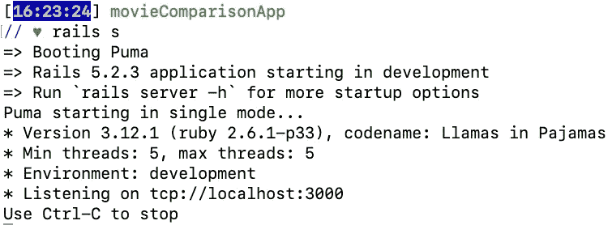

访问上面命令行响应中定义的`localhost`端口。在您的 URL 栏中，键入:

`localhost:3000`

您应该看到:

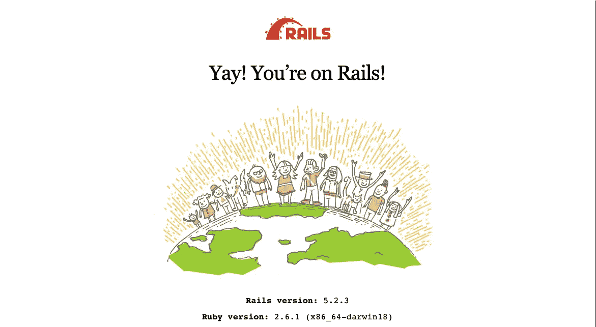

# 创建用户索引页

在您的终端中，使用 Rails 生成器创建一个控制器和相关的`views`文件夹:

`$ rails g controller Users`

这是您的控制器:

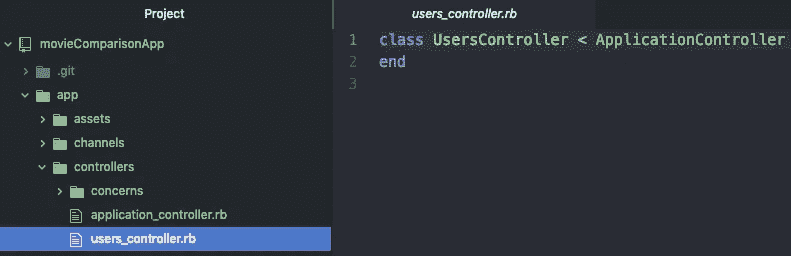

这是您的用户的视图文件夹:

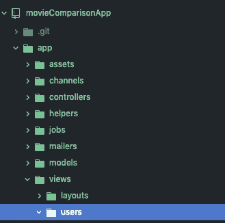

导航到您的`config/routes.rb`文件，并为 ssers 定义一个索引路径:

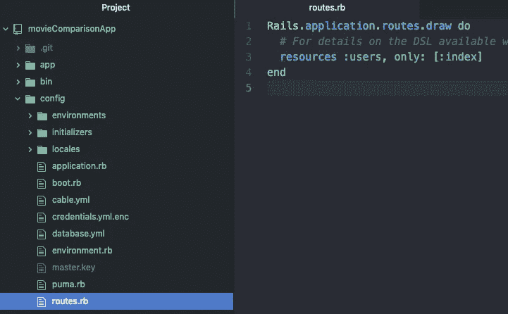

在用户控制器中创建相应的控制器动作:

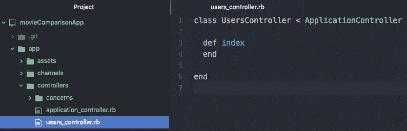

在新创建的`views/users`文件夹中创建相应的视图:

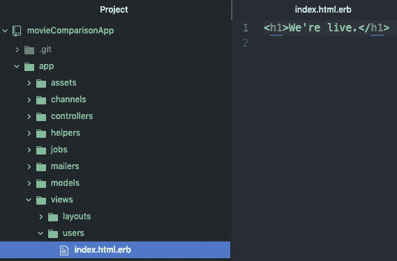

返回终端，用`rails s`重启服务器。您现在应该会看到文本“我们正在直播。”在此 URL:

`localhost:3000/users`

我们的目标是让*所有用户*显示在这个页面*上。让我们在控制器和视图中实现它。*

控制器:

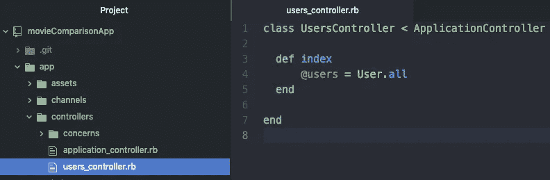

视图`views/users/index.html.erb`:

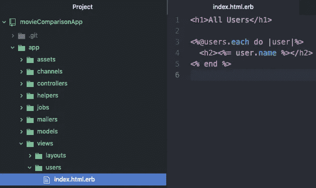

现在，当我们重新访问 URL `localhost:3000/users`时，我们应该看到:

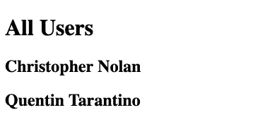

# 创建用户显示页面及其比较

首先，在`config/routes.rb`中定义新的表演路线:

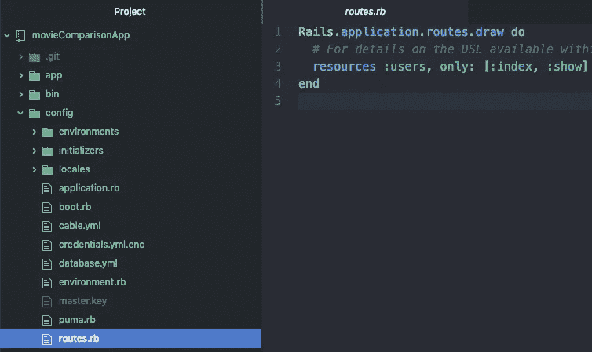

在用户控制器中创建相应的显示控制器动作:

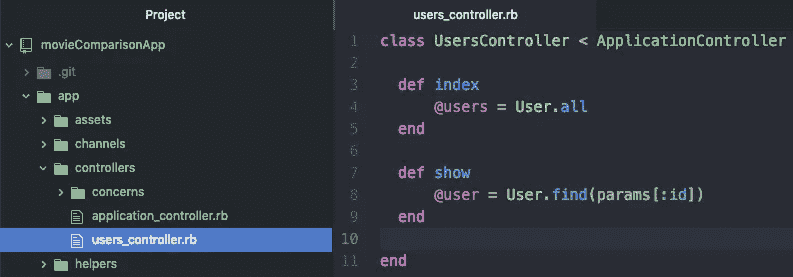

创建相应的视图:

`views/users/show.html.erb`

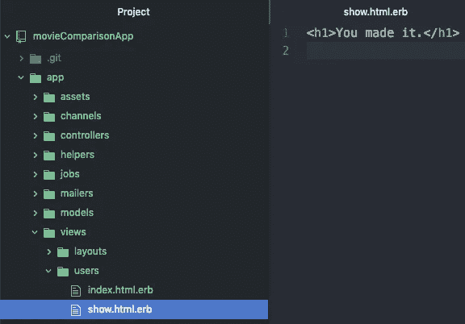

让我们测试一下，我们可以通过输入我们的 URL 来访问克里斯托弗·诺兰的页面:

`localhost:3000/users/1`

您应该看到:

现在让我们显示 Christopher 的信息，而不是一个带有不相关文本的静态屏幕。

我们将使用表格格式来完成这项工作。

注意:我们正在利用我们在第 2 部分中已经创建的三重连接来检索与特定用户相关联的劣质和优质电影:

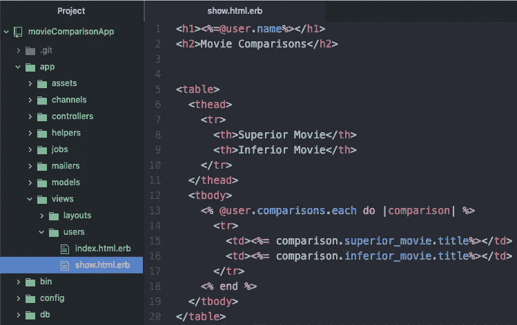

如果刷新页面，您现在应该会看到:

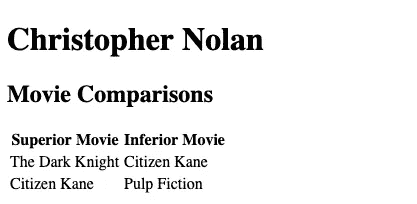

如果您在`localhost:3000/users/2`访问第二个用户的页面，您应该会看到显示的不同数据:

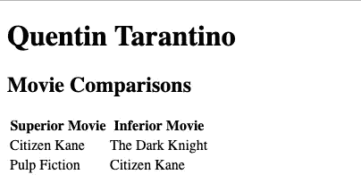

为了清楚起见，在我们继续之前，让我们链接索引和显示页面，这样我们就可以方便地在所有用户(索引)和特定用户(显示)之间来回移动。

`app/views/users/index.html.erb`:

这导致:

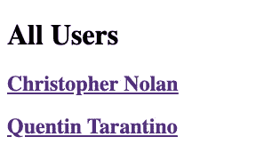

`app/views/users/show.html.erb`:

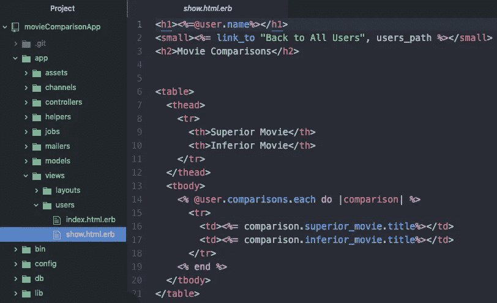

这导致:

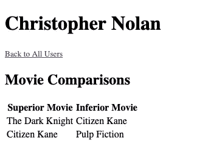

# 创建相应的电影索引和显示页面

由于我们刚刚与用户一起经历了这一过程，所以我将跳过这一部分中的一些步骤。首先，在`config/routes.rb`中画出两条新的电影路线:

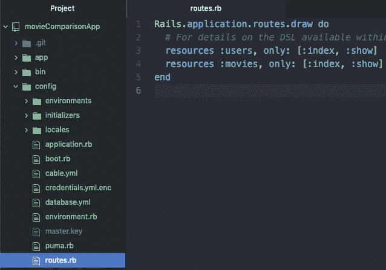

从终端生成电影控制器:

`$ rails g controller Movies`

然后，定义`index`和`show`控制器动作:

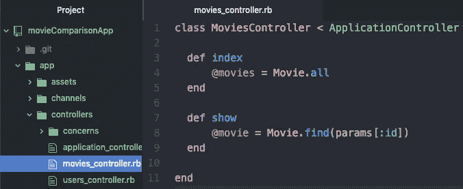

将相应的视图写入新创建的`app/views/movies/`文件夹中。

索引:

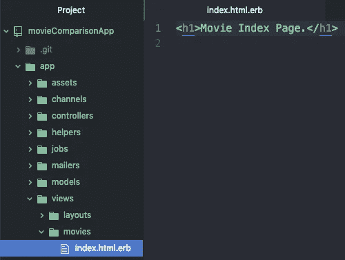

显示:

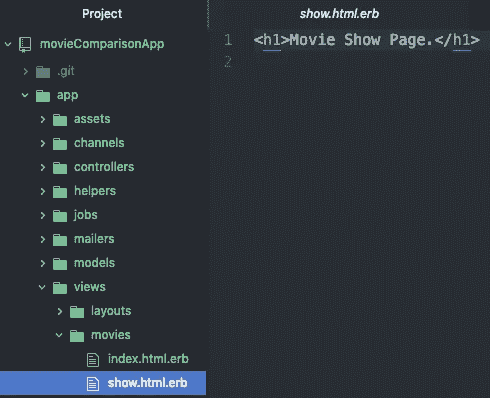

当我们访问`localhost:3000/movies`时，我们应该看到:

当我们访问`localhost:3000/movies/1`时，我们应该看到:

让我们使用已经在控制器操作中创建的实例变量来显示每个视图页面上的信息。

注意:我们使用第 2 部分中创建的三元连接关系中的`.fans`和`.haters`方法。我们使用这两种方法来检索喜欢或不喜欢某部电影的用户(与另一部电影相比)。

索引页面:

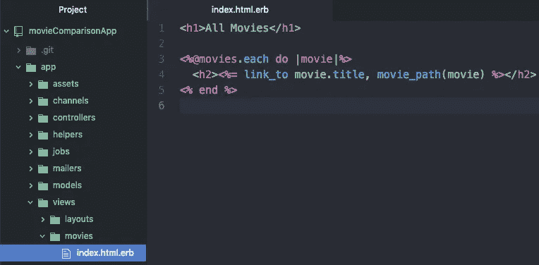

结果:

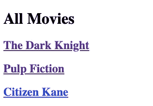

显示页面:

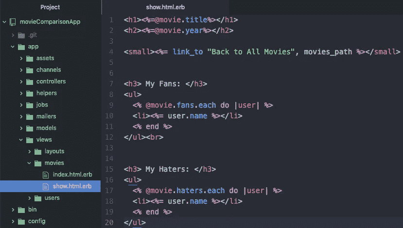

`localhost:3000/movies/1`的结果:

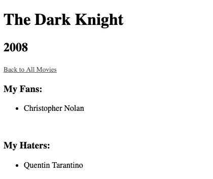

我们现在已经演示了基础知识。然而，如果你访问《公民凯恩》(电影 3)的展示页面，你会注意到*粉丝*和*憎恨者*名单包含相同的人:

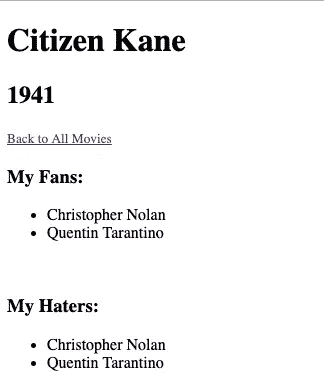

我们可以想象，随着对比次数的增加，展示页面上呈现的信息会变得越来越没有帮助。

让我们让它更有帮助:

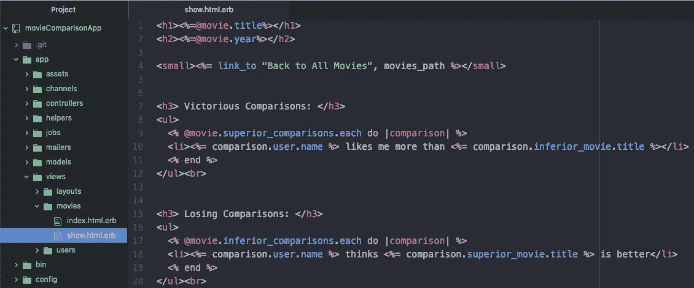

更新后的 HTML 提供了更具描述性的列表:

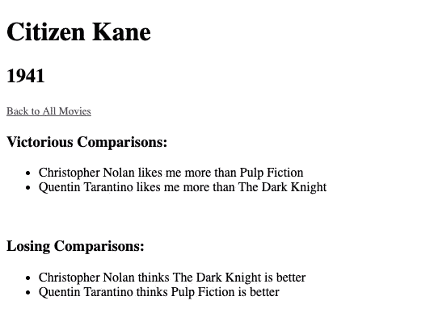

# 为新的比较建立一个创建表单

这是最后一步。

到目前为止，我们只使用了在第 2 部分中创建的 Rails 关系来连接和显示相关数据。在下一节中，我们将在用户展示页面中嵌入一个“新比较”表单。

在`config/routes/rb`中为我们的新比较控制器(我们即将生成)定义一个 *Create* route:

现在，让我们使用`$ rails g controller Comparisons`生成控制器:

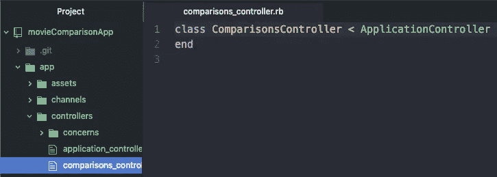

删除自动生成的文件夹`app/views/controllers`。我们不需要它。

定义一个空的`create`动作，我们将立即填充它:

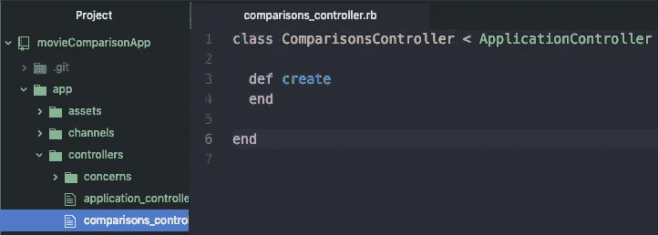

移动到用户控制器，为电影和一个新的比较创建实例变量，除了单个用户。

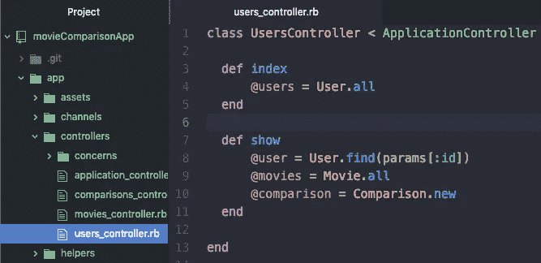

这些实例变量将允许我们轻松地创建一个新的比较表单。我们现在就做吧。

因为我们在用户控制器中将`@comparison`定义为一个新的比较实例，并使该变量可以从用户显示页面访问，所以我们可以创建一个`form_for @comparison`，它将自动在比较控制器中寻找创建动作。

我们利用`@movies`实例变量来创建两个`collection_select`助手方法。每个选定的收藏都会创建一个包含数据库中所有电影的下拉列表。

表单:

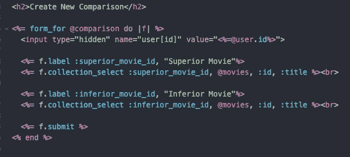

请注意附加的隐藏字段，它将携带我们正在查看的页面的用户 ID。

完整的显示页面，包括底部的表单:

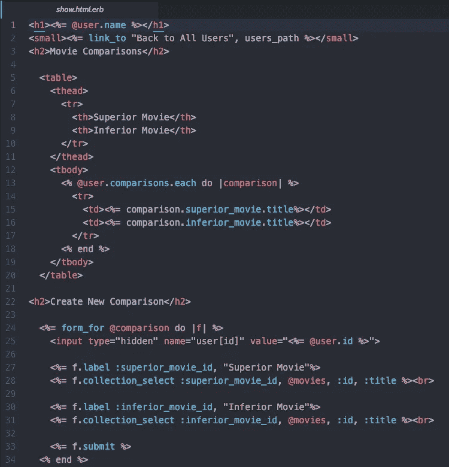

我们浏览器中的结果应该是这样的:

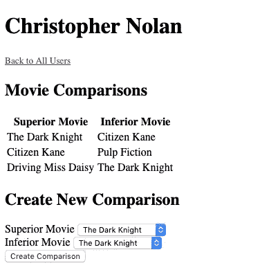

此时，我们可以从下拉列表中选择数据库中存在的两部电影，并将表单提交给比较控制器中的 create 动作。

然而，什么也不会发生，因为该动作是空的。

让我们填写`create`动作，这样我们就可以创建一个新的比较，其中`user_id`等于通过表单传递的隐藏值，然后是基于提交表单的下拉信息的`inferior_movie_id`和`superior_movie_id`。

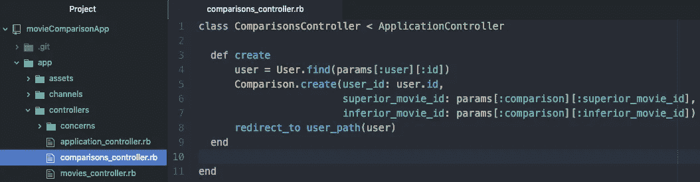

只要所有的 id 都在正确的位置，三重连接就会正常工作，并且一个新的比较实例会立即出现在用户页面上。

根据克里斯托弗·诺兰的说法，让我们通过比较《黑暗骑士》和《低俗小说》来看看这一点:

# 结论

如果你能走到这一步，干得好。这一页看起来不漂亮。但这不是这个练习的重点。

目的是通过 Ruby on Rails 探索比较自连接和三元连接的使用，然后在浏览器中观察它们的运行。通过一些 CSS 修饰，这个应用程序使用起来会很有趣。

单击下面的链接，查看上面的稍微复杂一点的版本:

网址: [MyMDb](http://my-m-db.herokuapp.com)

您可以创建一个用户，将电影保存到您的收藏夹，创建新的比较，并最终获得与您的偏好相关的电影推荐！

(注:Heroku 加载网站可能需要十秒钟。一旦启动，它应该会发出嗡嗡声。)

## MyMDb 的 Github

[SwanHub/MyMDb](https://github.com/SwanHub/MyMDb)

我希望这一系列文章对您有所帮助。如果你有任何问题或建议，我很想听听。

# Github 教程报告

对于与我们在第 2 和第 3 部分中创建的应用程序相关的完整 GitHub repo，您可以访问此链接:[examplemoviecomparisonpp/](https://github.com/SwanHub/exampleMovieComparisonApp)

就是这样！为你干杯。祝你愉快。

快乐编码，

杰克逊