# 使用 Python 的电影相似性推荐

> 原文：<https://betterprogramming.pub/movie-similarity-recommendation-using-python-b98a2670a2ad>

## Python 中推荐系统的学习和实现指南


照片由[阿林·苏尔杜](https://unsplash.com/@alinsurdu3?utm_source=medium&utm_medium=referral)在 [Unsplash](https://unsplash.com?utm_source=medium&utm_medium=referral) 上拍摄。

# 什么是推荐系统？

推荐系统预测用户未来的选择/偏好，并推荐他们可能感兴趣的产品/项目。

# 推荐系统有哪些类型？

两种最常见的类型是:

1.  基于内容的推荐系统
2.  协同过滤

# 什么是基于内容的推荐系统？

这种系统根据用户对产品的态度给出推荐。它的工作逻辑是，如果用户在过去同意了某件事，那么他们在将来也会同意。

# 什么是协同过滤？

这种系统查看项目的属性，并基于它们之间的相似性给出推荐。它的工作原理是推荐与用户过去喜欢的产品相似的产品。它进一步分为两种类型:

1.  基于内存的 CF
2.  基于模型的 CF

# 如何使用 Python 实现基于项目的 CF

用于本演示的数据集是 [MovieLens](https://grouplens.org/datasets/movielens/) 数据集的子集。将建立一个基本的推荐系统，该系统将推荐与特定电影最相似的电影。

## **导入库**

处理数据的基本包，像 NumPy 和 pandas，都是进口的。与此同时，可视化库 matplotlib 和 seaborn 也被导入。

```
**>>> import** numpy **as** np
**>>> import** pandas **as** pd
**>>> import** matplotlib.pyplot **as** plt
**>>> import** seaborn **as** sns
>>> sns.set_style('white')
**>>> %**matplotlib inline
```

## **读取数据**

分配列名并读取数据:

```
>>> column_names **=** ['user_id', 'item_id', 'rating', 'timestamp']
>>> df **=** pd.read_csv('dataset/df.data', sep**=**'\t', names**=**column_names)
>>> df.head()
```

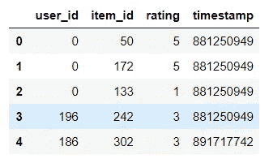

现在电影标题被附加到`DataFrame`上。

```
>>> titles **=** pd.read_csv("dataset/movie_title")
>>> titles.head()
```

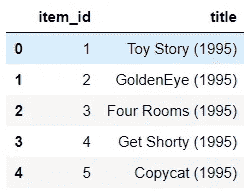

```
>>> df **=** pd.merge(df,titles,on**=**'item_id')
>>> df.head()
```

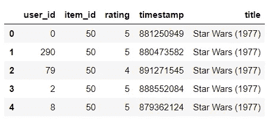

## **可视化**

评级的`DataFrame`根据其总数和平均值创建。通过调用`mean()`函数计算平均值:

```
>>> ratings **=** pd.DataFrame(df.groupby('title')['rating'].mean())
>>> ratings.head()
```

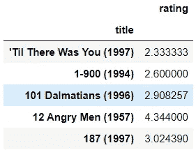

通过调用`count()`函数来计算总数:

```
>>> ratings['total_ratings'] **=** pd.DataFrame(df.groupby('title')['rating'].count())
>>> ratings.head()
```

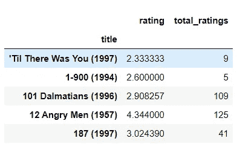

现在，用户给出的平均评级和总评级的直方图可以可视化:

```
>>> ratings['rating'].hist(bins**=**50)
```

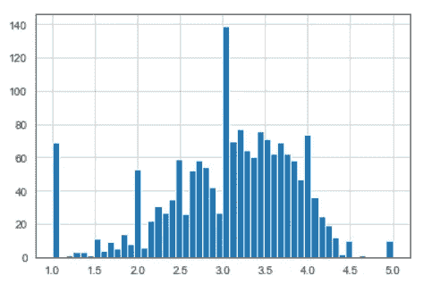

因此，平均等级在 1 到 5 的范围内，并且可以在平均值位于等级 3.5 附近的地方看到它们的分布。

```
>>> ratings['total_ratings'].hist(bins**=**50)
```

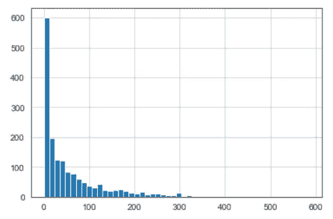

从这个情节可以推断，只有最著名的电影被用户评级很多，如果电影不太著名，则评级降低。

```
>>> sns.jointplot(x**=**'rating',y**=**'total_ratings',data**=**ratings,alpha**=**0.5)
```

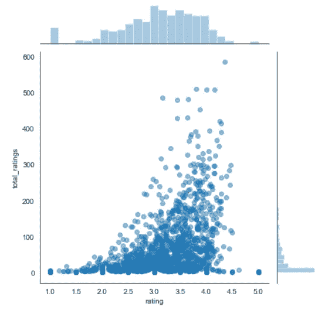

该图显示了平均评分和总评分之间的关系。

## **构建系统**

提取用户 ID 和电影标题，并分别放入索引和列中。这样，可以呈现每个用户对每部电影的评级。

```
>>> final_df **=** df.pivot_table(index**=**'user_id',columns**=**'title',values**=**'rating')
>>> final_df.head()
```

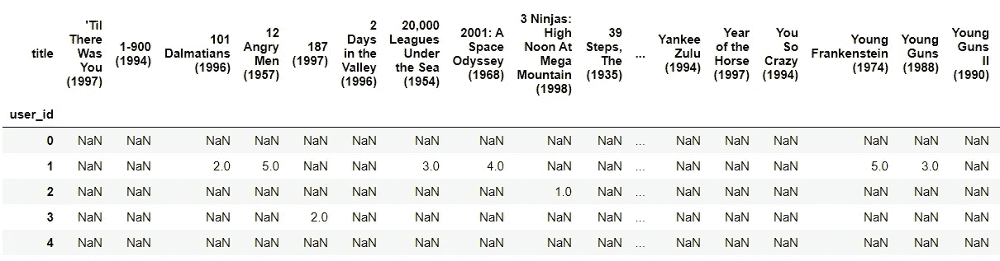

现在有一部电影(*《玩具总动员》*)被选中并归入奇幻类。获得用户评级:

现在使用`corrwith()`方法找出其他电影和*玩具总动员*之间的相关性:

```
>>> similar_to_toy **=** final_df.corrwith(toy_ratings)
```

这些相关性以`DataFrame`的形式呈现，空值被删除。

```
>>> corr_toy **=** pd.DataFrame(similar_to_toy,columns**=**['Correlation'])
>>> corr_toy.dropna(inplace**=True**)
>>> corr_toy.head()
```

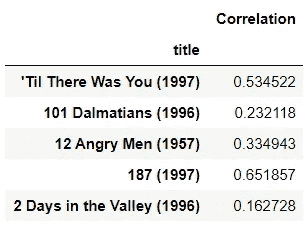

如果这些相关性按降序排序，那么我们得到与*玩具总动员*相关的电影:

```
>>> corr_toy.sort_values('Correlation',ascending**=False**).head()
```

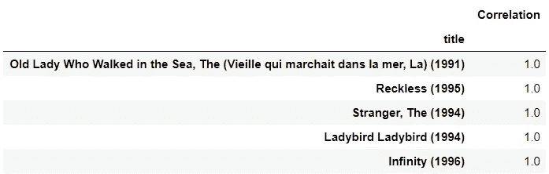

但是顶部的一些电影可能只有一个给出最高评级的用户观看过。因此，这可能会产生误导。所以我们会提取评论超过 100 条的电影:

```
>>> corr_toy **=** corr_toy.join(ratings['total_ratings'])
>>> corr_toy.head()
```

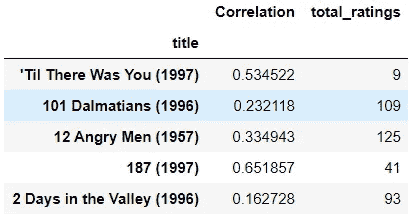

```
>>> corr_toy[corr_toy['total_ratings']**>**100].sort_values('Correlation',ascending**=False**).head()
```

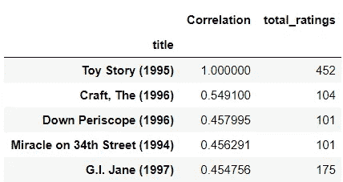

所以这些都是类似*玩具总动员*的电影。所有这些电影也属于幻想类。

*参考 GitHub* *上的数据集和笔记本* [*。*](https://github.com/jayashree8/Python_recommender_systems)