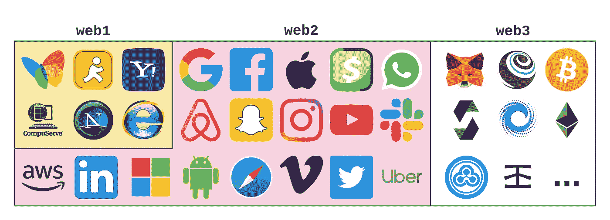
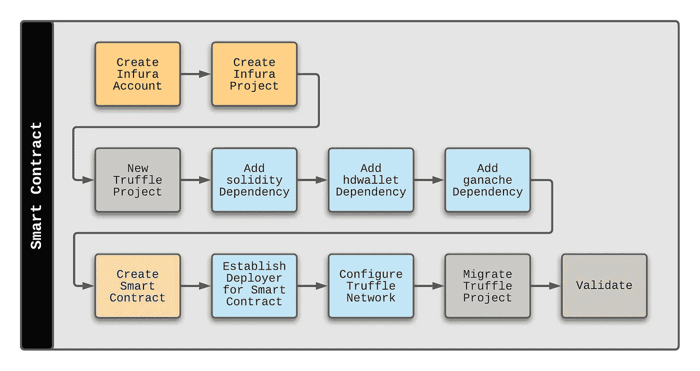
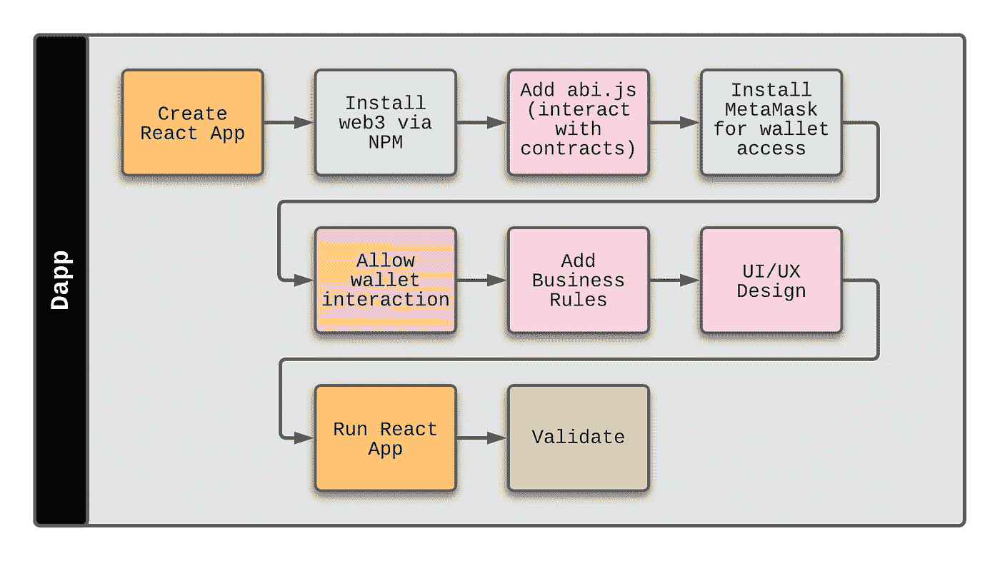
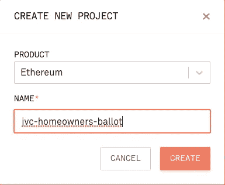
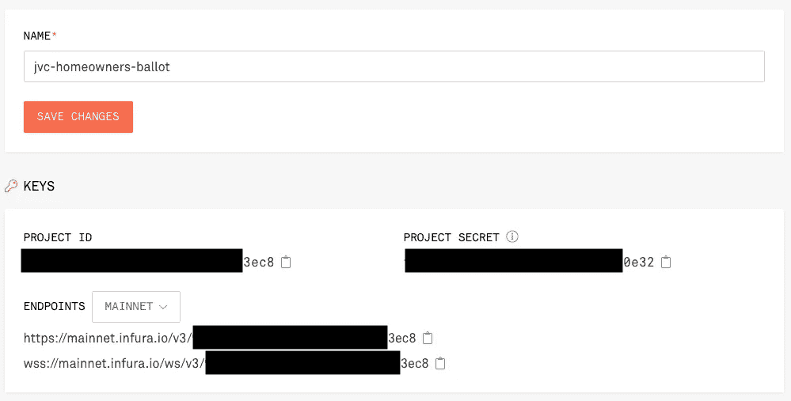
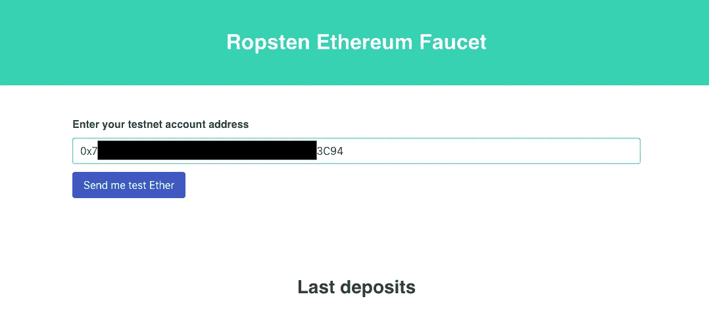
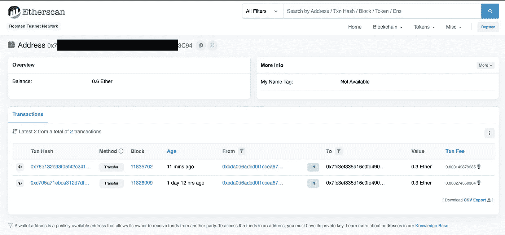
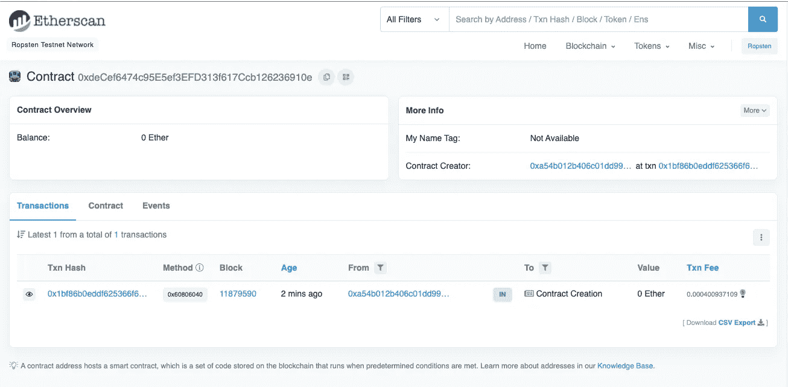
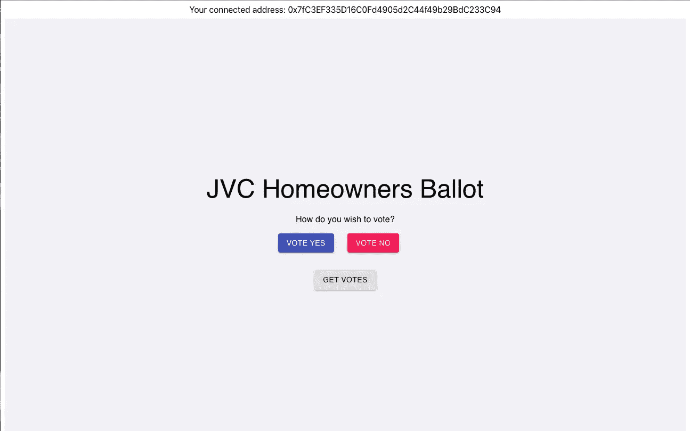
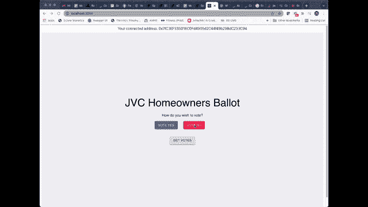

# 从全栈开发者转变为 Web3 先锋

> 原文：<https://betterprogramming.pub/moving-from-full-stack-developer-to-web3-pioneer-13bf8b415dc9>

## 想深入 Web3 开发吗？这里有一个介绍和全栈开发人员入门的快速示例


图片来自 [Unsplash](https://unsplash.com/@theshubhamdhage)

去年夏天，我和妻子在[网飞](https://en.wikipedia.org/wiki/Netflix)频道观看了一个名为[创业](https://en.wikipedia.org/wiki/StartUp_(TV_series))的节目。这部三季的电视剧讲述了一群角色在创造一种新的(虚构的)数字货币“GenCoin”时所面临的挑战。当我观看节目时，我想知道如果我是推动 GenCoin 采用的工程团队的一员，我的生活会有什么不同。

虽然像 GenCoin 这样的产品起源于提供一种新的金融交易方式的目的，但其基本概念比仅仅与货币相关的任务更强大。事实上，区块链的分布式设计直接关系到 Web3 的核心。

在继续之前，让我们回顾一下网络的三个主要时代:

*   [Web1](https://en.wikipedia.org/wiki/Web_2.0#Web_1.0) —静态网页(1991–2004)
*   [Web2](https://en.wikipedia.org/wiki/Web_2.0#Web_2.0) —作为平台的 Web(自 2004 年起)
*   [Web3](https://en.wikipedia.org/wiki/Web3) —分散式设计，采用了区块链技术(自 2009 年以来，但在过去几年中真正获得了发展势头)



每个网络时代的技术领导者。网络 3 先锋的前景依然广阔。

[Web3 为 web2 现实提供了另一种选择](https://consensys.net/blog/blockchain-explained/what-is-web3-here-are-some-ways-to-explain-it-to-a-friend/)，在 web 2 现实中，控制权被集中到少数技术提供商手中，如谷歌、苹果和亚马逊。Web3 创建了一个无权限的数据存储，其中没有任何人或公司控制或拥有数据，但数据仍然保证是真实的。数据存储在区块链网络的公共分类账上。因此，不是一个实体拥有数据，而是多个节点(运行区块链的计算机)存储数据，并就数据是否有效达成共识。

创建这种数据存储的协议(始于[比特币](https://bitcoin.org/en/)并延续到以太坊等协议)是 web3 的基础，并开启了各种各样的新用例，例如:

*   由用户控制的个人身份，而不是公司(如 [MetaMask](https://metamask.io/) )
*   无许可金融系统(允许无许可贷款、货币、投资等的比特币和其他数字货币)
*   可证明的数字项目的数字所有权，如[音乐](https://royal.io/)、[艺术](https://www.artblocks.io/)，以及更多通过 [NFT](https://en.wikipedia.org/wiki/Non-fungible_token) s 的效用
*   通过分散自治组织(DAO)临时组成具有相同目的的团体，如[宪法 DAO](https://www.constitutiondao.com/) 或社会 DAO [利益之友](https://www.fwb.help/)
*   玩家可以通过玩游戏谋生的游戏(p2e)(如 [Axie Infinity](https://axieinfinity.com/) )

当然，以上所有问题的关键在于，数字货币的所有权——DAO 会员资格、音乐版权等等——掌握在用户手中，并由用户控制。任何人，在世界上任何地方，只要有互联网连接，都可以自由交易、销售和开发这些产品。没有一个集中的公司或政府来控制和制定规则。

web3 离这个理想有多近，或者能有多近，以及这是不是一件好事，这是一场包含许多强烈(和强烈偏见)观点的深入对话。我不会在这里讨论这个问题。另外要提到的是，web3 不会取代 web2，就像 web2 不会取代 web1 一样。这三者在未来都有自己的位置。

让我们把辩论放在一边，看看作为一名开发者，你如何探索这个新的 web3 世界的技术方面。

# 从全栈到 Web3 栈的转变

全栈开发术语在 2015 年左右获得了发展势头，提供了单个软件工程师可以对软件栈的任何级别做出贡献的好处。因此，如果记录了与服务层相关的特性或错误，刚刚完成与客户端相关的任务的同一个开发人员就可以拿到工作单并提高工作效率。

对于那些有兴趣阅读我的关于全栈开发的想法(写于这个流行词热潮的顶峰时期)的人，请点击下面的链接:

[全栈开发…真的可能吗？](https://dzone.com/articles/do-not-publishfull-stack-development-truly-possibl)

尽管有人对全栈开发人员有看法，但现在的焦点应该转移到思考 web3 栈看起来像什么，以及软件工程师将如何在下一代 web 开发中引入特性和功能。

# 网络基础 3

深入到 web3 的细节会涉及到[冗长的系列文章](https://consensys.net/developers/)。我们将保持高水平，并提供一些附加资源链接的概述。我们将看看典型的第一步:创建一个智能契约，然后创建一个 Dapp 来与该智能契约进行交互。

一个[智能契约](https://www.coinbase.com/learn/crypto-basics/what-is-a-smart-contract)是部署在区块链上的一段代码(在下面的例子中，部署在[以太坊](https://ethereum.org/en/what-is-ethereum/))。这段代码是不可变的，没有权限的。一旦部署，它就存在于区块链上，无法更改，任何人都可以检索它。

dapp(分散式应用程序)是我们从 UI(通常是网页或应用程序)与智能合约进行交互的方式。dapp 在后端利用了智能合约的开放性。它也可以存储在分散的文件存储中，如 IPFS(星际文件存储)，因此没有停机的机会。DDOS 攻击也非常难以实施，因为你必须攻击网站存储的每一个节点。

相反，安全和测试更重要。在考虑部署之前，需要消除代码中的缺陷和漏洞。

让我们更详细地讨论一下。

# Web3 堆栈

成熟的技术和目的驱动的技术的结合存在于软件工程师寻求进入池的 web3 端。一种非常流行的堆栈包括以下组件:

*   [NPM](https://nodejs.org/en/) —节点包管理器，非常受 web2 开发者的欢迎
*   [松露框架](https://www.trufflesuite.com/) —专注于 web3 的开发工具
*   [Ganache](https://www.trufflesuite.com/ganache) —允许在本地机器上启动私有区块链
*   [元掩码](https://metamask.io/) —区块链用户界面/以太坊[网关](https://en.wikipedia.org/wiki/Ethereum)(开源分散区块链)
*   [可靠性](https://solidity.readthedocs.io/en/v0.7.1/) —领先的智能合约编程语言
*   [HTML/CSS/JavaScript](https://www.w3.org/standards/webdesign/htmlcss) —客户端层
*   [Web3.js](https://web3js.readthedocs.io/en/v1.3.0/) —以太坊 API 库，用于与以太坊网络交互
*   [Infura](https://infura.io/) —以太坊 API 服务，授权访问以太坊网络

# 以太坊 Dapp 概述

让我们假设一个房主协会即将举行他们的定期选举，在选举中，附近的居民对一系列决定进行投票。由于附近有一群渴望成为 web3 先锋的 IT 专业人士，他们决定为选举建造一个以太坊 Dapp。

为什么这是一个好例子？

使用 Dapp 存储投票提供了无可争议的结果。如果设置正确，篡改或伪造投票的能力是不存在的，因为数据是公开存储在区块链上，而不是存储在一家公司的私人服务器上。任何人都可以通过与智能合约交互，以一种无需许可的方式检索投票结果。

# 智能合同创建

第一步是创建用于应用程序的智能合约，它利用了 web3 堆栈的以下组件:

*   Infura
*   NPM
*   块菌框架
*   加纳切
*   固态

智能合同的创建遵循类似于下图的流程:



该流程已由 [ConsenSys](https://consensys.net/) 团队详细说明:

[以太坊开发者入职](https://consensys.net/developers/onboarding-step-2/)

# 使用 React 创建 Dapp

有了智能联系人，web3 工程师可以专注于构建协会选举将使用的应用程序。以下 web3 堆栈组件保留在上面的列表中:

*   NPM
*   元掩码
*   HTML/CSS/JavaScript/React
*   Web3.js

对于本例，我们将利用 [React](https://reactjs.org/) 框架，该框架将利用以下流程:



现在，让我们从头开始构建一些东西。

# 我的第一个以太坊 Dapp

在 [Infura](https://infura.io/register) 创建了一个免费账户后，我创建了一个名为`jvc-homeowners-ballot`的新项目:



新项目包含以下细节，我将在后面引用:



# 块菌入门

在我的本地机器上，我创建了一个名为`jvc-homeowners-ballot`的匹配文件夹，然后使用以下 CLI 命令初始化 Truffle:

```
truffle init
```

初始化会产生以下目录结构:

```
├── contracts
│   └── Migrations.sol
├── migrations
│   └── 1_initial_migration.js
├── test
└── truffle-config.js
```

接下来添加了基于 Truffle 的钱包提供者依赖:

```
npm install --save [@truffle/hdwallet-provider](http://twitter.com/truffle/hdwallet-provider)
```

为了创建本地开发网络，使用以下命令启动了 Ganache CLI:

```
ganache
```

CLI 响应了以下信息，Ganache 现在正在我的本地计算机的端口#8545 上运行:

```
ganache v7.0.1 ([@ganache/cli](http://twitter.com/ganache/cli): 0.1.2, [@ganache/core](http://twitter.com/ganache/core): 0.1.2)
Starting RPC serverAvailable Accounts
==================
(0) 0x2B475e4fd7F600fF1eBC7B9457a5b58469b9EDDb (1000 ETH)
(1) 0x5D4BB40f6fAc40371eF1C9B90E78F82F6df33977 (1000 ETH)
(2) 0xFaab2689Dbf8b7354DaA7A4239bF7dE2D97e3A22 (1000 ETH)
(3) 0x8940fcaa55D5580Ac82b790F08500741326836e0 (1000 ETH)
(4) 0x4c7a1b7EB717F98Fb0c430eB763c3BB9212F49ad (1000 ETH)
(5) 0x22dFCd5df8d4B19a42cB14E87219fea7bcA7C92D (1000 ETH)
(6) 0x56882f79ecBc2D68947C6936D4571f547890D07c (1000 ETH)
(7) 0xD257AFd8958c6616bf1e61f99B2c65dfd9fEE95A (1000 ETH)
(8) 0x4Bb2EE0866578465E3a2d3eCCC41Ea2313372B20 (1000 ETH)
(9) 0xdf267AeFeAfE4b7053ca10c3d661a8CB24E98236 (1000 ETH)Private Keys
==================
(0) 0x5d58d27b0f294e3222bbd99a3a1f07a441ea4873de6c3a2b7c40b73186eb616d
(1) 0xb9e52d6cfb2c074fa6a6578b946e3d00ea2a332bb356d0b3198ccf909a97fdc8
(2) 0xc52292ce17633fe2724771e81b3b4015374d2a2ea478891dab74f2028184edeb
(3) 0xbc7b0b4581592e48ffb4f6420228fd6b3f954ac8cfef778c2a81188415274275
(4) 0xc63310ccdd9b8c2da6d80c886bef4077359bb97e435fb4fe83fcbec529a536fc
(5) 0x90bc16b1520b66a02835530020e43048198195239ac9880b940d7b2a48b0b32c
(6) 0x4fb227297dafb879e148d44cf4872611819412cdd1620ad028ec7c189a53e973
(7) 0xf0d4dbe2f9970991ccc94a137cfa7cf284c09d0838db0ce25e76c9ab9f4316d9
(8) 0x495fbc6a16ade5647d82c6ad12821667f95d8b3c376dc290ef86c0d926f50fea
(9) 0x434f5618a3343c5e3b0b4dbeaf3f41c62777d91c3314b83f74e194be6c09416bHD Wallet
==================
Mnemonic:      immense salmon nominee toy jungle main lion universe seminar output oppose hungry
Base HD Path:  m/44'/60'/0'/0/{account_index}Default Gas Price
==================
2000000000BlockGas Limit
==================
30000000Call Gas Limit
==================
50000000Chain Id
==================
1337RPC Listening on 127.0.0.1:8545
```

在我的项目文件夹中，`truffle-config.js`文件被更新以激活以下行:

```
development: {
      host: "127.0.0.1",     // Localhost (default: none)
      port: 8545,            // Standard Ethereum port (default: none)
      network_id: "*",       // Any network (default: none)
    },
```

现在，Truffle 控制台可以在新的终端窗口中启动:

```
truffle console
```

…这产生了一个简单的控制台:

```
truffle(development)>
```

控制台可用于创建钱包:

```
const HDWalletProvider = require('[@truffle/hdwallet-provider](http://twitter.com/truffle/hdwallet-provider)');
```

这将导致未定义的响应。这没问题。

接下来，我们需要一个 12 个单词的助记短语，所以我使用了[助记代码转换器](https://iancoleman.io/bip39/)站点来生成一个。

然后我用那个 12 个字的短语更新了松露控制台:

```
const mnemonic = '12 words here';
const wallet = new HDWalletProvider(mnemonic, "[http://localhost:8545](http://localhost:8545)");
```

这两种情况都导致了未定义的响应，但是 wallet 控制台提供了命令实际工作的结果，如下所示:

```
truffle(development)> wallet
HDWalletProvider {
  walletHdpath: "m/44'/60'/0'/0/",
  wallets: {
...
 },
  addresses: [
    '0xa54b012b406c01dd99a6b18ef8b55a15681449af',
    '0x6d507a70924ea3393ae1667fa88801650b9964ad',
    '0x1237e0a8522a17e29044cde69b7b10b112544b0b',
    '0x80b4adb18698cd47257be881684fff1e14836b4b',
    '0x09867536371e43317081bed18203df4ca5f0490d',
    '0x89f1eeb95b7a659d4748621c8bdbabc33ac47bbb',
    '0x54ceb6f0d722dcb33152c953d5758a08045f254d',
    '0x25d2a8716792b98bf9cce5781b712f00cf33227e',
    '0x37b6364fb97028830bfeb0cb8d2b14e95e2efa05',
    '0xe9f56031cb6208ddefcd3cdd5a1a41f7f3400af5'
  ],
...
```

# 为测试增加 ETH 资金

现在我们需要为我们的 Dapp 获取一些测试资金，并将使用 [Ropsten 以太坊水龙头](https://faucet.ropsten.be/)向我现有的 [MetaMask](https://metamask.io/index.html) 钱包添加资金，该钱包由 [ConsenSys](https://consensys.net/) 创建。请记住，您可以在 MetaMask 中创建多个帐户，其中至少有一个帐户专用于开发和测试。这样做可以降低意外损失真实资金的风险。此外，永远不要与任何人分享你的种子短语，永远不要上传你的私钥…任何地方！

要添加一些测试资金，我只需填写我的帐户地址:



使用 Ropsten Etherscan 网站，我们可以验证交易是否成功完成:



# 最终准备步骤

使用以下命令将`dotenv`依赖项添加到项目中:

```
npm install --save dotenv
```

接下来，在项目的根目录下创建了一个名为`.env`的新文件，它包含以下两行:

```
INFURA_API_KEY=INSERT YOUR API KEY HERE (no quotations)
MNEMONIC="12 words here"
```

`INFURA_API_KEY`是创建`jvc-homeowners-ballot`项目时给出的项目 ID。

**重要提示:确保。env 文件包含在** `**.gitignore**` **文件中，以避免该机密信息被其他访问存储库的人获取。**

最后一个准备步骤是更新`truffle-config.js`文件。首先，我们需要在文件的顶部添加以下几行:

```
require("dotenv").config();
const HDWalletProvider = require("[@truffle/hdwallet-provider](http://twitter.com/truffle/hdwallet-provider)");
```

接下来，我们需要添加以下网络，它将利用上面添加的`dotenv`依赖关系:

```
ropsten: {
     provider: () =>
       new HDWalletProvider(
         process.env.MNEMONIC,
         `[https://ropsten.infura.io/v3/${process.env.INFURA_API_KEY}`](https://ropsten.infura.io/v3/${process.env.INFURA_API_KEY}`)
       ),
     network_id: 3, // Ropsten's id
     gas: 5500000, // Ropsten has a lower block limit than mainnet
     confirmations: 2, // # of confs to wait between deployments. (default: 0)
     timeoutBlocks: 200, // # of blocks before a deployment times out  (minimum/default: 50)
     skipDryRun: true // Skip dry run before migrations? (default: false for public nets )
    },
```

# 设置智能合同

随着 Infura 和 Truffle 的到位，以及我们帐户中的一些测试基金，是时候关注我们的智能合同了。

对于业主协会选举，我们将使用以下合同，该合同名为`JvcHomeownerBallot.sol`，位于项目的合同文件夹中:

```
// SPDX-License-Identifier: UNLICENSED  (it is common practice to include an open source license or declare it unlicensed)
pragma solidity ^0.8.7;  // tells the compiler which version to usecontract Homeowners {// store the addresses of voters on the blockchain in these 2 arrays
    address[] votedYes;
    address[] votedNo;function voteYes() public {
        votedYes.push(msg.sender);
    }function voteNo() public {
        votedNo.push(msg.sender);
    }function getYesVotes() public view returns (uint) {
        return votedYes.length;
    }function getNoVotes() public view returns (uint) {
        return votedNo.length;
    }
}
```

对于这个例子，我们的契约非常简单，投票人可以选择是或否来回答选票上的任何问题。

此时，合同文件夹出现，如下所示:

```
.
├── JvcHomeownersBallot.sol
└── Migrations.sol
```

有了契约，我们需要建立一种部署契约的方法。这就是迁移文件夹的用武之地。以下内容被添加到`migrations`文件夹内的`2_deploy_contracts.js`文件中:

```
const JvcHomeownersBallot = artifacts.require("JvcHomeownersBallot.sol");module.exports = function(deployer) {
 deployer.deploy(JvcHomeownersBallot);
};
```

现在，我们可以使用以下命令执行合同的迁移:

```
truffle migrate --network ropsten
```

migrate 关键字提供以下响应:

```
Compiling your contracts...
===========================
> Compiling ./contracts/JvcHomeownersBallot.sol
> Artifacts written to /Users/john.vester/projects/jvc/consensys/jvc-homeowners-ballot/build/contracts
> Compiled successfully using:
   - solc: 0.8.11+commit.d7f03943.Emscripten.clangNetwork up to date.truffle(development)> truffle migrate --network ropstenCompiling your contracts...
===========================
> Compiling ./contracts/JvcHomeownersBallot.sol
> Compiling ./contracts/Migrations.sol
> Artifacts written to /Users/john.vester/projects/jvc/consensys/jvc-homeowners-ballot/build/contracts
> Compiled successfully using:
   - solc: 0.8.11+commit.d7f03943.Emscripten.clangStarting migrations...
======================
> Network name:    'ropsten'
> Network id:      3
> Block gas limit: 8000000 (0x7a1200)1_initial_migration.js
======================Deploying 'Migrations'
   ----------------------
   > transaction hash:    0x5f227f26a31a3667a689be2d7fa6121a21153eb219873f6fc9aecede221b3b82
   > Blocks: 5            Seconds: 168
   > contract address:    0x9e6008B354ba4b9f91ce7b8D95DBC6130324024f
   > block number:        11879583
   > block timestamp:     1643257600
   > account:             0xa54b012B406C01dd99A6B18eF8b55A15681449Af
   > balance:             1.573649230299520359
   > gas used:            250142 (0x3d11e)
   > gas price:           2.506517682 gwei
   > value sent:          0 ETH
   > total cost:          0.000626985346010844 ETHPausing for 2 confirmations...
   ------------------------------
   > confirmation number: 1 (block: 11879584)
   > confirmation number: 2 (block: 11879585)> Saving migration to chain.
   > Saving artifacts
   -------------------------------------
   > Total cost:     0.000626985346010844 ETH2_deploy_contracts.js
=====================Deploying 'JvcHomeownersBallot'
   -------------------------------
   > transaction hash:    0x1bf86b0eddf625366f65a996e633db589cfcef1a4d6a4d6c92a5c1f4e63c767f
   > Blocks: 0            Seconds: 16
   > contract address:    0xdeCef6474c95E5ef3EFD313f617Ccb126236910e
   > block number:        11879590
   > block timestamp:     1643257803
   > account:             0xa54b012B406C01dd99A6B18eF8b55A15681449Af
   > balance:             1.573133154908720216
   > gas used:            159895 (0x27097)
   > gas price:           2.507502486 gwei
   > value sent:          0 ETH
   > total cost:          0.00040093710999897 ETHPausing for 2 confirmations...
   ------------------------------
   > confirmation number: 1 (block: 11879591)
   > confirmation number: 2 (block: 11879592)> Saving migration to chain.
   > Saving artifacts
   -------------------------------------
   > Total cost:     0.00040093710999897 ETHSummary
=======
> Total deployments:   2
> Final cost:          0.001027922456009814 ETH- Blocks: 0            Seconds: 0
- Saving migration to chain.
- Blocks: 0            Seconds: 0
- Saving migration to chain.
```

此时，我们已经将`JvcHomeownersBallot`智能合约部署到 Ropsten 网络。可以使用以下 URL 并在“部署 JvcHomeownersBallot”日志中提供协定地址来验证智能协定:

[https://ropsten.etherscan.io/](https://ropsten.etherscan.io/)

或者……在这种情况下:

[https://ropsten . ethers can . io/address/0x decef 6474 c 95 e 5 ef 3 EFD 313 f 617 CCB 126236910 e](https://ropsten.etherscan.io/address/0xdeCef6474c95E5ef3EFD313f617Ccb126236910e)



# 使用 React 创建 Dapp

对于前面的步骤，我使用了一个名为`jvc-homeowners-ballot`的文件夹。同样，我将使用 React CLI 创建一个名为`jvc-homeowners-ballot-client`的 React 应用程序:

```
npx create-react-app jvc-homeowners-ballot-client
```

接下来，我将目录更改到新创建的文件夹中，并执行以下命令将`web3`依赖项安装到 React 应用程序中:

```
cd jvc-homeowners-ballot-client
npm install web3
```

随着核心 React 应用程序准备就绪，需要建立一个契约应用程序二进制接口(ABI ),以允许我们的 Dapp 与以太坊生态系统上的契约进行通信。基于`JvcHomeownerBallot.sol`智能合同文件的内容，我导航到`build/contracts`文件夹，打开`JvcHomeownersBallet.json`文件，并使用`abi.js`文件的`jvcHomeOwnersBallot`常量的“abi”属性的值，如下所示:

```
export const jvcHomeownersBallot = [
  {
    "inputs": [],
    "name": "voteYes",
    "outputs": [],
    "stateMutability": "nonpayable",
    "type": "function"
  },
  {
    "inputs": [],
    "name": "voteNo",
    "outputs": [],
    "stateMutability": "nonpayable",
    "type": "function"
  },
  {
    "inputs": [],
    "name": "getYesVotes",
    "outputs": [
      {
        "internalType": "uint256",
        "name": "",
        "type": "uint256"
      }
    ],
    "stateMutability": "view",
    "type": "function",
    "constant": true
  },
  {
    "inputs": [],
    "name": "getNoVotes",
    "outputs": [
      {
        "internalType": "uint256",
        "name": "",
        "type": "uint256"
      }
    ],
    "stateMutability": "view",
    "type": "function",
    "constant": true
  }
];
```

这个文件被放在 React 应用程序的`src`文件夹中新创建的`abi`文件夹中。

现在，React `Apps.js`文件需要更新。让我们首先从文件的顶部开始，它需要如下所示进行配置:

```
import React, { useState } from "react";
import { jvcHomeownersBallot } from "./abi/abi";
import Web3 from "web3";
import "./App.css";const web3 = new Web3(Web3.givenProvider);
const contractAddress = "0xdeCef6474c95E5ef3EFD313f617Ccb126236910e";
const storageContract = new web3.eth.Contract(jvcHomeownersBallot, contractAddress);
```

可以通过多种方式找到`contactAddress`。在本例中，我使用了 truffle - migrate CLI 命令中的结果。另一个选择是使用[以太扫描](https://ropsten.etherscan.io/)网站。

# 标准反应发展

此时，标准的 React 开发可以接管。完成的`App.js`文件将如下所示:

```
import React, { useState } from "react";
import { jvcHomeownersBallot } from "./abi/abi";
import Web3 from "web3";
import Nav from "./components/Nav.js";
import "./App.css";
import { makeStyles } from "[@material](http://twitter.com/material)-ui/core/styles";
import Button from "[@material](http://twitter.com/material)-ui/core/Button";
import {CircularProgress, Grid, Typography} from "[@material](http://twitter.com/material)-ui/core";const useStyles = makeStyles((theme) => ({
 root: {
   "& > *": {
     margin: theme.spacing(1),
   },
 },
}));const web3 = new Web3(Web3.givenProvider);
const contractAddress = "0xdeCef6474c95E5ef3EFD313f617Ccb126236910e";
const storageContract = new web3.eth.Contract(jvcHomeownersBallot, contractAddress);function App() {
 const classes = useStyles();
 const [voteSubmitted, setVoteSubmitted] = useState("");
 const [yesVotes, setYesVotes] = useState(0);
 const [noVotes, setNoVotes] = useState(0);
 const [waiting, setWaiting] = useState(false);const getVotes = async () => {
     const postYes = await storageContract.methods.getYesVotes().call();
     setYesVotes(postYes);const postNo = await storageContract.methods.getNoVotes().call();
     setNoVotes(postNo);
 };const voteYes = async () => {
     setWaiting(true);const accounts = await window.ethereum.enable();
     const account = accounts[0];
     const gas = (await storageContract.methods.voteYes().estimateGas()) * 1.5;
     const post = await storageContract.methods.voteYes().send({
         from: account,
         gas,
     });setVoteSubmitted(post.from);
     setWaiting(false);
 };const voteNo = async () => {
     setWaiting(true);const accounts = await window.ethereum.enable();
     const account = accounts[0];
     const gas = (await storageContract.methods.voteNo().estimateGas() * 1.5);
     const post = await storageContract.methods.voteNo().send({
         from: account,
         gas,
     });setVoteSubmitted(post.from);
     setWaiting(false);
 };return (
   <div className={classes.root}>
     <Nav ></Nav>
     <div className="main">
       <div className="card">
         <Typography variant="h3" gutterBottom>
             JVC Homeowners Ballot
         </Typography><Typography gutterBottom>
             How do you wish to vote?
         </Typography><span className="buttonSpan">
           <Button
             id="yesButton"
             className="button"
             variant="contained"
             color="primary"
             type="button"
             onClick={voteYes}>Vote Yes</Button>
           <div className="divider"></div>
           <Button
             id="noButton"
             className="button"
             color="secondary"
             variant="contained"
             type="button"
             onClick={voteNo}>Vote No</Button>
           <div className="divider"></div>
         </span>{waiting && (
           <div>
               <CircularProgress ></CircularProgress>
               <Typography gutterBottom>
                   Submitting Vote ... please wait
               </Typography>
           </div>
         )}{!waiting && voteSubmitted && (
           <Typography gutterBottom>
               Vote Submitted: {voteSubmitted}
           </Typography>
         )}<span className="buttonSpan">
            <Button
                id="getVotesButton"
                className="button"
                color="default"
                variant="contained"
                type="button"
                onClick={getVotes}>Get Votes</Button>
         </span>{(yesVotes > 0 || noVotes > 0) && (
           <div>
           <Typography variant="h5" gutterBottom>
               Current Results
           </Typography><Grid container spacing={1}>
               <Grid item xs={6}>
                   <div className="resultsAnswer resultsHeader">Vote</div>
               </Grid>
               <Grid item xs={6}>
                   <div className="resultsValue resultsHeader"># of Votes</div>
               </Grid>
               <Grid item xs={6}>
                   <div className="resultsAnswer">Yes</div>
               </Grid>
               <Grid item xs={6}>
                   <div className="resultsValue">{yesVotes}</div>
               </Grid>
               <Grid item xs={6}>
                   <div className="resultsAnswer">No</div>
               </Grid>
               <Grid item xs={6}>
                   <div className="resultsValue">{noVotes}</div>
               </Grid>
             </Grid>
           </div>
         )}
       </div>
     </div>
   </div>
 );
}export default App;
```

# Dapp 在行动

要启动基于 React 的 Dapp，可以使用 Yarn CLI:

```
yarn start
```

编译和验证后，应用程序将出现在屏幕上，如下所示:



此时，有三个选项可用:

*   投票赞成—提交赞成投票
*   投反对票-提交反对票
*   获得投票—启用 Dapp 的新部分，显示赞成和反对的投票总数。

第一次投赞成票后，我创建了下面的视频来提交反对票，然后使用 GET VOTES 按钮:



这个视频也可以在 [YouTube](https://youtu.be/EO9gwSeFyL4) 上找到。

# 我们学到了什么

随着智能合同的建立，从客户的角度来看，web3 先锋的剩余任务没有太大的不同:

*   web2 项目流行的现有 JavaScript 客户端框架可以继续使用。
*   NPM 还被用来包含支持 web3 开发的依赖项。
*   web3、Truffle 和 MetaMask 库允许应用程序与数据交互，类似于 web2 应用程序与传统数据存储交互的方式。
*   业务规则和 UI/UX 设计继续满足产品所有者所要求的特性和功能的验收标准。

web3 应用程序与其前身的不同之处在于，谁在寻找存储在区块链智能合约中的信息并不重要。答案总是一样的，在请求信息时提供一个真实的来源。

在房主协会选举的简单用例中，无论查询多少次选票，结果总是完全相同的——即使编写第二个 Dapp 来访问相同的数据。

# 结论

从去年开始，我一直努力按照下面的使命宣言生活，我觉得它可以适用于任何 IT 专业人士:

> *“将您的时间集中在提供扩展您知识产权价值的特性/功能上。将框架、产品和服务用于其他一切。”*
> 
> *——j·维斯特*

Web3 Dapps 在多个层面上坚持我的个人使命宣言:

*   在区块链上构建 Dapps 时，只有一个真实的来源，为信息消费者提供可靠的数据。
*   知道“谁”参与交易的负担不再是一个要求，允许 Dapps 只关注应用程序的业务规则。
*   由于其分布式的本质，控制权又回到了消费者手中，不再掌握在少数人手中。

寻求成为 web3 先锋的全栈开发人员拥有一系列工具，而不需要很高的学习曲线。框架和库可以帮助软件工程师探索和设计下一代 web 开发。

如果您对这个项目使用的源代码感兴趣，GitLab 上有两个资源库:

*   【https://gitlab.com/johnjvester/jvc-homeowners-ballot 
*   [https://gitlab.com/johnjvester/jvc-homeowners-ballot-client](https://gitlab.com/johnjvester/jvc-homeowners-ballot-client)

祝你今天过得愉快！