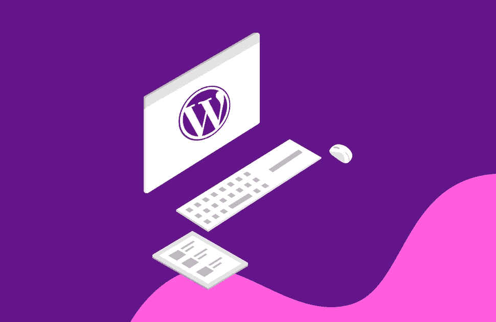

# 从 WordPress 到 Gatsby

> 原文：<https://betterprogramming.pub/moving-from-wordpress-to-gatsby-4a751a734adf>

## 改进的开发工作流程，更快的加载时间，并且不再需要维护

[https://beautiful themes . com/blog/how-to-create-a-WordPress-website/](https://beautifulthemes.com/blog/how-to-create-a-wordpress-website/)

[WordPress](http://wordpress.org) 功能强大。你可以用它做很多事情。但出于某种原因，我一直鄙视与它一起工作。

这不是一篇抨击 WordPress 的文章。它的有用性已被证明，因为它为三分之一的网络提供动力。

我更多的是在反思，为什么我决定在从事 web 开发项目时完全放弃 WordPress 这个平台。

作为一个专业的 web 开发人员，我习惯写 HTML/CSS/JS。那么，当我可以自己写代码的时候，为什么要去找 WordPress 呢？主要是因为我代理社区的朋友一直用 WordPress(可怕的原因，我知道)。

问题总是出现:“嗯，如果你的客户想自己更新网站呢？”

如果是这种情况，并且你的客户坚持要维护他们自己的网站或者发布博客文章，当然可以。WordPress 非常适合。你想做对客户最有利的事。我只知道这不适合我。

# 使用 WordPress 的工作流程

从开发的角度来看，你仍然可以用 WordPress 编写你自己的代码。在我看来，工作流程并没有优化。

它或者涉及在管理控制台中编写 HTML，或者更改文件，然后通过 FTP 将它们发送到服务器。希望你有比我更好的工作流程！

当飞轮推出[本地 by 飞轮](https://localbyflywheel.com/)时，情况有所好转。这是一个开发 WordPress 站点的一体化本地环境，然后将它们放在 Flywheel 上。

它有很多功能，但我仍然对使用 WordPress 感到痛苦。

# 为什么我不喜欢 WordPress

一天晚上，我正哄儿子睡觉，我的思绪在游荡。为什么我这么不喜欢 WordPress？。

所以，我列出了一个清单，你可以同意或不同意其中的任何一项。请随意。

*   为什么我运行 PHP 服务器和 MySQL 实例只是为了服务一个静态网站？
*   通常，我安装插件的经验使网站运行缓慢或容易被黑客攻击。
*   我真的不喜欢在他们的管理编辑器中为页面编写 HTML，然后编写我的 CSS，我必须用 FTP 上传。
*   PHP…没什么问题，只是不是我选择的语言。
*   与其他开发人员保持网站变更同步似乎很有挑战性。
*   我可以免费在 CDN 上托管一个静态网站，而不是花钱买一个 WordPress 主机。

# 转向盖茨比

我决定转向我的职业根源:HTML/CSS/JS。

我也一直在研读《盖茨比》并决定去看看。我拿了一个现有的 WordPress 网站，开始把它变成一个 Gatsby 网站。经过一段时间的学习，这个网站完成了，并在网上托管。

如果你读过我以前的文章，你会知道我也是[网利菲](https://www.netlify.com/)的忠实粉丝。我在这里有什么收获？

*   大大改进了开发工作流程。我可以用我喜欢的工具和语言，按照我想要的方式编写网站。这改进了我的开发时间，并将使未来的网站增强更容易。
*   更快的加载时间。Gatsby 框架从 JS 静态生成你的站点的 HTML([反应](https://reactjs.org/))。他们的口号是在每一个重要的方面都很快。这一点，再加上托管在像 Netlify 这样的 CDN 上，给了网站的用户很好的体验。
*   免费。我的网站通常不会有很多流量。当我在飞轮上支付 15 美元/月/站点时，我可以在 Netlify 的免费层上托管。
*   不用再维护 WordPress 了。一旦我的站点被部署，它们是完全安全的。它只是云中一个文件夹中的静态文件。这里没什么可黑的！
*   我仍然可以通过从 headless WordPress 或其他后端技术中提取数据来显示博客帖子或其他动态内容。

# 想要控制的客户怎么办？

我有一个亲密的朋友和企业主，我曾在他的网站上工作过。他有你的标准 WordPress 网站。他也很亲力亲为。发表博客文章，喜欢自己做出改变。

他不懂 HTML/CSS/JS，所以对 Gatsby 站点进行修改对他来说是不可能的。他表达了他在 WordPress 上遇到的一些问题，在聊天之后，他决定尝试一下 Squarespace。

几周之后，他终于部署了他的新站点。一些他独自完成的事情。

还有许多像 Squarespace 这样的网站建设者。这可能很适合那些用户？也许我会写一篇关于他从 WordPress 迁移到 Squarespace 的经历的案例研究。

# 结论

WordPress 有它的使用案例。对于那些很了解它的人来说，它是非常强大的。只是不适合我。

最好是找到正确的解决方案，而不是与之对抗。目标是找到适合你和你的客户的东西。

我相信我和盖茨比+ Netlify 在一起。