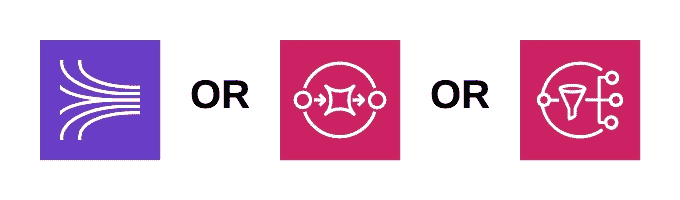
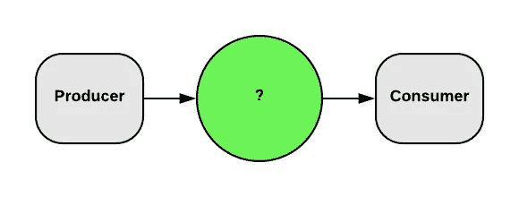
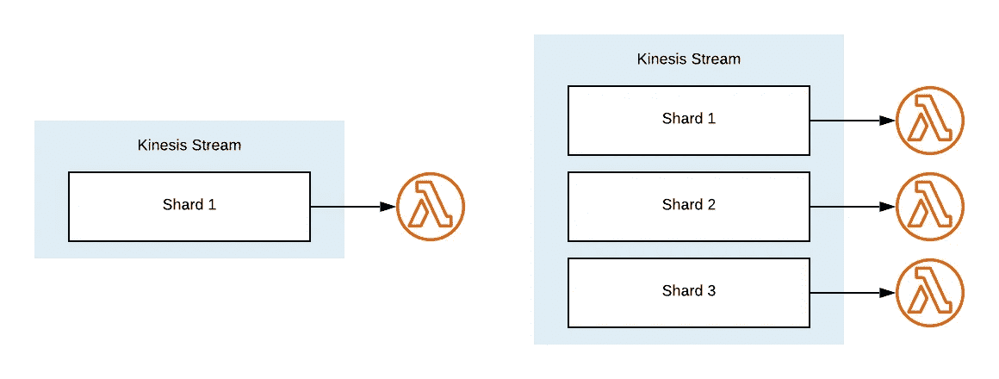
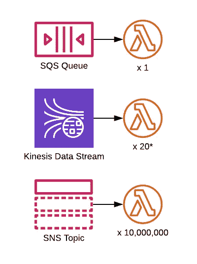
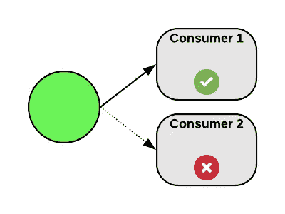

# 在 AWS 中移动消息:比较 Kinesis、SQS 和 SNS

> 原文：<https://betterprogramming.pub/moving-messages-in-aws-comparing-kinesis-sqs-and-sns-32cb5d2f89d5>

## 哪种技术最适合在 AWS 上传递您的信息？

Kinesis，SQS 还是 SNS？

使用无服务器技术构建您的应用程序充满了看起来相似的选项。将事件和消息从一个地方转移到另一个地方就是一个典型的例子:你如何决定哪种技术适合你？

在本指南中，我将比较以下 AWS 服务:

*   kine sis——kine sis 数据流
*   简单队列服务—SQS 标准队列
*   简单通知服务——SNS 主题

我可能应该先道歉:事实是这不是一个“谁对谁”的问题。每种服务都非常适合特定的用例。我们只需要了解我们的用例是什么，然后选择合适的技术。

典型的基于消息、事件驱动的架构

本指南帮助的场景是一个或多个服务*按照事件驱动模式产生*消息和*消费*消息。要决定哪种*交通*服务最适合您的需求，您需要了解与决策相关的特征:

*   可扩展性和负载
*   多个消费者
*   可靠性
*   过滤
*   消息大小
*   费用

事不宜迟，我们开始对比吧。

# 可扩展性和负载

我们的生产者/消费者模式中的三个元素可能都需要扩展。了解您的负载水平将如何变化以及这些增加和减少的性质是非常重要的。例如，你期望一个稳定的线性负载吗？或者，您是否期望在可预测的时间点出现“钟形曲线”式的上升和下降？或者可能是一个尖峰负载曲线，在这种情况下，大负载可能在任何时候出现，而没有警告？

## 上传请求

首先要考虑的是从生产者到运输服务的“投入”。当生产者将他们的消息发送到传输时，传输需要有足够的带宽来接受这些消息。否则，生产者将不得不不断重试，否则可能会丢失这些消息。

## SQS 和社交网络

SQS 和 SNS 在这里表现不错。它们会自动缩放以匹配传入消息的速率。换句话说，你不需要担心！

## 由外界刺激引起的不随意运动

Kinesis 就没那么有用了。一个 Kinesis 流的规模与其拥有的“碎片”数量有关。更多碎片，更大规模。每个碎片有 1 个 MiB 和每秒 1000 条消息的限制。

因此，如果预期吞吐量是每秒 9，500 条消息，您可以放心地提供 10 个碎片来避免瓶颈。但是，如果吞吐量可能发生变化，所需的分片数也必须随之变化。

AWS 不会为你管理 Kinesis 碎片的数量，因此，与 SNS 或 SQS 不同，你的解决方案必须包括一种方法来[改变 Kinesis 流上的碎片数量](https://docs.aws.amazon.com/kinesis/latest/APIReference/API_UpdateShardCount.html)。碎片的过度供应会增加成本，但是要注意——AWS 限制了在 24 小时内可以减少流上碎片数量的次数。

在这里阅读更多关于 Kinesis [极限的信息](https://docs.aws.amazon.com/streams/latest/dev/service-sizes-and-limits.html)。

## 获取请求

一旦消息被放到传输服务中，我们需要接收它们——消费者需要能够获取它们。get 的伸缩性与 put 的伸缩性非常相似。

## SQS 和社交网络

再一次，AWS 在这里很有帮助。如果我们设置一个 Lambda 函数由 SQS 或 SNS 触发，AWS 将自动增加和减少该 Lambda 的实例，以匹配 put 的规模。您可以放心，因为 AWS 会负责优化规模。

## 由外界刺激引起的不随意运动

如果我们有一个由 Kinesis 流触发的 Lambda，AWS 会确保为每个流部署该 Lambda 的一个实例。随着流数量的增加或减少，部署的 Lambda 实例的数量也会增加。Lambda 实例属于那个分片，所以只接收来自那个分片的消息。

每个分片 1 个 Lambda 实例

理解这种模式是必要的，因为每个碎片限制达到 10 个 [MiB](https://en.wikipedia.org/wiki/Mebibyte) 和每次*调用*10，000 条消息。请注意，限制是根据*调用*而不是每秒。要了解 Lambda 调用了多少个调用，您需要知道 Lambda 的批处理大小和处理时间。有许多变量需要考虑，包括内存分配、代码效率等。要问的关键问题是:*在每个分片中，消费者处理消息的速度能比产生消息的速度更快吗？*否则，您的消费者将无法跟上生产量。

# 多个消费者

一个重要的考虑因素是您是需要多种消费者(执行不同的功能)还是只需要一个。注意，就规模或吞吐量而言，这不同于拥有同一个消费者的多个*实例*。

## 社交网站（Social Network Site 的缩写）

简单通知服务允许多达一千万的订阅者订阅一个主题，这意味着一千万个不同的 Lambda 函数订阅一个主题。对于大多数用例来说，这远远超出了需要。

点击阅读更多关于 SNS 限制[的信息。](https://aws.amazon.com/sns/faqs/)

## 由外界刺激引起的不随意运动

Kinesis 比 SNS 限制性更强。每个流被允许有 20 个离散消费者，每个*流*(使用[增强扇出](https://docs.aws.amazon.com/streams/latest/dev/introduction-to-enhanced-consumers.html))。对于您的用例，20 个消费者可能就足够了。

然而，如果您要从一个流中触发多个消费者，那么您必须知道另一个限制。每个碎片被限制为每秒五次获取。如果您的每个 Lambdas 的调用持续时间都是一秒钟，那么您可能只有五个使用者。如果周期时间是两秒，你可能有 10 秒，以此类推。

你可以做一些事情来减轻这个限制:增加批量大小，调整内存分配等等。请记住，Lambda 调用的行为可能不完全一致。所以，如果只有很小的容差，Lambdas 偶尔可能无法从 shard 中获得记录。

每种服务都有不同的消费者限制

## SQS

因为 SQS 是一种排队服务(不是流服务)，它不适合多个消费者。它是专为“一次性”递送而设计的。当一个使用者从队列中“获得”一条消息时，SQS 会阻止其他使用者使用这条消息。

如果 SQS 是首选服务，尽管有此限制，那么您必须为每个消费者安排一个队列。

格雷格·法罗摄影

# 可靠性

可靠性看起来似乎是一个奇怪的特性——当然，设计应该总是可靠的？

澄清一下:我所说的可靠性是指确保消息被成功消费*最终*的能力。延迟处理并不适合所有情况。例如，如果消息是时间敏感的，那么除非在特定的时间范围内被成功地消费掉，否则它可能是无用的。

在另一个极端，即使“丢失”一条消息也是不可接受的。

## SQS

SQS 队列管理消息的方式使其成为非常可靠的选择。当消息被“消费”时，它会保留在队列中。但是，其他所有*消费者都看不到。当消息保持隐藏状态时，不能再次使用，从而防止重复处理。*

但是，如果在消费者处理消息的过程中出现错误，该怎么办呢？在这种情况下，消费者将无法告诉 SQS 消息已被成功消费。SQS 最终会让信息再次可见，以便另一个消费者可以检索到它。您可以自定义可见性超时— [这里有一些关于如何工作的信息](https://docs.aws.amazon.com/AWSSimpleQueueService/latest/SQSDeveloperGuide/sqs-visibility-timeout.html)。

消息会在 SQS 队列中保留四天，或者直到它们被成功使用([这是可配置的](https://docs.aws.amazon.com/AWSSimpleQueueService/latest/SQSDeveloperGuide/sqs-limits.html)，在 60 秒和 14 天之间)。

## 社交网站（Social Network Site 的缩写）

社交网站的可靠性不如 SQS。如果用户出现错误，SNS 会尝试重新发送消息，但仅限于严格限制范围内。更多信息可以在这个问题的答案中找到:[问:如果订阅端点不可用，Amazon SNS 消息会怎么样？](https://aws.amazon.com/sns/faqs/)

## 由外界刺激引起的不随意运动

Kinesis 可以说是三个选项中最可靠的。与 SQS 非常相似，如果消费者中存在持久错误状态，消息不会丢失——它会保留在流中。Kinesis 是一个*流*，而不是一个*队列。*一旦消息被成功处理，它*将保持*在流中。邮件不会被删除。

因为 Kinesis 保留所有消息，不管它们的成功处理状态如何，它提供了一个 SQS 或 SNS 都没有提供的选项——重播。

也许消费者没有进入错误状态，但是消息被不正确地处理。例如，代码中的业务逻辑可能有问题。如果你正在使用 Kinesis，你可以重置触发器到历史上的某个点([直到保持期限制](https://docs.aws.amazon.com/streams/latest/dev/kinesis-extended-retention.html))。重置触发器可能是一个有益的选择，尤其是在数据保留和准确性至关重要的情况下。

# 过滤

有些用例要求能够过滤消息，只处理那些与消费者相关的消息。

仅处理具有消费者类型子集的消息

例如，如果使用者应该只处理属于一个租户的消息，那么最好防止它被不符合标准的消息调用。

在上面的例子中，消费者 1 希望处理所有消息，而不管内容如何。消费者二只想处理属于一个特定租户的消息。SNS、SQS 和 Kinesis 如何帮助我们解决这个问题？

## SQS

如上所述，一个 SQS 队列应该有一个订阅的消费者，而不是几个。解决方法是为每个消费者设置不同的 SQS 队列。

拥有多个队列带来了一个问题:协调生产者变得更加困难。每个生产者现在必须理解它正在发送的消息的上下文，以便它可以将消息提交到正确的队列。

## 由外界刺激引起的不随意运动

不像 SQS，一个 Kinesis 流上有多个消费者是完全可以接受的。但是，Kinesis 不提供任何过滤帮助。

解决方法是让所有使用者调用并检查消息的内容。消费者必须做出决定:处理消息，或者忽略它。在不知道消息是否应该被处理的情况下进行调用是不理想的。调用必须付费，决定消息是否相关的处理时间也必须付费。在我看来，在无服务器架构中，不需要运行计算是一种反模式，因此应该避免。

## 社交网站（Social Network Site 的缩写）

在过滤方面，社交网络话题是我们的冠军。话题允许 [*订阅过滤*](https://docs.aws.amazon.com/sns/latest/dg/sns-subscription-filter-policies.html) *。*订阅过滤器非常出色。基于过滤器，您可以选择处理或不处理消息，而不必调用 Lambda 来检查内容。

# 消息大小

虽然所讨论的一些特征是需要评估和寻找折衷的问题，但是消息大小是更明确的。您必须在消息有效负载大小的硬性限制内操作。

## 社交网站（Social Network Site 的缩写）

从 [AWS SNS 文档](https://aws.amazon.com/sns/faqs/#Limits_and_restrictions)中:

> Amazon SNS 消息可以包含多达 256 KB 的文本数据，包括 XML、JSON 和无格式文本。

## SQS

来自 [AWS SQS 文档](https://docs.aws.amazon.com/AWSSimpleQueueService/latest/SQSDeveloperGuide/sqs-limits.html#limits-messages):

> 最小消息大小为 1 字节(1 个字符)。最大值为 262，144 字节(256 KB)。

## 由外界刺激引起的不随意运动

来自 [AWS Kinesis 文档](https://docs.aws.amazon.com/streams/latest/dev/service-sizes-and-limits.html):

> 在 base64 编码之前，记录的数据有效负载的最大大小为 1 MB。

对于任何比简单信息更大的东西，Kinesis 是更合适的选择。

# 费用

每项服务都有不同的相关成本。这些成本可能会很高，你应该在产生这些成本之前了解它们可能是什么。成本可能是选择过程中的一个重要因素。

看好硬币……(格雷格·法罗拍摄)

## 社交网站（Social Network Site 的缩写）

[产品升级和技术支持服务成本](https://aws.amazon.com/sns/pricing/)将取决于您的消费者。假设您的消费者是 Lambda functions，交付是免费的。因此，你只需支付发布消息的主题。

> 每 100 万次发布请求 0.50 美元

## SQS

SQS 向你收取与它互动的费用。因此，您将为每次交互—每次请求—累积成本。发布到队列是一个请求，使用队列中的消息是另一个请求。因此，尽管每百万次请求的价格略低于产品升级和技术支持服务，但更多的请求将导致成本继续增加。

> 每 100 万次发布请求 0.40 美元

如果您在 SQS 以外的地方阅读信息，您可能还会产生数据传输费用，更多详情请参见[价格信息](https://aws.amazon.com/sqs/pricing/)。

## 由外界刺激引起的不随意运动

Kinesis 的定价不同于 SNS 和 SQS，并且很难预测您的成本-但值得努力确保您不会累积大笔账单！

AWS 在他们的[定价页面](https://aws.amazon.com/kinesis/data-streams/pricing/)上提供了一个方便的计算器。计算器让你更容易理解你的流将花费多少。

您将为数据流的碎片数量、所需的保留期以及数据流上的数据量产生成本。有趣的是，消费消息的 Get 请求不需要付费。

根据我的经验，随着体积的增加，Kinesis 在成本上变得更有利——但前提是你能保持碎片数量绝对最小。

# 我们如何将这一切付诸实践？

如果你是云或 AWS 的新手，你可能会觉得信息超载。似乎经常有几个可行的选择——没有一个明显的方法来选择“最好”的一个。我深表同情！我也经历过同样的痛苦。让我们试着把它煮沸。

## 社交网站（Social Network Site 的缩写）

**我最喜欢 SNS 的两点:**出色的扩展性和可过滤性。

**我对社交网站的担心:**如果你的提醒和设计不够强大，数据很有可能会丢失。

**关于 SNS，我“要记住的事情:**成本。如果你不明白自己的计划，这些会让你大吃一惊。

## SQS

**我最喜欢 SQS 的一点:**它可以轻松地进行大规模扩展，同时保证所有数据的安全。

**我对 SQS 的担心:**它对多个消费者不起作用。这可能导致更复杂的架构。对于有经验的人来说，这不成问题，但作为新手，这可能会令人生畏。

关于 SQS，我要记住的是:因为当你使用 Lambda 来消费它时，它的伸缩性是如此惊人，它可以打破你的[并发限制](https://docs.aws.amazon.com/lambda/latest/dg/limits.html)！确保为消费者隔离 Lambda 并发性。

## 由外界刺激引起的不随意运动

我最喜欢 Kinesis 的一点是它可以记录你的信息长达七天。如果你想“重放”数据，那就太棒了。

**我对 Kinesis 的担心:t** hat 的缩放取决于你，可能会很尴尬和缓慢(与 SNS 和 SQS 相比)。

**我关于 Kinesis 的“需要记住的事情”:**虽然理论上支持多个消费者，但是实现起来可能会很麻烦。

# 最后

这些服务中的每一个都是有价值的，如果你在正确的场景中应用它们，它们会非常强大。选择最合适的解决方案通常很棘手。最好的学习方法是实验，将你的“最佳猜测”付诸实践，看看会发生什么。

你也应该考虑一起使用这些服务*和*来最大化每个服务的好处，同时减少它们的缺点。在 [ResponseTap](https://medium.com/responsetap-engineering) ，我们热衷于使用 SNS 主题，将 SQS 队列作为订阅者——使用上面提到的订阅过滤器。下次再谈这个吧！

# 附言

如果您觉得这篇文章很有用，并且想了解更多关于如何有效地向这些服务发送数据，请查看这篇文章:

 [## 在 AWS 中移动消息:超快的 Lambdas 使用批处理

### 通过批量发送消息来增强您的 Lambda 功能。

medium.com](https://medium.com/@greg.farrow1/moving-messages-in-aws-super-fast-lambdas-use-batches-c34cae10e78d)