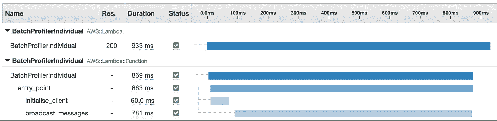
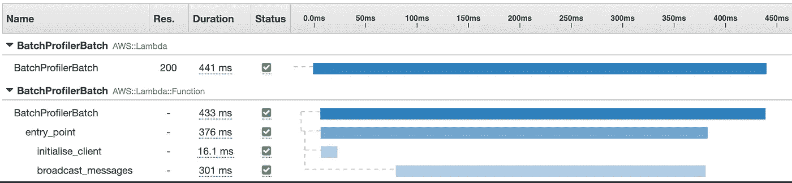

# 在 AWS 中移动消息:超快的 Lambdas 使用批处理

> 原文：<https://betterprogramming.pub/moving-messages-in-aws-super-fast-lambdas-use-batches-c34cae10e78d>

## 通过批量发送消息来加速你的 Lambda 函数


格雷格·法罗摄影

在无服务器世界中构建系统的一个基本原则是，您的功能应该尽可能快地完成它们的工作。功能运行的时间越长，花费就越多。

不管你的 Lambda 函数在做什么，在大多数用例中，很大一部分处理时间将被用于向其他地方发送数据。

如果目标是超快的 Lambdas 发送数据耗费大量时间，我们应该尽可能提高这一操作的效率。解决方案是在发送之前对数据进行批处理。

# 范围

我将讨论以下主题:

*   什么是批处理？
*   性能:批处理到底快了多少？
*   复杂性和错误处理:批处理是否太复杂而不值得？
*   不要重复自己(干巴巴):使用库可以让批处理成为最直接的选择吗？

# 什么是批处理？

许多 AWS 服务都有批量编写的 API。术语可能因服务而异，例如:“批量写入”、“批量发送消息”和“上传记录”。

但是，它们的意思都是一样的——您可以将不同的项目组合在一起，在单个事务中发送，而不是将一段数据作为单个项目发送，从而减少处理时间。

# 表演

为了证明节省了多少时间，让我们进行一些测试。

这些测试将使用两个 Lambda 函数，将数据发送到 SQS 队列。除了一个使用`send_message`和另一个使用`send_message_batch`之外，它们是相同的。我们将使用 [AWS X 射线](https://aws.amazon.com/xray/)来分析运行时间。

SQS `send_message_batch`的最大批量为十条消息。

如果你想自己运行下面的例子，你可以！GitHub 上有[的代码和部署说明。](https://github.com/g-farrow/message-batch-profiling)

处理发送消息的方法是`broadcast_messages`。

使用个人方法`send_message`，连续发送十条信息需要 700-800 毫秒:



一次发送一条消息大约需要 75 毫秒

用批处理方法做同样的事情，`send_message_batch`。我们看到更快的处理时间。所有 10 条消息都在大约 300 毫秒内广播，减少了大约 60%!



一次发送十条消息，每条消息大约需要 30 毫秒

[Kinesis](https://aws.amazon.com/kinesis/) 允许批量生产多达 500 件物品。再次运行测试，向 Kinesis 发送 500 条消息，我们看到以下广播消息计时:

*   `put_record` : 20-25 秒(对，秒！).
*   `put_records`:600-1000 毫秒。

这相当于潜在减少了 99.9%的播放时间！

## 较大批量

到目前为止，这两种方法的代码非常相似，而且相当简单。这些函数可以在单个事务中发送它们的所有消息。

但情况并不总是如此。例如，Lambda 可能由一个包含 1000 条入站消息的 Kinesis 流触发。

为了将 1，000 条消息分成更小的批次，Lambda 需要包含支持分块的代码。尽管并不十分复杂，但这段代码需要在所有利用批量发送的 Lambdas 上实现。

此外，不同的 AWS 服务对批量发送数据有不同的最大限制。例如，SQS 是 10，但 Kinesis 允许高达 500。

# 错误处理

我们需要注意的另一个方面是错误处理，以及在使用批量发送方法时这是如何变得更加复杂的。

如果出现故障，单个发送方法将抛出异常或返回指示错误的响应。此错误与当时正在发送的消息有关。处理这种情况相对简单。

如果在使用批量发送方法的过程中出现故障，并不能立即确定是哪条消息出了问题。

大多数 AWS 服务将响应一个批处理请求，通知客户端任何失败。为了处理失败，代码必须能够解析响应。例如，这是一个 SQS `send_message_batch`请求的合同:

Lambda 将需要迭代`Failed`中的任何项目，并重新处理它们或以其他方式处理它们。

在这一点上，正确处理批处理所需的代码变得相当复杂，为您希望使用的每个服务以及您构建的每个 Lambda 编写代码来处理这些场景将会很烦人，而且会浪费时间。

# 不要重复你自己

DRY 是所有软件开发的基本原则。在这种情况下尤其如此。用于分块批处理的代码，知道一个批处理可能有多大，然后处理任何失败或错误，是相当静态的。

不管你写了多少 Lambda 函数，也不管它们的目的是什么——批量发送数据的处理将是所有这些函数的标准。

因此，开发一个你可以*实现一次*但是*在多个地方*使用的库是至关重要的。

## Boto3 批处理工具

我正是这样做的。我编写并维护了一个名为`[boto3-batch-utils](https://github.com/g-farrow/boto3_batch_utils)`的 Python 库，它抽象了几个 AWS 服务的批量发送功能。

使用这样的库可以让我的 Lambda 函数获得高效批量发送的所有好处——但没有错误处理和批量管理的复杂性。

```
sqs_client = SQSBatchDispatcher('QUEUE_NAME')broadcast_messages_sqs(messages_list)sqs_client.flush_payloads()def broadcast_messages_sqs(messages_list):
    for message in messages_list:
        sqs_client.submit_payload(message)
```

使用`boto3-batch-utils`比发送单个消息需要*更少的*行代码。要了解更多关于我如何接近图书馆的信息，[你可以阅读文档](https://g-farrow.github.io/boto3_batch_utils/)。

# 更丰富的功能

使用库的好处不仅仅是错误处理和批量管理。以下是我在 Boto3 批处理实用程序中实现的一些特性:

## 客户端初始化效率

Boto3 客户端仅在需要时初始化。随后在调用中重用它，以节省更多的时间。

## 自动重试

在某些情况下，未能发送一批中的一部分可能不是严重的问题。例如，如果客户端受到限制。如果发生这种情况，重试可能会成功。

自动重试*仅*失败的消息有助于最大化效率并减少故障。

## 限制

该库可以存储批次大小的所有 AWS 服务限制。这意味着你不需要记住它们或者查找它们。

# 肯定是批量的！

不管你是使用`boto3-batch-utils`还是自己编写，如果你想增强你的 Lambda 函数，我强烈推荐使用一个库来允许你利用批量发送数据。

您想了解更多关于在 AWS 中移动消息的信息吗？查看我的帖子:

[](https://medium.com/better-programming/moving-messages-in-aws-comparing-kinesis-sqs-and-sns-32cb5d2f89d5) [## 在 AWS 中移动消息:比较 Kinesis、SQS 和 SNS

### 哪种技术最适合在 AWS 上传递您的信息？

medium.com](https://medium.com/better-programming/moving-messages-in-aws-comparing-kinesis-sqs-and-sns-32cb5d2f89d5)