# 多光标:IntelliJ 快捷方式，以提高您的打字速度

> 原文：<https://betterprogramming.pub/multi-cursors-intellij-shortcuts-to-boost-your-typing-speed-4b8901e4a9b9>

## 同时编辑多行，以及其他生产力提示


Amy Hirschi 在 [Unsplash](https://unsplash.com?utm_source=medium&utm_medium=referral) 上的照片

如果你用一个光标打字很快，那么用多个光标你会更快。智能工具有很多快捷方式来提高你的工作效率。你的同事会惊叹于你同时编辑多行的神一样的能力。这篇文章还将介绍通常与多光标结合使用的其他快捷方式。练习这些捷径，直到它们自然而然地出现在你的脑海中。

# 相关便捷快捷方式

在继续之前，您应该熟悉所有的快捷方式以及它们的用法。本文中的快捷方式是基于 Mac 的。要为 Windows 找到一些等效的快捷方式，使用这个[备忘单](https://resources.jetbrains.com/storage/products/intellij-idea/docs/IntelliJIDEA_ReferenceCard.pdf)。如果您不熟悉 Mac 密钥:

*   ⌘是指挥官
*   ⌥是选项
*   ⌃是控制者
*   ⇧正在转变

这篇文章使用 IntelliJ IDEA 来展示例子。这些快捷方式适用于所有 IntelliJ IDE，如 Android Studio、Webstorm、PyCharm 等。

## 拖动多个光标(按住⌥，左键单击，拖动)

要创建多个光标，请按住⌥，在第一行中您想要第一个光标所在的任何位置单击，然后垂直向下拖动它。如果你同时水平移动鼠标，你就在做选择。

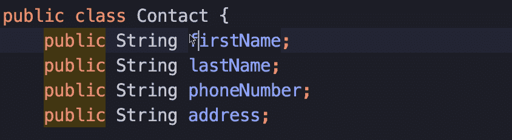

拖动多个光标(按住⌥，左键单击，拖动)

如果您想将光标放在每一行的末尾，请从每一行的末尾开始单击并拖动光标。

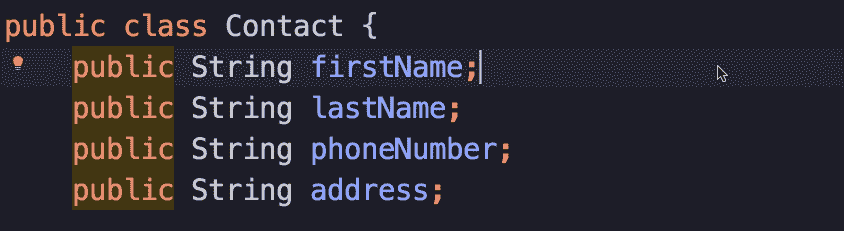

在每一行的末尾拖动多个光标

如果你的鼠标有一个滚轮，这可以通过点击并按住滚轮来实现，而不是按住⌥键。(抱歉，魔鼠用户。)

## 选择下一个事件(⌃ G)

选择单词或语法的任何部分，然后按下⌃ G 以选择下一个出现的单词。一次又一次地按下⌃ G，直到您选择了您想要的所有内容。开始输入，瞧，你正在同时编辑多行。

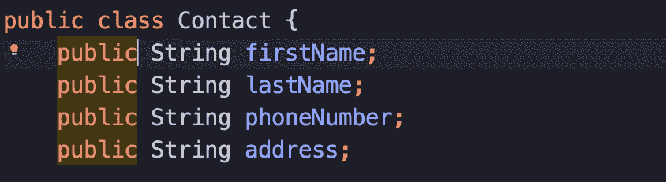

选择下一个事件(⌃ G)

和重命名有什么不同？重命名只对类名、函数名或变量名有效。

它与查找和替换有什么不同？嗯，查找和替换需要更多的点击，而且很难看到你要替换什么。有了这个，你可以很容易地看到你要编辑的内容。同时，您还在每次出现时创建一个光标。

## 取消选择前一个事件(⌃ ⇧ G)

当选定的发生意外溢出到下一个时，您可以通过⌃ ⇧ G 取消选择上一个发生，而不是重做所有操作。

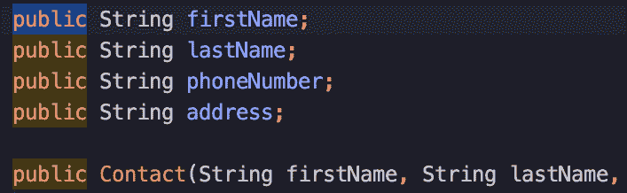

取消选择前一个事件(⌃ ⇧ G)

## 选择所有事件(⌃ ⌘ G)

当您想要选择文件中的所有匹配项时，请按⌃ ⌘ G。这相当于在文件中查找所有匹配项，但您会在每个匹配项处找到光标。

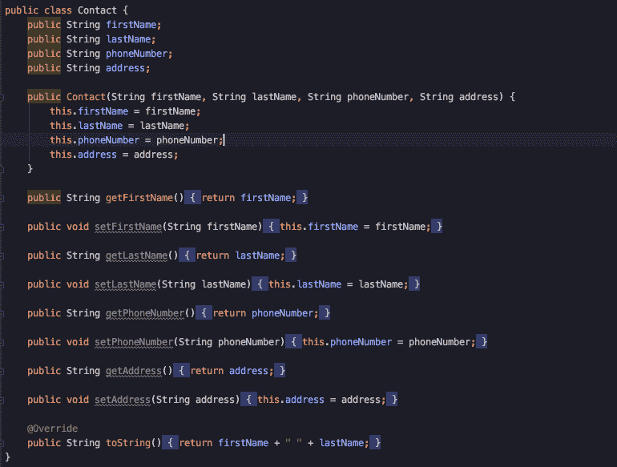

## 扩大选择范围或缩小选择范围(⌥ ↑或⌥↑)

这是另一个被低估的命令。当你想选择一对括号或引号之间的任何内容时，你必须小心控制鼠标指针的位置和移动。(有些开发人员讨厌使用鼠标——这就是 Vim 诞生的原因。)

更快的方法是使用扩展选择。将光标放在括号内的任意位置，按⌥ ↑。如果您的选择溢出，请按⌥ ↓以撤销扩展。

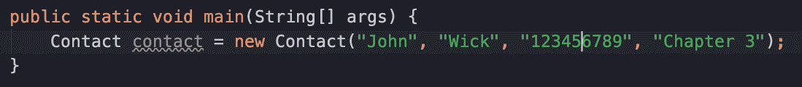

扩大选择范围或缩小选择范围(⌥ ↑或⌥↑)

## 开关盒(⌘ ⇧大学)

选择您想要转换为全部大写或全部小写的语法，然后按下⌘ ⇧ U 键在大小写之间切换。

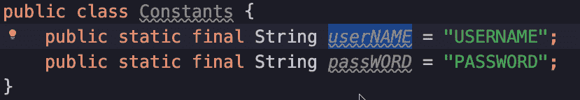

开关盒(⌘ ⇧大学)

## 重复行(⌘ D)

将光标放在该行的任意位置，然后按⌘ D。新的复制行将插入到原始行的正下方。您可以选择多行来复制多行。

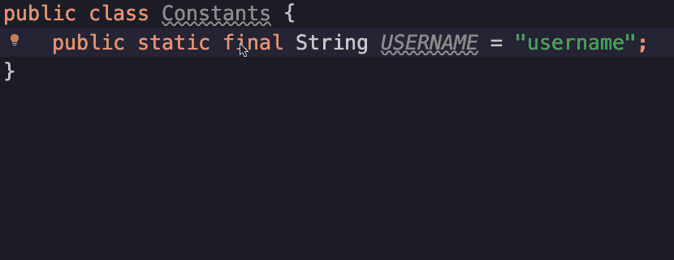

重复行(⌘ D)

## 移到句首或句尾(⌘ ←或⌘ →)

这是一个 Mac 快捷键。IntelliJ IDEs 在句首不包含缩进，因此您可以通过移动到句首并按住⇧键同时移动到句尾来快速选择整行(⌘ ←，⇧ ⌘ →)。

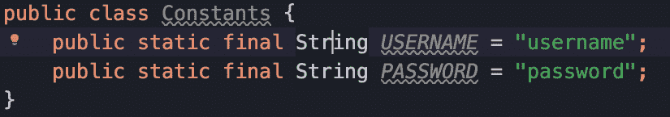

移到句首或句尾(⌘ ←或⌘ →)

## 按字移动(⌥ →或⌥ ←)

这是另一个 Mac 快捷键。当你不想使用鼠标时，你可以按住⌥键同时按下→或←来加快移动光标的速度。

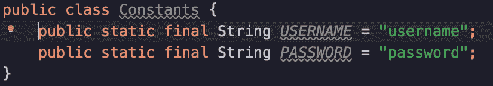

按字移动(⌥ →或⌥ ←)

# 实际例子

现在，您已经准备好在下面的四个实际例子中应用这些快捷方式了。

## 1.将 Javascript 转换成 Java

当你把一种语言的语法复制到另一种语言时，语法或多或少是相似的。对于常量声明，您可能需要转换:

```
export const USERS_FETCH_SUCCESS = 'users_fetch_success';
export const USERS_FETCH_FAILURE = 'users_fetch_failure';
export const USERS_FETCH_LOADING = 'users_fetch_loading';
```

到 Java:

```
public static final String *USERS_FETCH_SUCCESS* = "users_fetch_success"**;** public static final String *USERS_FETCH_FAILURE* = "users_fetch_failure"**;** public static final String *USERS_FETCH_LOADING* = "users_fetch_loading"**;**
```

您需要做的是:

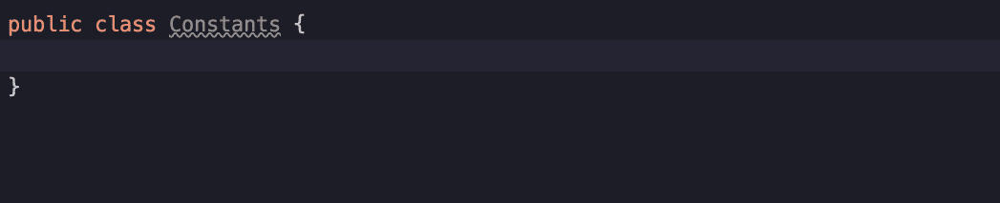

将 Javascript 转换成 Java

*   将 Javascript 语法粘贴到 Java 文件中。
*   在第一行选择`export const`。
*   选择下一个事件。
*   类型`public static final String`。
*   在单引号之间移动光标。
*   展开选择一次。
*   按下`"`。IDE 很聪明，可以用双引号代替单引号。

## 2.删除新行

要内联此中的项目:

```
List<String> statues = Arrays.*asList*(
        "New"**,** "Waiting for Customer"**,** "In progress"**,** "Ready for review"**,** "Done"
)**;**
```

对此:

```
List<String> statues = Arrays.*asList*("New"**,** "Waiting for Customer"**,** "In progress"**,** "Ready for review"**,** "Done")**;**
```

你必须:

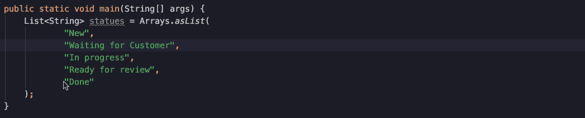

删除新行

*   在每行的开头创建多个光标。
*   按退格键删除每行的新行。
*   最后，稍微碰一下右括号。

## **3。将单词转换为枚举**

当您得到一个纯文本形式的状态列表时，您可能希望将它们声明为 enum。您想要转换此:

```
New
Waiting for Customer
In progress
Ready for review
Done
```

对此:

```
public enum WorkflowStatus {
    *NEW*,
    *WAITING_FOR_CUSTOMER*,
    *IN_PROGRESS*,
    *READY_FOR_REVIEW*,
    *DONE*,
}
```

流程如下:


**将单词转换为枚举**

*   创建一个暂存文件。将这些状态粘贴到暂存文件中。
*   选择第一个空白区域。选择所有事件。
*   用下划线`_`替换空格。
*   拖动以在行尾创建多个光标，并键入逗号`,`。
*   从每一行的末尾到每一行的开头进行选择。
*   按下使状态大写。
*   将状态复制到您的班级。

如果你正在复制 Python 代码，有一个名为[的 JetBrains 插件 https://plugins . JetBrains . com/plugin/2162-string-manipulation/](https://plugins.jetbrains.com/plugin/2162-string-manipulation/)可以让你实现更多。首先做你想到的任何事情。

## 4.粘贴成行

从上面的实际例子继续。如果要使用原始状态文本作为枚举值:

```
public enum WorkflowStatus {
    *NEW*("New")**,** *WAITING_FOR_CUSTOMER*("Waiting for Customer")**,** *IN_PROGRESS*("In progress")**,** *READY_FOR_REVIEW*("Ready for review")**,** *DONE*("Done")**,
    ;** WorkflowStatus(String value) {
    }
}
```

请按照以下步骤操作:

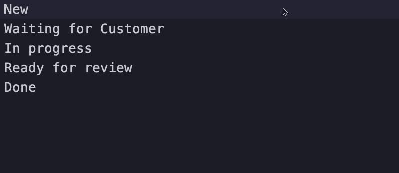

粘贴成行

*   在草稿文件中，拖移以在每行末尾创建多个。
*   从每行的结尾到开头进行选择。
*   复制或剪切这些行。
*   切换到您的枚举类文件。
*   选择第一个逗号。
*   选择下一个出现的逗号，直到选择所有逗号。
*   按←取消选择并将光标移动到逗号的左侧。
*   输入左括号`(`，右括号会自动添加。
*   键入一个双引号`"`，结束`"`会自动为您添加。
*   粘贴到这些行中。瞧啊。
*   只需修改您的枚举构造函数来适应您当前的用例。

请注意，只有当源和目标的行数相同时，才会正确插入行。

# 另外三个有用的提示

## 1.创建一个暂存文件

如果您不知道暂存文件，它是一个临时文件，您可以在其中快速键入或粘贴内容。

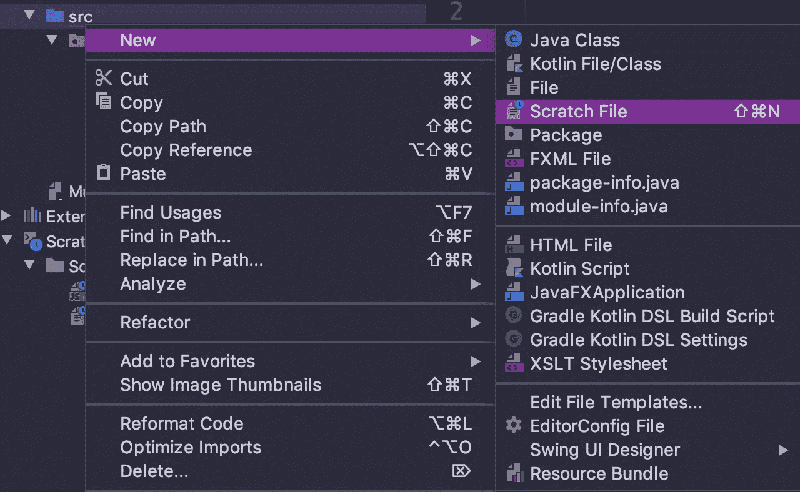

既然我们一直在谈论快捷方式，那么创建一个暂存文件的快捷方式就是 **⌘⇧ N** 。

## 2.演示助理

演示助手是一个超级酷的 IntelliJ 插件，可以显示你正在调用的快捷方式和 Windows 中的等效快捷方式。顾名思义，这意味着向观众展示在您的现场编码演示中您使用了哪些快捷方式。你也可以在结对编程时使用它，这样你的搭档就可以从你那里学到一堆捷径。

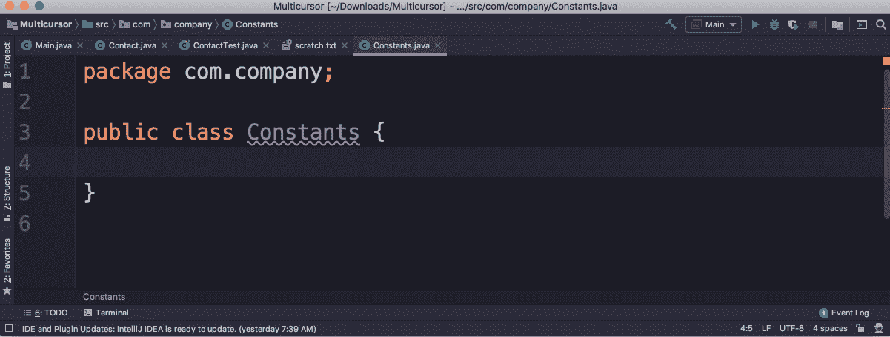

演示助理

## 3.深紫色主题

用不同的颜色主题增加你的 IDE 的趣味，例如，这篇文章中使用的[深紫色主题](https://plugins.jetbrains.com/plugin/12100-dark-purple-theme)。

# 遗言

当我第一次看到我的同事使用这些快捷方式时，我感到很惊讶。不确定你现在是不是。我希望你已经学会了大量有用的快捷方式，并开始使用它们。练习会让它们变得自然。快乐捷径！