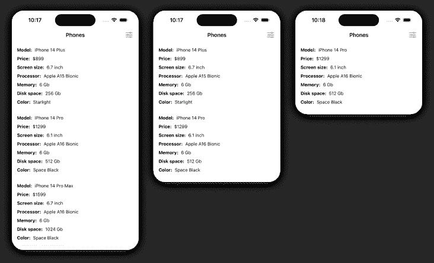
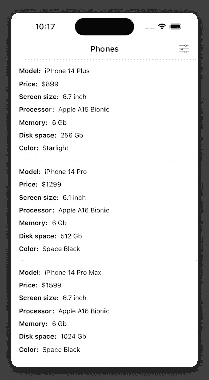
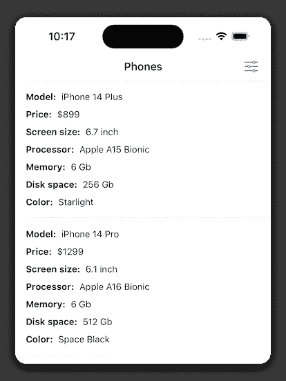
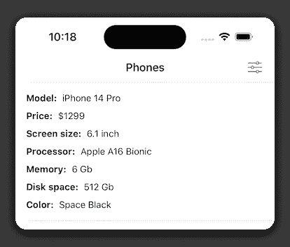

# Swift 中的多选过滤器

> 原文：<https://betterprogramming.pub/multi-select-filter-in-swift-part-1-5f4da79989b9>

## 如何使用设计模式实现过滤逻辑



在本教程中，我们将学习如何使用两种设计模式来实现多选过滤器:策略和装饰。

本教程将分为两个部分:

1.  在第一部分中，我们将重点关注过滤逻辑的实现。
2.  在第二部分中，我们将讨论 UI(即将推出)。

我们开始吧！

# 前言

想象一下，我们正在为一家在线智能手机零售商开发一款应用，我们的产品负责人想出了在目录中过滤智能手机的主意。

我们应该创建一个健壮的、可扩展的解决方案。这意味着，如果我们要在过滤器中增加一个选项，这不会有一点麻烦。

除此之外，过滤器必须是多选过滤器，假设用户可以同时选择几个选项。

考虑到这些要求，我们开始制定解决方案。

# 模型

首先，我们从定义一个[手机](https://github.com/creimbord/multiselect-filter/blob/cf62d7521421bb392de4f8a4a538681d69a5554a/MultiselectFilter/Model/Phone.swift?plain=1#L10)型号开始:

```
struct Phone {
    let model: String
    let price: Int
    let screenSize: Double
    let processor: String
    let memory: Int
    let diskSpace: Int
    let color: String
}
```

其次，我们应该确定一个 [***规格***](https://github.com/creimbord/multiselect-filter/blob/cf62d7521421bb392de4f8a4a538681d69a5554a/MultiselectFilter/Model/Specification.swift?plain=1#L10) 型号，该型号将用于过滤具体的智能手机规格:

```
enum Specification {
    case model(String)
    case price(Int)
    case screenSize(Double)
    case processor(String)
    case memory(Int)
    case diskSpace(Int)
    case color(String)
}
```

每个枚举案例都包含相关联的值，该值表示具体规范的底层类型。

既然模型都设置好了，我们就可以开始实现过滤功能了。

# 过滤策略

我们首先创建一个上下文类和一些符合[策略设计模式](https://refactoring.guru/design-patterns/strategy)的类，它们负责分别过滤每个智能手机规范。

> **策略** —一种行为设计模式，定义了一系列相似的算法，并将每个算法放在自己的类中，之后算法可以在运行时互换。
> 
> **来源:**设计模式:深入研究设计模式

首先，我们应该概述一个每个具体滤波器都要遵守的[协议](https://github.com/creimbord/multiselect-filter/blob/cf62d7521421bb392de4f8a4a538681d69a5554a/MultiselectFilter/Filter/FilterStrategy.swift?plain=1#L27):

```
protocol FilterStrategy {
    func filter(phones: [Phone], by specs: [Specification]) -> [Phone]
}
```

它将只包含一个方法，该方法有两个输入参数:

➊手机-要过滤的手机阵列。

➋规格—过滤将基于的规格数组。

完成之后，我们继续实现一个负责管理具体过滤器的[过滤器上下文类](https://github.com/creimbord/multiselect-filter/blob/cf62d7521421bb392de4f8a4a538681d69a5554a/MultiselectFilter/Filter/FilterStrategy.swift?plain=1#L10):

```
final class Filter {
    private var strategy: FilterStrategy // 1

    init(strategy: FilterStrategy) {
        self.strategy = strategy
    }

    func update(strategy: FilterStrategy) { // 2
        self.strategy = strategy
    }

    func applyFilter(to phones: [Phone], withSpecs specs: [Specification]) -> [Phone] {
        return strategy.filter(phones: phones, by: specs) // 3
    }
}
```

正是这个类能够在运行时交换策略。

➊它保持对当前过滤器的引用。

➋的 ***更新*** 功能反过来用于将当前策略改变为新策略。

➌，然后我们可以通过协议中定义的接口与当前过滤器进行交互。

设置好上下文之后，我们最后继续创建具体的过滤器。

> **注意** 我们将只研究一个具体的滤波器，因为所有滤波器的实现细节都是相同的。过滤器的完整列表可以在[这里](https://github.com/creimbord/multiselect-filter/blob/main/MultiselectFilter/Filter/FilterStrategy.swift)找到。

让我们看看[价格过滤器](https://github.com/creimbord/multiselect-filter/blob/cf62d7521421bb392de4f8a4a538681d69a5554a/MultiselectFilter/Filter/FilterStrategy.swift?plain=1#L42)的实现:

```
final class PriceFilter: FilterStrategy {
    func filter(phones: [Phone], by specs: [Specification]) -> [Phone] {
        let priceSpecs = Set(specs.compactMap { (spec) -> Int? in // 1
            if case let .price(price) = spec { return price }; return nil // 2
        })
        return phones.filter { priceSpecs.contains($0.price) } // 3
    }
}
```

➊:我们使用`compactMap`是为了只收集价格参数，用于以后的过滤，并确保我们有任何价格参数。为了实现快速查找，我们将数组包装在 Set 中。

➋ ***if case let*** 语法只允许我们解开一个特定的 enum case 关联值。更多信息请点击查看[。](https://useyourloaf.com/blog/swift-if-case-let/)

➌:最后，我们对电话收集应用一个过滤器并返回结果。

完成过滤器的实现后，我们继续创建过滤器装饰器。

# 过滤器装饰工

为了能够一次使用几个过滤器，我们应该创建一个与[装饰设计模式](https://refactoring.guru/design-patterns/decorator)一致的类。

> 装饰器(Decorator)——一种结构设计模式，允许你通过将对象包装在有用的“包装器”中，动态地给对象添加新功能。
> 
> 设计模式:深入研究设计模式

首先，我们定义一个每个装饰者都要遵守的[协议](https://github.com/creimbord/multiselect-filter/blob/cf62d7521421bb392de4f8a4a538681d69a5554a/MultiselectFilter/Filter/FilterDecorator.swift?plain=1#L10):

```
protocol PhoneFilter {
    func filter(phones: [Phone], by specs: [Specification]) -> [Phone]
}
```

它有一个方法和与`FilterStrategy`方法相同的方法签名。

然后我们创建一个符合`PhoneFilter`协议的[基类](https://github.com/creimbord/multiselect-filter/blob/cf62d7521421bb392de4f8a4a538681d69a5554a/MultiselectFilter/Filter/FilterDecorator.swift?plain=1#L22):

```
class PhoneFilterDecorator: PhoneFilter {
    private let phoneFilter: PhoneFilter // 1

    init(phoneFilter: PhoneFilter) {
        self.phoneFilter = phoneFilter
    }

    func filter(phones: [Phone], by specs: [Specification]) -> [Phone] { // 2
        return phoneFilter.filter(phones: phones, by: specs)
    }
}
```

它的主要任务是为每个具体的装饰器指定包装接口。

*   该类将符合`PhoneFilter`协议的包装对象保存在`phoneFilter`常量中。
*   `filter`函数将被子类覆盖，以提供定制的过滤逻辑。

接下来，我们创建一个`[PhoneBaseFilter](https://github.com/creimbord/multiselect-filter/blob/cf62d7521421bb392de4f8a4a538681d69a5554a/MultiselectFilter/Filter/FilterDecorator.swift?plain=1#L15)`类，它将扮演占位符过滤器的角色:

```
class PhoneBaseFilter: PhoneFilter {
    func filter(phones: [Phone], by specs: [Specification]) -> [Phone] {
        return phones
    }
}
```

我们使这个类符合`PhoneFilter`协议，作为返回值，我们提供了传递给函数的相同的电话数组。

我们将使用`PhoneBaseFilter`类作为默认过滤器。

与 strategy 类似，我们将只深入一个 decorator 类的实现细节。

让我们回顾一下`[PhonePriceFilter](https://github.com/creimbord/multiselect-filter/blob/cf62d7521421bb392de4f8a4a538681d69a5554a/MultiselectFilter/Filter/FilterDecorator.swift?plain=1#L45)`类:

```
final class PhonePriceFilter: PhoneFilterDecorator { // 1
    override func filter(phones: [Phone], by specs: [Specification]) -> [Phone] { // 2
        let filter = Filter(strategy: PriceFilter()) // 3
        let appliedFilterResult = super.filter(phones: phones, by: specs) // 4
        let filteredPhones = filter.applyFilter(to: appliedFilterResult, withSpecs: specs) // 5
        return filteredPhones
    }
}
```

➊它是从基础装饰者那里继承来的— `PhoneFilterDecorator` *。*

➋它覆盖了过滤方法。

➌过滤逻辑由过滤策略提供。

➍我们通过调用超级过滤方法将过滤后的电话数组设置为常量`appliedFilterResult` 。

意思是如果我们把 ***，*** 比如说`PhoneDiskSpaceFilter` 传递给`PhonePriceFilter` 初始化器，那么提供的初始手机数组会先用磁盘空间条件过滤，只有这样结果才会传递给`PhonePriceFilter` 进一步过滤*。*

➎我们使用当前过滤器(PriceFilter)来过滤前一个过滤器(例如 DiskSpaceFilter)的结果，它保存在`appliedFilterResult` 常量中，因此我们将`appliedFilterResult`传递给`applyFilter`方法。

装饰器部分到此为止，让我们继续看用法示例。

# 使用

我们首先创建一个[模拟数据](https://github.com/creimbord/multiselect-filter/blob/cf62d7521421bb392de4f8a4a538681d69a5554a/MultiselectFilter/Modules/Main/DataSource/MainDataSource.swift?plain=1#L13)，用于过滤:

```
var phones = [
    Phone(
        model: "iPhone 14",
        price: 799,
        screenSize: 6.1,
        processor: "Apple A15 Bionic",
        memory: 6,
        diskSpace: 128,
        color: "Midnight"
    ),
    Phone(
        model: "iPhone 14 Plus",
        price: 899,
        screenSize: 6.7,
        processor: "Apple A15 Bionic",
        memory: 6,
        diskSpace: 256,
        color: "Starlight"
    )
    ...
]
```

完成之后，我们现在就可以开始使用过滤器了。

让我们创建一个[规格数组](https://github.com/creimbord/multiselect-filter/blob/cf62d7521421bb392de4f8a4a538681d69a5554a/MultiselectFilter/Modules/Main/View/MainViewController.swift?plain=1#L14):

```
private let specifications: [Specification] = [
    .diskSpace(256),
    .diskSpace(512),
    .color("Starlight"),
    .color("Space Black"),
    .price(1299)
]
```

当用户选择 UI 中的选项时，将填充这个数组。

现在唯一剩下的事情就是按照期望的顺序创建一个装饰链。

在这个例子中，我们创建了一个由三个装饰者组成的[链:](https://github.com/creimbord/multiselect-filter/blob/cf62d7521421bb392de4f8a4a538681d69a5554a/MultiselectFilter/Modules/Main/View/MainViewController.swift?plain=1#L46)

```
override func viewDidLoad() {
    super.viewDidLoad()

    let phoneColorFilter = PhoneColorFilter(phoneFilter: PhoneBaseFilter()) // 1
    let phoneDiskSpaceFilter = PhoneDiskSpaceFilter(phoneFilter: phoneColorFilter) // 2
    let phonePriceFilter = PhonePriceFilter(phoneFilter: phoneDiskSpaceFilter) // 3

    dataSource.phones = phonePriceFilter.filter(
        phones: dataSource.phones,
        by: specifications
    )

    tableView.reloadData()
}
```

注意每个装饰器是如何插入另一个的。这就是装饰模式的强大之处。

*   滤色器将产生以下结果:



*   然后它将被传递给磁盘空间过滤器，结果将是:



*   最后，上一步的结果将被传递给价格过滤器，最终输出将是:



# 结论

使用设计模式可以让我们创建一个灵活的解决方案，在不破坏现有过滤选项的情况下，更容易添加新的过滤选项。

感谢阅读！如果您喜欢本教程，请鼓掌，请继续关注第二部分，我们将学习如何将过滤逻辑附加到 UI 上。

# 源代码

这个项目的源代码可以在我的 GitHub 资源库中找到:

[](https://github.com/creimbord/multiselect-filter) [## GitHub-creim bord/multiselect-filter:多选过滤器应用程序

### 此时您不能执行该操作。您已使用另一个标签页或窗口登录。您已在另一个选项卡中注销，或者…

github.com](https://github.com/creimbord/multiselect-filter)