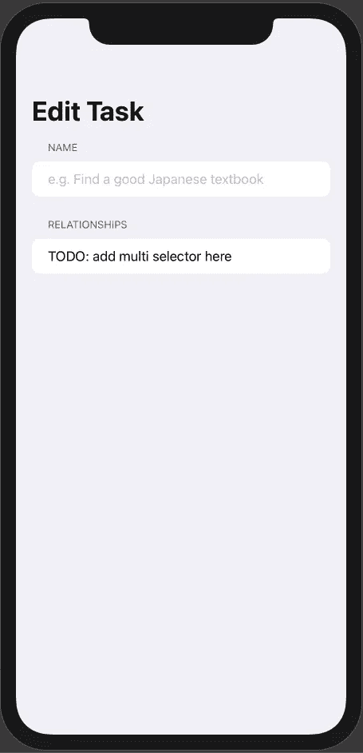
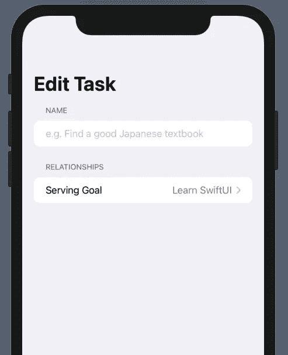
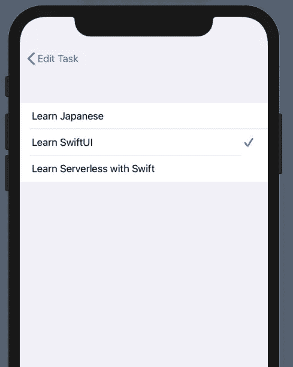
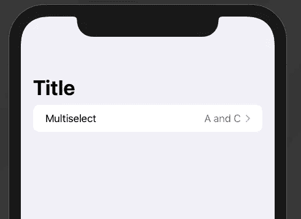
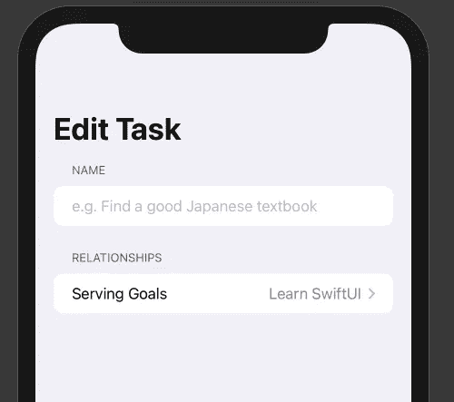
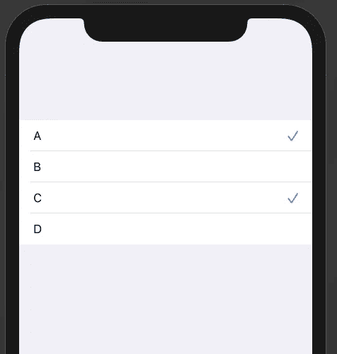

# SwiftUI 中的多重选择器

> 原文：<https://betterprogramming.pub/multi-selector-in-swiftui-52238dc2a690>

## 原型制作缺少 SwiftUI 组件


哈尔·盖特伍德在 [Unsplash](https://unsplash.com?utm_source=medium&utm_medium=referral) 上拍摄的照片

在使用 SwiftUI 开发我的第一个严肃的应用程序时，我一直对使用 SwiftUI 开发 UI 的速度印象深刻，特别是如果预先提供的视图已经支持您的用例。当然，对于任何类型的定制 UI，我们仍然需要编写我们的定制视图，合并现有的视图，并使用修饰符等对它们进行调整，我希望 SwiftUI 至少支持开发人员可能需要用来呈现数据和接受用户输入的最常见的视图。

如果是这样的话，SwiftUI 甚至可以用于原型制作，在这种情况下，可以快速构建一个“工作但不漂亮”的应用创意版本，并向用户展示，以验证该应用创意是否有任何成功的机会。此外，通过这种方式，人们还可以快速收集关于哪些部分实际上需要更好理解的 UI(尚未很好理解的部分)以及哪些部分可以通过一些视觉调整保留为默认组件的反馈。

换句话说:在我看来，SwiftUI 有可能让更多开发人员对 [MVP](https://en.wikipedia.org/wiki/Minimum_viable_product) 驱动的产品开发更感兴趣，这绝对是一件好事，因为它节省了大量时间，否则这些时间将被投入到最终会以这样或那样的方式失败的事情上。这与[精益创业方法](https://en.wikipedia.org/wiki/Lean_startup)一致，我认为这是处理任何新产品的好方法。

# SwiftUI 的当前状态

为了实现这一点，我希望 SwiftUI 已经涵盖了表单中可能需要的所有常见输入类型，如用户注册或其他类型的数据，因为许多类型的应用程序最终都只是一个接受输入数据、以某种方式转换数据并以特殊方式或时间呈现数据的表单。不幸的是，SwiftUI 还没有完全实现。

苹果似乎对 SwiftUI 采取的方法是考虑 SwiftUI 中最缺失的组件，并每年添加一些组件。例如，在 WWDC 2020 上，他们在`Text`中添加了[进度视图](https://developer.apple.com/documentation/swiftui/progressview)、[量表](https://developer.apple.com/documentation/swiftui/gauge)、`Image`支持，并改进了现有视图的许多[其他细节，这既是为了性能，也是为了更大的灵活性。在 WWDC 2021 上，他们增加了多个与`async/await`相关的 API，如](https://developer.apple.com/videos/play/wwdc2020/10041/)[asyn image](https://developer.apple.com/documentation/swiftui/asyncimage)或[。可刷新](https://developer.apple.com/documentation/swiftui/label/refreshable(action:))和[。任务](https://developer.apple.com/documentation/swiftui/circle/task(priority:_:))查看修改器，在[其他改进&增加](https://medium.com/@anithawritings/whats-new-in-swiftui-wwdc2021-aadbdd8d34de)中。

这种方法的好处是，一旦向框架中添加了一些东西，人们可以预期它会长期以相同的方式存在和工作，因此每个版本都不需要大的代码更改(就像 Swift 4 之前的 Swift 语言一样)。不利的一面是，许多组件仍然缺失。这就是我认为社区可以提供临时解决方案的地方，这些解决方案可以在未来的某个时候被苹果提供的官方组件轻松替换。

# 实现多选视图组件

在这篇文章中，我将重点关注这样一个组件，并提供我的初步解决方案:一个多选器，用于从给定的选项集中选择多个选项。截至目前，苹果确实提供了一个[选择器](https://developer.apple.com/documentation/swiftui/picker)，但它不支持选择多个条目，甚至会在做出一个选择后自动离开列表屏幕。所以让我们开始着手解决这个问题吧！

什么样的数据结构需要多重选择器？让我们来看看这个例子:

所以基本上，在我们的应用程序中，我们有一个目标集合和一个任务集合。我们希望对描述每项任务服务于哪些目标的关系进行建模。当创建或编辑一个`Task`时，我们想要选择任务服务于哪个目标。下面是一个`TaskEditView`的 SwiftUI 代码:

上面的代码呈现在这个预览中:



为了展示一下，如果我们只有一个目标要服务，事情将如何工作，我们可以简单地用这样的`Picker`替换我们的 TODO `Text`条目:

这就是`TaskEditView`现在的样子:



单击选取器时，这是详细视图:



相当直接。请注意，`Goal`必须是`Identifiable`才能工作，这就是为什么我首先给它添加了`var id: String { name }`。对于我们的多选器，我们希望用户界面看起来几乎一样，但不是一个，我们希望能够选择多个条目。

首先，我们需要在`TaskEditView`中重新创建条目，我选择了名称`MultiSelector`作为`Picker`的替换类型名称。下面是它的实现:

注意，我决定用一个`String`来表示每个条目，因此需要一个`optionToString`闭包来提供选项类型的`String`表示。

对`ListFormatter.localizedString`的调用确保我们以正确的本地化格式将所选选项列表连接在一起(例如`["A", "B", "C"]`变成了英语的“A、B 和 C”)。

这是我用于视图的预览代码:

注意，我没有使用`Goal`，而是使用了一个内部类型来使预览独立于我的特定项目。这是预览的样子:



让我们将它放入我们的`TaskEditView`中，通过将 TODO `Text`调用替换为:

预览现在变成这样，看起来和预期的一样:



但是当我们点击它的时候，我们看到了这个，这还不是正确的:


让我们实现细节视图。我为详细视图选择了类型名`MultiSelectionView`,这是它的代码:

除了`label`之外，这个基本都有相同的性质。但是这一次，它们实际上被使用了，例如当通过调用`selected`集合上的`contains`来检查复选标记是否应该实际显示时。

当点击其中一个条目时，在该条目上使用`toggleSelection`来删除或插入到`selected`属性中。对于勾号，我使用 SF 符号“勾号”，它看起来与`Picker`的勾号图标一模一样。

这是我为细节视图设置的预览代码，请注意，它几乎是`MultiSelector`预览的副本:

这是它在 Xcode 预览中的样子:



最后，让我们将 TODO `Text`条目替换为:

基本上，我们只是将数据传递到细节视图上。但是，让我们看看我们的应用程序现在是什么样子，在我从模拟器上录制的动画 GIF 中:


很好，起作用了！

我已经上传了演示项目[到 GitHub](https://github.com/Jeehut/MultiSelectorDemo) 如果你想复制`MultiSelector`和`MultiSelectionView`的内容，你可以在[这个文件夹](https://github.com/Jeehut/MultiSelectorDemo/tree/main/Shared/MultiSelector)中找到它们。

```
**Want to Connect?**You can also find me on 👾 [Twitch](https://www.twitch.tv/Jeehut), on 🎬 [YouTube](https://www.youtube.com/channel/UCtg6Ck7oYa_9k1oSTmFGNRw) and on 🐦 [Twitter](https://twitter.com/Jeehut).
```