# WebGL 中的多态元胞自动机

> 原文：<https://betterprogramming.pub/multi-state-cellular-automata-in-webgl-2bff79bf08fb>

## 如何在浏览器中高效地建模和模拟任意多态元胞自动机

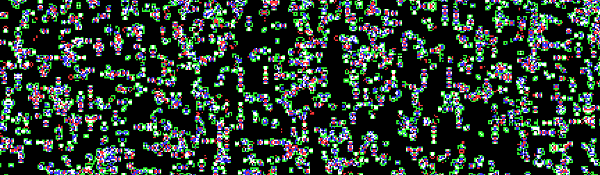

这是我第一篇细胞自动机文章的重写和重要扩展。它涵盖了第一篇文章中的所有内容，外加对多态自动机的大量解释。

现场演示:【https://benpm.github.io/cellarium/ 

我一直对康威的《生命的游戏》这样的细胞自动机很着迷。复杂而有趣的行为可以从简单的规则中产生，这个想法对我很有吸引力。在本文中，我将解释我对一类多态元胞自动机规则进行编码的方法，以及我如何实现我的模拟器。

# 基础知识

细胞自动机本质上是由状态(在我们的例子中是整数)决定的细胞排列，这些状态由**规则**决定。这些规则是将单元及其邻居的状态作为输入，并将单元的新状态作为输出的函数。通过将该规则同时应用于每个单元，我们及时推进了模拟。

对于这项工作，我们将只考虑具有**摩尔邻域**的 **totalistic** 细胞自动机，它包含八个直接相邻的细胞。由于是总计的，这些规则只考虑邻域中每个州的总单元数，而忽略它们的排列。

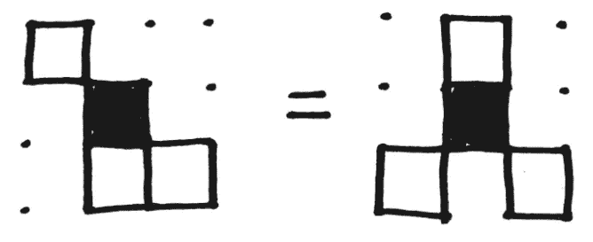

摩尔街区

有了这些定义，我们可以指定一个**规则函数**，F:

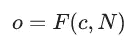

o 是输出状态，c 是当前状态，N 是表示每个可能状态的邻居总数的整数序列:N 的第 I 个元素是状态为 I 的邻居总数，在上面的例子中，c=0，N=(3，3，2)。

首先，让我们考虑两种可能的状态:“开”(1)和“关”(0)，就像《生命的游戏》一样。首先要注意的是，由于邻居总数始终为 8，我们只需考虑(1)个邻居，因为(0)个邻居的数量始终为 8 N1。(我们也可以选择只计算(0)个邻居的数量)。

那么，我们如何表示规则函数，以便在我们的约束下模拟任何双态规则呢？因为我们函数的输入只是整数，所以我们可以用它们来索引一个表，就像这样:

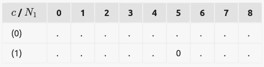

这里，我们有一个包含输出状态的表，这是通过按行(当前状态，c)和列(邻居的数量，N1)查询该表找到的。在上面的例子中，F(1，5)=0，所以如果一个单元的状态是(1)，并且它有五(1)个邻居，它就变成(0)。

让我们试着用这种格式来编码生命的游戏。用英语来说，生活的游戏规则是:

1.  任何单元上的*与两个或三个*单元上的*邻居保持*在**
2.  任何一个*关闭*且三个*打开*的相邻单元打开*打开*
3.  所有其他单元关闭*，包括已经关闭*的单元**

*因此，在 F 的表格表示中:*

*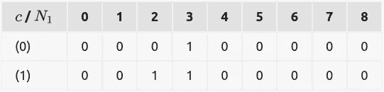*

*简单又好看！现在我们可以开始考虑如何在着色器中使用它。模拟将在整数格式的纹理上进行，我们可以这样访问它:*

```
*// simulate.frag
#version 300 es
uniform highp usampler2D uSim; // Simulation texture
in vec2 vTextureCoord;         // Texture coordinates 0.0 to 1.0void main(void) {
    // Get the current state
    int curstate = int(texture(uSim, vTextureCoord).r); // Determine number of (1) neighbors
    int count = -curstate;
    for (int x = -1; x <= 1; x += 1) {
        for (int y = -1; y <= 1; y += 1) {
            if (v == 1) {
                count += 1;
            }
        }
    }
}*
```

> ****注意:*** *我们将* `*count*` *初始化为* `*-curstate*` *以防止对当前单元格进行计数。也避免了分支，在一个 GPU 上可以很贵，* [*视情况*](https://developer.nvidia.com/gpugems/gpugems2/part-iv-general-purpose-computation-gpus-primer/chapter-34-gpu-flow-control-idioms) *。**

*现在我们有了 c 作为`curstate`和 N1 作为`count`，我们可以从规则中获取我们的下一个状态，它也存储在一个纹理中:*

```
*// simulate.frag
#version 300 es
uniform highp usampler2D uRule; // Rule table
uniform highp usampler2D uSim;  // Simulation texture
in vec2 vTextureCoord;          // Texture coordinates 0.0 to 1.0
out uvec3 fragColor;void main(void) {
    // Get the current state
    int curstate = int(texture(uSim, vTextureCoord).r); // Determine number of (1) neighbors
    int count = -curstate;
    for (int x = -1; x <= 1; x += 1) {
        for (int y = -1; y <= 1; y += 1) {
            if (v == 1) {
                count += 1;
            }
        }
    } uint newstate = texelFetch(uRule, ivec2(count, curstate), 0).r;
    fragColor = uvec3(newstate);
}*
```

> ****注:*** *这里我们用* `[*texelFetch()*](https://www.khronos.org/registry/OpenGL-Refpages/es3.0/html/texelFetch.xhtml)` *代替* `[*texture()*](https://www.khronos.org/registry/OpenGL-Refpages/es3.0/html/texture.xhtml)` *来避免昂贵的浮点转换和片段到纹理的坐标转换。我们不为采样模拟纹理这样做，因为它不支持纹理包裹。**

*为了运行我们的模拟，我们使用两个不同的纹理附加到帧缓冲区，一个作为输出，一个作为输入。通过在每个时间步骤中交替他们的角色，我们期望的结果终于产生了！*

*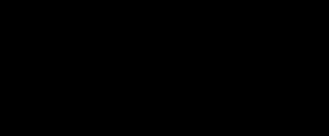*

*一个有趣的双态规则*

*那么这给了我们多少可能的规则呢？c 有 2 个可能的值，N1 有 9 个可能的值(从 0，1，2 到 8，包括 8)。因为 f 只能返回 2 个可能的值，所以可能的规则总数是 22⋅9=262144！不错，但我们可以做得更好…*

# *编码多种状态*

*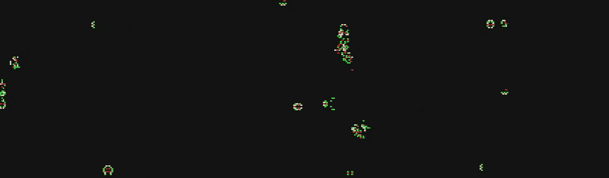*

*虽然两种状态足以产生有趣的行为，但多状态规则可以有[一些](https://en.wikipedia.org/wiki/Brian%27s_Brain) [非常](https://en.wikipedia.org/wiki/Wireworld) [酷](https://en.wikipedia.org/wiki/Codd%27s_cellular_automaton) [属性](https://en.wikipedia.org/wiki/Von_Neumann_cellular_automaton)，所以让我们弄清楚如何高效地编码这些更复杂的规则。*

*首先，让我们想象一下，我们有 3 个状态，而不是 2 个。我们不仅需要一个额外的邻居计数 N2 作为规则函数的输入，而且可能的输入集变得更加细微。例如，如果 N2=4，则(1)和(0)的可能邻居计数受到限制，因为所有邻居计数的总和必须等于 8。换句话说:*

*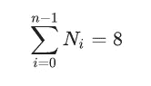*

*在这种情况下，N=(3，4，5)是*无效的*，因为 N 的总和不幸是 12，而不是 8。当然，这也适用于我们的 2 态情况，但我们不必担心它，因为 n0 的值隐式地仅由 n1 定义。*

*那么，考虑到这个属性，我们如何索引我们的规则纹理呢？好吧，让我们先来看看我们可能希望如何将可能的 Ns 映射到索引，通过某种“向上计数”:*

*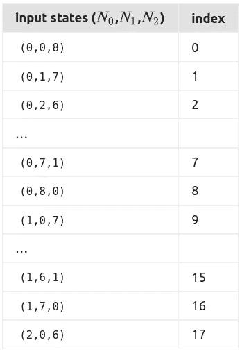*

***首先要注意的是，前 9 个条目的 N0=0，这就像我们只有两个状态。这意味着，如果我们考虑到第四种状态，我们可以把它加到表的末尾。这也意味着我们可以将表的长度(可能的 ns 总数)表示为状态数 n 的函数。***

***一个状态有 1 个可能的输入，两个状态有 9 个，如果我们扩展这个表，我们会发现 3 个状态有 45 个可能的输入。 [OEIS](https://oeis.org/) 告诉我们 1，9，45，…的顺序是(n+78)。注意:8 是我们的目标总和，7 只是 8–1。事实上，(n+S1)是任何目标和 s 的一般形式。***

***那么这些数字从何而来呢？如果我们按州排列可能的输入序列，就很清楚了:***

***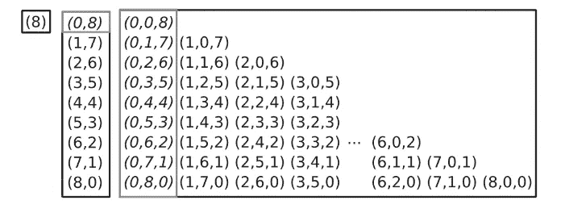***

***既然我们可以计算任意给定长度 n 和目标和 s 的序列的最大索引，我们最终可以计算一个索引。过程是这样的:***

***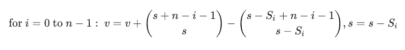***

***…其中，初始化为 0 的 v 是给定序列 s 的计算索引，s 是序列中 I 之后元素的剩余和，它作为我们的目标和开始(对于我们的目的，8)。当我们遍历它时，S 减少了 S 的每个元素的值。***

***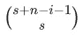***

***是计算最大指数的公式，只是我们计算的是长度为 ni 的序列的最大指数，其总和等于整个序列 s 的余数。***

***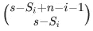***

***提供长度为 ni 的序列的最大索引，其总和为 Si，即元素 Si 之后的剩余总和。***

***取这两个量的差，通过将所有 i***

***For clarity, I’ve also written the algorithm in Python:***

```
***# n: sequence length
# S: the sequence
# s: the integer value which each sequence sums to# The computed index, starts at 0
v = 0# algorithm: Consider each element of the sequence S as a subsequence,
#  where each element is an increasingly smaller subsequence.
#  By summing together the indices of each subsequence, we get the
#  index of the whole sequence. We start with the longest subsequence.
for i in range(n - 1):
    # l: Max index of subsequence that sums to n minus whatever we've seen so far
    l = comb((s) + (n - i - 1), s) 
    # r: Like l, but for sequences that sum to current minus S[i], the element we are considering
    r = comb((s - S[i]) + (n - i - 1), s - S[i])
    # Add l-r, the index of the part of the sequence we've seen so far
    v += ( l - r )
    # Subtract the current sequence element from current sum
    s -= S[i]***
```

***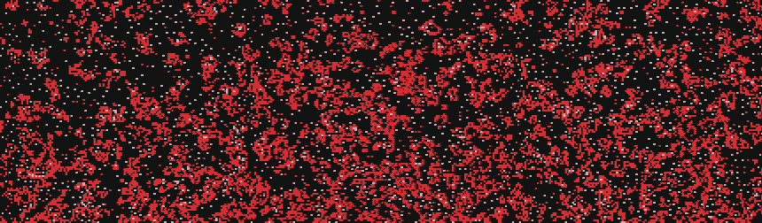***

# ***Implementation***

***To implement this algorithm efficiently in a shader, we need to pre-compute binomial coefficients into a texture:***

```
***function buildBinomial() {
    const data = new Uint32Array(32 * 32);
    data.fill(0);
    for (let n = 0; n < 32; n++) {
        for (let k = 0; k < 32; k++) {
            data[k * 32 + n] = binomial(n, k);
        }
    }
    const binomialTex = this.gl.createTexture();
    this.gl.bindTexture(this.gl.TEXTURE_2D, binomialTex);
    // We use 32-bit unsigned integers because we need to store large numbers
    this.gl.texImage2D(this.gl.TEXTURE_2D, 0, this.gl.R32UI, 32, 32, 0, this.gl.RED_INTEGER, this.gl.UNSIGNED_INT, data);
}***
```

***We access the texture like this, using texelFetch():***

```
***#version 300 esuniform highp usampler2D uBinomial// Returns binomial coefficient (n choose k) from precompute texture
int binomial(int n, int k) {
    return int(texelFetch(uBinomial, ivec2(n, k), 0).r);
}***
```

***Finally, we have everything we need for the final shader!***

```
***// simulate.frag
#version 300 es
precision mediump float;uniform highp usampler2D uSim;   // Input states texture
uniform highp usampler2D uRule;      // The cellular automata rule
uniform highp usampler2D uBinomial;  // Precomputed binomial coefficents
uniform vec2 uSize;                  // Size of simulation canvas in pixels
uniform int uStates;                 // Number of states in this rule (MAX 14)
uniform int uSubIndices;             // Number pf subrule indicesin vec2 vTextureCoord;out uvec3 fragColor;// Returns binomial coefficient (n choose k) from precompute texture
int binomial(int n, int k) {
    return int(texelFetch(uBinomial, ivec2(n, k), 0).r);
}void main(void) {
    int curstate = int(texture(uSim, vTextureCoord).r); // Neighbor counts by state index
    int N[14] = int[](0, 0, 0, 0, 0, 0, 0, 0, 0, 0, 0, 0, 0, 0);
    N[curstate] = -1; // Determine neighbor counts
    for (int x = -1; x <= 1; x += 1) {
        for (int y = -1; y <= 1; y += 1) {
            uint i = texture(uSim, vTextureCoord + (vec2(x, y) / uSize)).r;
            N[i] += 1;
        }
    } // Determine the index of the integer sequence formed by the neighbor counts
    int seqIndex = 0;
    int s = 8;
    for (int i = 0; i < 13; i++) {
        if (N[i] > 0) {
            int x = uStates - i - 1;
            seqIndex += binomial(s + x, s) - binomial(s - N[i] + x, s - N[i]);
            s -= N[i];
        }
    }
    // Compute final index into rule tex given current state and neighbor states
    int ruleIndex = curstate * uSubIndices + seqIndex;
    // Convert 1D rule index into 2D coordinate into rule texture
    uint newstate = texelFetch(uRule, ivec2(ruleIndex % 1024, ruleIndex / 1024), 0).r; fragColor = uvec3(newstate);
}***
```

***Now we have a working shader that simulates arbitrary multi-state cellular automatons! You can see a live demo [这里](https://benpm.github.io/cellarium/)，以及所有源代码[这里](https://github.com/benpm/cellarium)相加，我们得到序列的索引，直到 I。***

***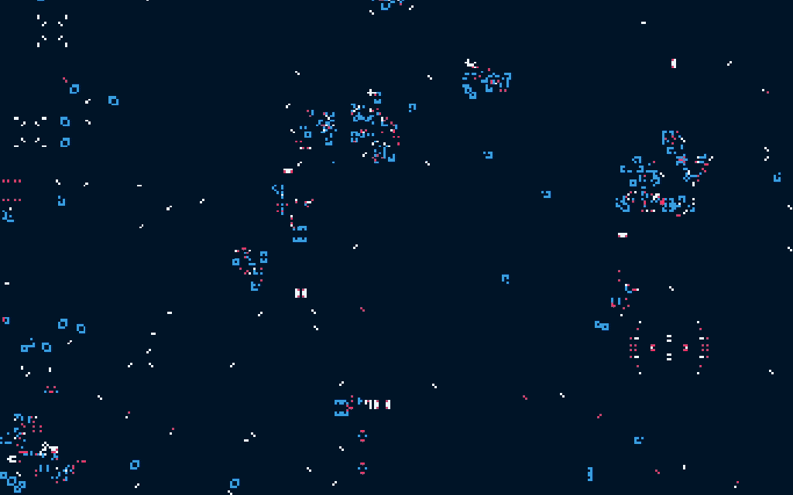*********