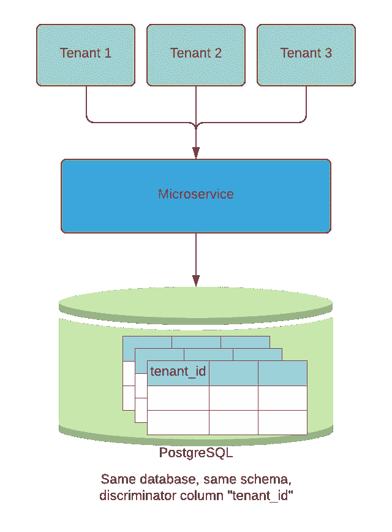
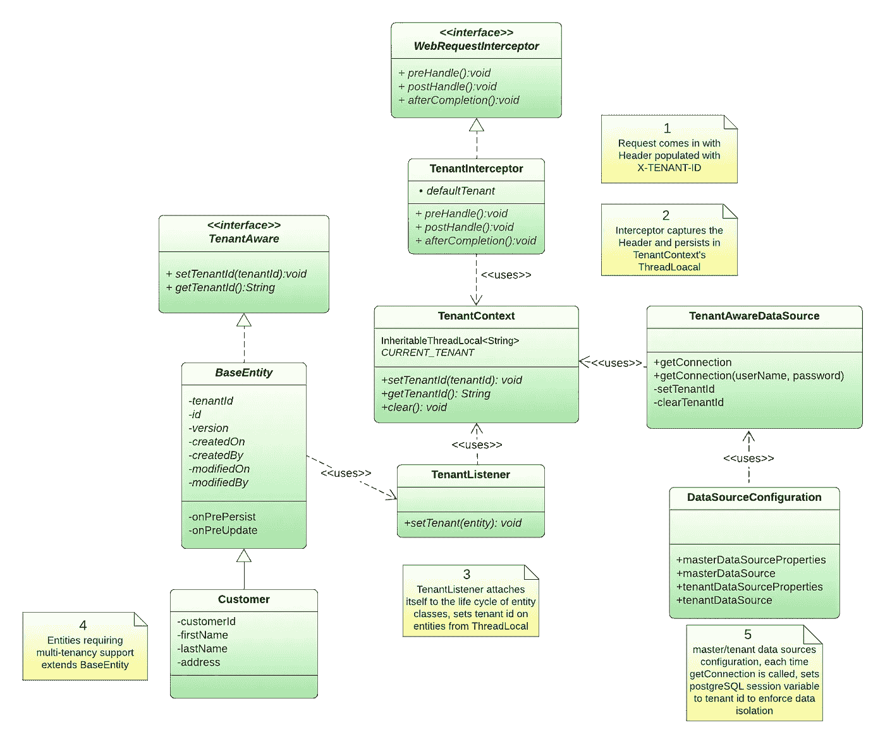

# Spring Boot、Liquibase 和 PostgreSQL 的多租户支持

> 原文：<https://betterprogramming.pub/multi-tenancy-support-with-spring-boot-liquibase-and-postgresql-d41942dc0639>

## 如何实施多租户的分步指南

图片由[不再-这里](https://pixabay.com/users/no-longer-here-19203/)发自 [Pixabay](https://pixabay.com/photos/lavenders-flowers-field-farm-894919/)

# 多租户模型

在微服务中实现多租户有多种模式:

1.  **每个租户的数据库**:每个租户都有自己的数据库，并与其他租户隔离。
2.  **共享数据库，独立模式**:所有租户共享一个数据库，但是有自己的数据库模式和自己的表。
3.  **共享数据库，共享模式**:所有租户共享相同的数据库和模式。共享表有一个包含租户标识符的列，它显示行的所有者。

每种模式都有其优缺点。对于这个故事，我们将关注第三个模型，**共享数据库，共享模式**，共享表有一个带有租户标识符的鉴别器列。见下图。

作者图表

# 数据库中的多租户实现

# 数据隔离:PostgreSQL 行级安全性(RLS)

对于数据隔离，我们将使用 PostgreSQL 行级安全性(RLS)。RLS 是 PostgreSQL 的一个安全特性，它允许数据库管理员定义策略来控制特定数据行如何显示以及如何为一个或多个角色操作。从本质上讲，RLS 是我们可以应用于 PostgreSQL 数据库表的附加过滤器。当用户试图在表上执行操作时，在查询条件或其他筛选之前应用该筛选，并根据安全策略缩小或拒绝数据。我们可以为 SELECT、INSERT、UPDATE 和 DELETE 等特定命令创建行级安全策略。

# 添加鉴别器列

在需要多租户支持的表中，需要添加一个鉴别器列，比如说`tenant_id`。我们将使用一个名为[客户服务](https://github.com/wenqiglantz/multi-tenancy-spring-boot)的演示 Spring Boot 微服务作为例子。这是一个处理客户 CRUD 操作的简单微服务。假设我们需要对客户实体的多租户支持。我们需要添加一个新的 Liquibase 变更集，以将`tenant_id`列添加到 customer 表中，不可为空，见下文:

# 定义行级策略

需要为需要多租户支持的表定义行级策略。两步走:

*   为表启用行级安全性
*   为表定义一个策略，引用`tenant_id`鉴别器列

这两个步骤可以包装在一个 Liquibase 变更集中，如下所示:

# 添加应用程序级数据库用户

对于行级安全性，除了表所有者数据库用户(在客户服务的情况下，是数据库用户`postgres`)之外，我们需要引入一个应用级数据库用户，该用户可以访问租户特定的操作。为什么？默认情况下，行级安全策略**不会**应用于表所有者，因为表所有者必须能够出于管理目的访问所有行。因此，让我们通过添加新的 Liquibase 变更集来添加一个应用程序级别的数据库用户，比如“customerservice”。见下文。下面的示例脚本中的第二个变更集是为了确保将所有现有表的 SELECT、INSERT、UPDATE、DELETE 权限正确地授予“customerservice”用户。第一个变更集中的“`ALTER DEFAULT PRIVILEGES...`”确保所有未来的新表都将那些权限正确地授予“customerservice”。这两个变更集都是必需的。

# 应用程序中的多租户实现

# 高级类图

参见下面的客户服务微服务中多租户实现的类图。在下面的部分中，我们将逐类深入研究。

作者的类图

# 数据源配置

我们需要两个数据源:

*   **主数据源** : Liquibase 为数据库迁移需求寻找主数据源。
*   **租户数据源**:这个数据源是我们微服务的默认数据源。参见下面的代码。注意`tenantDataSource` bean 定义上的`@Primary`注释。

`DataSourceConfiguration`类看起来是这样的:

相应地，`application.yml`中的数据源定义:

# 租户感知数据库连接

有了行级安全策略，每次应用程序向数据源请求连接时，我们都需要将 PostgreSQL 会话变量设置为`tenant_id`来强制数据隔离。当连接关闭时，从 PostgreSQL 会话中清除`tenant_id`。由于每个租户没有单独的数据库用户，我们可以利用定制的*会话参数*，例如`app.tenant_id`，将当前租户与数据库连接相关联。使用 Postgres 特定的 SQL 语句来设置会话参数。

`"SET app.tenant_id TO '" + tenantId + "'"`

见下图`TenantAwareDataSource`类。

# TenantAware 界面

这是多租户实体类需要实现的接口。

# 租户上下文

使用`InheritableThreadLocal`存储/检索/清除当前租户 id。

# JPA 实体列表器

现在，我们如何在每个需要多租户支持的实体类上设置`tenant_id`？看向 JPA `EntityListener`！`EntityListener`允许监听器附加到 JPA 实体的生命周期中。它允许我们用当前租户 id 填充鉴别器列。见下面`TenantListener`类。在更新、删除和保存之前，从`TenantContext` 捕获`tenantId`，并在实体处设置。

*   @PreUpdate:在更新操作之前
*   @PreRemove:在移除实体之前
*   为新实体调用@PrePersis: before persist

# BaseEntity

添加这个实现`TenantAware`接口的类`BaseEntity`，由需要多租户支持的实体进行扩展。注意`@EntityListeners(TenantListener.class)`，使`TenantListener`能够附加到扩展`BaseEntity`的特定实体类的生命周期。

需要多租户支持的实体类现在需要扩展`BaseEntity`。实体类`Customer`示例如下:

# 从客户端应用程序捕获租户 id

现在让我们考虑如何最好地从传入的请求中提取租赁标识符。一个流行的选择是让客户端应用程序发送一个名为`X-Tenant-ID`的 HTTP 头，以传入现有的`tenantId`。然后，我们的微服务读取`X-Tenant-ID`头，并将其值存储在`TenantContext`的`InheritableThreadLocal`中。我们可以像下面这样加一个`TenantInterceptor`。在`preHandle`方法中，我们根据传入的 HTTP 头设置`tenantId` ，如果没有传入，那么`tenantId` 保存默认值“0”。

接下来我们添加`WebConfiguration`来给它注入`TenantInterceptor`。

# 黄瓜 BDD 测试场景

为了验证多租户特性的实现，开发了以下测试场景。正如我们所看到的，租户数据仅被隔离到特定的租户。

样本步骤定义如下:

对于这个故事的完整源代码，请查看[我的 GitHub repo](https://github.com/wenqiglantz/multi-tenancy-spring-boot) 。

编码快乐！手工制作快乐！

## **参考文献**

[https://satoricyber . com/postgres-security/postgres-row-level-security/](https://satoricyber.com/postgres-security/postgres-row-level-security/)

[https://www . byte fish . de/blog/spring _ boot _ multi tenance _ using _ RLS . html](https://www.bytefish.de/blog/spring_boot_multitenancy_using_rls.html)

[https://callista enterprise . se/blogg/teknik/2020/10/24/multi-tenancy-with-spring-boot-part 6](https://callistaenterprise.se/blogg/teknik/2020/10/24/multi-tenancy-with-spring-boot-part6/)

[https://www.baeldung.com/jpa-entity-lifecycle-events](https://www.baeldung.com/jpa-entity-lifecycle-events)