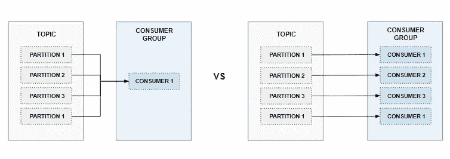
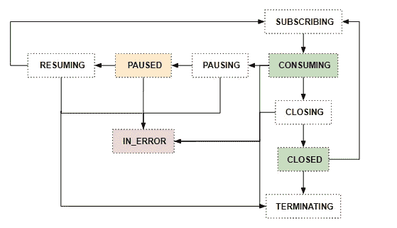

# 具有简单 Apache Kafka 消费者的多线程应用程序

> 原文：<https://betterprogramming.pub/multi-threaded-application-with-simple-apache-kafka-consumers-3d331998cec4>

## Kotlin 中的代码示例


弗朗西斯科·德·诺瓦在 [Unsplash](https://unsplash.com?utm_source=medium&utm_medium=referral) 上拍摄的照片

任何 Kafka 的新工程师第一次尝试做比简单的快速阅读过程-编写更复杂的事情时，他们不可避免地需要解决这样一个事实，即 *KafkaConsumer* 不是线程安全的(参见 [doc](https://kafka.apache.org/31/javadoc/org/apache/kafka/clients/consumer/KafkaConsumer.html) )。

Kafka 的架构方式自然会迫使你通过在一个群体中增加更多的消费者来进行横向扩展。在 Kafka 中，一个主题中的所有记录都被分组到分区中，分区可以独立地写入和读取，而不会影响数据的质量。

因此，如果我们想要更高的处理能力，我们需要更多的分区，并且一个组中至少有同样多的消费者订阅该主题，其中每个消费者是一个单独的线程。(消费者的数量可以大于或等于分区的数量，任何多余的消费者将只是袖手旁观，以防其他消费者中的一个崩溃。)



不过这不是我们将要讨论的多线程。每消费者线程模型是比较容易的。然而，它是基于这样的假设，即大多数用例在记录被消费后会涉及一个简单而快速的处理步骤。在现实生活中，有时我们需要做的不仅仅是给消息添加一两个字段，我们可能需要做一些 I/O 操作、复杂的计算、调用第三方 API，或者与应用程序的其他部分协调。

然后，我们需要定制一些东西来解决库的限制。像任何其他工程问题一样，我们想到的第一个方法不是我们想要最终得到什么，而是让我们从它开始，遵循自然的进程。

# 方法 1 —只使用标志(废话..)

假设我们有一个消费者需要在结束交易时得到通知。当然，我们添加一个简单的标志并在循环中检查它，对吗？

```
...
private final closed = new AtomicBoolean(false);
...// this runs in a separate thread than the main 
try {
   consumer.subscribe(Arrays.asList("topic"));
   while (!closed.get()) {
      val records = consumer.poll(Duration.ofSeconds(1));
      // processing..
   }
} catch (e: Exception) {
   // Ignore exception if closing
   if (!closed.get()) throw e;
} finally {
   consumer.close();
}
```

现在，假设我们使用的应用程序需要在提交前成功完成处理，因此我们关闭了自动提交，并手动控制它。

此外，最重要的是，我们需要使用来自另一个主题的数据来处理来自一个主题的数据，或者将这些数据发送给第三方 API 进行转换，然后我们需要等待结果返回。

所以，我们手上的任务很重，我们继续…自然地添加更多的旗帜。

```
...
private final closed = new AtomicBoolean(false);
private final readyToCommit = new AtomicBoolean(false);
...try {
   consumer.subscribe(Arrays.asList("topic"));
   while (!closed.get()) {
      val records = consumer.poll(Duration.ofSeconds(1));
      // start processing in another thread - call API, stitch data from this topic with another etc..
     while (!readyToCommit.get()) {
      // idle loop?,  maybe add Thread.sleep() or delay()
     }

   }
} catch (e: Exception) {
   // Ignore exception if closing
   if (!closed.get()) throw e;
} finally {
   consumer.close();
}
```

那看起来不太好，是吗？如果我们和其他线程有更多的接触点呢？如果有一个事件需要暂停，将****状态或间歇状态写入一个文件，或者甚至可能关闭消费者但不停止线程以允许它稍后重新加入另一个事件，该怎么办？这将意味着更多的旗帜，更多的错误空间。****

****我想我们都同意使用普通的布尔值来导航这不是最佳的和可伸缩的。让我们进入下一个选项。****

# ****方法 2 —将标志转变为状态机****

****那样会更好吗？如果操作得当，这将为您提供单点控制、访问和故障。这将使代码更易读，错误处理更容易，调试更容易忍受(多线程永远不会)。****

****我们将考虑以下状态:****

```
**enum class State {
   SUBSCRIBING,
   CONSUMING
   PAUSING,
   PAUSED,
   RESUMING,
   CLOSING
   CLOSED,
   TERMINATING,
   IN_ERROR; fun isHealthy(): Boolean {
      return this != IN_ERROR
   }   fun shouldRun(): Boolean {
      return this != TERMINATING
   }     
}**
```

****定义清晰而严密的规则是很重要的，比如什么转换是有效的，什么在多线程的情况下可能发生但可以接受，什么是问题的标志，即什么是正常的流程，什么会被认为是警告，以及什么会引发警报。****

****对于上述状态，我们可以同意以下流程:****

********

****这可以转化为状态机本身的一组规则，类似于:****

```
**class StateMachine {
    companion object {
       private val rules = mapOf(
          **SUBSCRIBING** to Predicate<State> { it == RESUMING || it == CLOSED },
          **CONSUMING** to Predicate<State> { it == SUBSCRIBING },
          **PAUSING** to Predicate<State> { it == CONSUMING },
          **PAUSED** to Predicate<State> { it == PAUSING },
          **RESUMING** to Predicate<State> { it == PAUSED },
          **CLOSING** to Predicate<State> { it == CONSUMING },
          **CLOSED** to Predicate<State> { it == CLOSING },
          **TERMINATING** to Predicate<State> { it == SUBSCRIBING ||
   it == CONSUMING || it == PAUSING || it == PAUSED || it == RESUMING || it == CLOSING || it == CLOSED || it == IN_ERROR }
          **IN_ERROR** to Predicate<State> { it == SUBSCRIBING ||
   it == CONSUMING || it == PAUSING || it == PAUSED || it == RESUMING || it == CLOSING || it == CLOSED }  
        ) fun transitionRuleFor(state: State) {
           return rules[state]|| 
       }
    } private val state = AtomicReference(State.CLOSED) fun transitionTo(newState: State){
         state.getAndUpdate{
            if(transitionRuleFor(newState).test(oldState)) {
               newState 
            } else {
               // handle invalid transitions...
             }
         }
    } }**
```

****使用上述方法，使用者线程的 while 循环可以修改如下:****

```
**...
val state = AtomicReference<StateMachine>(StateMachine())
...while (state.get().shouldRun()) {
   when(state.get()) {
     SUBSCRIBING -> subscribe()
     CONSUMING -> processRecords()
     PAUSING -> pause()
     PAUSED -> doNothing() //well almost, will discuss later 
     RESUMING -> resume()
     CLOSING -> close()
     CLOSED -> doNothing() //maybe add delays if right for the app
     IN_ERROR - > logAndAlert() // any other error handling and either break or attempt a recovery
   }
}// handle successful termination like app TERM on deploy or else**
```

****when 表达式中调用的各个方法应该处理可能的异常和到下一个状态的转换。****

****这段代码应该位于一个包装实际 KafkaConsumer 实例的类中，并作为一个单独的协程启动。对于一个有一个或多个消费者的群体来说，这同样适用。****

# ****方法 3——使用参与者..在状态机的顶部****

****如果使用者类仅从一个其他线程获得事件通知，或者管理器使用发送并忘记策略向多个使用者类发送通知，方法 2 就足够了。****

****然而，如果多线程可以作为需要顺序处理的通知的来源，或者消费者需要向经理发送反馈，那么我们需要卷起袖子，使用更复杂的东西。根据我们处理的是第一种还是第二种情况，我们可能需要仅在管理者端或消费者端实现。****

****为此，除了 State 类之外，我们还需要创建一个将通过通道发送的消息类的层次结构。我们可以有一个由管理器使用的 *ControlMessage* 类来控制消费者类的工作流，还有一个由消费者类使用的 *FeedbackMessage* 类来通知管理器所请求的操作已经完成或者发生了错误。****

```
**sealed class Message {
   sealed class ControlMessage: Message() {
      class SubscribeMessage(topics: List<String>): ControlMessage()
      object CloseMessage: ControlMessage()
      object PauseMessage: ControlMessage()
      object ResumeMessage: ControlMessage()
      object TerminateMessage: ControlMessage()
   }sealed class FeedbackMessage(consumer: Consumer): Message() {
      class SubscribedMessage(c: Consumer): FeedbackMessage(c)
      class ClosedMessage(c: Consumer): FeedbackMessage(c)
      class PausedMessage(c: Consumer): FeedbackMessage(c)
      class ConsumingMessage(c: Consumer): FeedbackMessage(c)
      class TerminatedMessage(c: Consumer): FeedbackMessage(c)
      class InErrorMessage(c: Consumer, e: Exception): FeedbackMessage(c)
   }
}**
```

****如果我们需要不止一个实现，如上所述，最好有一个创建通道的工厂。****

```
**class ChannelFactory {
   fun createChannel(consumer: Consumer<Message>): SendChannel<Message> {
      return object: CoroutineScope {
         override val coroutineContext = Dispatchers.Unconfined + Job()
         val channel = actor<Message> {
            for(message in channel) {
                consumer.accept(message)
            }
         }
       }.channel
   }
}**
```

****对于消费者类，通道中的消息处理将如下所示(类似于经理类，但具有 FeedbackMessage 层次结构)。****

```
**val consumer = Consumer<Message> { message ->
   when (message) {
       is SubscribeMessage -> subscribe(message.topics)
       is CloseMessage -> close()
       is PauseMessage -> pause()
       is ResumeMessage -> resume()
       is TerminateMessage -> terminate()
    }
}val channel = channelFactory.createChannel(consumer)**
```

****这里棘手的一点是在发送任何消息之前对其进行初始化，因为消费者类需要访问管理器的通道来发送反馈，反之亦然——管理器需要访问消费者类的通道。****

****如果你关注了我们讨论的场景，你可能已经有一些问题了。其中一个可能是——你如何防止消费者在长时间没有提交并且心跳发送到卡夫卡的情况下被踢出群体？****

****在解决这个问题之前，我们需要了解三种 kafka 消费者配置:****

*   ****`session.timeout.ms` —定义代理在认为客户端不活动之前等待的最长时间。之后，客户端从组中删除，并触发重新平衡。**默认值为 45s** ，但是任何值都应该在`group.min.session.timeout.ms` 和`group.max.session.timeout.ms` *、*之间，这些都是代理端的配置。****
*   ****`heartbeat.inteval.ms`—定义预期发送心跳的频率。默认值为 3s ，但任何值都应低于`session.timeout.ms`且不高于其 1/3。****
*   ****`max.poll.interval.ms`—定义调用`poll()`之间的最大延迟。如果在这段时间后没有轮询到新记录，则认为消费者失败，并触发重新平衡，以便将分区重新分配给组中的另一个成员。默认值为 5 分钟。对于使用非空的`group.instance.id`的用户，当超时到达时，分区不会立即被重新分配，而是在`session.timeout.ms`到期后才被重新分配。这反映了已经关闭的静态消费者的行为。****

****因此，基本上心跳必须每隔`heartbeat.interval.ms` 发送一次，否则在`session.timeout.ms`之后，代理认为客户端已经死亡，并将其踢出，重新平衡，然后继续前进。****

****有了 Java 库，有一个线程在后台为您处理这个问题，但是只有当您在`max.poll.interval.ms`中轮询时，也就是说，只要处理速度很快，新记录轮询的频率足够高，心跳根本就不用担心。****

****但是，上面的场景假设长时间运行的复杂处理可能会超过 5 分钟的超时时间。****

****有一些显而易见的解决方案，比如优化代码或增加配置时间。然而，前者可能是不可能的或不够的，而后者是相当危险的，因为它会阻止我们足够快地发现故障。****

****请记住，我们还说过，在提交之前，我们需要确保处理已经成功完成。所以，我们需要另一种选择。****

****好消息是，我们已经完成了一半——我们有一个暂停状态和/或暂停消息。解决方案是在一个单独的线程中执行长时间运行的处理任务时暂停。暂停时，在消费者线程中，保持安全轮询(并保持发送心跳),实际上不会返回任何记录。是的，这增加了一个线程，但它是值得的。****

****现在，我们的第二种状态机方法的结果是:****

```
**...
while (state.get().shouldRun()) {
   when(state.get()) {
     ...
     CONSUMING -> pollStartThreadToProcessAndSetToPausing()
     PAUSING -> pause()
     PAUSED -> keepPollingAndVerifyNothingPolled()  
     ...
   }
}
...**
```

****或者，记录可以被缓冲，直到管理器暂停以开始长时间运行的处理。****

```
**...
while (state.get().shouldRun()) {
   when(state.get()) {
     ...
     CONSUMING -> pollAndBufferRawOrTransformedRecords()
     PAUSING -> pauseAndStartThreadForProcessing() 
     PAUSED -> keepPollingAndVerifyNothingPolled()  
     ...
   }
}
...**
```

****如果我们在它的上面有 actor 层，对它的改变是容易的，因为繁重的负载是由状态机部分完成的，我们只需要通知消费者类它需要移动到的状态(注意，这只适用于缓冲的情况)。****

****嗯，这不是很有趣吗？让我知道你是否尝试过，以及你觉得有多容易或多难。你遇到了什么问题？****

****编码快乐！****