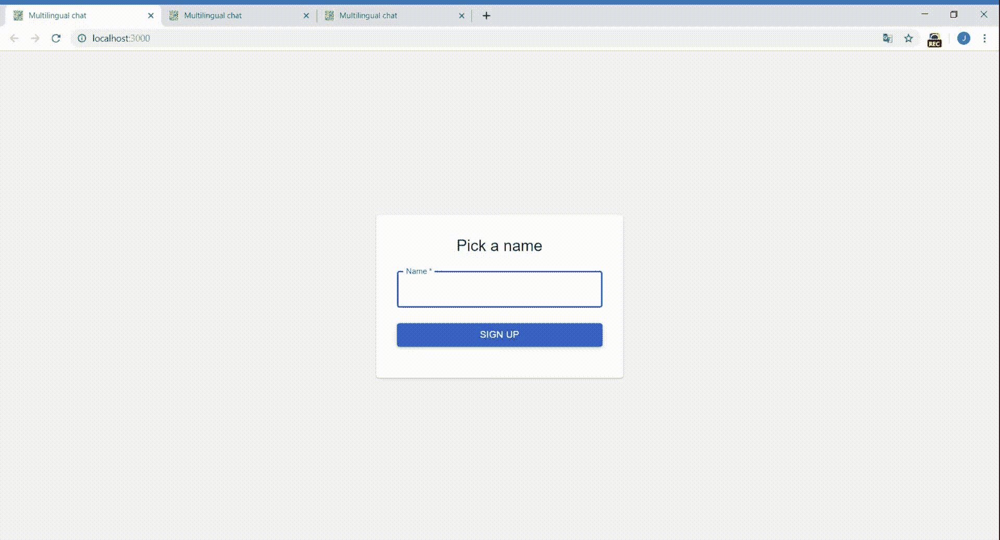

# 带有 AWS 翻译和反应的多语言实时聊天

> 原文：<https://betterprogramming.pub/multilingual-real-time-chat-with-aws-translate-react-99401e103532>

## 构建解决方案，帮助消除语言障碍

语言障碍一直是一个真正的问题，尤其是如果你必须快速沟通。如果你每天都需要和来自世界不同地方的人交谈，你肯定知道我的意思。

幸运的是，现在我们有一些非常酷而且非常准确的翻译服务，我们可以将它们投入到工作中，让生活变得更加轻松。不需要字典和逐句翻译。让我们构建一个解决方案，在 Amazon Translate 的帮助下完成这项工作。它有 25 种语言可用，非常容易使用，并且有精美的 API 文档。

我们的解决方案将看起来像下面的视频。我们有三个人，分别来自英国、德国和波兰，说他们的母语没有任何问题，因为它会自动翻译。你所要做的就是选择一个登录名和一种你想要使用的语言。

为了进行聊天，我们将使用 React 和 Material-UI 作为前端和 Node.js 和 Socket。后端的 IO。让我们从构建我们的极简服务器开始。它将主要包括两个部分:使用的事件和 HTTP 和 WebSocket 服务器的定义。我们的服务器将使用七个不同的事件。

事件. js

为了连接到 AWS，我们需要创建一个帐户并为应用程序生成一个访问密钥。以下是一些关于使用 AWS IAM 创建新帐户和生成访问密钥的精彩文章:

*   [https://docs . AWS . Amazon . com/IAM/latest/user guide/getting-started _ create-admin-group . html](https://docs.aws.amazon.com/IAM/latest/UserGuide/getting-started_create-admin-group.html)
*   [https://docs . AWS . Amazon . com/general/latest/gr/managing-AWS-access-keys . html](https://docs.aws.amazon.com/general/latest/gr/managing-aws-access-keys.html)

Dotenv 是一个存储机密信息的伟大图书馆。您所要做的就是将它们放入一个在 GIT 中没有版本控制的. env 文件中。这是放置 AWS 访问键的好地方。

该应用程序的一个关键部分是通过 WebSockets 建立通信。它允许你实时通知每个成员发生了什么。我们将使用插座。IO 是一个非常棒的库，它使得 WebSockets 非常容易设置。

server.js

我们将连接的用户存储在一个`Map`中。它比标准的 JavaScript 对象更适合这项工作，因为它更便于迭代。

应用程序最重要的部分从第 82 行开始。当我们从用户那里收到一条新消息后，我们必须根据他们选择的语言为所有其他人翻译这条消息。如果需要新的翻译(有人说不同的语言)，我们必须调用 AWS Translate 并收集结果。API 非常简单，我们所要做的就是调用`translateText`方法并等待结果。

后端似乎工作正常，所以我们可以继续进行前端部分。我们需要允许用户在使用聊天之前选择语言和名称。我们还需要留意传入的消息和聊天成员的变化。这些都是应用程序状态的一部分。

App.js

应用程序的一个重要初始化部分是设置 WebSocket 通信。我们只使用`useEffect`钩子触发它一次，没有任何依赖性。

我们已经启动并运行了最重要的部分。现在，我们可以与任何人实时交谈，而不用担心语言障碍。不错！

此处提供了该应用程序的完整源代码:

 [## jkapuscik 2/多语言聊天

### 此时您不能执行该操作。您已使用另一个标签页或窗口登录。您已在另一个选项卡中注销，或者…

github.com](https://github.com/jkapuscik2/multilingual-chat) 

# 资源

*   [https://docs . AWS . Amazon . com/translate/latest/DG/what-is . html](https://docs.aws.amazon.com/translate/latest/dg/what-is.html)
*   【https://aws.amazon.com/iam/ 
*   [https://socket.io/docs/emit-cheatsheet/](https://socket.io/docs/emit-cheatsheet/)