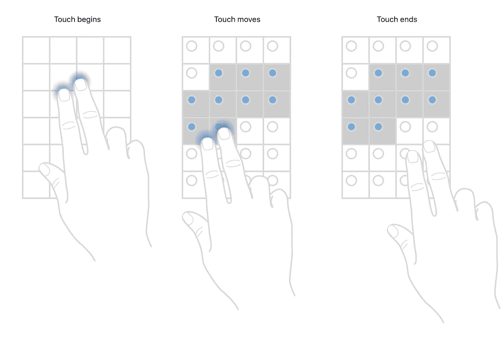
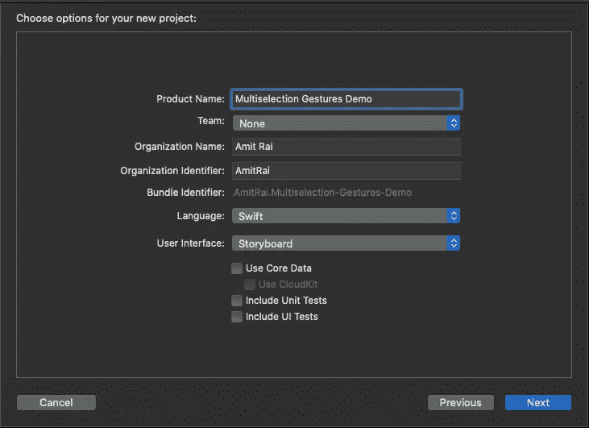
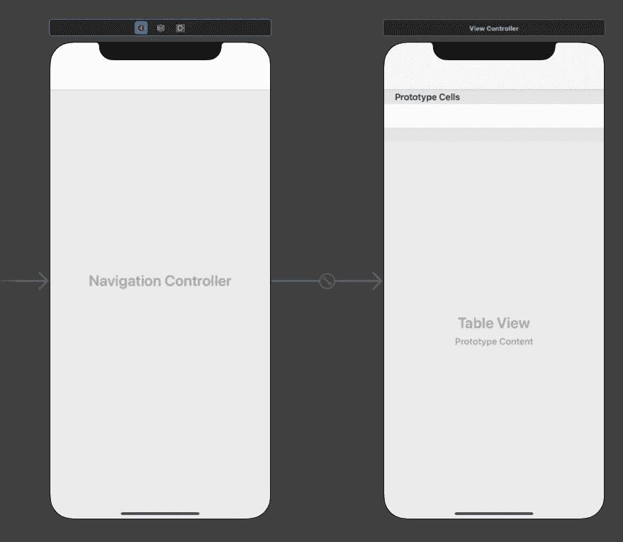
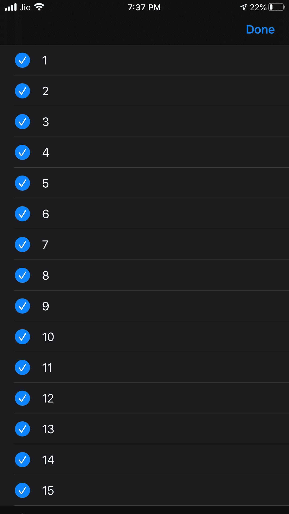

# iOS 13 中 TableView 和 CollectionView 上的多种选择手势

> 原文：<https://betterprogramming.pub/multiple-selection-gestures-on-tableview-and-collectionview-in-ios-13-77144506b742>

## 表和集合视图上的多选手势


由[耶稣·基特克](https://unsplash.com/@jesuskiteque?utm_source=unsplash&utm_medium=referral&utm_content=creditCopyText)在 [Unsplash](https://unsplash.com/s/photos/coding?utm_source=unsplash&utm_medium=referral&utm_content=creditCopyText) 上拍摄的照片

WWDC 2019 引入了 UITableViewCell 的新功能。现在，您可以让您的应用程序用户能够在表格和集合视图上使用双指平移手势选择多个项目。这允许用户快速选择多个项目。

> ***如果你正在准备你的技术编码面试，或者你想学习递归来提高你解决问题的技能，那么你应该查看这个 udemy 课程*** [**递归大师班，从 C++**](https://www.udemy.com/course/master-the-recursion-from-beginner-to-advance-level/?referralCode=75F57675BDABF6D104C0) ***的初级到高级水平，或者你可以在***[***Skillshare***](https://skl.sh/3PTOCns)***上查看这个递归课程。***
> 
> **如果你想从初学者到专家水平学习 ARKit 3，然后点击** [**这里**](https://www.udemy.com/course/ios-13-swift-5-the-complete-arkit-3-course/?couponCode=FORCREATOR) **获得课程，你还将获得 97%的折扣。**
> 
> **如果你对学习 iOS 移动开发充满热情，并希望将你的 iOS 开发技能提升到一个新的水平，那么使用 CloudKit framework 的核心数据应该是你的首选。点击** [**此处**](https://www.udemy.com/course/mastering-coredata-with-cloudkit-in-swift-5-for-ios/?couponCode=FORDEVS) **获取课程，还可享受 97 折优惠。**
> 
> **从头开始学习 SwiftUI 点击** [**此处**](https://www.udemy.com/course/swiftui-the-complete-course-building-real-world-apps/?couponCode=FORCODERS) **获取课程，因为在本课程中，我们将使用 SwiftUI 构建许多应用，如脸书克隆、新闻应用、笔记应用等等。**

# 这篇文章的目的

*   这篇文章的目的是让你理解多选手势在`tableView`和`CollectionView`中是如何工作的。
*   我们将在带有示例 iOS 应用程序的`tableView`上实现这个新特性。

# 理解多重选择手势

在 iOS 13 中，拥有这一功能的应用可以让用户快速选择多个项目。例如，当`tableView`识别双指平移手势时，应用程序可以自动将表格视图置于编辑模式，用户不需要点击编辑或选择按钮。

若要选择多个项目，请在您想要选择的项目上拖移两个手指。当视图识别双指平移手势时，它会切换到编辑模式，允许您选择多个项目。



图片取自[苹果文档](https://developer.apple.com/documentation/uikit/uitableviewdelegate/selecting_multiple_items_with_a_two-finger_pan_gesture)

# 示例 iOS 应用程序入门

打开 Xcode 并创建一个新的 Xcode 项目。在 iOS 模板部分选择单视图应用程序，然后单击下一步。


输入您的产品名称，单击下一步，然后在桌面上创建它。



# 履行

跳到`Main.storyboard`，删除默认`ViewController`。从对象库中取出一个`TableViewController`并嵌入到`NavigationController`中。接下来，进入属性检查器，选中`NavigationController`的`Is Initial View Controller`框。



Main.storyboard 看起来像这样

现在跳到`ViewController.swift`并确保你的`ViewController`是从`UITableViewController`继承的。

# 在表格视图中实现多重选择

```
navigationItem.rightBarButtonItem = editButtonItem
tableView.allowsMultipleSelectionDuringEditing = **true**
```

为了在`TableView`上使用多重选择，我们启用`TableView`属性，将`allowsMultipleSelectionDuringEditing`设置为 true，并在`navigationItem`中添加编辑按钮。

# 导入委托方法

```
// 1**override** **func** tableView(**_** tableView: UITableView, shouldBeginMultipleSelectionInteractionAt indexPath: IndexPath) -> Bool {**return** **true**}// 2**override** **func** tableView(**_** tableView: UITableView, didBeginMultipleSelectionInteractionAt indexPath: IndexPath) {**self**.setEditing(**true**, animated: **true**)}// 3**override** **func** tableViewDidEndMultipleSelectionInteraction(**_** tableView: UITableView) {print("\(**#function**)")}
```

1.  询问委托用户是否可以使用双指平移手势在表格视图中选择多个项目。我们返回 true，因为用户可以使用双指平移手势。
2.  告知委托用户何时开始使用双指平移手势在表格视图中选择多行。启用编辑模式是为了标记多重选择。
3.  告知委托用户何时停止使用双指平移手势在表格视图中选择多行。

# 建造并运行！



若要在模拟器上使用手势，请按住 option 和 shift 键拖移触控板。

委托方法也适用于`CollectionView`。

# 结论

这就是这篇报道新的 iOS 13 功能`tableView`上的两个平移手势的内容。在您的 iOS 应用程序中实现这一新的 iOS 13 功能，使用户能够快速选择多个项目。

# 源代码

你可以在 [Github](https://github.com/Amitrai011/Multiselection-Gestures-Demo) 上找到完整的项目。

> ***如果你正在准备你的技术编码面试，或者你想学习递归来提高你解决问题的技能，那么你应该查看这个 udemy 课程*** [**递归大师班，从 C++**](https://www.udemy.com/course/master-the-recursion-from-beginner-to-advance-level/?referralCode=75F57675BDABF6D104C0) ***的初级到高级水平，或者你可以在***[***Skillshare***](https://skl.sh/3PTOCns)***上查看这个递归课程。***

# 额外资源

> **如果你想从初学者到专家水平学习 ARKit 3，然后点击** [**这里**](https://www.udemy.com/course/ios-13-swift-5-the-complete-arkit-3-course/?couponCode=FORCREATOR) **获得课程，你还将获得 97%的折扣。**
> 
> **如果你对学习 iOS 移动开发充满热情，并希望将你的 iOS 开发技能提升到一个新的水平，那么使用 CloudKit framework 的核心数据应该是你的首选。点击** [**此处**](https://www.udemy.com/course/mastering-coredata-with-cloudkit-in-swift-5-for-ios/?couponCode=FORDEVS) **获取课程，还可享受 97 折优惠。**
> 
> **从头开始学习 SwiftUI 点击** [**此处**](https://www.udemy.com/course/swiftui-the-complete-course-building-real-world-apps/?couponCode=FORCODERS) **获取课程，因为在本课程中，我们将使用 SwiftUI 构建许多应用，如脸书克隆、新闻应用、笔记应用等等。**