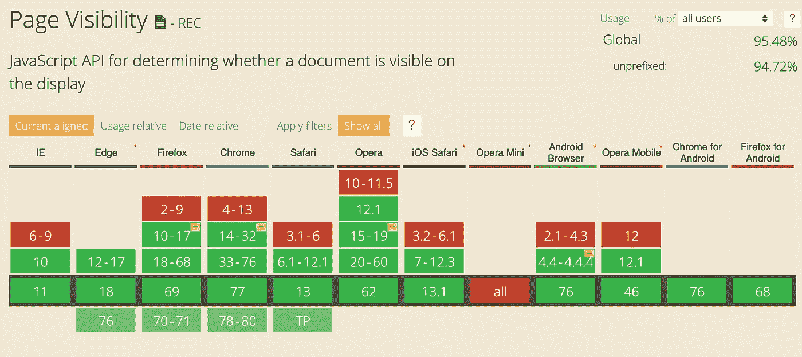
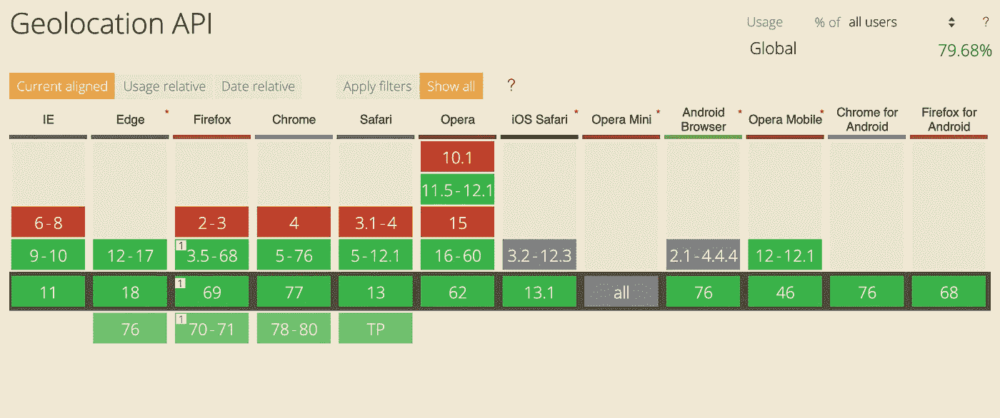
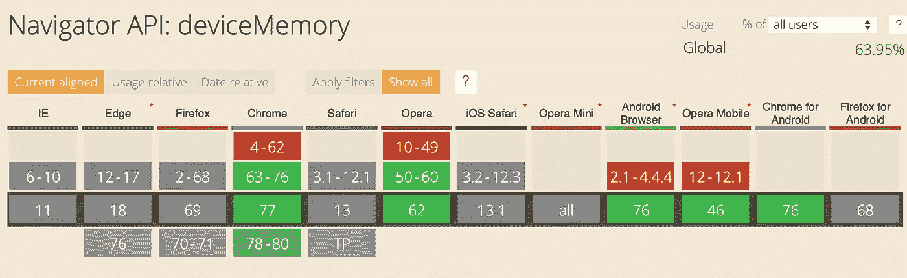
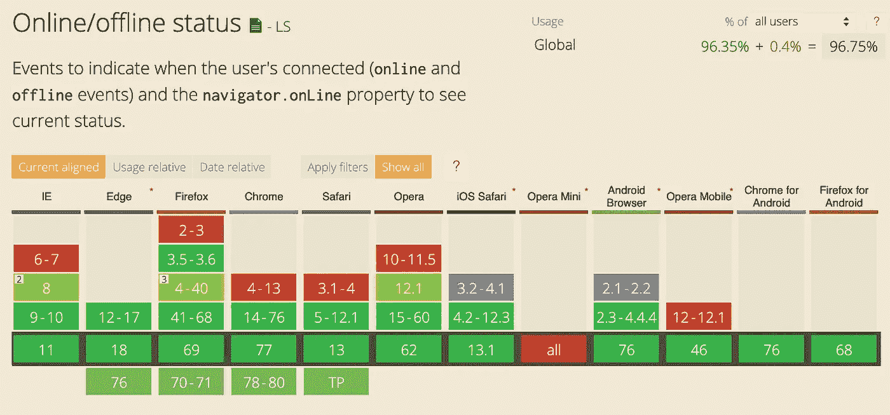
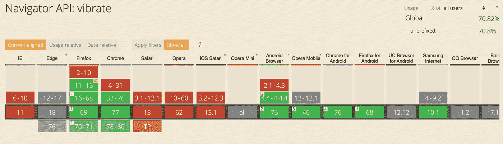
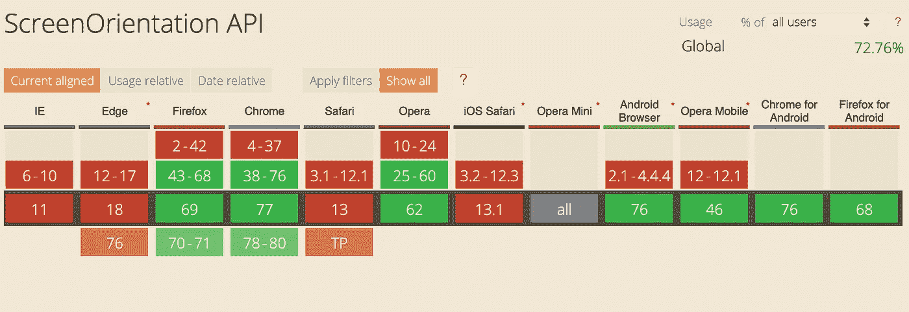
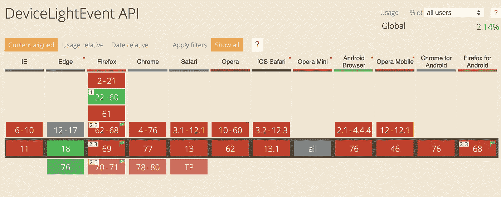
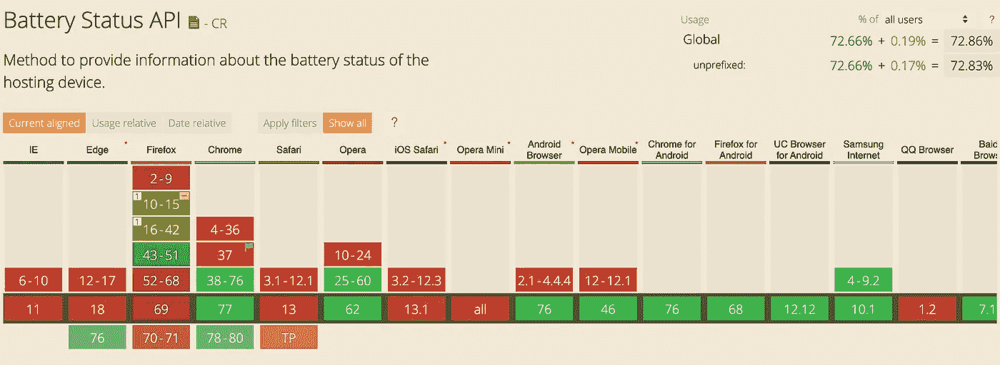

# 为了获得更好的 UX，您应该使用的 Web APIs

> 原文：<https://betterprogramming.pub/must-have-web-apis-for-better-ux-34af6747cb8f>

## 您现在应该使用的简单而有用的 web APIs


背景图片由 [Jesus Kiteque](https://unsplash.com/@jesuskiteque?utm_source=unsplash&utm_medium=referral&utm_content=creditCopyText) 在 [Unsplash](https://unsplash.com/s/photos/web-design?utm_source=unsplash&utm_medium=referral&utm_content=creditCopyText) 上拍摄

Web APIs 是一些最强大的工具，可以利用浏览器的功能，为用户提供与本地应用一样好的体验。在本文中，我们将探索一些最有用的 web APIs，您可能听说过，也可能没有。无论哪种方式，这些都是你绝对应该用来优化你的应用程序以改善用户体验的 API。我们几乎进入了下一个十年。如果你还没有意识到，如果你想让你的产品存活下来，用户体验真的很重要。

注意:其中一些 API 仍在开发中，或者在某些浏览器中不受支持。在使用它们之前，请务必阅读完整的文档。

# 页面可见性

我们大多数人可能都使用过`blur` 或`focus` 事件上的***对象来检测用户当前是否在页面上。但是这个 API 不能检测用户在不使用时是否还能看到页面，比如在同一个屏幕上打开两个窗口。页面可见性 API 通过告诉你页面何时可见或隐藏来解决这个问题。一个用例是当页面显示给用户时刷新页面内容，即使它不是焦点。***

```
***window.addEventListener('visibilitychange', ()=>{
if(document.hidden){
    console.log('Page Hidden');
} else{
    console.log('Page Shown');
}
});***
```

***`visibilityState`属性提供了四个不同的值:`visible`、`prerender`、`hidden`和`unloaded`。下面是浏览器兼容性:***

******

***信息提供者-[caniuse.com](https://caniuse.com/#search=pagevisibility)***

# ***演讲***

***这是一个很酷的 API，可以用来给你的网页添加一个文本到语音的过程。[Speech synthesis](https://developer.mozilla.org/en-US/docs/Web/API/SpeechSynthesis)*是 [Web Speech API](https://developer.mozilla.org/en-US/docs/Web/API/Web_Speech_API/Using_the_Web_Speech_API) 的一个接口，具有多种可定制的属性，如一组说话声音、语速、音调等。对于带有默认选项的最简单的实现，您只需要三行代码:****

```
***let synth = window.speechSynthesis;
let speakthis = new SpeechSynthesisUtterance('hello world');
synth.speak(speakthis);***
```

***对于自定义，您可以单独设置每个属性:***

```
***let voices = synth.getVoices();
speakthis.voice = voices.find( voice => voice.name === 'Monica');
speakthis.rate = 0.5;
speakthis.pitch = 0.4;
synth.speak(speakthis);***
```

***有些声音只在某些浏览器中可用；除此之外，支持看起来不错:***

******

***信息提供者-[caniuse.com](https://caniuse.com/#search=SpeechSynthesis)***

# ***地理定位***

***[地理定位 API](https://developer.mozilla.org/en-US/docs/Web/API/Geolocation_API) 是一个非常简单而强大的 API，用于从浏览器获取用户的当前位置。它给你经纬度坐标，只能在安全的环境下使用(HTTPS)。最简单的使用方法是使用`getCurrentPosition` 方法:***

```
**navigator.geolocation.getCurrentPosition((position) => {
  console.log(position.coords.latitude, position.coords.longitude);
});**
```

**这个方法会给你用户的经纬度坐标。它还有一个名为`watchPosition` 的方法，可以用来检测位置*的变化。*当你想利用用户的位置给出准确的信息时，这个 API 会非常有用。它有一些额外的属性，如准确性和高度，可以与纬度-经度一起使用。示例用例可以包括在地图上显示最近的事件或在表单上自动填充位置信息。**

**它在所有现代浏览器上都得到普遍支持:**

****

**信息提供者-[caniuse.com](https://caniuse.com/#search=geolocation)**

# **导航器.设备内存**

**[这个 API](https://developer.mozilla.org/en-US/docs/Web/API/Navigator/deviceMemory) 可以用来检测用户在设备上的内存量。在这种情况下，内存是指安装的 RAM，而不是实际可用的内存。如果您想要检查用户的设备是否能够支持繁重的功能并相应地调整用户体验，这将非常有用。就像地理定位一样，它只能在 HTTPS 使用。使用起来非常简单:**

```
**console.log(navigator.deviceMemory);**
```

**有一个上限值和下限值的阈值来保护非常低端或高端设备的用户。因此，如果您有一台 16GB 内存的笔记本电脑，它将只返回 8。可能的值有`***0.25***` ***，*** `***0.5***` ***，*** `***1***` ***，*** `***2***` ***，******，*** 和`***8***`。这是一项试验性功能，目前对浏览器的支持有限:**

****

**信息由- caniuse 提供。 [com](https://caniuse.com/#search=deviceMemory)**

# ****在线状态****

**如果你正在运行一个 web 应用程序，知道用户何时失去网络连接对于提供良好的用户体验来说非常方便。例如，当用户点击表单的提交按钮时，您可能想要发送一封电子邮件并将他们重定向到另一个页面。这个 API 可以帮助解决这种情况。想象一下，用户在加载页面后失去了互联网连接；浏览器会将他们带到失去网络连接页面。您可以通过检查用户点击按钮时是否有网络连接来防止这种情况发生。或者更好的是，你可能希望在你的页面上显示“没有网络连接”的信息，就像所有现代的移动应用程序一样。**

**当您想要检查特定事件的按钮点击状态时，您可以使用一行程序，如:**

```
**console.log(navigator.onLine ? 'online' : 'offline');**
```

**或者，如果您想一直收听事件:**

```
**window.addEventListener('offline',networkStatus);
window.addEventListener('online',networkStatus);function networkStatus(e){
console.log(e.type);
}**
```

**以下是该 API 的浏览器兼容性:**

****

**信息提供者-[caniuse.com](https://caniuse.com/#search=online)**

**还有一个[网络信息 API](https://developer.mozilla.org/en-US/docs/Web/API/Network_Information_API) ，可用于检测用户当前使用的网络连接类型(wifi、蜂窝等。).**

# **震动**

**[振动API](https://developer.mozilla.org/en-US/docs/Web/API/Vibration_API) 可以用来在网页上给出触觉反馈。它让你能够访问设备的振动功能。这对于在浏览器上运行的游戏非常有用，甚至对于在表单域出错的情况下向用户提供反馈也非常有用。该 API 使用起来非常简单:**

```
**// vibrate for one second
navigator.vibrate(1000);// turn of vibration
navigator.vibrate(0);// vibrate in a pattern => [vibrate,wait,vibrate,wait,vibrate]
navigator.vibrate([500,400,700,400,6000]);** 
```

**注意:如果用户没有点击框架或任何嵌入的框架，对`navigator.vibrate` 的调用将立即返回`false`。**

**你可以在这里找到一些很酷的主题振动模式的代码，比如马里奥、星球大战等等。遗憾的是，目前浏览器支持有限:**

****

**信息提供者-[caniuse.com](https://caniuse.com/#search=vibrate)**

# **方向**

**检测方向对于保持响应速度和提供更好的用户体验非常有帮助。有两个主要的 API 可以帮助获得这些信息。**

**第一个是[deviceorientionevent](https://developer.mozilla.org/en/docs/Web/API/DeviceOrientationEvent)，这是一个实验性的 API，使用之前要小心。这个 API 提供了三个有用的值:**

*   **`alpha`表示设备绕 z 轴的运动，以度数表示，取值范围为 0 到 360。**
*   **`beta`值代表设备绕 x 轴的运动，以度表示，取值范围为-180 至 180。这表示设备的前后运动。**
*   **`gamma`值代表设备绕 y 轴的运动，以度数表示，取值范围为-90°到 90°。这表示设备从左到右的运动。**

**用法非常简单:**

```
**window.addEventListener('deviceorientation', function(event) {
  console.log(event.alpha + ' : ' + event.beta + ' : ' + event.gamma);
});**
```

**来自 MDN 的警告:目前，Firefox 和 Chrome 处理坐标的方式不同。在对它们使用 API 时要注意这一点。**

**此 API 的一个示例用例是基于设备方向旋转 3D 图像或徽标。到目前为止，浏览器支持看起来也不错:**

****

**信息提供者-[caniuse.com](https://caniuse.com/#search=deviceorientation)**

**另一个可以用来检测方向的 API 是[屏幕。这是一个非常简单的 API，包含两个主要属性:](https://developer.mozilla.org/en/docs/Web/API/Screen/orientation)**

*   **`type` 根据屏幕方向返回`portrait-primary`、`portrait-secondary`、`landscape-primary`或`landscape-secondary`之一的。**
*   **`angle`返回设备的旋转角度。Eg- 0，90 等。**

**对该 API 的支持是有限的，如下所示:**

****

**信息提供者-[caniuse.com](https://caniuse.com/#search=screenorientation)**

# **设备照明事件**

**[DeviceLightEvent](https://developer.mozilla.org/en-US/docs/Web/API/DeviceLightEvent) API 从光电传感器或类似的检测器获取关于设备附近环境光线水平的信息。这在一些用例中非常有用，比如在你的网页上调整亮度或者切换到黑暗模式。但是 MDN 的另一个缺点是:这是一项实验性技术。在生产中使用之前，请仔细检查浏览器兼容性表。**

**该 API 使用起来非常简单:**

```
**window.addEventListener('**devicelight**', function(event) {
  console.log(event.value);
});**
```

**我在 Firefox 上检查了一下，它确实对关灯和把手靠近摄像头等事件做出了反应。如果浏览器兼容性得到改善，这种方便的 API 会有大量的应用；同时，以下是截至 2019 年 10 月的浏览器支持:**

****

**信息提供者-[caniuse.com](https://caniuse.com/#search=devicelight)**

# **电池状态**

**[电池状态 API](https://developer.mozilla.org/en/docs/Web/API/Battery_Status_API) 允许你获取移动或桌面设备的电池信息。例如，当电池电量不足时提醒用户，或者当电池电量低于某一水平时保存用户数据。但是在你使用它之前，这里有一个来自 MDN 的免责声明:**

> **不再推荐使用此功能。虽然一些浏览器可能仍然支持它，但它可能已经从相关的 web 标准中删除，可能正在被放弃，或者可能只是出于兼容性的目的而保留。**

**如果您仍然决定继续使用它，这个 API 非常简单。`navigator`对象上的`getBattery()`方法是一个承诺，它将为您提供`battery`对象，您可以在其上设置事件监听器。**

```
**navigator.**getBattery()**.then(**battery** =>{
console.log(`${battery.level * 100}%`);
 **battery**.addEventListener('**levelchange**', ()=> {
   console.log(`${this.level*100} %'`);
   });
});**
```

**API 包含许多其他方法来检测充电、放电、充电时间等。但是，如上所述，要小心使用它，因为浏览器可能会随时取消对 API 的支持。这是电池状态的浏览器兼容性。要查找其他电池 API 兼容性，请访问图像描述中给出的链接:**

****

**信息提供者-[caniuse.com](https://caniuse.com/#search=battery)**