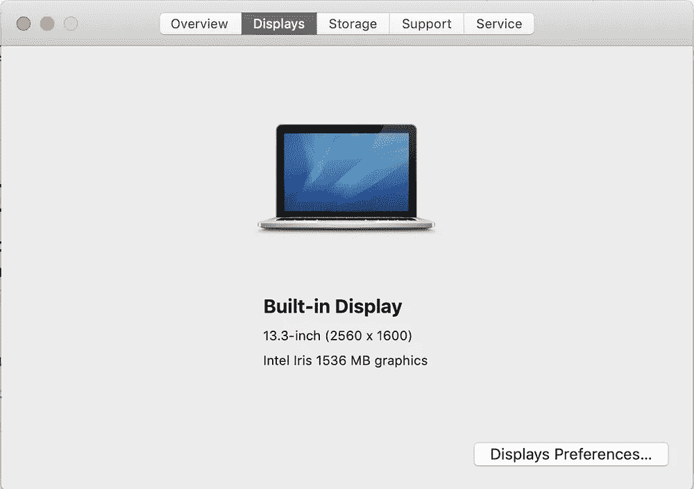
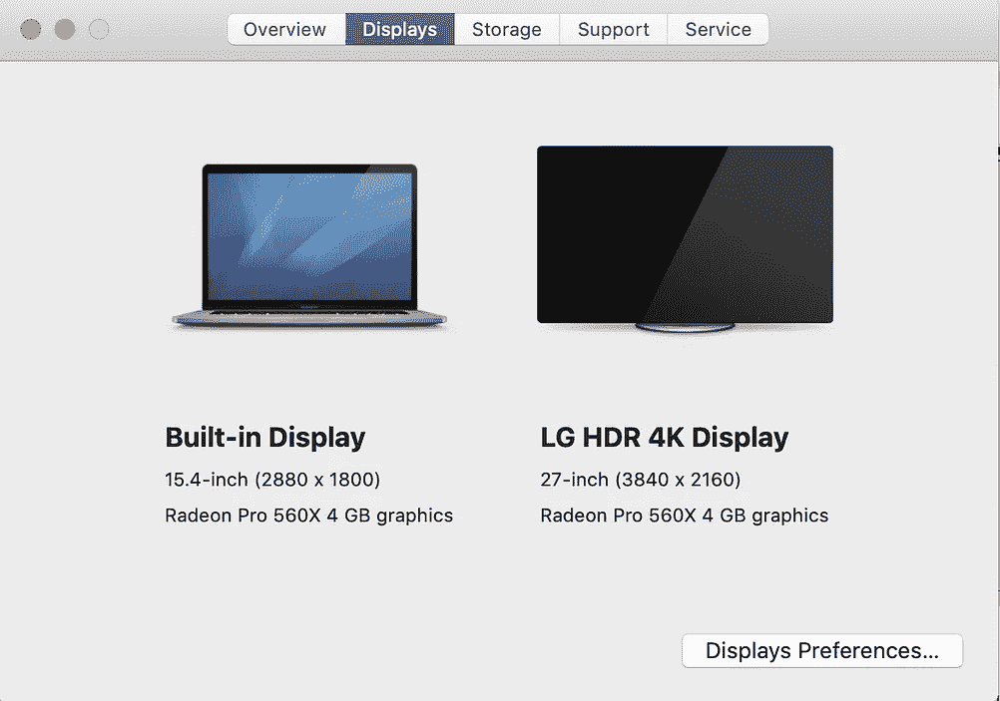
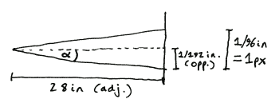
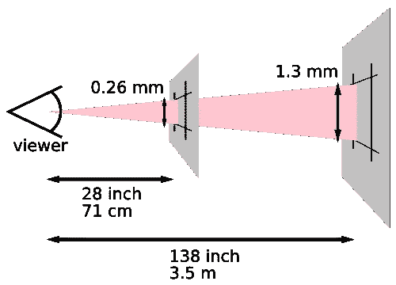
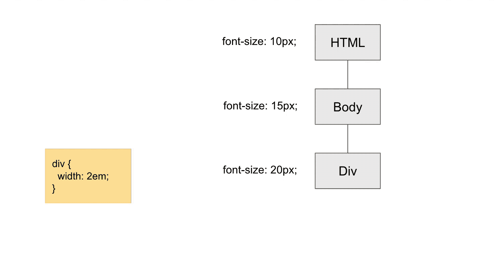
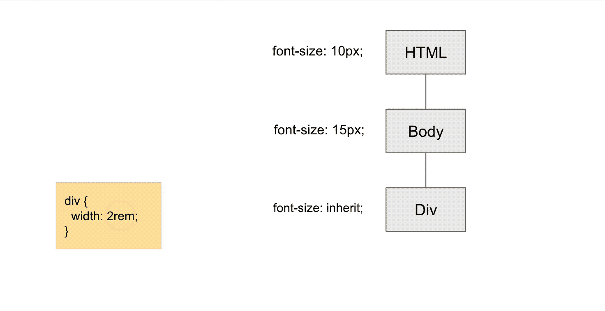

# 必须知道的 CSS 长度单位:px、em 和 rem

> 原文：<https://betterprogramming.pub/must-know-css-length-units-px-em-and-rem-ab4bf2a75907>

## 解释 3 种容易混淆的 CSS 字体大小单位


潘卡杰·帕特尔在 [Unsplash](https://unsplash.com?utm_source=medium&utm_medium=referral) 上的照片

为了使你的页面能根据宽度或高度的大小做出响应，你应该考虑使用百分比(%) —大概。很多设计师在和前端开发者合作的时候，给开发者的是百分比单位，至少从我自己的经验来看是这样的。

但是有更多有用的单元，不仅仅是对于响应性网站，也是为了更容易地将你的元素框在正确的位置。

# CSS 中长度的含义

在 CSS 中，放入 DOM 元素的值，比如宽度的 17px，在内部被称为*长度*值。但这意味着什么呢？在 CSS 中，*长度*是指距离值。

例如，对于宽度，长度意味着内容框从左边到右边的距离。就字体大小而言，长度是指字母从左边到右边的距离。

因此，简单的总结是，CSS 中的长度基本上意味着某个对象从开始位置到结束位置的距离，可以是字体大小或宽度。我们用 px，em 等来表示大小。

# px 是什么？

我将尝试用一些有趣的故事来更深入地解释这一点。

只要您使用 Mac，就可以在“设置”标签中检查电脑显示器的分辨率。这是我的显示器的分辨率状况，Retina 13 英寸，Retina 15 英寸和 LG 27 英寸。你能看到括号内所有不同的数字吗，比如 2560 x 1600？那些数字代表的是宽度-像素 x 高度-像素的分辨率。



Retina 13 英寸/ Retina 15 英寸/ LG 27 英寸显示器分辨率

但在 Chrome 中，全尺寸窗口的宽度不会像 Mac 设置标签显示的那样显示相同的像素。例如，我在 27 英寸显示器上的全尺寸 Chrome 窗口宽度是 1920。


看看这个关于像素的精彩视频:“[什么是像素，它们是如何工作的？](https://www.youtube.com/watch?v=m8c1CAT2zEI)

这是因为显示器和浏览器对*像素*的定义不同。在监视器中，像素是光栅图像中的物理点。您可以将像素视为填充监视器的最小单位。但是在浏览器中，它的工作方式不同。


图片来源:[维基共享资源](https://commons.wikimedia.org/wiki/Category:Cubit_arms#/media/File:Ell.jpg)

像素是浏览器中的度量单位，来自眼睛和显示器之间的阅读距离。查看显示器时，显示器的建议距离为 71 厘米(28 英寸)(这可能因地区而异)。

几百年前，一些欧洲国家，如比利时和英格兰，通过使用人的手臂长度来确定官方测量单位。在那个时代，比利时一只手臂的长度是 28 英寸。该值仍用于计算监视器的读数距离。



图片来源(左):[http://inamidst.com/stuff/notes/csspx](http://inamidst.com/stuff/notes/csspx)

在 96 [DPI](https://en.wikipedia.org/wiki/Dots_per_inch) 分辨率下，一英寸有 96 个点。当你的眼睛看着屏幕上的一个特定点时，你看到的是一平方英寸内的一个点。然后我们可以画出眼睛和圆点之间的角度，从圆点的顶点到底部。这个角度在本文档[中称为“ *α* ，在其他文档中称为](http://inamidst.com/stuff/notes/csspx)或*视角*。

```
tan(α) = opp./adj.
tan(α) = ((1/96) / 2) / 28
tan(α) = (1/192) / 28
tan(α) = 1/5376
α = arctan(1/5376)Therefore,
radians = arctan(px/5376) * 2
px = 5376 * tan(radians/2)
```

有了视角，就可以推导出在屏幕上获得一个像素的公式。因此，CSS 中的像素是通过屏幕的 DPI 值来计算的。

当然，你根本不需要了解所有这些，但我试图给你一个单位 *px* 起源背后的历史或故事的总结。

因此，这个故事的结论是，CSS 中的像素是以不同于物理设备的方式确定的。理论上，CSS 中的像素值可能会根据显示器的 DPI 而有所不同:高 DPI 和低 DPI 可能会使用不同的像素值。然而，现在，如果导出的像素值与平均像素值相差太大，浏览器会自动为您调整，这样您就不会觉得字体大小如此奇怪。

所以 px 通常不被推荐用来建立一个响应性网站，因为它固定字体大小，不会改变它。

# em 是什么？

*em* 是字体大小的相对 CSS 长度。px 是一个绝对长度，因为它不关心浏览器的大小，但 em 是指其元素的字体大小。

我将向你们展示一些例子来理解这个单元是如何工作的。

让我们用下面的 CSS 来考虑一下 div 标签。

```
div {
  width: 2em;
}
```



图片由作者提供

那么这个元素的宽度将是 40px，因为 em 查找元素的字体大小，在这个例子中是 20px。所以宽度最终是 40px。

如果 div 元素的字体大小不是由您设置的，而是从父元素继承的，该怎么办？


图片由作者提供

如果元素的字体大小设置为 inherit，它将从父元素继承大小，在本例中为 15px。然后计算宽度，达到 30px。

在 CSS 中使用 em 意味着您应该始终非常小心。正如我在一些例子中所展示的，em 基本上依赖于元素的字体大小，这很容易通过设计来改变。每当你改变一些元素的字体大小时，修复由此带来的副作用是一件非常痛苦的事情。

所以我个人不太想推荐你用这个，除非你真的需要。

# 什么是 rem？

*rem* 也是一个相对 CSS 长度，但这和 em 略有不同。当 em 查找 DOM 元素的字体大小时，不管是父元素还是自身，rem 总是查找最上面的元素，HTML 元素。

下面是例子。

```
div {
  width: 2rem;
}
```



图片由作者提供

这就简单多了，也更容易计算。

要将 HTML 元素的默认字体大小设置为 10px，可以将这个公式放在您的`normalize.css`或`reset.css`中。

```
html {
  font-size: 62.5%;
}
```

默认的字体大小是 16px，所以乘以 62.5%可以得到 10px。我个人最喜欢这个单位。它更容易维护，可读性更好，并且更少依赖于其他标签。

# 结论

我向您介绍了三种不同的 CSS 单位:px(绝对长度)、em 和 rem(相对长度)。我还解释了 px 是如何在您的浏览器中确定的，尽管这是一个简短的解释。如果您感兴趣，可以查看下面参考资料中的原始文档。

当你建立一个响应式网站时，最重要的事情之一就是让它易于维护。从这个角度来看，我认为快速眼动是最简单的。

# 资源

*   [px 和弧度的关系](http://inamidst.com/stuff/notes/csspx)
*   [CSS 单位— W3Schools](https://www.w3schools.com/cssref/css_units.asp)
*   [字体相对长度 W3C 规范](https://www.w3.org/TR/css-values/#font-relative-lengths)
*   [Ell —维基百科](https://en.wikipedia.org/wiki/Ell)
*   [新闻部—维基百科](https://en.wikipedia.org/wiki/Dots_per_inch)