# 必须学习 2020 年的 DevOps 工具

> 原文：<https://betterprogramming.pub/must-learn-devops-tools-for-2020-1a8a2675e88f>

## 现在就开始使用的最佳 DevOps 工具

[来源](https://electric-cloud.com/wp-content/uploads/developers-devops-tools-background2-1024x512.jpg)

DevOps 革命终于成为主流，DevOps 工具的受欢迎程度也呈爆炸式增长。据[谷歌趋势](https://trends.google.com/trends/explore?date=all&geo=US&q=devops%20tools)报道，对“DevOps 工具”的搜索一直在稳步增长，而且这一趋势还在继续。

因为 DevOps 包含了整个软件开发生命周期，所以有许多工具可供选择——众所周知，没有适合所有人的工具。然而，有几个已经成熟的功能，为几乎任何场景提供了广泛的支持。

让我们将同类最佳的工具分为以下几类:

*   [开发和构建工具](#8b1f)
*   [自动化测试工具](#541a)
*   [部署工具](#6fd6)
*   [运行时 DevOps 工具](#48bf)
*   [协作开发运维工具](#faf9)

成功和成熟地采用 [DevOps 实践](https://levelup.gitconnected.com/digestible-devops-the-7-devops-practices-8bd8b34e1418)将始终有一个完整的管道，其中包含符合这五个类别的工具。请务必评估您当前的工具堆栈，以确保您没有遗漏 CI/CD 管道中的关键部分。

# 开发和构建工具

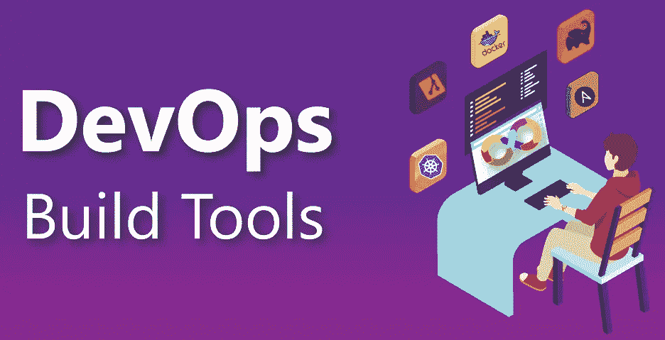

[来源](https://cdn.mindmajix.com/blog/images/devops-build-tools-170919.png)

这是您的 CI/CD 管道堆栈的基础。一切从这里开始。这一类别中最好的工具可以编排多个事件流，并与外部工具轻松集成。

软件开发生命周期的这一部分中的工具分为三个子类别:

*   源代码控制管理(SCM)
*   持续集成
*   数据管理

2020 年推荐的配置管理技术是 GIT，所以我们的配置管理工具必须有优秀的 GIT 支持。对于 CI 来说，在短暂的容器化环境中运行和执行构建的能力是绝对必要的。至于数据管理，我们需要能够对数据库模式进行更改，并使其与应用程序版本保持一致。

## **2020 年排名第一的 SCM + CI 工具:Gitlab 和 Gitlab-CI**

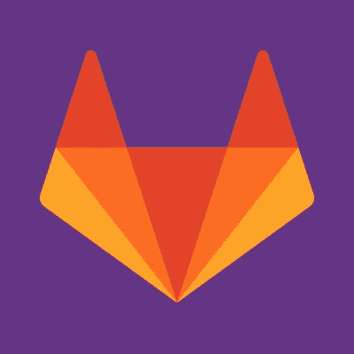

毫无疑问，Gitlab 是 2020 年最伟大的 DevOps 生命周期工具，在可预见的未来，它将成为创新的领导者。

Gitlab 的核心功能提供了一个完美的 GIT 存储库管理工具。其基于网络的用户界面是最冗长且最易于使用的。Gitlab 通过其免费层产品提供您需要的一切，并提供 SaaS 和内部两种外形规格。

市场上有大量的配置管理工具，但是没有一个像 Gitlab 多年来所做的那样直接将持续集成到你的存储库中。名为 Gitlab-CI，您将一个`.gitlab-ci.yml`文件放在代码库的根目录中，任何 GIT 事件都将基于您在此定义的内容触发操作。他们是持续代码集成的真正领导者。

## 主要优势

*   **成熟度**—该产品自 2013 年上市以来，一直非常稳定，得到了很好的支持。
*   **开源**——git lab 的免费版没有删减开发团队需要的核心功能。每个付费层级都提供了额外的功能，根据您组织的规模和需求带来极大的价值。
*   市场上没有其他工具像 Gitlab-CI 那样将持续集成直接嵌入到您的 SCM 中。将 Docker 构建用于临时构建的能力提供了无忧的构建工作，并且内置的报告使得调试构建失败变得容易。不需要多种工具的复杂集成和编排。
*   **无限集成** — Gitlab 提供每个核心 DevOps 类别所需工具的简单集成。这允许开发者和操作者在任何和所有的环境中，对于与他们的应用相关的信息有一个真实的来源。

## 击败竞争对手

在这一领域还有其他流行的工具，但是，它们没有 Gitlab 好。原因如下:

*   **GitHub** — GitHub 已经成为小型和早期开发商店的一个伟大的 SaaS 源代码管理系统。然而，对于需要将 IP 保留在其网络内的大型企业来说，GitHub 的唯一选择是不支持高可用性的`.OVA`虚拟机。这使得维护`on-prem`变得困难，而且在服务器本身开始崩溃之前，它只能为中型组织运行。它缺乏 GitHub 操作(直到最近，仍然没有在本地版本中)或 CI-as-Code，这意味着您总是需要自带 CI 工具并管理该集成。最后，它远比任何 Gitlab 定价都贵。
*   Jenkins —虽然 Jenkins 已经成为持续集成工具的默认标准，但它一直缺少源代码控制元素。也就是说，你会一直使用詹金斯*和*这两个配置管理工具。当像 GitLab 这样的工具同时提供这两种功能时，这就变得非常复杂了。其可怕的 UX 给现代 web 应用程序留下了许多不足之处。
*   **BitBucket/Bamboo**——我不得不说，考虑到你需要两个工具来完成 Gitlab 一个工具所做的工作，这是一个自动失败者。虽然 BitBucket cloud 支持 Gitlab-CI/GitHub 操作功能，但没有比初创公司更大的组织可以轻松采用它。用于本地*的位桶服务器甚至不支持位桶管道*！

## 2020 年排名第一的数据管理工具:FlywayDB

web 应用程序开发最容易被忽视的方面是数据库的自动化需求。这通常是为应用程序的新版本部署数据库模式更改后的想法。模式更改通常是添加或重命名列或表。如果应用程序版本与模式版本不匹配，应用程序可能会完全崩溃。由于有两个不同的系统，协调数据库更改和应用程序升级也很困难。FlyWayDB 解决了所有这些问题。

## 主要优势

*   **数据库版本控制** — FlyWay 允许您简单地创建数据库版本、跟踪数据库迁移，并轻松地前滚或回滚模式更改，而无需为此定制解决方案。
*   **二进制或内置**—您可以选择将 Flyway 作为应用程序启动的一部分或作为二进制可执行文件来运行。在您的代码中使用此工具，以便它在启动时检查版本功能并运行适当的迁移，从而保持数据库和应用程序版本同步。您还可以特别运行 cmd 行，为现有数据库提供灵活性，而无需重新构建整个应用程序。

## 击败竞争对手

这个领域的工具不多。但是，我们来看几个:

*   **LiquiBase** — Liquibase 是类似的，事实上，如果有人在我的组织中对这个工具有更多的经验，我会很乐意在 FlyWay 上标准化这个工具。
*   **flock er**——这可能只适用于容器化的应用程序——在容器中运行数据库是极其困难的，必须经过周密的计划才能成功执行。我建议利用数据库服务，比如 RDS，而不是试图运行存储在容器中的关键数据。

# 自动化测试工具

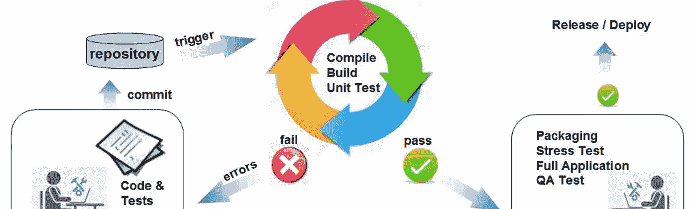

[来源](https://miro.medium.com/fit/c/1838/551/1*U_6UTSTu_qK39BzdyhSrjw.jpeg)

我们必须首先将自动化测试工具放入测试金字塔中，从而开始对它们进行评估。测试金字塔有 4 层:

*   单元 —这是你所有自动化测试的基础。就容量而言，与其他类型相比，您应该拥有最多的单元测试。这些测试应该由软件开发人员编写和运行，以确保应用程序的一部分(称为“单元”)符合其设计并按预期运行。
*   **组件** —组件测试的主要目的是验证测试对象的输入输出行为。这确保了测试对象的功能按照期望的规范正常工作。
*   **集成**——这是测试阶段，将单个软件模块组合起来，作为一个组进行测试。
*   **端到端** —这一层不言自明。我们从开始到结束都在观察应用程序的流程，并确保它的行为符合预期。

由于单元和组件层测试仅由应用程序开发人员驱动，并且通常是特定于编程语言的，因此我们不会针对 DevOps 领域评估这些工具。

## 2020 年排名第一的集成测试工具:黄瓜

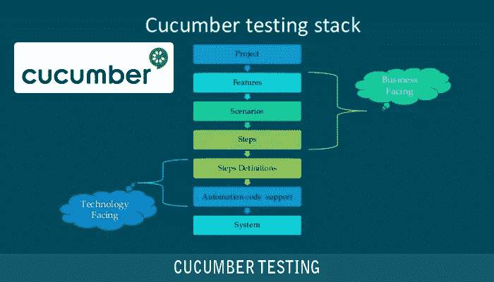

[来源](https://www.oditeksolutions.com/wp-content/uploads/2017/10/cucumber.png)

Cucumber 将规范和测试文档合并成一个有凝聚力的活文档。因为它们是由 Cucumber 自动测试的，所以您的规格总是最新的。如果您想构建一个从开始到结束的 web 自动化测试框架，并在 web 应用程序上模拟用户行为，那么 Selenium web driver with Java and Cucumber BDD 是在您的项目中学习和实现 cumber 的一个好方法。

## 主要优势

*   **行为驱动开发**——Cucumber 是用于 BDD 测试的，它已经成为一个必不可少的测试框架(与传统的测试驱动开发相比)。
*   **活文档**—记录你做过的事情总是一件痛苦的事。因为您的测试被定义为代码，Cucumber 测试自动生成文档来匹配，确保它们总是同步的。
*   **支持**—这里有许多工具可供选择，但是当事情变得严重时，你需要工具维护者的大力支持。Cucumber 拥有资金和支持结构，可以在未来几年维护这个工具。

## 击败竞争对手

在这个领域有许多框架和特定于技术的工具，但是只有 Cucumber 接近于一个通用的解决方案。

# 端到端测试工具

进行端到端测试时，需要关注两个关键领域:

*   功能测试
*   负载测试

功能测试显然是测试我们想要发生的事情是否真的发生了。当我点击我的 SPA 上的某些页面，填写表格，并点击提交时，数据出现在数据库中，屏幕上显示成功！

我们还需要能够测试 x 数量的用户通过相同的场景可以被正确处理。

如果您没有在这两个方面进行测试，那么您的 CI/CD 渠道将会有很大的缺口。

## 2020 年排名第一的端到端测试工具—功能:SoapUI Pro

SoapUI 在 API 测试领域已经存在很长时间了——因为 SOAP web 服务是默认的。虽然我们不再构建新的 SOAP 服务，工具的名称也没有改变，但这并不意味着它没有发展。SoapUI 为构建后端 web 服务的自动化功能测试提供了一个优秀的结构。这些可以很容易地与持续集成工具集成，并作为 CI/CD 管道的一部分运行。

## 主要优势

*   **大量的文档** —这个工具已经存在一段时间了，所以有大量的在线资源可以帮助你解决如何配置负载测试的问题。
*   **易用性**——虽然有几种可用的 API 测试工具，但是为多种服务提供一个接口使得构建测试变得简单。

## 击败竞争对手

*   **Selenium —** Selenium 是这个领域的另一个重要工具。如果您正在构建和运行基于 Java 的应用程序，我推荐您使用它。然而，如果您正在使用多种技术开发一个完整的 web 应用程序，对于非 Java 部分来说可能会有点笨拙。

## 2020 年排名第一的端到端测试工具—负载测试:LoadRunner

[来源](https://lh3.googleusercontent.com/proxy/enmjvgtefTLdbm3j5wAICWSpcrOl_mCs72zbJ8HKOHEjc1UMLbdAFpyh0mN6Aua7FiWmwl4WhN8_RgCeWK5g0W54JujXunzKye0ooeLmVFuxS-FycOppmOJFKqW_EmGKB4VuVW6OEkgUhTIJ)

**解释:**当涉及到对应用程序的各个方面进行负载测试时，只有 LoadRunner 能够完成。是的，它很贵，开始有点困难，但是它是唯一一个执行测试的工具，作为一个技术架构师，它给了我新代码在极端压力下执行的信心。此外，我认为是时候将负载运行者技能从 SQA 资源转移到开发团队中了。

## 主要优势

*   **大量文档。**这个工具已经存在一段时间了，所以有大量的在线资源可以帮助你解决如何配置负载测试的问题。
*   **协议支持** —从 ODBC 到 AJAX，再到 HTTPS，以及您的应用程序可能在某处使用的任何其他模糊协议，load runner 都支持它。我们希望避免串联多个负载测试工具——这只会增加复杂性。

## 击败竞争对手

同样，在这一领域，没有多少通用的工具，因此简单的解决方案是可以在任何环境中使用任何技术的解决方案。

# 部署工具

[来源](https://mohamedradwan.com/?attachment_id=6485)

部署工具可能是应用程序开发中最不为人所知的方面。对于操作人员来说，如果没有对应用程序代码和功能的深入理解，很难使用部署工具。对于开发人员来说，管理代码部署是一项新的职责，因此他们对许多部署工具没有什么经验。

首先，让我们将部署工具分成三个子类别:

*   工件管理
*   配置管理
*   部署

## 2020 年排名第一的工件管理工具:Nexus

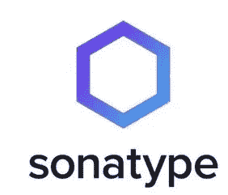

Nexus 工件库支持几乎所有的主要技术，从 Java 到 NPM 到 Docker。我们可以使用这个工具来存储所有可部署的工件。代理远程包管理器的能力也通过使包更接近构建过程而大大提高了我们的 CI 构建的速度。这样做的另一个好处是，我们可以获得跨多个软件项目使用的所有包的全局视图，锁定可能成为我们代码中攻击媒介的不安全的开源包。

## 主要优势

*   **技术支持** —该产品自 2013 年上市以来，非常稳定，得到了很好的支持。
*   **开源**——git lab 的免费版没有删减开发团队需要的核心功能。每个付费层级都提供了额外的功能，这些功能可以带来极大的价值，具体取决于您组织的规模和需求。

## 2020 年排名第一的配置管理工具:Ansible

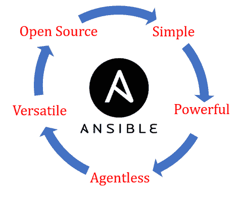

Ansible 是这个领域的领导者，原因很简单:无状态。早期的现场配置管理工具集中于管理我们的配置状态。如果它与期望的配置不一致，它会自我修复。在新的应用程序中，我们只有无状态的组件。新版本的代码是新的工件，被部署来替换现有的东西。我们有短暂的环境。

## 主要优势

*   **无状态** —可翻译的剧本从一台操作员机器上运行，并命中服务器的目标。我不关心远程对象的状态，这使得使用像 Packer 这样的工具来构建可部署对象变得容易得多。
*   **开源** —和 CentOS 一样，Ansible 也是由 RedHat 维护的。该企业及其高级支持有助于维护社区并确保高质量、易于使用的模块。
*   **分子测试** —因为配置管理就像其他任何东西一样是代码，我们不能不测试它。用于测试可负责角色的分子框架无缝地工作，以确保我们的配置-代码同样是高质量的，并且遵循与应用程序代码相同的 CI/CD 管道。
*   **YAML —** 与其他工具相比，YAML 更容易让人理解。由于配置管理对于任何采用 DevOps 的人来说通常都是新的，这使得它成为一个关键的卖点。

## 击败竞争对手

*   **ops code Chef**——我的 DevOps 职业生涯始于一名厨师烹饪书开发者。Ruby 和 Chef 是我的挚爱。然而，它们根本无法解决当今无状态的云原生应用程序的问题。对于更传统的遗留应用程序来说，这是一个很好的工具，但是在本文中我们关注的是未来。
*   木偶(Puppet)——木偶从未成长为一个巨大的社区，尤其是与厨师和 Ansible 相比。它非常适合于配置和裸机，但缺乏对 web 应用程序类型配置管理的支持。

## 2020 年排名第一的部署工具:Terraform

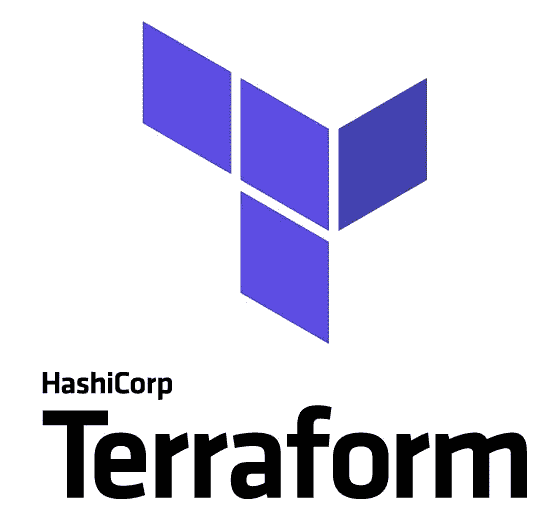

Terraform 解决了从网络组件到实际服务器映像的基础设施即代码的定义问题。自最初发布以来，它已经走过了漫长的道路，并且已经建立了一个庞大的插件和支持社区，可以在您可能面临的几乎任何部署场景中提供帮助。支持任何类型的环境的能力，无论是内部环境、云中环境还是其他环境，都是首屈一指的。最后，最新版本为 HCL 提供了与任何其他传统编程语言相同的逻辑函数和类，使开发人员易于掌握和学习。

## 主要优势

*   **与云/环境无关的** — Terraform 利用提供者作为您的 Terraform 代码与所有 API 和后端逻辑之间的接口，以便与您的基础设施提供商进行交流。这意味着我可以学习一种工具，并有能力在任何地方工作。
*   **开源** —同样，很难敲打免费工具。社区支持是一流的。

## 击败竞争对手

*   **AWS 云形成** —即使你只在 AWS 云环境中工作，你也可能在职业生涯中转移到一个不存在的地方。将你的技能和知识硬塞进一个平台可能会有风险。此外，许多新的 AWS 服务在 CloudFormation 中可用之前，通常以 Terraform 模块的形式提供。

# 运行时 DevOps 工具

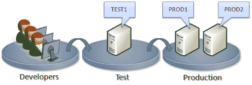

[来源](https://lh3.googleusercontent.com/proxy/whvJjzBdKlquCxUrNPQTRm3JNwgGo2ilsPQlX3MHfujIR98ybB_JKPGay84qhvlONnwVgZycL90EgQYDMytVZJ6SRjna9dlJhmYpOCShk_K_0UR9bBst0ImydH2mLNSlF3OfZPbHrLkcVMjUAAGiIgU)

任何开发项目的最终目标都是在生产中运行我们的应用程序。在 DevOps 世界中，我们希望确保我们能够了解环境中的任何潜在问题，并且希望将人工干预降至最低。选择正确的运行时工具集对于实现开发天堂至关重要。

运行时工具子类别包括:

*   x 即服务
*   管弦乐编曲
*   监视
*   记录

## 2020 年头号 X 即服务工具:亚马逊网络服务

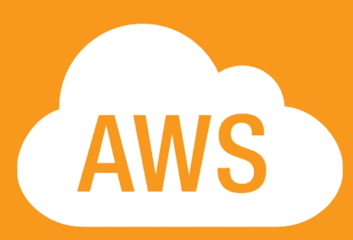

亚马逊一直是云领域的领导者。他们也不仅仅停留在那里——他们有如此多的新服务供开发者利用，这可能会让你头晕目眩。给 AWS 带来任何技术和任何模式，它都可以被构建和运行。与在您自己的数据中心构建、管理和维护传统硬件相比，它们的成本非常合理。免费的服务层让任何人都有机会在做出购买决定之前尝试一些东西，这对于试图以正确的方式构建应用程序来说是非常好的，而不是因为成本而不得不做出妥协。

## 主要优势

*   行业标准(Industry-standard)—如果你有在 AWS 中构建应用程序的经验，你基本上可以在任何地方找到工作。企业喜欢 AWS，而创业公司喜欢 AWS 的低成本。
*   **自由层**——与其他一切相比，这确实是 AWS 做得非常正确的业务方面。让我使用这项服务，看看它是如何工作的，然后再决定我要把数千美元投入到可能有巨大陷阱的东西中。我从来没有为任何简单的 POC 构建过自由层限制。

## 击败竞争对手

*   **Azure**——Azure 自最初发布以来已经走过了漫长的道路，这是值得称赞的。然而，与众不同的需求导致了 it 奇怪地命名服务，这有点难以理解——到底什么是“blob 存储”?同时。NET 代码在微软的生态系统中工作得更好，不太可能只使用。NET 应用程序的每个方面。
*   简单地说，我永远不会在 Heroku 上运行除了个人项目之外的任何东西。没有太多的透明度，企业没有理由采用它作为平台。它非常适合在博客中演示一些东西，但是对于实际应用——不，谢谢！

## 2020 年排名第一的编排工具:OpenShift

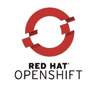

您可能正在应用程序堆栈的某个地方使用 Docker 或 containers。无服务器应用程序很棒，但是它们不能适合所有的架构模式。在没有编排平台的情况下运行容器是行不通的。从安全和工具的角度来看，Core Kubernetes 有很多不足之处。OpenShift 是唯一一个从 Source2Image 构建、到 pods 的部署自动化，甚至是可追溯性和监控都具备的 Kubernetes 平台。它可以在本地、云中运行，或者两者都运行。

## 主要优势

*   **安全内置** —管理 K8 的安全几乎需要一个博士学位。它必须经过深思熟虑，考虑到每一个细节。OpenShift 默认设置的安全机制减少了开发人员许多额外的非功能性工作，并为他们的应用程序提供了一个更安全的平台。
*   **一体化解决方案—** 与默认情况下不包含负载平衡工具的香草 K8 不同，OpenShift 拥有一切。我可以用它来托管我的容器、构建容器、运行 CI/CD 工具、编排外部流程、管理秘密等等。虽然 GUI 还需要做更多的工作，但是 API 优先的方法意味着一切都可以用脚本编写，而且，与 K8 的其他 GUI 不同，它使得学习 Kubernetes 的基础知识变得简单得多，而不必首先获得那个学位！

## 击败竞争对手

*   **Docker Swarm**——Docker Swarm 试图通过去掉很多东西来使 K8 变得更简单。这对于较小的应用程序来说很好，但是对于企业应用程序来说，这根本行不通。此外，像 AWS ECS 这样的服务也采用了类似的方法，但是更容易与我可能会与之交互的其他服务(Lambda、IAM 等)一起使用

## 2020 年排名第一的监控工具:新遗迹

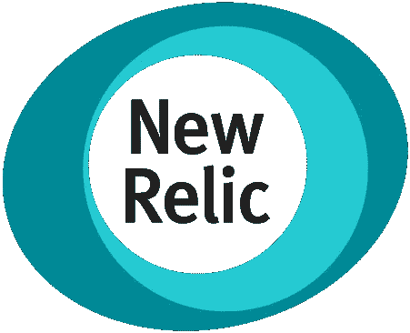

New Relic 的早期版本做了一件非常好的事情——APM 监控。现在它是一套完整的监控工具，允许我监控服务器性能、容器性能、数据库性能、终端用户体验监控，当然还有 APM 监控。

## 主要优势

*   作为一名系统工程师，我使用过很多监控工具，但我从未遇到过像 New Relic 这样简单易用的工具。这是一个 SaaS，所以不必设置服务器组件是很好的。
*   **端到端可见性** —其他工具试图监控应用程序的一个特定方面。无论是 CPU 利用率还是网络流量，所有这些层都协同工作，使您的应用程序正常工作。New Relic 让您能够将所有数据结合起来，以获得正在发生的事情的真实感觉。

## 击败竞争对手

*   **Zabbix** — Zabbix 是我最喜欢的监控系统，但它没有进化到云原生和 APM 领域，这使它落后了。它仍然可以很好地监控传统的服务器基础设施，但仅此而已。
*   **DataDog** —该工具过于关注管理生产应用程序的流程视角，而对代码本身关注不够。由于真正的 DevOps 团队有开发人员参与生产，我们不需要依赖流程繁重的工具来提供世界级的支持。

## 2020 年排名第一的日志工具:Splunk

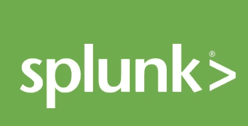

很难反驳 Splunk。他们长期以来一直是日志聚合领域的领导者，并将继续做得最好。通过内部和 SaaS 服务，您可以在任何地方使用它。主要的缺点是运行起来仍然非常昂贵！

## 主要优势

*   **行业标准** —企业喜欢 Splunk，他们也有钱购买。虽然初创公司可能难以证明成本的合理性，但许多概念和技能可以转移到开源替代方案中。
*   **可支持性**——简单来说，它工作并且工作得很好。它有很多默认设置和现成的特性，所以你不必花很多时间去阅读文档，并试图让一些没有直接抛出的东西工作。

## 击败竞争对手

*   **ELK Stack**——elastic search、LogStash 和 Kibana，虽然看起来总是很酷，因为它们不收你的使用费，但随着日志集的增长和越来越多的应用程序加入到你的工具中，维护它们变得越来越困难。在构建任何类型的仪表板之前，我花费了比使用 Splunk 更多的时间来设置工具。

# 协作开发工具

[来源](https://www.float.com/blog/content/images/2020/01/cross-collaboration-Float.png)

DevOps 首先是关于组织内的文化变革。虽然购买一个工具不会在一夜之间改变文化，但它肯定有助于培养与同事合作的新方式。

协作工具子类别包括:

*   问题跟踪
*   ChatOps
*   证明文件

## 2020 年排名第一的问题跟踪工具:吉拉

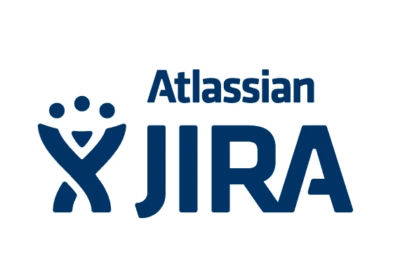

尽管这一领域的竞争日益激烈，但吉拉继续保持着领先地位。然而，吉拉内置的难以置信的灵活性允许开发团队和运营团队管理他们的项目工作和冲刺任务。使用敏捷术语的内置标准有助于简化从传统工作方法到更精益流程的文化转变。

## 主要优势

*   行业标准—同样，像许多工具一样，吉拉几乎无处不在。小团队可以使用廉价的许可证并获得他们需要的一切，而企业可以为任何人支付许可证。
*   **集成** —成为该领域的第一名和快速增长意味着第三方工具选择您首先构建本机集成，它们只会增加您工具的价值，吉拉就是这种情况。我们可以与本文中列出的所有其他工具集成，开箱即用，几乎不需要定制。

## 击败竞争对手

*   Trello 因为是一个免费使用的看板工具而迅速走红。然而，一旦事情开始扩大规模，从几十期增加到几千期，Trello 就变得难以导航、搜索和报道了。
*   **Pivotal Tracker**——我在为一家初创公司工作时成为了这个工具的超级粉丝。然而，他们更关注产品管理，而不是技术任务。虽然吉拉之外的产品管理有点困难，但仍然可以在不使用完全独立的工具的情况下完成。

## 2020 年排名第一的 ChatOps 工具:MatterMost

**解释:**这可能是 2020 年榜单上最大的惊喜，这是件好事！MatterMost 通过充分利用以前的工具并引入本地工具而广受欢迎。对于企业来说，这是巨大的，因为它使数据处于他们的控制之下，而且还有助于与内部工具的集成-我们不再需要走出防火墙去寻找新的东西。

## 主要优势

*   **开源**——matter most 的开源版本非常适合小型或大型团队。与会丢失历史记录的 Slack 免费层不同，自己运行服务器意味着您拥有自己的数据。
*   **集成** —因为 API 几乎 100%基于 Slack API，几乎所有 Slacks 集成都可以直接与 MatterMost 一起使用。

## 击败竞争对手

*   Slack 很棒，但是他们发展得太大了，他们需要开始盈利。他们业务的付费阶段即将到来，将剥离 Slack 过去免费提供的大量价值，最关键的是聊天记录。
*   **微软团队**——尝试将微软产品与非微软原生产品整合在一起——祝你好运。这就是我要说的！

## 2020 年的头号文档工具:Confluence

不管使用什么工具，创建和维护高质量的技术文档都是困难的。虽然最近有许多 SaaS 文档工具进入市场，但我发现很难接受将有关关键应用程序的敏感技术文档存储给第三方。我需要将数据和文档保存在本地，这就是 Confluence 为我做的事情。

## 主要优势

*   **易于管理** —大多数自托管工具的启动和运行可能有点复杂，大规模维护它们需要一些特定的知识。Confluence server 开箱即可为 10 名用户或 10，000 名用户提供出色的服务。
*   **插件**——虽然使用默认的 confluence 创建漂亮且易于导航的文档已经很棒了，但是拥有一个几乎可以做任何事情的插件的能力释放了 Wiki 的潜力。

## 击败竞争对手

*   **阅读文档**——开源公共代码很棒，但绝不会考虑在这里存储关键的应用知识。
*   **MarkDown**——虽然很适合记录我的代码，但是很难将架构、过程或其他类型的文档直接放入 MarkDown 格式中。
*   当记录技术知识时，我不想简单地建立一个新的静态站点来部署每一个变化。Confluence 的简单版本管理系统使得内部文档变得更加容易。

# 总结 2020 年的精彩

市场上有数百种 DevOps 工具。试图导航哪些应该被使用以及何时应该被实现可能是压倒性的。遵循这个简单的指南，为完整的 CI/CD 管道选择您的 DevOps 工具堆栈。

将工具分为以下五个关键领域:

*   开发和构建工具
*   自动化测试工具
*   部署工具
*   运行时工具
*   协作工具

记住:自动化所有的事情！