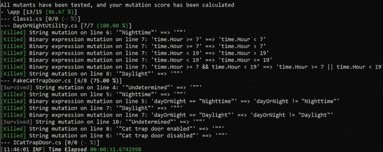

# 突变测试示例:如何通过实验利用失败

> 原文：<https://betterprogramming.pub/mutation-testing-by-example-how-to-leverage-failure-by-experimenting-fc4f13aa39bd>

## 通过快速失败学习代码的深度指南


亚历克斯·布纳季奇的照片

在我的文章[TDD 如何工作的实践解释](https://medium.com/@alexbunardzic/hands-on-explanation-of-how-tdd-works-c009135dfc79)中，我展示了当一个可测量的测试可用时，迭代的力量来保证一个解决方案。在那篇文章中，一种迭代方法有助于确定如何实现计算给定数字平方根的代码。

我还演示了最有效的方法是找到一个可测量的目标或测试，然后开始用最佳猜测进行迭代。正如所料，对正确答案的第一次猜测很可能会失败，因此失败的猜测需要改进。精确的猜测必须根据可测量的目标或测试进行验证。根据结果，猜测要么被验证，要么必须进一步完善。

在这个模型中，学习如何达到解决方案的唯一方法是反复失败。这听起来违反直觉，但令人惊讶的是，这很有效。

跟随这一分析的脚步，本文研究了在构建包含一些依赖项的解决方案时使用 DevOps 方法的最佳方式。第一步是编写一个可能会失败的测试。

# 依赖的问题在于你不能依赖它们

正如迈克尔·尼加德在 [*没有结束状态*](https://www.infoq.com/presentations/Architecture-Without-an-End-State/) 的架构中风趣地表达的那样，依赖的问题是一个巨大的主题，最好留给另一篇文章来讨论。在这里，您将看到依赖关系可能给项目带来的潜在缺陷，以及如何利用测试驱动开发(TDD)来避免这些缺陷。

首先，提出一个现实生活中的挑战，然后看看如何使用 TDD 来解决它。

# 谁把猫放出来了？


亚历克斯·布纳季奇的照片

在敏捷开发环境中，通过定义期望的结果来开始构建解决方案是有帮助的。通常，期望的结果在[用户故事](https://www.agilealliance.org/glossary/user-stories#q=~(infinite~false~filters~(postType~(~'page~'post~'aa_book~'aa_event_session~'aa_experience_report~'aa_glossary~'aa_research_paper~'aa_video)~tags~(~'user*20stories))~searchTerm~'~sort~false~sortDirection~'asc~page~1))中描述:

> 使用我的家庭自动化系统
> 
> 我想控制猫什么时候可以出去
> 
> 因为我想让猫安全过夜

现在您有了一个用户故事，您需要通过提供一些功能需求(也就是说，通过指定接受标准)来详细阐述它。从伪代码中描述的最简单的场景开始:

> 场景#1:夜间禁用猫陷阱门

*   假设时钟检测到现在是晚上
*   当时钟通知 HAS 时
*   然后，禁用支持物联网(IoT)的猫陷阱门

# 分解系统

在您开始工作之前，您正在构建的系统(HAS)需要被分解——分解成它的依赖项。您必须做的第一件事是确定任何依赖关系(如果您幸运的话，您的系统没有依赖关系，这将使它易于构建，但这样它可能就不是一个非常有用的系统)。

从上面的简单场景中，您可以看到期望的业务结果(自动控制猫门)取决于对夜间的检测。这种依赖性取决于时钟。但是时钟不能确定现在是白天还是晚上。这取决于你提供的逻辑。

您正在构建的系统中的另一个依赖项是自动访问 cat door 并启用或禁用它的能力。这种依赖性很可能依赖于支持物联网的猫门提供的 API。

# 依赖关系管理快速失败

为了满足一个依赖关系，我们将构建一个逻辑来确定当前时间是白天还是夜晚。本着 TDD 的精神，我们将从一个小的失败开始。

关于如何设置这个练习所需的开发环境和框架的详细说明，请参考我以前的文章。我们将重用相同的网络环境，并依赖于[xUnit.net](https://xunit.net/)框架。

接下来，创建一个名为 HAS(表示“家庭自动化系统”)的新项目，并创建一个名为 UnitTest1.cs 的文件。在这个测试中，描述你的期望。例如，当系统运行时，如果时间是晚上 7 点，那么负责决定是白天还是夜间的组件将返回值“夜间”

下面是描述这种期望的测试:

至此，您可能已经熟悉了测试的形状和形式。快速复习:通过给测试起一个描述性的名字来描述期望，在这个例子中为 Given7pmReturnNighttime。然后，在测试主体中，创建一个名为 expected 的变量，并为其分配期望值(在本例中，值为“夜间”)。接下来，名为 actual 的变量被赋予实际值(在组件或服务处理一天中的时间后可用)。

最后，它通过断言期望值和实际值相等来检查期望值是否满足。相等(预期，实际)。

您还可以在上面的清单中看到一个名为`dayOrNightUtility`的组件或服务。这个模块能够接收消息`GetDayOrNight`，并且应该返回类型`string`的值。

同样，在 TDD 的精神中，被描述的组件或服务还没有被构建(它仅仅是被描述为以后规定它)。构建它是由所描述的期望驱动的。

在`app`文件夹中创建一个新文件，命名为`DayOrNightUtility.cs`。将以下 C#代码添加到该文件并保存:

现在，转到命令行，将目录切换到`unittests`文件夹，并运行测试:

```
[Xunit.net 00:00:02.33] unittest.UnitTest1.Given7pmReturnNighttime [FAIL]
 Failed unittest.UnitTest1.Given7pmReturnNighttime
 [...]
```

恭喜你，你已经写出了第一个失败的测试。测试期望`DayOrNightUtility`返回字符串值“Nighttime ”,但是它收到了字符串值“Undetermined”

# 修复失败的测试

修复失败测试的一种快速而又肮脏的方法是用值“夜间”替换值“未确定”,并保存更改:

现在当我们运行测试时，它通过了:

```
Starting test execution, please wait...Total tests: 1\. Passed: 1\. Failed: 0\. Skipped: 0.
 Test Run Successful.
 Test execution time: 2.6470 Seconds
```

然而，硬编码的价值观基本上是欺骗，所以最好赋予`DayOrNightUtility`一些智能。修改`GetDayOrNight`方法以包含一些时间计算逻辑:

该方法现在从系统中获取当前时间，并比较`Hour`值以查看它是否小于上午 7 点。如果是，则逻辑将`dayOrNight`字符串值从“白天”转换为“夜间”测试现在通过了。

# 白天呢？

接下来，您需要描述当当前时间大于早上 7 点时会发生什么情况的预期。下面是名为`Given7amReturnDaylight`的新测试:

新的测试现在失败了(值得重复——越早失败越好！):

```
Starting test execution, please wait...
 [Xunit.net 00:00:01.23] unittest.UnitTest1.Given7amReturnDaylight [FAIL]
 Failed unittest.UnitTest1.Given7amReturnDaylight
 [...]
```

它期望收到字符串值`“Daylight”`，但却收到了字符串值`“Nighttime”`。

# 分析失败的测试用例

经过更仔细的检查，我们的代码似乎陷入了困境。原来`GetDayOrNight`方法的实现是不可测试的！

看一下我们面临的核心挑战:

> *1。* `*GetDayOrNight*` *依靠隐藏输入。*
> `*dayOrNight*`的值取决于隐藏输入(它从内置系统时钟中获取一天中的时间值)。
> 
> *2。* `*GetDayOrNight*` *包含非确定性行为。*
> 从系统时钟获得的时间值是不确定的。这取决于您运行代码的时间点，我们必须考虑这种不可预测性。
> 
> *3。低质量的* `*GetDayOrNight*` *API。*
> 这个 API 与具体的数据源(系统`*DateTime*`)紧密耦合。
> 
> *4。* `*GetDayOrNight*` *违反了单一责任原则。*
> 你实现了一个同时消费信息和处理信息的方法。一个好的做法是，一个方法应该只负责执行一项任务。
> 
> *5。* `*GetDayOrNight*` *有不止一个改变的理由。*
> 可以想象一个场景，时间的内部来源可能会改变。同样，很容易想象处理逻辑会改变。这些不同的变化原因必须相互隔离。
> 
> 6。 `*GetDayOrNight*` *的 API 签名不足以理解它的行为。通过简单地查看一个 API 的签名，就能理解它会有什么样的行为，这是非常可取的。*
> 
> 7。 `*GetDayOrNight*` *依赖于全局共享的可变状态。*
> 要不惜一切代价避免共享的可变状态！
> 
> *8。* `*GetDayOrNight*` *方法的行为即使在读取源代码后也无法预测。那是一个可怕的命题。一旦系统可以运行，通过阅读源代码就可以很清楚地知道可以预测什么样的行为。*

# 失败背后的原则

每当你面临一个工程问题时，使用久经考验的分而治之的策略是明智的。在这种情况下，遵循关注点分离的原则是正确的。

> [关注点分离](https://en.wikipedia.org/wiki/Separation_of_concerns) ( SoC)是一种设计原则，用于将计算机程序分成不同的部分，以便每个部分解决一个单独的关注点。关注点是影响计算机程序代码的一组信息。关注点可以像代码被优化的硬件的细节一样普遍，也可以像要实例化的类名一样具体。一个很好体现 SoC 的程序叫做模块化程序。

`GetDayOrNight`方法应该只关心决定日期和时间值是指白天还是夜晚。它不应该关心寻找价值的来源。这个问题应该留给呼叫客户。

您必须将获取当前时间的任务交给调用客户端。这种方法符合另一个有价值的工程原理——控制反转。马丁·福勒在[中详细探讨了这个概念，这里是](https://martinfowler.com/bliki/InversionOfControl.html)。

> 框架的一个重要特征是，用户定义的用于定制框架的方法通常会从框架内部调用，而不是从用户的应用程序代码调用。框架通常在协调和排序应用程序活动中扮演主程序的角色。这种控制反转赋予了框架作为可扩展骨架的能力。用户提供的方法为特定的应用定制框架中定义的通用算法。*——*[*拉尔夫·约翰逊和布莱恩·富特*](http://www.laputan.org/drc/drc.html)

# 重构测试用例

显然，我们需要重构代码。摆脱对内部时钟的依赖(系统实用程序`DateTime`):

```
DateTime time = [new](http://www.google.com/search?q=new+msdn.microsoft.com) DateTime();
```

删除上面的行(应该是文件中的第 7 行)。通过向`GetDayOrNight`方法添加一个输入参数`DateTime`时间来进一步重构您的代码。

下面是重构后的类`DayOrNightUtility.cs`:

重构代码需要改变测试。您需要为`nightHour`和`dayHour`准备值，并将这些值传递给`GetDayOrNight`方法。以下是重构后的测试:

# 经验教训

在继续这个简单的场景之前，回顾一下本练习中的内容。

通过实现不可测试的代码，很容易无意中创建一个陷阱。从表面上看，这些代码似乎运行正常。然而，如果我们遵循测试驱动开发(TDD)实践——首先描述期望，然后才规定实现——它会立即揭示代码中的严重问题。

这表明 TDD 是确保代码不会变得太乱的理想方法。TDD 指出了问题领域，例如单一责任的缺失和隐藏输入的存在。此外，TDD 有助于删除非确定性代码，并用行为确定的完全可测试的代码替换它。

最后，TDD 有助于交付易于阅读的代码，因为实现的逻辑易于理解。

现在让我们看看如何使用在这个练习中创建的逻辑来实现功能代码，以及进一步的测试如何使它变得更好。

# 在夜间禁用猫陷阱门

假设猫门是一个复杂的物联网(IoT)产品，它有一个 IP 地址，可以通过向其 API 发送请求来访问。为了简洁起见，本系列不探讨如何对物联网设备进行编程；相反，它模拟服务来保持对测试驱动开发(TDD)和突变测试的关注。

从编写一个失败的测试开始:

```
[Fact]
public void GivenNighttimeDisableTrapDoor() {
   var expected = "Cat trap door disabled";
   var timeOfDay = dayOrNightUtility.GetDayOrNight(nightHour);
   var actual = catTrapDoor.Control(timeOfDay);
   Assert.Equal(expected, actual);
}
```

这描述了一个全新的组件或服务(`catTrapDoor`)。该组件(或服务)具有在给定当前时间的情况下控制活板门的能力。现在是时候实施`catTrapDoor`了。

要模拟这个服务，您必须首先使用接口描述它的功能。在 app 文件夹中新建一个文件，命名为`ICatTrapDoor.cs`(按照惯例，一个接口名称以大写字母`I`开头)。将以下代码添加到该文件中:

```
namespace app{
   public interface ICatTrapDoor {
       string Control(string dayOrNight);
   }
}
```

此接口无法运行。它仅仅描述了您在构建`CatTrapDoor`服务时的意图。接口是创建您正在使用的服务的抽象的好方法。在某种程度上，您可以将这个接口视为`CatTrapDoor`服务的 API。

要实现 API，在 app 文件夹中创建一个新文件，并将其命名为`FakeCatTrapDoor.cs`。将以下代码输入到类文件中:

这个新的`FakeCatTrapDoor`类实现了接口`ICatTrapDoor`。它的方法`Control`接受字符串值`dayOrNight`，并检查传入的值是否是“Nighttime”如果是，它将`trapDoorStatus`从“未确定”修改为“猫活板门禁用”,并将该值返回给调用客户端。

为什么叫`FakeCatTrapDoor`？因为这不是真正的猫活板门。假的只是帮助你找出处理逻辑。一旦你的逻辑无懈可击，假服务就被真正的服务取代了(这个话题留给集成测试这个学科)。

随着一切的实现，所有的测试在运行时都通过了:

```
Starting test execution, please wait...Total tests; 3\. Passed: 3\. failed: 0\. Skipped: 0.
 Test Run Successful.
 Test execution time: 1.3913 Seconds
```

# 在白天启用猫活板门

是时候看看我们用户故事中的下一个场景了:

> 场景#2:白天启用猫陷阱门

*   假设时钟检测到日光
*   当时钟通知 HAS 时
*   然后 HAS 启动猫活板门

这应该很容易，只是第一个场景的另一面。首先，编写失败的测试。将以下测试添加到`unittest` 文件夹中的 `UnitTest1.cs`文件中:

```
[Fact]
public void GivenDaylightEnableTrapDoor() {
   var expected = "Cat trap door enabled";
   var timeOfDay = dayOrNightUtility.GetDayOrNight(dayHour);
   var actual = catTrapDoor.Control(timeOfDay);
   Assert.Equal(expected, actual);
}
```

当向`catTrapDoor`服务发送“日光”状态时，您可能会收到“猫活板门已启用”的通知。当您运行测试时，您会看到您所期望的结果，它会像预期的那样失败:

```
Starting test execution, please wait...
 [Xunit unittest.UnitTest1.UnitTest1.GivenDaylightEnableTrapDoor [FAIL]
 Failed unittest.UnitTest1.UnitTest1.GivenDaylightEnableTrapDoor
 [...]
```

测试预计会收到“猫活板门已启用”的通知，但却被告知猫活板门的状态为“未确定”爽；现在是修复这个小故障的时候了。

给`FakeCatTrapDoor`添加三行代码就可以了:

```
if(dayOrNight == "Daylight") {
   trapDoorStatus = "Cat trap door enabled";
}
```

再次运行测试，所有测试都通过:

```
Starting test execution, please wait...Total tests: 4\. Passed: 4\. Failed: 0\. Skipped: 0.
 Test Run Successful.
 Test execution time: 2.4888 Seconds
```

厉害！一切看起来都很好。所有的测试都是绿色的；你有一个坚如磐石的解决方案。谢谢你，TDD！

# 没那么快！

有经验的工程师不会相信这个解决方案是坚如磐石的。为什么？因为溶液还没有变异。

虽然随着一个成功的控制猫门的示例物联网(IoT)应用程序，旅程似乎已经结束，但有经验的程序员知道解决方案需要突变测试。

# 什么是突变检测？

变异测试是这样一个过程:遍历每一行已实现的代码，对那一行进行变异，然后运行测试并检查变异是否超出了预期。如果没有，你就创造了一个幸存的变异体。

幸存的突变体总是一个令人担忧的问题，它指出了代码库中潜在的危险区域。一旦你抓到一个幸存的变异人，你必须杀死它。杀死幸存的变异体的唯一方法是创建额外的描述——描述你对函数或模块输出的期望的新测试。最终，您交付了一个精益的、不透气的解决方案，并保证您的代码库中没有令人讨厌的 bug 或缺陷。

如果你让幸存的变种人四处游荡、繁衍、长寿、繁荣，那么你正在制造可怕的技术债务。另一方面，如果任何测试抱怨临时突变的代码行产生的输出与预期的输出不同，那么这个突变体就被杀死了。

# 安装 Stryker

尝试突变测试的最快方法是利用专门的框架。这个例子使用了 [Stryker](https://stryker-mutator.io/) 。

要安装 Stryker，请转到命令行并运行:

```
$ dotnet tool install -g dotnet-stryker
```

要运行 Stryker，请导航至`unittest`文件夹并键入:

```
$ dotnet-stryker
```

以下是 Stryker 关于我们解决方案质量的报告:

```
14 mutants have been created. Each mutant will now be tested, this could take a while.Tests progress | 14/14 | 100% | ~0m 00s | 
 Killed : 13
 Survived : 1
 Timeout : 0All mutants have been tested, and your mutation score has been calculated 
 - \app [13/14 (92.86%)]
 [...]
```

报告称:

*   史崔克创造了 14 个变异人
*   史崔克看到 13 名变种人被测试杀死
*   史崔克看到一个变异人在测试中幸存下来
*   Stryker 计算出现有代码库包含 92.86%的符合预期的代码
*   Stryker 计算出 7.14%的代码库包含不符合预期的代码

总的来说，Stryker 声称我们迄今为止构建的应用程序未能产生一个可靠的解决方案。

# 如何杀死一个变异人

当软件开发人员遇到幸存的变种人时，他们通常会找到已实现的代码，并寻找修改它的方法。例如，在应用程序为卡特彼勒车门自动化的情况下，更改以下代码行:

```
string trapDoorStatus = "Undetermined";
```

收件人:

```
string trapDoorStatus = "";
```

再次运行史崔克。一个变种人活了下来:

```
All mutants have been tested, and your mutation score has been calculated
 - \app [13/14 (92.86%)]
 [...]
 [Survived] String mutation on line 4: '""' ==> '"Stryker was here!"'
 [...]
```

这一次，你可以看到 Stryker 改变了生产线:

```
string trapDoorStatus = "";
```

变成:

```
string trapDoorStatus = ""Stryker was here!";
```

这是 Stryker 工作方式的一个很好的例子:它以一种聪明的方式改变每一行运输代码，以查看是否有我们尚未考虑的进一步测试案例。这迫使我们更深入地考虑我们的期望。

被 Stryker 打败后，您可以尝试通过添加更多逻辑来改进实现的代码:

但再次运行 Stryker 后，你会看到这一尝试创造了一个新的突变体:

```
ll mutants have been tested, and your mutation score has been calculated
 - \app [13/15 (86.67%)]
 [...]
 [Survived] String mutation on line 4: '"Undetermined"' ==> '""'
 [...]
 [Survived] String mutation on line 10: '"Undetermined"' ==> '""'
 [...]
```



你不能通过修改实现的代码来摆脱这个困境。事实证明杀死幸存的变种人的唯一方法是描述额外的期望。你如何描述期望？通过编写测试。

是时候添加一个新的测试了。由于幸存的突变体位于第 4 行，您意识到您没有用值“未确定”指定输出的期望值。

让我们添加一个新的测试:

```
[Fact]
public void GivenIncorrectTimeOfDayReturnUndetermined() {
   var expected = "Undetermined";
   var actual = catTrapDoor.Control("Incorrect input");
   Assert.Equal(expected, actual);
}
```

修复成功了！现在所有的变种人都被杀死了:

```
All mutants have been tested, and your mutation score has been calculated
 - \app [14/14 (100%)]
 [Killed] [...]
```

您最终有了一个完整的解决方案，包括如果系统接收到不正确的输入值时的输出描述。

# 突变测试拯救世界

假设您决定过度设计一个解决方案，并将这个方法添加到`FakeCatTrapDoor`:

```
private string getTrapDoorStatus(string dayOrNight) {
   string status = "Everything okay";
   if(dayOrNight != "Nighttime" || dayOrNight != "Daylight") {
       status = "Undetermined";
   }
   return status;
}
```

然后替换第 4 行语句:

```
string trapDoorStatus = "Undetermined";
```

使用:

```
string trapDoorStatus = getTrapDoorStatus(dayOrNight);
```

当您运行测试时，一切都通过了:

```
Starting test execution, please wait...Total tests: 5\. Passed: 5\. Failed: 0\. Skipped: 0.
 Test Run Successful.
 Test execution time: 2.7191 Seconds
```

测试已顺利通过。TDD 奏效了。但是把 Stryker 带到现场，突然画面看起来有点可怕:

```
All mutants have been tested, and your mutation score has been calculated
 - \app [14/20 (70%)]
 [...]
```

史崔克创造了 20 个变种人；14 名变种人被杀，6 名变种人幸存。这将成功得分降低到 70%。这意味着只有 70%的代码能够满足描述的期望。另外 30%的代码没有明确的原因，这使我们面临代码滥用的风险。

在这种情况下，史赛克帮助对抗膨胀。它不鼓励使用不必要的和复杂的逻辑，因为正是在这些不必要的复杂逻辑的缝隙中滋生了错误和缺陷。

# 结论

如您所见，突变测试确保没有不确定的事实会被检查。

你可以把史崔克比作一位国际象棋大师，他正在想尽一切办法来赢得一场比赛。当史赛克不确定的时候，它在告诉你，赢还不是一个保证。我们记录的事实越多，我们的比赛就越深入，Stryker 就越有可能获胜。在任何情况下，Stryker 都有助于发现失败的情况，即使表面上一切都很好。

恰当地设计代码总是一个好主意。您已经看到了 TDD 在这方面的帮助。当涉及到保持代码高度模块化时，TDD 特别有用。然而，TDD 本身并不足以交付完全符合预期的精益代码。

开发人员可以向已经实现的代码库添加代码，而无需首先描述预期。这将整个代码库置于风险之中。变异测试在捕捉常规测试驱动开发(TDD)节奏中的漏洞时特别有用。您需要改变每一行实现的代码，以确保没有一行代码是没有特定原因的。