# 用 Pitest 进行变异测试以提高单元测试质量

> 原文：<https://betterprogramming.pub/mutation-testing-with-pitest-to-improve-unit-tests-quality-885e7c844d88>

## 好的测试应该失败:用 Pitest 确保有意义的测试


[奥利·戴尔](https://unsplash.com/@olidale?utm_source=medium&utm_medium=referral)在 [Unsplash](https://unsplash.com?utm_source=medium&utm_medium=referral) 上的照片

## 标准测试覆盖的问题是

编写单元测试是开发过程的重要部分。我们经常使用报告工具，例如 [Jacoco](https://www.eclemma.org/jacoco/) 来检查测试覆盖率。如果我们看到所有的线都是绿色的，我们很高兴我们覆盖了一切。

但是，不需要任何有意义的测试就可以实现全线覆盖。例如，我可以编写没有任何断言或验证的测试。有时，即使我们涵盖了所有情况，它们也可能不够详尽。

## 如何提高考试质量？

[突变测试](https://en.wikipedia.org/wiki/Mutation_testing)是一种检查每段代码是否经过有意义测试的技术。它以各种方式修改内存中的代码，以产生不同的结果。然后证明测试是否会失败。好的测试应该会失败。如果突变体(代码修改)被杀死，我们认为测试成功。

下图说明了线覆盖和突变覆盖的不同之处:

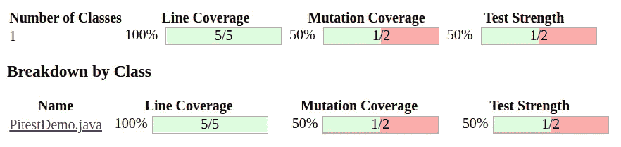

PIT 报告覆盖范围示例

在本文中，我将用易懂的例子介绍 Java 的 [Pitest](https://pitest.org/) (PIT)突变测试框架。您将了解它的好处，并学习如何将其集成到您的项目中。

我们开始吧！

# Pitest 演示

我创建了一个简单的 Java 项目来演示 PIT 的用法。完整的代码位于我的 GitHub repo 中，链接在本文末尾的参考资料部分。

## 项目相关性

这是一个基于 Maven 的项目。将 Pitest 插件添加到`pom.xml`文件:

```
<plugin>
    <groupId>org.pitest</groupId>
    <artifactId>pitest-maven</artifactId>
    <version>1.9.9</version>
</plugin>
```

*注意，Pitest 也可以与其他构建工具一起工作，比如 Gradle。*

我们使用 JUnit 作为测试框架:

```
<dependency>
    <groupId>org.junit.jupiter</groupId>
    <artifactId>junit</artifactId>
    <version>5.8.2</version>
    <scope>test</scope>
</dependency>
```

注意，PIT 需要知道使用哪个测试框架。这就是为什么我们必须为插件提供`pitest-junit5-plugin`依赖:

```
<plugin>
    <groupId>org.pitest</groupId>
    <artifactId>pitest-maven</artifactId>
    <version>1.9.9</version>
    <dependencies>
        <dependency>
            <groupId>org.pitest</groupId>
            <artifactId>pitest-junit5-plugin</artifactId>
            <version>1.1.0</version>
        </dependency>
    </dependencies>
</plugin>
```

## 标准覆盖率报告

首先，看一个简单的例子来理解行覆盖和突变覆盖之间的区别。

考虑以下代码:

```
 public static boolean isIsogram(String input) {
        String[] splitString = input.split("");
        Set<String> set = new HashSet<>(Arrays.asList(splitString));
        return input.length() == set.size();
    }
```

等值图是没有重复字母的单词。这段代码检查给定的字符串是否是等值图。

让我们创建一个单元测试:

```
@Test
void generateNumberFromRange_shouldReturnTrue() {
    var result = PitestDemo.isIsogram("chair");
    System.out.println(result);
}
```

请注意，我有意跳过断言部分，向您展示覆盖率将是绿色的。我运行了一个 Jacoco 报告，看到了以下结果:

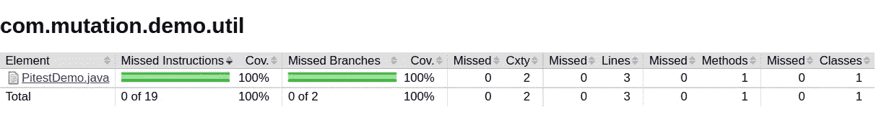

整个 Jacoco 报告

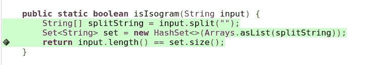

Jacoco 方法线覆盖

根据工具显示，我们已经覆盖了所有线路。不是这样的。

让我们添加一些断言来创建一个更有效的测试:

```
@Test
void generateNumberFromRange_shouldReturnTrue() {
    var result = PitestDemo.isIsogram("chair");
    Assertions.assertTrue(result);
} 
```

看起来好多了，对吧？但是，PIT 报告显示了这些结果:

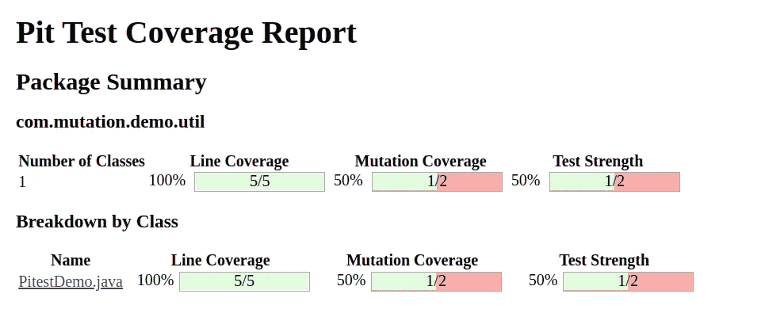

PIT 总体报告

在下一节中，您将看到如何配置 PIT 并生成报告。

## 包含 Pitest 的覆盖率报告

插件的基本配置如下所示:

```
 <configuration>
     <targetClasses>
       <param>com.mutation.demo.util.*</param>
     </targetClasses>
     <targetTests>
       <param>com.mutation.demo.util.*</param>
     </targetTests>     
</configuration>
```

*   属性告诉 PIT 在哪里注入突变。
*   `targetTests`定义了运行哪些单元测试。

PIT 提供了丰富的属性定义选择。为了便于理解，您可以配置以下内容:

*   哪些类或包超出了范围(当您想排除第三方代码时很方便)
*   使用哪种变异(例如，否定布尔语句、删除 void 方法调用、返回空值等等。)
*   每类突变的数量
*   报告设置

查看[文档](https://pitest.org/quickstart/maven/)了解更多信息。

PIT 自动生成报告，类似于 Jacoco。我们可以看到我们的测试表现如何。

执行以下 maven 命令来运行测试:

```
mvn test pitest:mutationCoverage
```

您应该会在项目的目标目录下看到一个名为`pit-reports`的新文件夹:

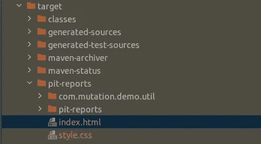

在浏览器中打开`index.html`文件。

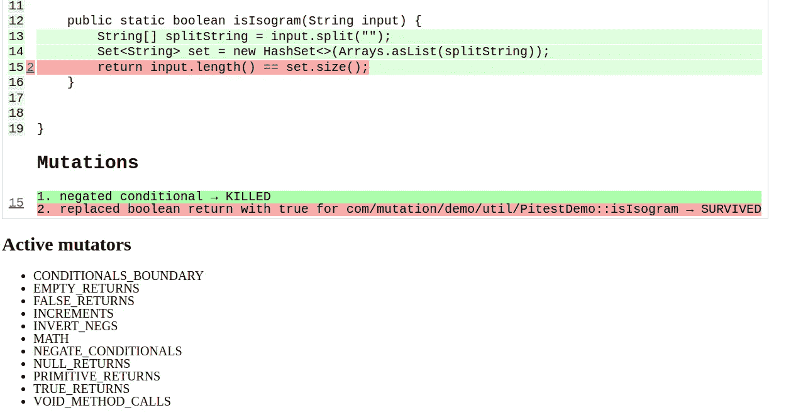

现在你可以看到 PIT 显示的结果与 Jacoco 略有不同。一些突变体存活了下来，这表明我们的测试需要改进。您可以在“突变”部分查看创建了哪种突变。这些是默认的变异函数。如果你想禁用一些或者添加新的，在插件中配置`<mutators>`属性。这里是所有可能变异的列表。

让我们编写额外的测试来覆盖缺失的案例。

根据报告，当方法返回 false 时，我们不检查结果。

```
@Test
void generateNumberFromRange_shouldReturnFalse() {
    var result = PitestDemo.isIsogram("look");
    Assertions.assertFalse(result);
}
```

重新运行测试:

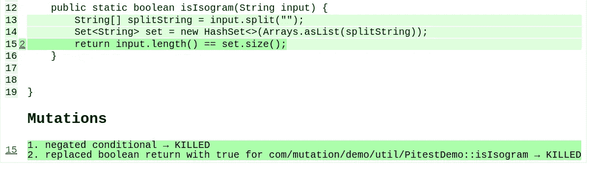

这次我们涵盖了所有案例！

让我们考虑另一个例子:

```
public static boolean isWithinRange(int number) {
    return number <= 100 && number >= 10;
}
```

此方法检查提供的数字是否在 10 和 100 之间。

以下是 JUnit 测试:

```
@ParameterizedTest
@ValueSource(ints = {15, 100})
void isWithinRange_shouldReturnTrue(int input) {
    var result = PitestDemo.isWithinRange(input);
    Assertions.assertTrue(result);
}

@ParameterizedTest
@ValueSource(ints = {105, -150})
void isWithinRange_shouldReturnFalse(int input) {
    var result = PitestDemo.isWithinRange(input);
    Assertions.assertFalse(result);
}
```

这一次，我们使用`@ParameterizedTest`和`@ValueSource` [Jupiter](https://junit.org/junit5/) 注释测试各种输入。

这是标准报告:

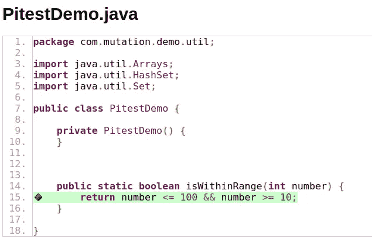

方法行覆盖率的 Jacoco 报告

维修站报告如下所示:

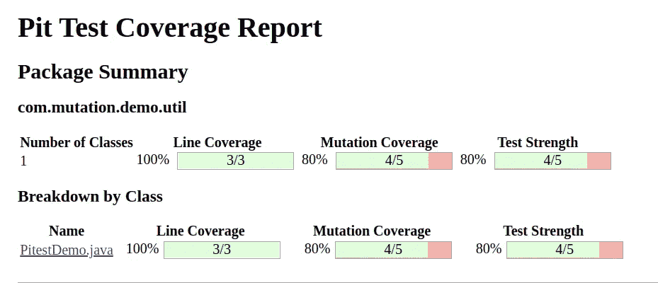

总体维修站报告

详细的测试案例报告:

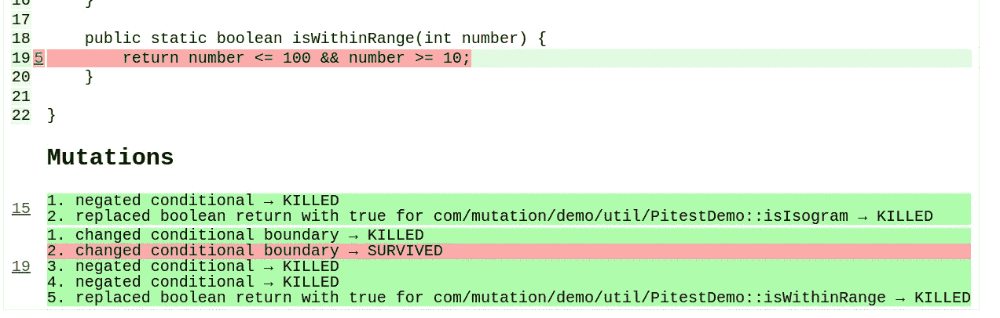

详细的方法覆盖报告

差不多好了。我们没有包括覆盖下限的测试，下限是 10。让我们将值添加到值列表中:

```
@ParameterizedTest
@ValueSource(ints = {10, 15, 100})
void isWithinRange_shouldReturnTrue(int input) {
    var result = PitestDemo.isWithinRange(input);
    Assertions.assertTrue(result);
}
```

PIT 结果:

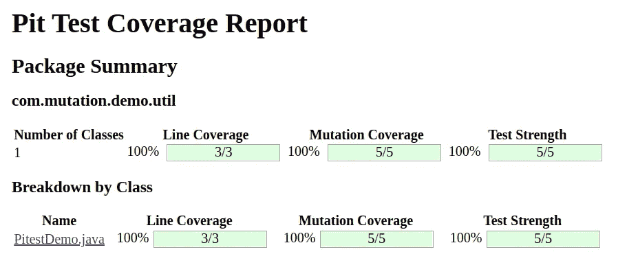

涵盖所有维修站的整体报告

太好了，现在一切都准备好了！

# 结论

本教程教你如何使用 Pitest 插件进行突变测试。这对你的单元测试的质量是有益的。

正如你所看到的，这个插件是高度可配置的。我鼓励您查看所有选项的文档，以充分利用它。

请注意，突变测试的执行可能是耗时且昂贵的。应该谨慎使用。理想情况下，当我们修改或添加新类时。

我希望你能从这篇文章中学到一些新的东西。如果您对关于测试的主题感兴趣，您可能会喜欢我的类似文章:

[](/how-to-test-databases-easily-in-a-spring-boot-application-5ccdfbc6309f) [## 如何在 Spring Boot 应用程序中轻松测试数据库

### 嵌入式数据库和 Testcontainers 库的测试技术

better 编程. pub](/how-to-test-databases-easily-in-a-spring-boot-application-5ccdfbc6309f) [](/archunit-test-software-architecture-easily-a874c54bda1e) [## ArchUnit:轻松测试软件架构

### 如何使用 ArchUnit 验证 Java 项目中的架构约束

better 编程. pub](/archunit-test-software-architecture-easily-a874c54bda1e) 

感谢您的阅读，下次再见！

# 参考

*   [我的 GitHub 回购](https://github.com/kirshiyin89/mutation-testing-demo)
*   [官方 Pitest 用户指南](https://pitest.org/quickstart/)