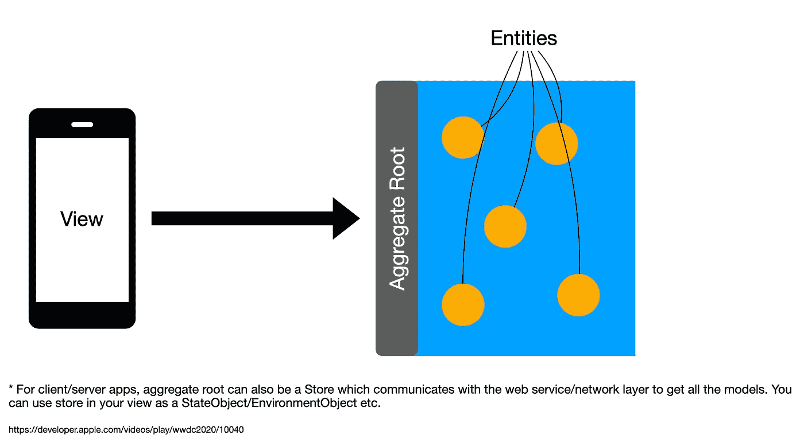
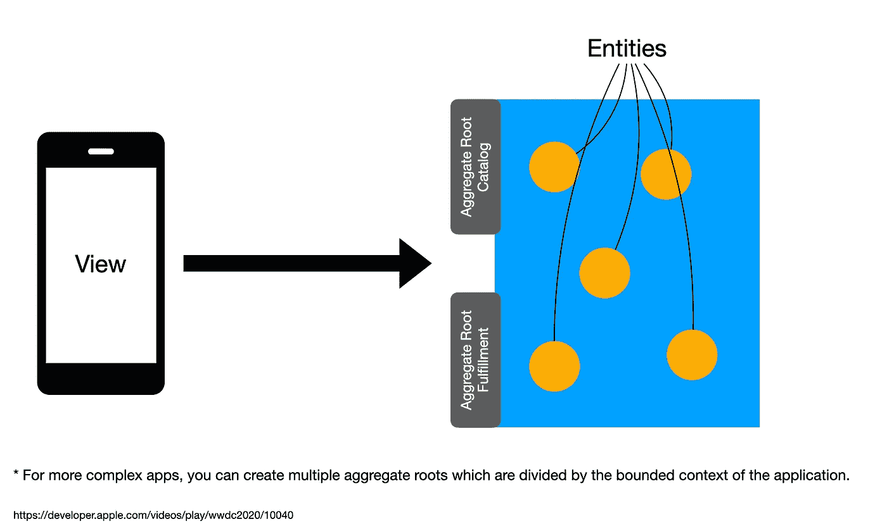
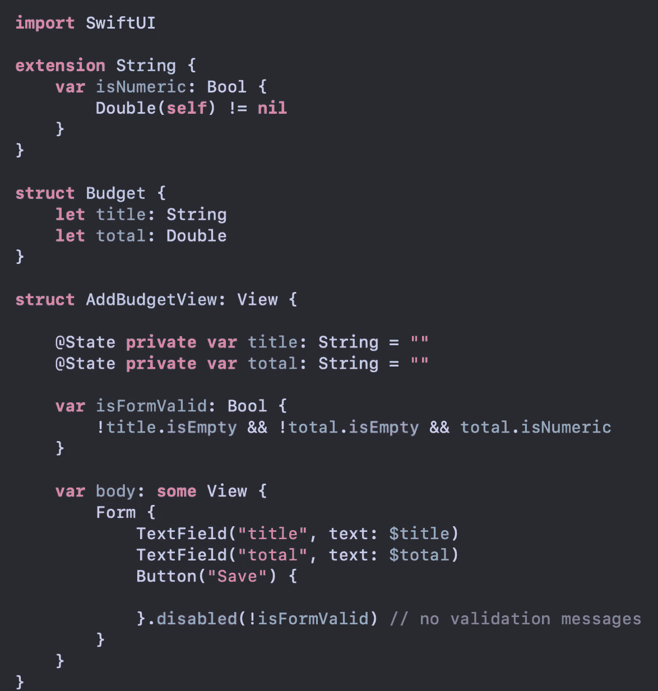
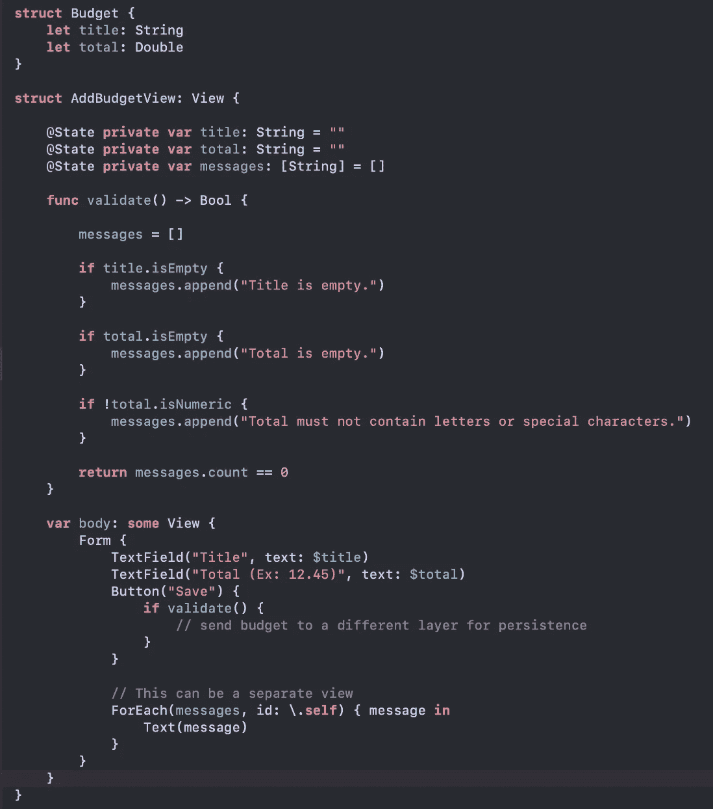
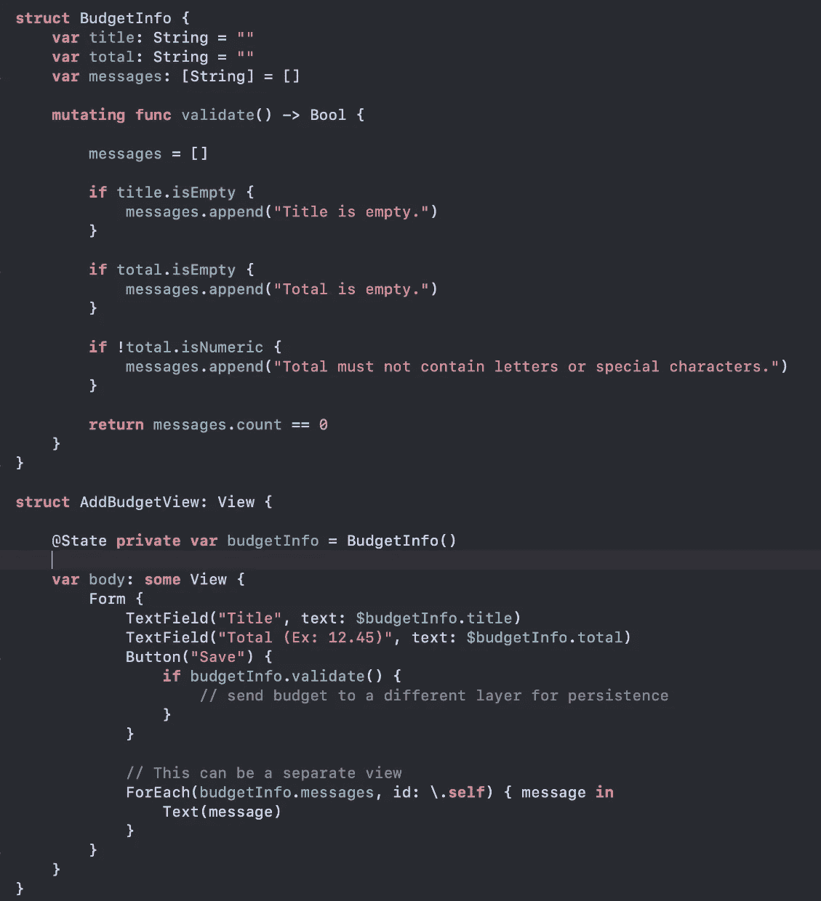

# MV 状态模式——构建 SwiftUI 应用的更好方式

> 原文：<https://betterprogramming.pub/mv-state-pattern-a-better-way-of-building-swiftui-apps-2cf2da6652fa>

## 介绍 MV 模式


照片由[帕特里克·福尔](https://unsplash.com/@patrickian4?utm_source=unsplash&utm_medium=referral&utm_content=creditCopyText)在 [Unsplash](https://unsplash.com/s/photos/road-light?utm_source=unsplash&utm_medium=referral&utm_content=creditCopyText) 拍摄

> 更新:我写了这篇文章的一个更详细的版本，标题为“[用 SwiftUI 构建大规模应用程序——模块化架构指南”。](https://medium.com/@azamsharp/building-large-scale-apps-with-swiftui-a-guide-to-modular-architecture-9c967be13001)

2019 年开始做 SwiftUI 框架。像大多数开发人员一样，我也加入了 MVVM 的行列。我写了关于它的书，做了演示，甚至制作了很多视频。尽管我设法让 MVVM 在我几乎所有的项目中使用 SwiftUI。但这是一场持久战。我一直觉得我在和 SwiftUI 框架战斗。即使对于中小型项目，我也觉得我写了太多代码，增加了不必要的层。在这篇文章中，我将介绍 MV 模式。这不是我发明的东西。这与苹果在 SwiftUI 应用程序的代码样本中使用的模式相同。查看本文末尾的参考资料部分。

> 我可以理解，我们不应该在应用程序的架构方面采纳苹果的建议。但是在和 SwiftUI 和 MVVM 一起工作了 3 年之后，我发现 MV 模式变得更好更容易使用(至少对我个人来说)。这并不意味着 MVVM 在 SwiftUI 的世界里毫无用处。有时，您需要一个视图模型来展平数据，甚至为大型视图执行验证。我反对的是为每个屏幕创建一个单独的视图模型。通常情况下，这是完全不必要的，而且毫无必要地增加了项目的复杂性。如果 MVVM 为你工作，那就给你更多的权力！

# 什么是 MV 状态模式？

首先，MV 状态模式不是这种模式的正式名称。有人称之为状态模式，有人称之为模型视图模式。我将简单地称之为 MV 模式或 MV 状态模式。在这篇文章中，我将介绍如何使用 MV 模式编写 SwiftUI 应用程序。你会看到，当你在 SwiftUI 中使用 MV 模式时，事情变得更简单，更容易管理。

MV 模式的基本思想是用户将执行改变/突变状态的动作。这将导致视图再次渲染。这将是一个持续的循环。每当一个动作改变了状态，一个新版本的视图就会被创建并呈现在屏幕上。下图显示了这一点。


[通过 SwiftUI 的数据流](https://developer.apple.com/videos/play/wwdc2019/226/)

> 请注意，苹果公司从未明确称之为模式，MVI·帕滕。

用户触发的动作将改变状态。这种状态可以存在于由`@State`属性包装器、模型对象甚至视图模型修饰的单个属性中。继续阅读，我将在聚合根部分讨论如何使用 MV 构建应用程序。

尽管 MVVM 已经成为 SwiftUI 应用的默认架构，但它引入了大量不必要的代码，而这些代码在大多数情况下是不需要的。与 WPF(Windows Presentation Foundation)不同，SwiftUI views 具有内置绑定。这意味着 SwiftUI 视图不仅是视图，还是视图模型。我在我的上一篇文章[中提到过，SwiftUI 视图是视图模型](https://azamsharp.com/2022/07/21/view-is-the-view-model.html)。

如果你有兴趣用 SwiftUI 阅读我对 MVVM 的看法，那么你可以查看参考部分的文章。本文致力于解释 MV 状态模式的架构。

上图简单展示了一个普通 SwiftUI app 的流程。状态携带来自模型的数据，并将其直接提供给视图。一个动作可以通过点击按钮或者甚至一个外部事件来触发。在下一节中，我们将看到如何使用 Aggregate Root 来应用这个模式。

# 聚集根

聚合根背后的主要概念是一个可观察的对象将作为访问模型对象的网关。所有模型都将是在 Swift 中使用 struct 数据类型实现的值类型。这为你的应用程序提供了一个存放所有逻辑的地方。这可以从下图中得到解释。



还可以使用 SwiftUI 中的`@EnvironmentObject`将聚合根模型作为全局对象注入。在客户端/服务器应用程序中，您的商店也可以充当聚合根。Store 只是一个可观察的对象，它与外部服务(网络层)通信以将数据发送到视图。

对于更复杂的应用程序，您可以基于应用程序的有界上下文引入多个聚合根对象。如下图所示。



> 请记住，划分您的模型并把它们放到各自的聚合根对象中并不容易。这需要广泛的领域知识，领域专家会让你受益匪浅。

让我们看看这在代码中会是什么样子。我们将使用来自[山寨商店 API](https://fakestoreapi.com/products) 的 JSON。我们将从实现我们的`Product`模型开始。

接下来，我们将实现一个网络层。

> 您可以在 Webservice 类中添加一个配置选项，以便它可以在不同的环境之间切换。

最后，我们将实现我们的聚合根。这将被称为存储，如下所示:

乍一看，您可能会觉得 Store 只是一个名称不同的视图模型。但是商店不是一个视图模型。Store 是一个聚合根，它允许您的应用程序访问模型对象。我们不会为每个屏幕创建单独的视图模型。我们将在视图中直接使用 Store 并获取我们需要的数据。如果您希望商店在所有视图中都易于访问，那么您可以将商店实例作为`@EnvironmentObject`注入。

> 对于较大的应用程序，您可能希望将全局状态分成多个部分。你可以在这里读到它。

# 更新(2022 年 8 月 20 日):

根据您的应用，您甚至可能不需要单独的商店层。您可以直接使用 web 服务从视图中进行调用。如下图所示存储:

如果您的应用程序有多个有界上下文，那么您的单个 web 服务将被划分为多个服务，以满足每个有界上下文的需求。这意味着你可以拥有 **AccountService** 、 **UserService** 、 **ProductService** 等等，而不是单一的 Webservice 类。

> 每个 app 都不一样。如果您的架构要求您必须有一个专用的网络层，那么就添加它。

接下来，我们将把存储注入到环境对象中，这样它就可以在整个应用程序中使用。

> 对于这个应用程序，您可以简单地将 Webservice 注入到 EnvironmentObject 中，因为我们的商店做得不多。只有当您计划访问其他视图中的数据时，才需要注入 EnvironmentObject。

最后，我们可以在视图中直接使用商店。

视图使用存储获取模型对象，然后直接将其绑定到屏幕上。在视图和模型之间不需要视图模型层。SwiftUI 中的视图也是一个视图模型。如上所示，这并不意味着您可以开始将 URLSession 放到视图中。您仍然需要一个网络层来执行我们前面实现的请求。

> 当共享同一个环境对象时，所有使用该环境对象的视图都将被渲染。这主要包括子视图，甚至导航栈中的视图。如果这开始引起问题，那么你可能必须切片你的全局状态。我在我的文章[这里](https://azamsharp.com/2022/07/01/slicing-environment-object.html)中提到过。

# 核心数据

在上一个例子中，我们讨论了客户机/服务器应用程序。但是当我们移除服务器组件时，MV 模式是如何工作的呢？在这一节，我将分享我现有应用程序(BudgetApp)的代码片段，你可以从这里的[预算应用程序](https://github.com/azamsharp/BudgetApp)下载。

核心数据提供了几个属性包装器，允许从视图(视图模型)中方便地访问数据。这包括`@FetchedRequest`、`@SectionedFetchRequest`甚至`NSManagedObjectContext`。

*请注意，在 SwiftUI 中，视图也是视图模型。*

如下所示实现了一个`@FetchRequest`属性包装器。

`@FetchRequest`从环境中访问 managedObjectContext。您可以下载[完整代码](https://github.com/azamsharp/BudgetApp)来查看实现。`@FetchRequest`属性包装器不仅根据请求获取记录，还保持它们是最新的。这意味着如果您添加一条新记录，那么@FetchRequest 将进行另一次调用，并从数据库中获取最新的记录。

如果您对核心数据使用 MVVM 模式，那么您可能需要实现`NSFetchedResultsController`来获得相同的功能。这需要大量的工作，你可以在我的 YouTube 视频中查看。

在视图中使用`@FetchRequest`确实带来了一些挑战。最大的问题是，现在我们不能重用同一个请求，因为它被绑定在视图中。在某些情况下，您不在乎重用相同的请求，因为它是特定视图的一部分，但是在其他情况下，您需要从不同的视图执行相同的请求。在这些情况下，您可以将请求移动到相应的模型中。这显示在下面的实现中。

`BudgetCategory`是核心数据模型，我们正在向该模型添加一个名为“all”的新静态属性。“all”属性创建并返回可以在视图中使用的`NSFetchRequest`。如下所示:

由于可以在视图中直接访问 NSManagedObjectContext，持久化数据也变得更加容易。这显示在下面的实现中:

> 请注意，在 SwiftUI 中，视图也是视图模型。

您可能想知道，当我们在 SwiftUI 中使用核心数据时，到底是什么在充当聚合根。当使用上述技术在 SwiftUI 中构建核心数据应用程序时，NSManagedObjectContext 被视为聚合。通过 NSManagedObjectContext，您可以访问模型并持久化它们。

# 确认

在任何 iOS 应用程序中，验证用户输入的数据都是强制性的。你可能听过“垃圾进，垃圾出”这句话。如果您让您的用户输入无效的数据，那么它会一直到达您的数据库。为了验证，我将分享一些我之前在社交媒体上发布的截图。

## 简单验证(无错误消息)

这种验证可以用于不需要向用户显示验证错误消息的简单视图。通过禁用按钮来进行验证。如果表单有效，则允许用户提交表单，否则就不允许。



## 带有错误消息的验证



这种验证可用于需要向用户显示验证消息的表单。validate 函数执行验证并将消息存储在一个数组中。稍后，这些信息会显示在屏幕上。

## 带有错误消息的验证(单独的视图状态)



当您有一个大的表单要验证，并且不想将所有代码都放在视图中时，可以使用这种验证。对于这个场景，我们创建一个单独的结构(BudgetInfo)来保存 UI 的状态。你可以把`BudgetInfo`想象成一个视图模型，它可以自我验证。

> 出于演示目的，我将所有代码放在同一个文件中。必要时，请确保创建单独的文件。

## 使用属性包装进行验证

另一种验证方式是为每个验证场景创建属性包装器。这意味着您将拥有`@Required`、`@Email`、`@Min`、`@Max`的属性包装器。我手头没有一个例子，但你绝对可以看看 [ValidatedPropertyKit](https://github.com/SvenTiigi/ValidatedPropertyKit) 。

我最近发了一篇关于在 SwiftUI 中执行验证的不同方式的推文。你一定要来这里看看。

# 测试

在 SwiftUI 中使用 MVVM 的一个论点是，它允许开发人员轻松地为他们的视图执行单元测试。这是一个有效的论点，因为拥有一个单独的视图模型层确实允许简单的测试。您可以调用视图模型上的操作，并见证视图模型属性的更改。如果没有额外的视图模型层，这种内存 UI 测试可能是不可能的，但是您仍然可以为 SwiftUI 应用程序编写 UI 测试。您可以使用内置的 Xcode UI 测试项目，也可以使用名为 [ViewInspector](https://github.com/nalexn/ViewInspector) 的框架。

## 边注

Kent Beck 说得好，“我是为有效的代码而不是为测试而获得报酬的，所以我的哲学是尽可能少地测试以达到给定的置信度”。

如今，我看到开发人员虔诚地测试他们的每一行代码，并以 100%的代码覆盖率为目标。开发人员拿工资是为了写特性/代码，而不是单元测试。但是我总是在项目中看到测试代码几乎是实际代码库的 3 倍。

测试当然非常重要，但前提是你要编写有意义的测试。考虑一个案例，我们必须为下面的场景编写一个单元测试。

`A user should be able to add transaction to their existing budget`

如果这个操作是您的模型的一部分，那么您的测试应该创建一个用户，在数据库中为该用户添加一个预算。然后向预算中添加一个新事务，然后检查该事务是否添加成功。

不幸的是，大多数开发人员会忽略数据库部分，并针对模拟对象运行他们的测试。最后，他们的测试运行得很快，他们很高兴看到测试通过，但是他们到底测试了什么。他们只是测试了他们的模拟对象是否如预期的那样工作。在这种情况下，一个真正的测试将触及数据库，并检查是否满足所有的规则。

*对于上述场景，我们正在考虑通过核心数据或领域管理 Sqlite 等设备数据库。*

我曾与拥有 2000 多项测试的公司合作过。但是如果你仔细观察，你会发现这些测试并没有测试任何与商业领域相关的东西。他们实际上是在测试编程语言。这就是为什么测试应用程序的行为而不是实现是极其重要的。在编写测试时，问问自己测试的是什么业务逻辑。如果你不能回答这个问题，那么就停止写测试。

我给予领域层单元测试和完整系统端到端功能测试更多的优先权。功能系统测试将确保系统与应用程序的所有其他层一起工作。您不必为您的控制器或视图模型编写测试。所有这些层都将在端到端功能测试中进行测试。

我希望在以后的文章中会涉及更多关于测试的内容。

# 结论

没有一个单一的架构适合每一个应用。这意味着你应该始终关注你的应用，并根据你的需求选择最佳架构。

没有灵丹妙药。

# 我的资源

*   [我错了！MVVM 不是构建 SwiftUI 应用的好选择](https://azamsharp.com/2022/07/17/2022-swiftui-and-mvvm.html)
*   [SwiftUI 视图也是一个视图模型](https://azamsharp.com/2022/07/21/view-is-the-view-model.html)
*   [Fruta App](https://developer.apple.com/documentation/swiftui/fruta_building_a_feature-rich_app_with_swiftui)
*   [食品车](https://developer.apple.com/documentation/swiftui/food_truck_building_a_swiftui_multiplatform_app)
*   [MVVM 适合 SwiftUI 吗？](https://www.raywenderlich.com/35112528-is-mvvm-right-for-swiftui-live-seminar-coming-soon)
*   [使用 MV 状态模式在 SwiftUI 中验证表单](https://youtu.be/J6GhNGlF4L8)
*   [使用 SwiftUI 中的 MV 状态模式执行网络操作](https://youtu.be/XqiW6lselfc)
*   [停止使用 SwiftUI 的 MVVM](https://developer.apple.com/forums/thread/699003)
*   [为什么大多数单元测试都是浪费](https://rbcs-us.com/documents/Why-Most-Unit-Testing-is-Waste.pdf)
*   [TDD 死了吗？](https://youtu.be/z9quxZsLcfo)
*   [TDD，到底哪里出了问题](https://youtu.be/EZ05e7EMOLM)
*   [切片全局状态](https://azamsharp.com/2022/07/01/slicing-environment-object.html)

```
If you liked this article and want to support my work then check out my [Udemy courses](https://azamsharp.com/courses).
```