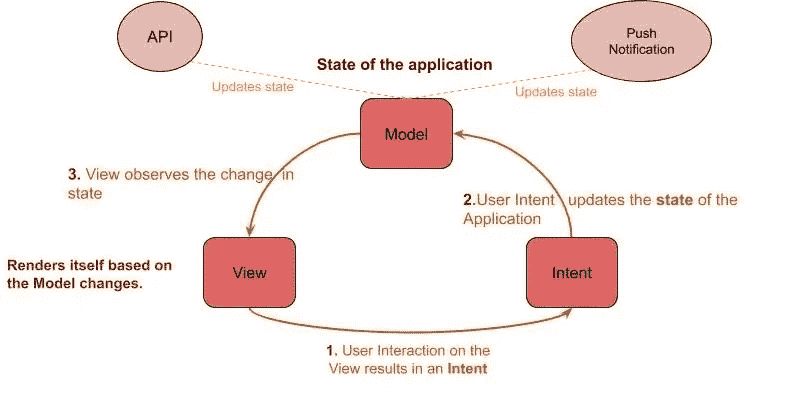
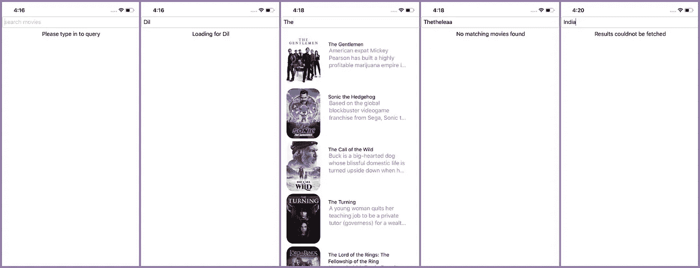

# 斯威夫特 ui——MVI 建筑

> 原文：<https://betterprogramming.pub/mvi-architecture-for-swiftui-apps-cff44428394>

## iOS 的模型-视图-意图

杰里米·珀金斯在 [Unsplash](https://unsplash.com?utm_source=medium&utm_medium=referral) 上拍摄的照片

模型-视图-意图(MVI)是 Android 世界中一个流行的架构。它是由汉尼斯·多尔夫曼介绍的。这里可以找到[。就本文而言，下面是对 MVI 的简要介绍。](http://hannesdorfmann.com/android/mosby3-mvi-1)

MVI 是一个循环的单向数据流架构。

*   ***模式*** 代表应用的状态。它包含呈现屏幕所需的属性。
*   ***意图*** 是改变系统状态的事件——例如，用户点击是改变系统状态的事件。还有，叫它[ **互动** ]。
*   ***视图*** 观察状态变化并相应更新自身。

## **图形表示:**

MVI 建筑设计

1.  用户与视图交互以创建意图。
2.  意图改变应用程序的状态。
3.  状态的变化会更新视图。循环重复。

**注意:**另外，API 和推送通知也会改变应用的状态。

# SwiftUI 中的 MVI 实施

出于演示的目的，我们将实现一个电影搜索屏幕。它有一个`TextField`来输入要搜索的关键字。以下是与关键字匹配的电影列表。

## 型号**(应用状态)**

首先，让我们考虑应用程序的可能状态。在任何给定的时间，应用程序将处于下列状态之一。稍后，您将看到我们有一个对应于每个状态的视图。

视图的详尽状态列表

*   `InitState`:初始状态。没有查询到任何内容。
*   `Loading`:关键字已经输入，正在从 API 中取电影
*   `SuccessfullyFetched`:API 返回匹配电影时
*   `NoMatchingResults`:查询未找到结果时
*   `ApiError`:HTTP 请求失败或 API 返回错误

我们将使用 Swift 的`Enum`来保持状态。

## SearchPageViewModel(业务层)

*   它包含应用程序的状态。
*   从视图接收意图并更新状态。
*   将更新后的状态发布到视图。

让我们看看它的实现。`SearchPageViewModel`是一个保存应用程序状态的数据保存类。它符合`ObservableObject`协议。`ObservableObject`协议中的任何东西都可以在它的值发生变化时发出通知，这样 SwiftUI 视图就可以自我更新。

它有一个名为`uiState`的变量，类型为`SearchPageState`。它用`Published`属性包装器包装。这样，当它的值改变时，它可以通知视图。

该类接收意图，进行 API 调用以获取数据，并更新应用程序的状态。

`loadMovies`当想要获取匹配的电影时调用的函数。下面的注释显示了该函数如何更新应用程序的状态。

SearchPageView 的数据持有者。这也显示了进行 API 调用的业务逻辑。

## 视角

我们显示一个`TextField`来输入关键字。在它的下面，我们有一个显示应用程序状态视图的组。

演示:当我们提交(点击搜索按钮)时，它向`SearchPageViewModel`发送一个 intent 来更新状态。`SearchPageViewModel`然后制作一个 API 来更新状态。

初始化→加载→ [ `SuccessfullyFetched` | `NoResultsFound` | `ApiError` ]

该小组拥有`SearchPageState`的详尽案例，以及应用程序每个状态的对应视图。

搜索页面视图——它上面的交互创造了意图

## 目的

它是视图上的交互。意图被传播到`SearchPageViewModel`，从而改变其状态。示例:输入查询后按下搜索图标是为了加载匹配的电影。

`vm.loadMovies(query: self.query)`是一个意向。

将意图通知给 SearchPageViewModel

你可以在这里找到完整的代码

 [## AnupAmmanavar/Mvi-SwiftUI

### 此时您不能执行该操作。您已使用另一个标签页或窗口登录。您已在另一个选项卡中注销，或者…

github.com](https://github.com/AnupAmmanavar/Mvi-SwiftUI/tree/master/MovieSearch/search) 

# **关闭点**

现在您已经了解了 MVI 及其实现，我们将询问*为什么这与 SwiftUI 相关？*

像移动应用程序这样的 UI 应用程序总是试图使视图与应用程序的状态保持同步。例子:想象一下驾驶一辆汽车。仪表盘上的速度读数无非就是车的状态(速度)。如果仪表板显示一个错误的读数，那么它是不一致的。

SwiftUI 有一个基础设施，其中数据被绑定到 UI(数据绑定)。在 SwiftUI 中，显示警报是通过绑定来控制的。框架**处理数据更改后重新呈现(无效)视图的性能影响。**所以用数据驱动 UI (data-driven UI)会消除数据和 UI 之间存在的不一致。