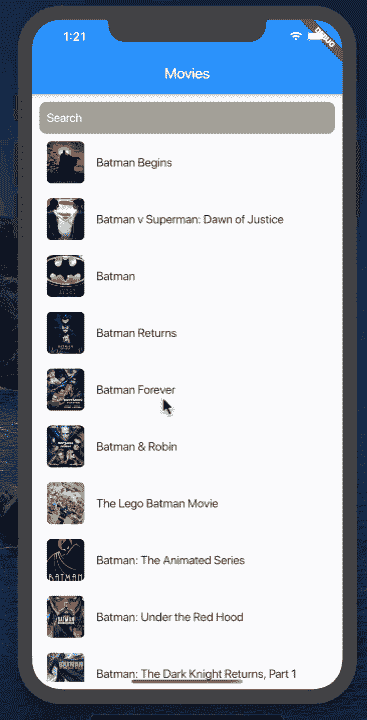

# 《飘动中的 MVVM》简介

> 原文：<https://betterprogramming.pub/mvvm-in-flutter-edd212fd767a>

## 在这篇文章中，我们将使用 MVVM 设计模式来编写一个完整的 Flutter 应用程序


在 [Unsplash](https://unsplash.com/photos/GC80BXJf0Yw) 上由 [Duy Huong](https://unsplash.com/@zuizuii) 拍摄的照片

Flutter 是一个跨平台的框架，允许你使用单一代码库编写 iOS 和 Android 应用。

默认情况下，Flutter 应用程序不使用任何特定的设计模式。这意味着开发人员负责选择和实现适合他们需求的模式。颤振的声明性本质使其成为 MVVM 设计模式的理想候选。

# 了解 MVVM

[MVVM](https://www.wintellect.com/model-view-viewmodel-mvvm-explained/) 代表模型-视图-视图模型。基本思想是创建一个视图模型，为视图提供数据。视图可以使用视图模型提供的数据来填充自己。创建一个视图-模型层允许您编写模块化代码，这些代码可以被多个视图使用。

MVVM 设计模式起源于微软。MVVM 被大量用于编写 Windows 演示基础 [(WPF](https://docs.microsoft.com/en-us/visualstudio/designers/getting-started-with-wpf?view=vs-2019) )应用程序。MVVM 模式是展示模型的一个别出心裁的名字。

[](https://www.udemy.com/course/flutter-dart-mvvm-design-pattern/?referralCode=3E32698D188E47553501) [## 终极手摇& MVVM -建造真实的项目

### Google Flutter 框架风靡全球。Flutter 允许开发人员编写一个单一的代码库…

www.udemy.com](https://www.udemy.com/course/flutter-dart-mvvm-design-pattern/?referralCode=3E32698D188E47553501) 

由于设计模式是平台无关的，它可以用于任何框架，包括 Flutter。

在这一部分中，我们将创建一个电影应用程序，它将根据输入的关键字获取电影并显示给用户。这个应用程序将根据 MVVM 原则创建。在深入研究代码之前，先看看下面的动画，了解一下我们将要构建的应用程序。



电影 spp

## 实现 web 服务

我们将使用 [OMDb](http://www.omdbapi.com/) API 来获取电影。确保您在他们的网站上注册以获得 API 密钥。没有有效的 API 密钥，您将无法执行成功的请求。

现在您已经注册了 OMDb 服务并收到了您的密钥，我们可以继续实现 web 服务/客户机了。web 服务使用 [HTTP](https://pub.dev/packages/http) 包发出网络请求并下载 JSON 响应，但是您可以随意使用任何网络包。

JSON 下载后，它被提供给电影模型以获得电影对象的列表，如下所示:

电影模型实现如下:

只包含一个标题和一张海报。它还公开了一个`fromJson`函数，允许我们基于 JSON 响应创建一个`Movie`对象。

我们使用术语*模型*来定义我们的`Movie`对象，但是，实际上，它们服务于数据传输对象(DTO)的目的。

至此，我们已经获得了所有需要的数据，下一步是在屏幕上显示这些数据。在进入用户界面之前，我们必须创建视图模型，负责向视图提供数据。

## 实现视图模型

虽然您可以通过创建单个视图模型来获得想要的结果，但是我们将在我们的应用程序中创建两个单独的视图模型。

一个视图模型，`MoviesListViewModel`，将代表显示电影的整个屏幕。第二个视图模型`MovieViewModel`将代表一个单独的电影——它将在视图中显示。

视图模型的实现如下所示:

`MovieListViewModel`由 movies 属性组成，该属性将返回一列`MovieViewModel`对象。`MovieViewModel`接受一个`Movie`对象，并将标题和海报作为只读属性返回。下一步是使用 web 服务获取电影。

## 设置 ChangeNotifier 和 ChangeNotifierProvider

`MovieListViewModel`中的`fetchMovies`方法负责在 web 服务的帮助下从 OMDb API 中检索电影。

实现如下所示:

我们已经更新了我们的`MovieListViewModel`来继承`ChangeNotifier`。`ChangeNotifier`允许我们发布变更通知，视图可以使用这些通知来更新自身。

在我们使用 web 服务获取电影之后，我们调用`notifyListeners`函数，通知所有的订阅者/听众。目前，没有人听，所以没有人被通知电影已经下载。

为了用更新后的`MovieListViewModel`通知视图，我们将不得不使用`ChangeNotifierProvider` **、**这是[提供方](https://pub.dev/packages/provider)包的**、**部分。通过在`pubspec.yaml`文件中添加依赖项来添加提供方包，如下图所示:

接下来，我们需要找到一个好的地方，从供应商那里注入价值。我们谈论的价值是`MovieListViewModel`的一个实例，因为它扩展了`ChangeNotifier`并且向听众发布通知。

在我们的例子中，我们可以使用`main.dart`文件并将值注入到`MovieListPage`中。这意味着`MovieListViewModel`将可用于`MovieListPage`及其所有子代。

太棒了。最后一步是在屏幕上显示数据。这将在下一节中介绍。

## 显示电影

对于我们的应用程序，我们会要求用户输入关键字，然后按键盘上的返回键。这将调用`MovieListViewModel`上的`fetchMovies`方法，如下所示:

`fetchMovies`将根据关键字获取所有电影，并触发`notifyListeners`。为了获得`MovieListViewModel`的更新实例，我们将从提供程序包中获得帮助，如下所示:

```
@override Widget build(BuildContext context) { 
final vm = Provider.of<MovieListViewModel>(context);
```

通过在构建方法中添加`Provider`，我们确保无论何时`notifyListener`被激发，我们都可以访问`MovieListViewModel`的实例。

现在，如果你运行你的应用程序，它会根据关键词获取电影，并在用户界面上显示出来。

如果您想在页面加载时进行初始提取，那么您可以将`StatelessWidget`更新为`StatefulWidget`并从`initState`方法内部调用`fetchMovies`，如下所示:

请注意，我们将`listen: false`传递给了`Provider`，这意味着这只是一次调用，更改不会被`Provider`跟踪。

在此查看 GitHub 回购[。](https://github.com/azamsharp/Movies-App-Flutter-MVVM)

[](https://www.udemy.com/course/flutter-dart-mvvm-design-pattern/?referralCode=3E32698D188E47553501) [## 终极手摇& MVVM -建造真实的项目

### Google Flutter 框架风靡全球。Flutter 允许开发人员编写一个单一的代码库…

www.udemy.com](https://www.udemy.com/course/flutter-dart-mvvm-design-pattern/?referralCode=3E32698D188E47553501) 

感谢阅读！