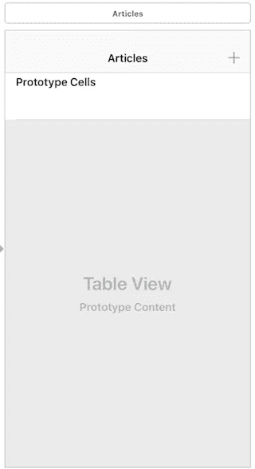

# iOS 中的 MVVM

> 原文：<https://betterprogramming.pub/mvvm-in-ios-from-net-perspective-580eb7f4f129>

## 通过将逻辑转移到视图模型中来减小庞大的视图控制器的大小

[为什么伟大的建筑应该讲述一个故事|奥雷·舍人— YouTube](https://www.google.com/url?sa=i&rct=j&q=&esrc=s&source=images&cd=&cad=rja&uact=8&ved=0ahUKEwi05eCOh4fXAhXKzlQKHTpLA8QQjhwIBQ&url=https%3A%2F%2Fwww.youtube.com%2Fwatch%3Fv%3DiQsnObyii4Q&psig=AOvVaw1NG_SNK-lTLIC4TEenM-V3&ust=1508858659679924)

本文有更新:**[*iOS 中的 MVVM(重访)*](https://medium.com/@azamsharp/mvvm-in-ios-revisited-1e2de1419ba6) *。***

**其他相关文章: [*在 iOS 中查看模型验证*](https://medium.com/@azamsharp/validation-in-mvvm-for-ios-5a819be221c8) 和 [*查看模型和联网*](https://medium.com/@azamsharp/mvvm-in-ios-viewmodel-and-networking-5bbe1d768c7f) *。***

**最近，有很多关于 iOS 应用中的 MVVM 以及它如何帮助驯服大规模视图控制器的症状的讨论。**

**构建 iOS 应用的默认架构模式是 MVC(模型视图控制器)，虽然 MVC 模式没什么问题，但大多数时候，视图控制器成了代码垃圾场。**

**MVVM 不是突然冒出来的新东西，它已经被使用了好几年，尤其是在。网络社区。我曾在许多大规模的 WPF(Windows Presentation Foundation)应用程序中成功使用过 MVVM。**

**说到这里，比较一下。NET WPF 框架对 iOS 框架是不公平的，因为 WPF 使用 XAML 和 [*依赖属性*](https://docs.microsoft.com/en-us/dotnet/framework/wpf/advanced/dependency-properties-overview) 的力量来进行双向无缝绑定。**

**在 iOS 中，我们没有任何类似于依赖属性的东西，即使有，我们也没有像 XAML 那样的声明式 UI 代码。**

**MVVM 模式背后的思想是，屏幕上的每个*视图* 将由一个表示视图数据的*视图模型* 支持。**

**这意味着，如果我们正在构建一个新闻应用程序，那么视图可能由一个允许您显示新闻条目的`UITableView`组成，视图模型将由表示新闻条目的数据组成，如标题、描述、`publishedDate`、作者、来源等。**

**下面显示了一个示例视图。它由一个简单的`UITableView`控件组成，该控件使用默认的`UITableView`单元格进行显示。**

****

**现在，考虑您想要在视图中显示什么数据。为了简单起见，我们将显示一个标题和描述。因此，视图模型将由能够提供标题和描述的属性组成。**

**我们的第一个实现可能如下所示:**

**这当然代表了我们想要在`UITableView`中显示的数据，但是它确实有一些缺点。**

**它只表示视图中可以被填充的部分。视图模型应该能够容纳完整的视图。查看下面的实现:**

**通过添加父视图模型`ArticleListViewModel`，我们可以更加灵活地控制屏幕上的项目。**

**如果将来我们需要添加一个搜索栏，那么我们可以简单地在我们的`ArticleListViewModel`中添加一个对`SearchViewModel`的引用。**

# **查看型号+联网=？**

**在研究 iOS 中的 MVVM 实现时，我遇到了许多资源，其中开发人员在视图模型中实现了网络代码和数据访问代码。**

**下面显示了一种可能的实现方式:**

**你的视图模型应该尽可能的简单。它不应包含网络代码或数据访问代码。**

**当您开始在视图模型中执行网络操作时，您正在视图模型层和 web 服务层之间添加紧密耦合。**

**更新:正如少数读者指出的，我认为您的视图模型不应该调用 web 服务是不公平的，因为长期以来一直使用 MVVM 架构的微软似乎确实提倡从视图模型内部调用 web 服务的想法。**

**即使在 iOS 社区，我也看到开发人员使用不同风格的 MVVM 架构。我鼓励你选择最符合你需求的 MVVM 建筑。**

**网络和数据访问操作应该从视图模型中分离出来，并且应该是单独的类或者甚至是单独的框架/库的一部分。**

**根据您的应用程序，网络和数据访问操作可以作为依赖注入传递到视图控制器构造函数中。**

**下面是一个 web 服务调用的实现，它发生在视图控制器内部，但是由一个单独的 web 服务类控制。**

**web 服务返回域对象，然后这些域对象被映射到视图模型对象。这种映射可以手动执行，或者使用任何类似于. NET 中的[自动映射器](http://automapper.org/)的 iOS 自动映射工具来执行。**

**最后，当映射完成时，我们设置触发`UITableView`重载的视图模型。由于`didSet`属性的行为，这个触发会自动发生。**

**请记住，当属性设置在类的构造函数中时，`didSet`不会被触发。**

# **MVVM 绑定**

**绑定指的是视图和视图模型之间的信息流。**

**考虑一个场景，您必须创建一个注册屏幕。当您在文本字段中键入信息时，它也会立即被填充到`RegistrationViewModel`对象上。**

**换句话说，您不必键入以下代码:**

**绑定是双向的！这意味着，如果修改视图模型属性，它会反映在视图中。这也称为双向绑定。**

**正如我前面提到的，在 WPF 框架中，绑定是由依赖属性处理的。不幸的是，Swift 没有任何依赖属性，因此我们必须做一些工作来实现这一点。**

**我们不能在字符串类型上放置一个观察者，这意味着我们将创建我们的自定义类并允许它被观察。**

**`[Dynamic<T>](http://rasic.info/bindings-generics-swift-and-mvvm/)`是一个自定义类，可以保存类型`T`的值。如果值改变了，那么我们触发`didSet`，它调用绑定函数，将值传递回调用者。实现如下所示:**

**这将建立从视图模型到用户界面元素的单向绑定。这意味着如果视图模型的属性发生变化，那么用户界面元素会得到通知。**

**为了创建一个双向绑定，您需要实现一个定制的`UITextField`控件。这在下面实现:**

**我们将`editingChanged`事件附加到`UITextField`上，然后触发一个自定义回调函数。现在，您可以更新`IBOutlets`来使用这个新的绑定函数，如下所示:**

**不漂亮，但它的工作！**

# **结论**

**这只是对 MVVM 模型的一个非常初步的了解。我相信，如果 Swift 允许定制属性的功能，iOS 中的 MVVM 方法将会大大改进。**

**这将允许我们创建动态验证框架，其中每个视图模型都可以轻松地验证和返回与视图相关联的不规则。**

**正如 Michael Long 在评论中指出的，MVVM 让测试观点背后的逻辑变得很容易。**

> **将`ViewController`的业务逻辑移入`ViewModel`的另一个好处是，`viewModel`为应用程序的这些组件创建单元测试变得容易多了。**

**您可以从这里下载代码:**

** [## azamsharp/HeadlinesMVVM

### 在 GitHub 上创建一个帐户，为 HeadlinesMVVM 的开发做出贡献。

github.com](https://github.com/azamsharp/HeadlinesMVVM)**