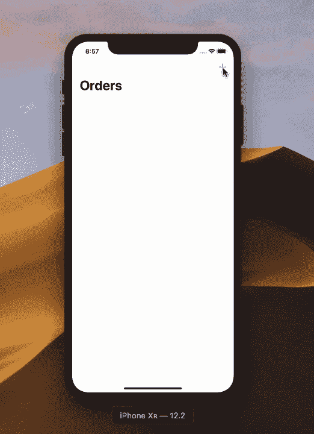
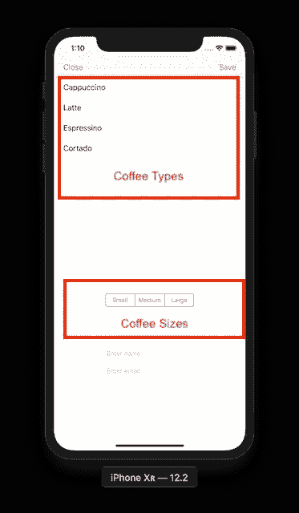

# iOS 中的 MVVM(重访)

> 原文：<https://betterprogramming.pub/mvvm-in-ios-revisited-1e2de1419ba6>

## 在应用程序中使用 MVVM 时需要考虑的新技术

[https://www . arc-magazine . com/WP-content/uploads/2018/06/KL-Sports-city . jpg](https://www.arc-magazine.com/wp-content/uploads/2018/06/KL-Sports-City.jpg)

前段时间，我写了一篇关于使用 Swift 编程语言在 iOS 中实现 [MVVM 设计模式的文章。我收到了很多关于这篇文章的很好的反馈。](https://medium.com/@azamsharp/mvvm-in-ios-from-net-perspective-580eb7f4f129)

这篇文章是我的原始文章的更新，重点关注实现 iOS 应用程序时的新技术，结合了 MVVM 设计模式。

本文的前提围绕着一个咖啡订购应用程序。咖啡师接受顾客的订单，包括以下内容:

*   名字
*   电子邮件
*   咖啡类型
*   咖啡大小

订单被发送到服务器并保存。最后，咖啡师能够在列表中查看顾客的所有订单。应用程序的演示如下所示:

热咖啡 iOS 应用

让我们开始吧。

# 计算机网络服务器

我使用 [Express](https://expressjs.com/) 在 [Node.js](https://nodejs.org/) 中实现了服务器。对于本文的目的来说，服务器并不那么重要。服务器的完整实现如下所示:

如您所见，我们的服务器没有使用任何数据库。咖啡订单存储在内存中。在实际的应用程序中，你肯定会使用数据库，否则当服务器重启时，所有的订单都会神奇地消失，导致客户愤怒。

该服务器也公开托管在 Heroku 上，网址为 [URL](https://guarded-retreat-82533.herokuapp.com) 。

# web 服务客户端

我们的首要任务是从服务器中检索所有订单。为此，我们将在 iOS 应用程序中实现一个 web 服务 API 客户端。

我们将首先创建我们的资源结构，它将表示资源类型、URL 和用于访问资源的方法(GET/POST)。

接下来，我们将实现如下所示的`Webservice`客户端:

`Webservice`类利用了 Swift 5 编程语言中新的*结果类型。*

结果允许我们关联成功和失败函数，这使得处理这两种情况更加清晰。如果您想了解更多关于结果类型的信息，请查看我下面的视频:

`Webservice`将返回可以映射到我们模型的 JSON 数据。在下一节中，我们将实现我们的`Order`模型。

# 实现模型

一旦`Webservice`返回数据，我们需要将它映射到我们的模型。Swift 4 引入了可编码协议，这有助于我们将 JSON 结果无缝地映射到一个类或结构，符合可编码协议。

`Order`模型的实现如下所示:

`Order`结构公开了与 Web API 返回的相同的属性。

请记住，模型的属性不一定要与 API 返回的响应相匹配。您可以使用`CodingKey`协议来提供定制映射。定制映射超出了本文的范围。

我们的`Order`模型还包含一些助手方法，允许它创建资源。看看下面的方法:

每个方法将负责返回一个`Resource`对象，该对象提供如何使用资源的信息。

*create* 方法接受一个视图模型对象，并使用它来实例化一个订单，然后将订单对象传递给 web 服务。

一旦模型被填充，它们需要在视图中显示数据。这就是视图模型的概念发挥作用的地方。

# 实现视图模型

视图模型的基本思想是从模型中获取数据，然后将数据提供给视图。

让我们来看看负责在屏幕上显示订单相关数据的`OrderViewModel`的实现。

`OrderViewModel`是一个简单的视图模型，它只是将数据作为原始类型返回给视图。因为它不返回复杂的对象，所以数据可以很容易地显示在视图上。

视图模型可以是智能的，也可以是简单的。

*   智能视图模型可以通过 web 服务层进行逻辑调用。
*   当一个视图模型简单地向视图提供数据，并且不执行任何复杂的操作时，我们就说它是简单的。

`OrderViewModel`代表每个订单，将显示在`UITableView`控件中。

虽然您可以简单地使用一个数组`OrderViewModels`并填充您的`UITableView`，但是我建议创建一个父视图模型来表示整个视图。

这样，您就可以灵活地为其他视图项(如`SegmentedControl`、`PickerView`等)提供数据。

我们应用中的父视图模型叫做`OrderListViewModel`。`OrderListViewModel`代表负责显示订单的整个屏幕。

我们将实现的第二个视图模型称为`AddCoffeeOrderViewModel`。这个视图模型负责提供数据以及从*添加咖啡订单*屏幕收集输入数据。

如果你看下面的咖啡订购屏幕，你会意识到在我们订购咖啡之前，咖啡订购屏幕需要一些不同的东西。

幸运的是，所有这些信息都可以由`AddCoffeeOrderViewModel`提供给视图。

需要注意的一点是`AddCoffeeOrderViewModel`的类型和大小属性。

这两个属性都返回`[String]`，它稍后被绑定到屏幕上。通过返回原始类型，我们可以很容易地在屏幕上显示信息。

# 添加新的咖啡订单

现在我们已经在屏幕上显示了咖啡的种类和大小，剩下的唯一步骤就是点一杯新咖啡。这是在`AddCoffeeOrderViewController`实施的。

当用户按下 save 按钮时，我们从 UI 收集所有选择，填充`AddCoffeeOrderViewModel`的实例，然后通过 web 服务发出请求，插入新订单。

实现如下所示:

请记住，在用用户选择填充视图模型之后，我们使用`Order.create`函数将视图模型转换成资源，然后使用我们的 web 服务层将其发送到服务器。

在本文中，我们没有使用任何第三方框架进行 UI 到 VM 的绑定。您可以使用 [RxSwift](https://github.com/ReactiveX/RxSwift) 或 [Bond framework](https://github.com/DeclarativeHub/Bond) 在您的应用中执行单向(UI 到 VM)绑定。

MVVM 设计模式允许我们将界面分成更小的组件。这有助于我们构建更多可定制的应用程序，也有助于我们为应用程序编写单元测试。

请记住，仅仅因为您正在使用 MVC 设计模式，并不意味着您将最终拥有一个庞大的控制器。

有一些方法可以重构你的控制器，并确保它是精简的。将自己的错误归咎于设计模式从来都不是一个好主意。最终，它只是一个设计模式。

# 资源

1.  [iOS 中的 MVVM](https://medium.com/@azamsharp/mvvm-in-ios-from-net-perspective-580eb7f4f129)
2.  [源代码](https://github.com/azamsharp/HotCoffee-MVVM)