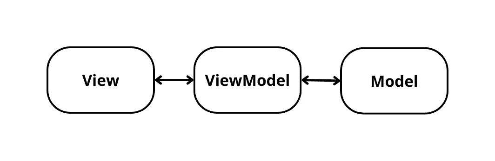

# 在 Jetpack Compose 中开始使用 MVVM

> 原文：<https://betterprogramming.pub/mvvm-in-jetpack-compose-part-4-fe757a1a1b84>

## 我们将学习如何将 MVVM 应用于 Jetpack Compose

马库斯·温克勒在 [Unsplash](https://unsplash.com?utm_source=medium&utm_medium=referral) 上拍摄的照片

您可以在这里找到关于 Jetpack 撰写教程的前一篇文章:

*   [通过构建应用程序一瞥 Jetpack Compose](/a-glimse-into-jetpack-compose-by-building-an-app-a7869723d4e8)
*   [Jetpack 排版](/layouting-in-jetpack-compose-8c16e687bfe5)
*   [Jetpack 撰写中的导航](/navigation-routes-in-jetpack-compose-ce2e0337ed28)

在本文中，我们将学习如何使用 Jetpack Compose 将 MVVM 应用于 Android 应用程序。

# 什么是 MVVM？

MVVM，又名模型-视图-视图模型是一个软件架构模式，它是为一个独立于业务逻辑(用例)的视图而设计的，业务逻辑将在`ViewModel`中处理。此图解释了模式本身。

MVVM 模式示意图

MVVM 分为三个部分:

1.  `View`:这个部分负责从`ViewModel`中指向的用例逻辑中为最终用户显示`User Interface`。这个部分还负责收集来自最终用户的输入，例如点击、提交表单，然后将其传输到`ViewModel`。通常该段由`activity`或`fragment`组成。
2.  `ViewModel`:这个部分负责表现逻辑，通常将业务逻辑从`Model`引导到`View`，或者从`View`给`Model`输入。
3.  `Model`:这个部分是应用程序的大脑。该部分负责从`ViewModel`指向`View`的业务逻辑。这个部分还处理从终端用户接收输入的用例。通常，该部分由服务类别组成。

更多关于 MVVM 的信息，你可以参考这里的——这篇文章也解释了 MVP。

# 这里我们的应用程序工作

使用 MVVM，我们的应用程序将或多或少类似于下图:

我们的应用程序由`HomeFragment`和`DetailFragment`(视图部分)组成，每个片段都有自己的`ViewModel`(视图模型部分)，它将引用存储库/服务(模型部分)。在存储库中，我们将从`rawg.io` REST API 中检索数据。

> 在我们开始之前，我们必须从 `*rawg.io*` *中检索我们的 API 密钥。请参考此链接进行检索。并储存了* `*ApiKey*` *。为了成功调用* `[*rawg.io*](https://rawg.io/apidocs)` *API* ，我们将需要这个。

# 我们开始吧

从应用级别打开`gradle`。请确保添加此代码。

因为我们需要检索 API，所以我们必须在应用程序中添加使用互联网的权限。打开`AndroidManifest.xml`添加这一行。

通常我们会从 API 响应中得到`Loading`、`Success`、`Failure`类型。因此，我们将把实用程序类命名为`Response.kt`。代码大致如下所示:

所以以后我们每次从 API 调用东西，都会参考这个类，找出 API response 会给我们哪个响应类型。

现在，让我们在应用程序中实现 MVVM。之前，我们构建了视图部分(`MainActivity.kt`、`HomeFragment.kt`、`DetailFragment.kt`)。现在，我们将构建`Model`部分和`ViewModel`部分。

我们将创建一个负责从外部资源调用 API 的类。记住，我们将从`rawg.io`调用 API。创建一个名为`GamesService.kt`的类。复制这段代码。

`GamesService.kt`中有三个主要功能:

*   `getAllGames`:使用参数`ApiKey`检索所有`Games`数据的函数，是哪一页，一次调用多少数据？该数据将存储在`GamesResponse.kt`中。(我们将在稍后创建它)
*   `getGamesDetail`:使用参数`ApiKey`检索`Games`的详细信息的函数，从`Games.kt`检索`id`，该数据将存储在`Games.kt`中。(我们将在稍后创建它)
*   `getInstance`:一个函数，是`GamesService.kt`的初始化，让`Retrofit`从`rawg.io`初始化服务。

请注意，我们使用了以前保存的`rawg.io`中的`ApiKey`。

现在我们需要创建一个名为`GamesResponse.kt`和`Games.kt`的数据类。这两个将被用作来自`GamesService.kt`的`Data Model`类。

`GamesResponse.kt`将存储`Games.kt`的列表，以及关于页面的其他信息。并且`Games.kt`将存储关于`Games`的细节的数据。

> `Games.kt`中的`null`和`GamesResponse.kt`被标记为可选数据。

现在，我们只需要将`GamesService.kt`解析成存储库和它们的功能。

创建名为`GamesRepository.kt`的接口类和名为`GamesRepositoryImpl.kt`的类，它们将从`GamesRepository.kt`接收实现类。复制代码，使该类如下所示:

`GamesRepositoryImpl.kt`中有两个主要功能:

*   `getAllGames`:这将被调用分页函数从`GamesService.kt`中检索`GamesResponse.kt`的批量
*   `getDetailgames`:这个将被称为`Games.kt`的`Response`，包含了`GamesService.kt`中`Games`的细节

现在我们为分页功能创建`GamesPagingSource.kt`。

关于`GamesPagingSource.kt`有两个主要功能:

*   `load`:该函数将从`response`参数调用`GamesService`函数的`getAllGames`，并将`nextPage`和`prevPage`信息存储到`paging`库中`PagingSource`类的`LoadResult`中。
*   `getRefreshKey`:该功能负责`load`想要执行的时候。该函数将返回`PagingState.anchorposition`，以便`load`知道用户现在处于哪个位置，因此负载将正确执行服务而不会出现问题。

> 注意到`GamesResponse`中的变量`next`为空，所以如果发生这种情况，我们将使用`nextPage`作为默认值。

关于`PagingSource`的更多信息，请参考这里的。

这些库是我们要在`ViewModel`中实现的。创建`HomeViewModel.kt`和`DetailViewModel.kt`。

`HomeViewModel.kt`负责检索一个`Games`的列表并将其导向`HomeFragment.kt`，同时`HomeFragment.kt`将寻呼信息的信息检索给`GamesRepository.kt`，供`PagingSource`决定是否要执行`load`。

`DetailViewModel.kt`负责从`DetailFragment.kt`中检索关于`Games`的信息(用户从`Games`列表中点击`Games`中的一个)，并将其导向`GamesRepository.kt`，从`GamesRepository.kt`到`DetailFragment.kt`中检索关于 API `response`的信息，以便最终用户了解 API `Response`。

# 结论

通过创建`Model`和`ViewModel`部分，我们已经了解了如何在应用程序中实现 MVVM。

这篇文章的所有代码可以在[这里](https://github.com/SkyairOnline/Jetpack-Compose)查看完整版本。

在下一篇文章中，我将讲述如何在 Jetpack Compose 中实现从视图模型部分到视图部分。下一篇文章是 Jetpack Compose 中 MVVM 的最后一部分。

你可以在这里看到我的下一篇文章

 [## 要在 Jetpack 撰写中查看的视图模型

### 了解如何在 Jetpack Compose 中将 ViewModel 应用于 MVVM 架构视图

better 编程. pub](/viewmodel-to-view-in-jetpack-compose-7c7183b54fb5)