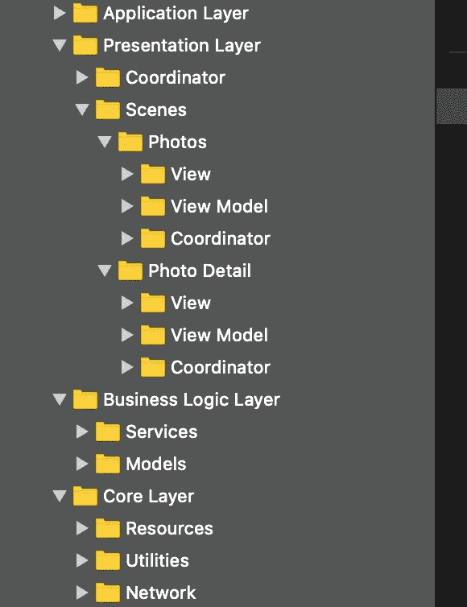
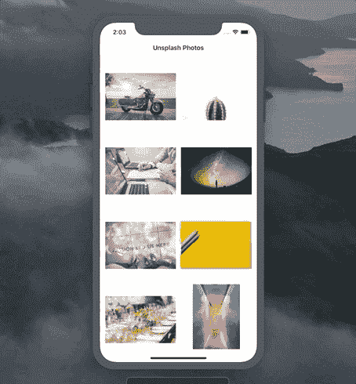

# 在 Swift 5 中实施反应式 MVVM 架构

> 原文：<https://betterprogramming.pub/mvvm-in-swift-infinite-scrolling-and-image-loading-d47780b06e23>

## 使用 RxSwift、Codable 和协调器设计模式

由[安朵斯·瓦斯](https://unsplash.com/@wasdrew?utm_source=medium&utm_medium=referral)在 [Unsplash](https://unsplash.com?utm_source=medium&utm_medium=referral) 上拍摄的照片

在本文中，我们将探索一个完整的基于示例应用程序的反应式 MVVM 实现，该实现从 [Unsplash API](https://unsplash.com/developers) 获取照片，并以异步方式加载它们。

我们将讨论如何实现无限滚动、图像缓存和正确导航。我们还将学习如何根据整体应用架构处理一些底层功能，因为 MVVM 只负责表示层。

该项目的源代码可以在文章的底部找到。

事不宜迟，我们开始吧。

# 快速设置

首先，为了让我们的应用程序按照我们想要的方式运行，我们需要获得一个免费的 Unsplash API 密钥:

 [## Unsplash 图像 API |免费高清照片 API

### 使用最大的免费高质量图像集合进行创作。受特雷罗信任，中等，和…

unsplash.com](https://unsplash.com/developers) 

粘贴到`Core Layer/Network/API Keys`目录下的`APIKeys.swift`文件中:

现在我们准备探索这个项目。

# 我们开始吧

我们的项目分为四层(文件夹):

*   **应用层:**包含`AppDelegate.swift`文件和`AppCoordinator`，它负责设置我们应用程序的初始视图控制器(在本文中您将很快了解到更多)
*   **表示层:**包含视图控制器、视图模型以及它们的协调器。它有两个场景:`Photos`(在 a `UICollectionView`中显示未喷溅的照片)和`PhotoDetail`(显示用户在`Photos`场景中选择的照片)。
*   **业务逻辑层:**由模型和服务组成。`UnsplashPhoto`结构作为一个模型，代表我们从 API 中获取的一张特定的照片。我们使用服务来实现特定的业务逻辑——例如，获取未曝光照片的列表。
*   **核心层:**定义了我们的业务逻辑层和其他小工具运行所需的所有设置。例如，它包含基本 URL、API 密钥和网络客户端。

# 使用协调员

我选择使用协调器设计模式，因为 MVVM 不包括应用程序内部的导航。虽然它相对简单，而且你可以通过阅读这篇文章来领会它的意思，但是你可以在这里随意了解它。

我们提供基本的`Coordinator`协议，`PhotosCoordinator`和`PhotoDetailCoordinator`将遵循该协议:

`start()`方法负责创建当前的视图控制器及其依赖项，而`coordinate(to)`在我们想要导航到另一个视图控制器时运行，它按顺序触发那个视图控制器的`start()`方法。

现在，我们可以设置应用程序的初始流程。我们定义了`AppCoordinator`，它依赖于`AppDelegate`提供的`UIWindow`属性:

我们可以看到在`AppCoordinator`的`start()`方法内部，我们坐标到了`PhotosCoordinator`，这就创建了我们 app 的初始场景:`Photos`。

我们来探讨一下它的实现。

# “照片”场景

`PhotosCoordinator`构造`PhotosViewController`和`PhotosViewModel`，如下:

我们为`PhotosViewModel`提供了三个依赖项:

*   `UnsplashPhotosService`:获取`UnsplashPhoto`模型数组
*   `DataLoadingService`:根据提供的 URL 加载并返回`Data`
*   `DataToImageService`:根据提供的`Data`返回一个`UIImage`

这是我们屏幕的样子:

让我们详细研究一下视图模型和视图控制器的实现(我们将从视图模型开始，因为它是独立于用户界面的，并且有明确的输入/输出区别，因此视图控制器的代码在这之后会更有意义)。

## '照片视图模型'

我们在这个文件中定义了`PhotosViewModel`协议及其实现。该协议描述了输入(从视图控制器接收的事件)和输出(视图控制器用来驱动其 UI 的视图模型的工作结果)。下面是我们如何在`PhotosViewModelImplementation`中对输入做出反应并提供输出:

*   `PhotosViewController`加载并发送一个值到视图模型的`viewDidLoad`继电器
*   视图模型的`getPhotos()`方法被触发
*   检索一组`UnsplashPhoto`并将其发送到`unsplashPhotos`继电器

请注意，我们还将相关的`Bool`事件发送到`isLoadingFirstPage`和`isLoadingAdditionalPhotos`继电器上，我们的视图控制器使用它们来显示/隐藏一个加载指示器(在视图控制器部分中有更多相关信息)。

*   `PhotosViewController`使用`unsplashPhotos`属性来驱动`UICollectionView`并显示与收到的模型数量相对应的单元格数量
*   `PhotosViewController`向视图模型的`willDisplayCellAtIndex`属性发送值，触发数据加载
*   当图像被加载时，它被发送到`imageRetrievedSuccess`继电器上，`PhotosViewController`用它在相应的单元格中显示图像

首先，我们检查`unsplashPhotos`属性是否包含正在显示的单元格的索引。然后，我们获取图像的 URL 并触发`DataLoadingService`的`loadData(at:)`方法，在后台观察结果，这样我们的主线程就不会被阻塞。

当我们接收到`Data`时，我们调用`DataToImageService`的`getImage(from:)`方法来获得一个`UIImage`对象。最后，我们或者向`imageRetrievedError`属性发送一个事件(如果我们不能获得图像),或者向`imageRetrievedSuccess`中继发送一个事件。

为了优化内存的使用，我们还希望在数据加载的单元格从屏幕上消失时取消该任务。为此，我们提供了`didEndDisplayingCellAtIndex`继电器，其使用如下:

*   视图控制器注意到某个单元格在滚动`UICollectionView`时消失了，并将其索引发送到`didEndDisplayingCellAtIndex`属性上
*   视图模型调用`DataLoadingService`的`stopLoading(at:)`方法来取消正在进行的任务

`DataLoadingService`在字典中记录任务，并处理掉我们不再需要的任务:

我们还想导航到另一个屏幕，并在其中显示选定的图像及其描述，因此我们定义了`didChoosePhotoWithId`继电器。当一个值被发送到继电器上时，我们触发`PhotosCoordinator`的`pushToPhotoDetail(with:)`方法:

现在剩下最后一个特性——无限滚动。它允许我们按页面加载`UnsplashPhoto`，节省 API 资源并优化性能。所以我们的目标是加载一个额外的`UnsplashPhoto`数组，并将它附加到现有的数组中。我们通过在视图模型中定义`didScrollToTheBottom`中继并像这样使用它来实现:

*   视图控制器注意到用户滚动到最后一个可用单元格，并向`didScrollToTheBottom`继电器发送一个`Void`事件
*   视图模型通过递增`pageNumber`并触发额外的数据获取来做出反应

因此，我们实现了分页功能:

## '照片视图控制器'

我们不会讨论 UI 是如何创建的，因为这不是本文的重点。如果你想了解程序化的`UICollectionView`实现，请访问[这篇](https://medium.com/cleansoftware/quickly-implement-tableview-collectionview-programmatically-df12da694af9)文章。这里我们将关注两个关键职责:为视图模型提供输入，以及将视图模型的输出连接到我们的 UI。

我们创建`cachedImages`属性将加载的图像保存在一个字典中，这样我们以后就可以通过在单元格中使用缓存的图像来节省资源，而不是再次触发数据加载操作。

这就是我们将视图模型的`unsplashPhotos`属性绑定到`photosCollectionView`的方式:

将该值发送到`willDisplayCellAtIndex`以触发数据加载(如果在该索引处未找到缓存图像):

我们还对视图模型的`imageRetrievedSuccess`和`imageRetrievedError`事件做出反应:

当一个特定的单元格消失时，我们向视图模型的`didEndDisplayingCellAtIndex`继电器发送一个值:

再次使用 RxSwift 的`willDisplayCell`包装器，我们确定是否到达了列表的末尾。

如果是，我们发送一个`Void`值到`didScrollToTheBottom`继电器:

我们通过改变`navigationItem`上的标题并在每个`PhotoCell`中显示/隐藏一个加载指示器来对视图模型的`isLoadingFirstPage`和`isLoadingAdditionalPhotos`做出反应:

最后，当我们点击一个特定的单元格时，我们抓取所选的`UnsplashPhoto`的`id`，并向`didChoosePhotoWithId`继电器发送一个`Int`值:

太好了！我们已经讲述了`Photos`场景，现在让我们进入最后一个场景——`PhotoDetail`。

# “光细节”

当我们从`Photos`坐标到这个场景时，`PhotoDetailCoordinator`是这样构造的:

我们可以看到，我们拥有从前一个协调器获得的`photoId`属性，并将其分配给`PhotoDetailViewModel`的`photoId`属性。

## '光电详细视图模型'

类似于我们在`PhotosViewModel`中所做的，这里我们使用`viewDidLoad`属性作为输入，使用`isLoading`、`imageRetrievedError`、`imageRetrievedSuccess`和`description`属性作为输出:

和以前一样，当我们在`viewDidLoad`上接收到一个`Void`值时，我们触发`getPhoto()`方法，该方法将结果绑定到`unsplashPhoto`属性:

因此，它触发图像数据及其描述的加载:

## '光电详细视图控制器'

这里，我们同样将事件发送到`viewDidLoad`属性，并将`imageRetrievedSuccess`、`imageRetrievedError`、`description`和`isLoading`绑定到 UI:

因此，我们有了最后的工作流程:

我们已经使用反应式 MVVM 架构实现了一个全功能的应用。

# 资源

该项目的源代码可以在 GitHub 上找到:

 [## 扎法里瓦耶夫/MVVM-rx 斯威夫特

### 反应 MVVM 演示应用程序从 Unsplash 获取照片，并显示在一个 UICollectionView。展示了…的用法

github.com](https://github.com/zafarivaev/MVVM-RxSwift) 

# 包扎

想了解更多关于设计或架构模式的知识吗？请随意查看我的其他相关作品:

*   [“在 Swift 5](https://medium.com/better-programming/implement-the-facade-design-pattern-in-swift-dcc4325754ff) 中实现 Facade 设计模式”
*   [“在 Swift 5](https://medium.com/better-programming/implement-the-builder-design-pattern-in-swift-5-ff5bc6f2fc3d) 中实现生成器设计模式”
*   [“在 Swift 5](https://medium.com/better-programming/implement-the-strategy-design-pattern-in-swift-5d9c3f221277) 中实现策略设计模式”
*   [“在 Swift 5 中实现 VIPER 架构](https://medium.com/better-programming/how-to-implement-viper-architecture-in-your-ios-app-rest-api-and-kingfisher-f494a0891c43)”

感谢阅读！