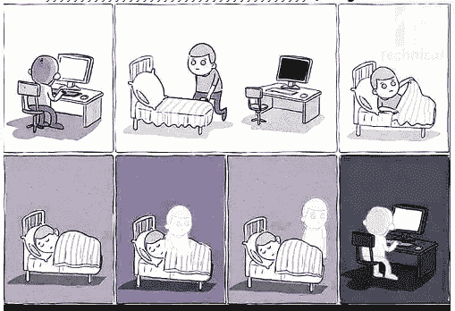

# 我对程序员心理健康的两点看法

> 原文：<https://betterprogramming.pub/my-2-cents-on-mental-health-for-programmers-40086ec3d3>

## 注意力超载、缺乏成就感、持续的学习需求、灾难焦虑、创造力枯竭、冒名顶替综合征、孤独、无休止的失眠、竞争

溺水的开发商(照片由来自 [Pexels](https://www.pexels.com/photo/person-drowning-in-water-3651632/?utm_content=attributionCopyText&utm_medium=referral&utm_source=pexels) 的 [Luca Nardone](https://www.pexels.com/@lucanardone?utm_content=attributionCopyText&utm_medium=referral&utm_source=pexels) 拍摄)

我编了一些这样的短语，但你明白了。这些是使程序员容易受到精神压力影响的触发因素，最终也可能表现为身体症状。初学程序员不得不忍受另一种精神痛苦[。](https://medium.com/illumination-curated/7-reasons-beginner-programmers-should-push-through-the-pain-58665d914254)

我想把人们通常所说的过度压力或倦怠分解成更具体的诱因，这样它们更容易处理。这篇文章仔细研究了每一个压力触发因素，并探索了减少其对心理健康负面影响的可能方法。

希望雇主和那些受影响的人能收集到一些有用的信息。我们的目标不是试图提供一个详尽的解决方案列表，而仅仅是给讨论提供动力。未能及时处理精神压力的迹象会对健康、生活方式和人际关系造成持久的损害。

首先，让我们简单介绍一下由这些触发因素引起的过度压力的影响。

# 过度压力的影响

压力有行为、认知、身体和情绪上的症状。症状包括:

*   喜怒无常
*   感觉失去控制
*   抑郁+自卑
*   头痛，牙关紧闭
*   失眠
*   健忘
*   无法集中注意力
*   希望使用麻醉剂/酒精

WebMd 指出，长期后果可能包括“心血管疾病，包括心脏病、高血压、心律失常、心脏病发作和中风。”(有关详细的概要，请参见 WebMD 的“[压力症状](https://www.webmd.com/balance/stress-management/stress-symptoms-effects_of-stress-on-the-body#1)”页面。)

没有人可以幸免。甚至 YouTube 最著名的创作者之一 Brad Traversy 也在这个视频中描述了他是如何需要从持续的压力中休息一下。

鉴于失控压力的后果，寻找压力触发因素是一个好主意，如下所述。

# 浓度过载

这一条几乎是不言自明的。产生无错代码所需的脑力劳动和注意力会导致脑力衰竭。你集中注意力的时间越长，你的大脑就变得越疲惫。有了这个触发器，花在键盘上的时间和压力大小之间就有了直接的关联。

考虑到花在编程上的时间和压力之间的明显相关性，减少你的编程时间可以消除这个触发因素。这并不总是可能的，尤其是如果你为苛刻的老板工作，他们不会给你片刻的休息时间，要求你在周末工作来完成项目。

如果你认为这是你的导火索，那么你必须尝试所有可能的方法来减少你的编码时间，包括找另一份工作。

# 缺乏成就感

同样不言自明，但这是如何发生的是复杂的。你开始时对工作非常热情，但随着时间的推移，你会变得越来越没有动力，并在每天结束时开始感到空虚。发生这种情况的原因有很多，解决这种压力的方法是找到具体的原因并解决它。下面列出了一些可能的原因，以及示例解决方案:

*   你对老板对待你的方式有意见。
    可能的解决方案:如果你和老板有矛盾，那么你必须试着和他们一起解决。另一个选择是尝试调到另一个团队、项目或职位。核选项是另找工作，说起来容易做起来难。
*   **你正在开发的产品没有引起你的共鸣。**
    可能的解决方案:要求调到另一个项目。如果这是不可能的，你可以留心另一份工作。
*   你对如何做事有想法，但没人听你的；你的工作从来没有实现过。大多数程序员在看到自己的想法融入到代码中并得到部署时会感到满足。如果你的想法被忽视或被推到一边，你会开始感到不受重视。可能的解决方案:要求调到另一个项目或团队。
*   你已经厌倦了编程，想做点别的。有些人会遇到这种情况。也许你觉得刚开始编程时的激情已经消退，或者你觉得你的编码技能不够好。试图在别处寻找满足感并没有错。
    可能的解决方案:也许你可以转到一个相关的职业，比如产品开发或 UX 设计，对编码技能要求不高。
*   你被期望去做你的技能/工作描述之外的事情；你的同事不理解你的角色。
    这很常见，不仅仅是在编程领域，在很多行业都是如此。尤其令人沮丧的是，你的主管希望你做一些不属于你的事情，并想知道为什么这些事情没有完成。
    可能的解决方案:这个问题的最佳解决方案似乎是不断重复你的角色。有时这个问题永远无法解决，你将永远被别人的工作所困扰！

# 持续学习要求

技术日新月异。框架和库一直在涌现，每隔几个月就有新的框架版本发布。这给程序员带来了跟上进度的压力。

如果程序员想保持最新，他们必须不断地遵循教程和文档。

新版本也会产生一些必须在旧代码库中修复的错误。如果程序员没有跟上时代的步伐，这可能会变得势不可挡。应用程序和网站所有者不断要求程序员集成新技术，使他们的应用程序最快、最好。

一些公司通过内部课程来处理这个问题，让程序员了解最新的趋势和库。这减轻了个人的压力，因为他们不必自己寻找学习资源。拥有内部课程也为任何新技术的实施创造了一种内部标准。这个标准实现将减少由于实现冲突带来的压力。

似乎真的没有简单的方法来解决这个压力引发的问题。这是作为一名程序员的职责所在。

# 灾难/边缘案例焦虑

这不同于单纯的注意力过度集中。注意力超负荷是让你因为疲惫而想入睡的部分，但这个触发点会在半夜把你吵醒。

这种压力触发表现为非常具体和恼人的问题，例如:

*   *我是不是用一个会让公司破产的循环访问了云数据库？* 这是常见的一种，晚上能叫你起床。有一些关于这种情况实际发生的详细记录的案例。在一个例子中，一个应用程序在三天内积累了 3 万美元的 Firebase 账单。
*   我是否无意中公开暴露了用户的隐私数据，如位置或电子邮件地址？

关于编程导致灾难的两个例子，见[这篇文章](https://interestingengineering.com/when-bad-programming-turns-deadly)来自有趣工程。这些灾难表明，糟糕的编程在一个案例中导致拦截导弹无法发射，在另一个案例中导致病人用药过量。如你所见，很容易理解为什么程序员会有不眠之夜。

处理这种触发的一种方法是建立测试代码的过程，并对代码进行同行评审。知道别人已经测试了你的代码是否有 bug，你晚上会睡得更好。当然，发射导弹的软件应该比你的 kitty pics 应用程序上的 like 按钮更受关注。

# 创造性枯竭

这主要适用于 UI 和 UX 设计师。客户不断试图超越他们的竞争对手，这样做给设计师施加压力，不断提出新的想法和概念。

可以说，对独特创意的持续需求给设计师带来了从帽子里变出兔子的压力。他们的工作经常因为琐碎的原因被拒绝，甚至在重复迭代之后，他们不知道如何满足客户对独特界面的需求。

UI 和 UX 设计师还有其他独特的触发因素——关于 UX 倦怠的更深入的讨论，请参见这篇精彩的文章:“[倦怠:UX](https://uxdesign.cc/burnout-the-ugly-side-of-ux-1a6b436a8f46) 丑陋的一面。”

像 YouTube 视频创作者一样，内容创作者也容易出现这种形式的疲惫。创作者依赖于至少每隔几天向他们的学生/追随者提供新的和令人兴奋的材料。如果他们不能提出新的想法，他们内容的浏览量就会受到影响，他们的收入来源也会受到影响。

# 冒名顶替综合症

你可能听说过这个术语。这个术语试图描述一种感觉，即一个人觉得自己不如周围的人有能力，从而导致一种没有归属感。

编程中出现这种情况的几率很高，原因有几个。一些起作用的因素是:

*   很高比例的自学程序员——因为程序员可以在家自学，当他们得到第一份工作时，他们可能会觉得周围那些接受过更正规的大学培训的人更聪明、更有资格。
*   达到 100%精通所需的知识量——有如此多的语言、框架、库和相关技术，很容易让人觉得自己是个骗子，不知道别人都知道的东西。
*   软件语言和技术的快速发展——当新版本的库和框架出现时，很容易落后。感觉自己是冒名顶替者的人总是感觉比其他人落后一步，或者他们觉得自己不在“圈子里”
*   一些程序员加入小团体，故意将其他人排除在最新的讨论和趋势之外，或者联合起来对付经验较少的程序员。

我之前提到的布拉德·特拉弗斯(Brad Traversy)制作了一个关于这个话题的视频。

对于这种精神上的痛苦，没有真正的解决办法，除非那些受影响的人意识到他们的担忧通常是没有根据的。

# 孤独

编程是一项需要高度集中注意力的活动，这通常意味着与世隔绝或在一个安静的地方工作。相比之下，其他职业，如市场营销，销售或客户服务，有大量的人际接触。

这种孤立常常会导致一种孤独感，一种对更多人际交往的渴望，以及一种没有我们的世界正在流逝的感觉。程序员经常感觉被困在他们内部思想的日常隔离中。这也是一个影响节目内容创作者的触发器。

除了那些受影响的人在空闲时间尽可能地寻求社会互动，或者经常休息并寻求一些交谈之外，没有其他办法来解决这个问题。

# 无开关失眠

对于编码人员来说，即使他们筋疲力尽地躺在床上，也无法停止思考编码，这是一种常见的体验。他们的另一个经历是在晚上睡觉前关灯的几分钟内突然意识到一个解决方案。

众所周知，他们还会在半夜突然被一些编码问题或解决方案的潜意识想法惊醒。

甚至还有关于它的漫画。我最喜欢的一个是这个:

图片来源:【probytes.net 

这种现象是白天高度集中注意力的副产品。大脑不知道何时或如何关闭。紧张的截止日期让情况变得更糟。

睡前几个小时避免任何编程活动是个好主意。睡前从事一些其他活动会有所帮助，比如体育活动，这会让你的思维离开编程轨道，让它放松下来。躺在床上用笔记本电脑编程是自找麻烦。

# 竞争

每个人都有账单要付，都有投资要做。因为被认为能力不如别人而丢掉工作的想法会导致焦虑和不安全感。

竞争会让开发人员感觉他们是竞技场上的角斗士。这往往会导致前面描述的小团体行为。程序员有时会加入小团体来帮助自己免受指责或竞争。如果你不在小圈子里，你经常成为替罪羊和其他恶作剧的目标。新团队成员经常发现自己处于风口浪尖。

通常，激进竞争的目标在收到终止信之前，甚至不知道他们正在被暗中诋毁。

如何保护自己？这很难，但最好的保护是了解你的东西。当很明显你知道自己在做什么，你是一个尽职尽责的员工时，你的对手就很难诋毁你了。所以建立你的声誉是竞争中最好的防御。

# 次要生活方式压力

这通常表现为关系问题，因为你花太多时间在工作上。例如，你回到家，但太累了，无法和家人一起参加任何有意义的活动。这个二次应力是由上述应力产生的。

这适用于所有的职业，但是把它放在你的观察清单上。这样，当它弹出时你就能认出它，你就知道它是从哪里来的。

# 最后的想法

如果你是一名程序员或在技术领域工作，你可能会经历这些压力触发之一。

为了避免受到影响，让自己意识到触发因素并在压力失控之前采取适当的行动是有好处的。

感谢阅读。如果你喜欢这篇文章，可以考虑[订阅这里的](https://craftedwebpages.medium.com/membership)成为中级会员，以获得数以千计的其他文章。