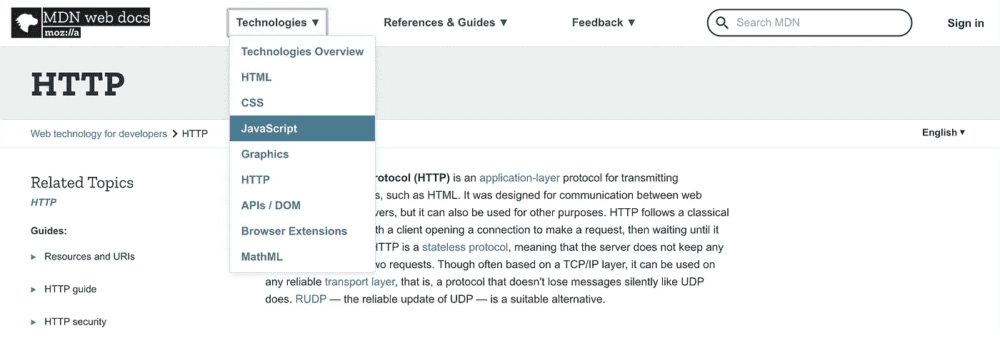

# 我快速学习任何新技术的 4 步策略

> 原文：<https://betterprogramming.pub/my-4-step-strategy-to-learn-any-new-technology-quickly-c277299b35c>

## 这对我很有效——我希望对你也有效

> 啊啊啊……要学的东西太多了！
> 
> —我，2019

新的框架和技术不断发布，每一个都在争夺我们的注意力，并声称自己更快、更安全、更高效。作为开发人员，我们有时会被大量的信息淹没。我们甚至可能会经历冒名顶替综合症。

为了跟上学习的步伐，每个人都需要找到适合自己的方法。在这篇文章中，我将分享我学习编程的四步策略。这是对我有用的。希望你能够参考它，并用它来规划你自己的道路。

# 第一步:确定基本要素

你学什么比你怎么学更重要。

时间有限，所以我们需要选择我们的战斗。

在你担任的每一个角色中，都有一套你必须深入理解的基本概念，以便为未来的学习打下坚实的基础。

为了确定基本的概念，你需要做一些互联网挖掘:

演职员表:【https://developer.mozilla.org/en-US/ 

例如，MDN 是 web 技术的最佳参考文档。如果你想成为一名 web 开发人员，也许你应该先学习一下这里列出的每一项基础技术——HTML、CSS、Javascript、HTTP、API/DOM。

可能会很无聊。可能会很乏味。它可能不酷也不时尚。但它会给你一个坚实的基础，让你的学习能力提高十倍。

# 第二步:快速学习

刚开始学习编程的人常犯的一个错误是陷入“教程地狱”——上了一个又一个教程，却没有取得显著的进步。

在我看来，教程对于入门来说很棒。但是，我们应该快速浏览教程并限制花在上面的时间，因为:

*   辅导课是**被动学习的一种形式，**效率低下。知识的保留率很低，将来你可能需要再次查阅这些概念
*   参加教程**可能会扼杀你的兴趣**，因为学习一门新语言的语法可能会很无聊(例如，“如果你输入这个，你会看到…”)

## 什么对我有用

*   以双倍的速度浏览教程(甚至 Youtube 上的多个教程视频)。
*   我们的目标不是记住教程中的所有内容，而是理解概念和了解技术的能力。您可以在练习时轻松地查找语法或复习教程。

*目的在于理解，而不是记忆！*

*   如果你认为这些材料不适合你的学习风格，不要害怕放弃当前的教程，去找另一个。现在网络上不乏高质量的教程视频。

# 第三步:建造任何东西

演职员表:[https://giphy.com/gifs/motion-stop-build-3ZALZoBtI1KJa](https://giphy.com/gifs/motion-stop-build-3ZALZoBtI1KJa)

你遇到过靠看教程学会骑自行车的人吗？大概不会！某些技能只能通过实践获得，编程就是其中之一。

在快速浏览了多个教程之后，现在是时候让你应用你所学的东西来制作任何东西了——我是说*任何东西*！

通过采取旨在建立*某种东西的心态，不管多么琐碎，你都会实现一些事情:*

*   你避免了决策瘫痪的问题——无法想出一个好主意。
*   当您在构建产品时，您不得不回忆从教程中学到的材料。这加强了你的学习！
*   你意识到你学习中的差距。教程永远不会完整，因为它是面向初学者的。在构建产品的过程中，你会遇到一些问题，这些问题会驱使你在更深的层次上学习这项技术。
*   最后，它增强了你的自信。相信你能学会一项技术并成功实现它是非常有益和有力量的。

## 什么对我有用

*   建造一些琐碎的东西。不要花太多时间想出一个花哨的主意。
*   将项目想法限制在你试图学习的技术和你已经熟悉的技术上。不要试图同时掌握三到四项新技术。这并不是说你做不到，但这不是我推荐的。

# 第四步:找份工作

你曾经在考试前几周甚至几个月死记硬背学习材料吗？不可思议的是，你设法学会了大部分内容并通过了考试。这就是压力的力量！

将工作压力变成你的优势。

当你开始从事编程工作时，你不得不每周交付一些特性。即使你不确定这项技术，你也别无选择，只能一路走来。

赋予的责任提供了健康的压力来增强你的学习和提高你的编程技能。此外，你还能从有能力、通常更有经验的同事那里学到技术技能。除此之外，作为一名程序员，学习如何交流想法是一项极其重要的技能。

简而言之，获得报酬来增强我的学习是一个不可抗拒的提议！

## 什么对我有用

*   要实现上述好处，你必须选择合适的工作环境。我会推荐一个给你很多自主权和责任的创业环境。
*   此外，你应该和经理谈谈，明确工作范围，以确保你做的是你想学的东西。
*   为了得到这份工作，向他们展示你的成果(见第 3 步)。然而，如果你被拒绝了，不要灰心丧气。继续构建和应用！

# 到无限和更远

不管你想学习什么新的编程技能，一旦你完成了上面列出的四个步骤，我相信你会获得巨大的动力来推动你的学习更上一层楼。

有数不清的方法可以让你增长知识，比如阅读技术博客文章、参加讲座、活动、聚会，以及参与开源项目。天空是无限的！

我希望你已经设法从这篇文章中获得了一些有用的东西。最后，我想强调每个人的学习方式都不一样。尝试新事物，尝试不同的学习方法，打造你自己的道路。这是优化和增强你的学习的唯一方法！

祝你好运！