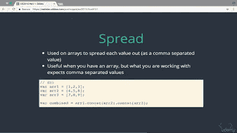
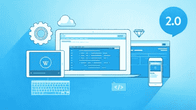
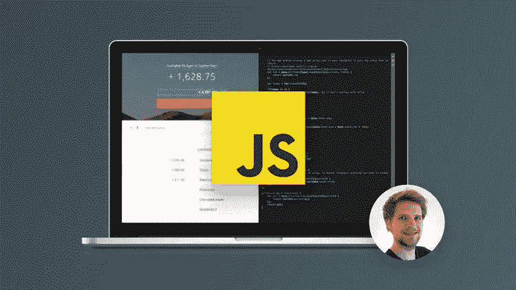
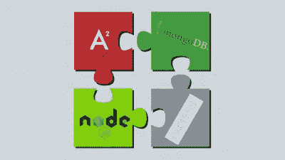

# 2023 年 10 门最佳网络开发在线课程

> 原文：<https://betterprogramming.pub/my-5-favorite-courses-to-learn-web-development-in-2019-a5e74167f8b2>

## 想成为一名自学成才的网页开发者？这里有几门在线课程可以提供帮助。

大家好，如果你对学习 web 开发感兴趣或者想成为一名 web 开发人员，那么你来对地方了。在这篇文章中，我将分享一些我最喜欢的在线课程，你可以参加这些课程来深入学习 Web 开发。

但是，在此之前，让我祝贺你做出了一个了不起的决定。Web 开发是一个令人兴奋的领域，开发者总是受欢迎的。

一旦你学会了如何开发网站，你不仅可以成为一名网站开发人员，还可以成为一名自由职业者，甚至可以为你的创业公司建立一个网站。

披露:这个帖子包括附属链接；如果您从本文提供的不同链接购买产品或服务，我可能会收到报酬。

学习 Web 开发本身并不难，但是网上的资源太多了，一不小心就很容易迷路，而这正是我可以在你的旅途中为你指引和帮助的地方。

我热爱学习。我一生中的大部分时间都是通过读书来学习，但自从我在 [Udemy](https://click.linksynergy.com/fs-bin/click?id=JVFxdTr9V80&offerid=323058.9409&type=3&subid=0) 和 [Pluralsight](http://pluralsight.pxf.io/c/1193463/424552/7490?u=https%3A%2F%2Fwww.pluralsight.com%2Flearn) 上遇到在线课程后，我大部分时间都是通过在线课程来学习。它们是开始使用新技术的最佳方式，可以让您立即投入使用。

我最近一直在分享一些很好的在线课程，学习新的技术、框架和库。在我的上一篇文章中，我介绍了我的前五门 Java 9 课程。今天，我将列出 Udemy 的五大网络开发课程。

顺便说一下，谈到 web 开发，在过去的五到十年里，事情发生了很大的变化。仅仅知道 [HTML](http://www.java67.com/2018/02/5-free-html-and-css-courses-to-learn-web-development.html) 、 [CSS](https://www.java67.com/2019/01/5-free-bootstrap-course-to-learn-online.html) 和 [JavaScript](https://javarevisited.blogspot.com/2018/06/top-10-courses-to-learn-javascript-in.html) 就够了的日子已经一去不复返了。它们仍然是必不可少的，但还不够，你还需要学习现代 web 开发框架，如 [React](https://medium.com/@javinpaul/top-5-courses-to-learn-react-js-in-2019-best-of-lot-fa02cd96cdf0) 、 [Angular](https://dzone.com/articles/top-5-angular-2-courses-for-web-developers) 和 Bootstrap 来开发现代 web 应用程序。

这些框架使得 web 开发更加结构化和有组织。它们还允许你从一个网页应用程序到成熟的真实世界的网络应用程序，如脸书、Airbnb 或优步。

如果你有兴趣学习像 [React](https://medium.com/@javinpaul/top-5-courses-to-learn-react-js-in-2019-best-of-lot-fa02cd96cdf0) 、 [Spring Web-Flux](https://medium.com/javarevisited/7-best-webflux-and-reactive-spring-boot-courses-for-java-programmers-33b7c6fa8995) 、 [Redux](https://javarevisited.blogspot.com/2018/08/top-5-react-js-and-redux-courses-to-learn-online.html) 、 [Angular](https://javarevisited.blogspot.com/2018/06/5-best-courses-to-learn-angular.html) 和 [Bootstrap](https://medium.com/javarevisited/6-best-bootstrap-online-courses-for-web-designers-and-developers-a688e192b2e2) 这样的前沿技术，那么这些 Web 开发课程是很好的开始。通过学习这些课程，您将接触到许多客户端和服务器端技术。

如果你是这个博客的常客，那么你可能知道我学习新技术或框架的三点公式。我过去曾经学习过许多技术，如 [Git](http://javarevisited.blogspot.sg/2018/01/5-free-git-courses-for-programmers-to-learn-online.html) 、[数据结构和算法](http://javarevisited.blogspot.sg/2018/01/top-5-free-data-structure-and-algorithm-courses-java--c-programmers.html)和 [Hibernate](http://javarevisited.blogspot.sg/2018/01/top-5-hibernate-and-jpa-courses-for-java-programmers-learn-online.html) ，现在我正在使用这种技术学习 [Kotlin](http://javarevisited.blogspot.sg/2018/02/5-courses-to-learn-kotlin-programming-java-android.html#axzz56R4AatoQ) 、 [Docker](http://javarevisited.blogspot.sg/2018/02/10-free-docker-container-courses-for-Java-Developers.html) 和 [Android](http://javarevisited.blogspot.sg/2017/12/top-5-android-online-training-courses-for-Java-developers.html) 以在 2023 年提升我的技术技能。

你通常应该从一个好的在线课程开始，这将帮助你理解最重要的部分并获得一些实践经验，比如如何设置你的开发环境和构建一些简单的应用程序。

一旦你理解了基础知识，你就可以通过阅读一本书来更全面地了解在线课程中涉及的所有概念以及根本没有涉及的主题。

完成本书和在线课程后，您应该能够开发一个真实世界的应用程序来测试您的知识并填补您学习中的空白。

# 2023 年最适合初学者的 10 门 Web 开发课程

无论如何，这是我列出的 2023 年你可以学习 web 开发的一些最好的在线课程。这些都是很棒的课程，教你很多基本的 web 开发技术，如 [HTML](https://medium.com/javarevisited/top-10-free-courses-to-learn-html-5-css-3-and-web-development-872d62d97a97) 、 [JavaScript](https://medium.com/javarevisited/5-free-html-and-css-courses-to-learn-front-end-web-development-online-8b04517c6ecb#axzz57KmATcMj) 有基本了解，并希望探索更先进的概念和技术以在职业生涯中获得更大成功的 web 开发人员

**这是加入本课程的链接** — [高级 Web 开发人员训练营](https://click.linksynergy.com/fs-bin/click?id=JVFxdTr9V80&subid=0&offerid=323058.1&type=10&tmpid=14538&RD_PARM1=https%3A%2F%2Fwww.udemy.com%2Fthe-advanced-web-developer-bootcamp%2F)

## **4。完整的 Web 开发人员课程 2.0**

这又是一门优秀的动手 web 开发课程，你将通过使用 [HTML](https://www.java67.com/2020/08/5-best-online-courses-to-learn-html-5.html) 、 [CSS](https://medium.com/javarevisited/top-10-free-courses-to-learn-html-5-css-3-and-web-development-872d62d97a97) 、 [Javascript](https://medium.com/javarevisited/10-best-online-courses-to-learn-javascript-in-2020-af5ed0801645) 、 [PHP](http://www.java67.com/2018/02/5-free-php-and-mysql-courses-for-web-developers.html) 、 [Python](http://www.java67.com/2018/02/5-free-python-online-courses-for-beginners.html) 、 [MySQL](http://www.java67.com/2018/02/5-free-database-and-sql-query-courses-programmers.html) 等构建网站和移动应用来学习关键的 web 开发技术。

你不仅会学到 HTML、CSS 和 JavaScript 等基础技术，还会学到更高级的技术，如 jQuery 和 Bootstrap。

这个课程教你如何像编写客户端和服务器端代码一样结束开发。您还将学习如何使用更先进的技术来构建自己的响应网站，如 [jQuery](https://hackernoon.com/top-5-free-jquery-courses-for-web-developers-best-of-lot-9f65a1ff25b6) 、 [PHP](https://hackernoon.com/5-free-php-and-mysql-courses-to-learn-web-development-63836cd3e587) 7、 [MySQL 5](https://javarevisited.blogspot.sg/2018/05/top-5-mysql-courses-to-learn-online.html) 和 Twitter [Bootstrap](http://www.java67.com/2019/01/5-free-bootstrap-course-to-learn-online.html) 。

**这是加入本课程的链接** — [完整的 Web 开发人员课程 2.0](https://click.linksynergy.com/fs-bin/click?id=JVFxdTr9V80&subid=0&offerid=323058.1&type=10&tmpid=14538&RD_PARM1=https%3A%2F%2Fwww.udemy.com%2Fthe-complete-web-developer-course-2%2F)

## 5.[完整的 JavaScript 课程:构建真实世界的项目](https://click.linksynergy.com/fs-bin/click?id=JVFxdTr9V80&subid=0&offerid=323058.1&type=10&tmpid=14538&RD_PARM1=https%3A%2F%2Fwww.udemy.com%2Fthe-complete-javascript-course%2F)

JavaScript 是网络开发者最重要的技术之一，这也是为什么我在这个列表中包含了一个完整的 JavaScript 课程。

JavaScript 最初是一个纯粹的客户端解决方案，现在允许您在不使用任何其他技术的情况下构建一个完整的应用程序。像 [Node.js](http://javarevisited.blogspot.sg/2018/01/top-5-nodejs-and-express-js-online-courses-for-web-developers.html) 这样的框架使得使用 JavaScript 创建服务器端应用程序变得很容易。

您将学习编码和调试技术，同时还将学习如何使用模块和函数来组织和构建代码。简而言之，这是深入学习 JavaScript 的**最佳课程之一**。

**这里是加入本课程的链接** - [完整的 JavaScript 课程:构建一个真实世界的项目](https://click.linksynergy.com/fs-bin/click?id=JVFxdTr9V80&subid=0&offerid=323058.1&type=10&tmpid=14538&RD_PARM1=https%3A%2F%2Fwww.udemy.com%2Fthe-complete-javascript-course%2F)

## 6.[棱角完整指南](https://click.linksynergy.com/fs-bin/click?id=JVFxdTr9V80&subid=0&offerid=323058.1&type=10&tmpid=14538&RD_PARM1=https%3A%2F%2Fwww.udemy.com%2Fthe-complete-guide-to-angular-2%2F)

《Angular 完全指南》会教你所有你需要知道的关于 Angular 的知识。如果某个东西有谷歌做后盾，不知道太重要了。

这门课程将教你如何掌握 [Angular](http://www.java67.com/2018/01/top-5-free-angular-js-online-courses-for-web-developers.html) (Angular 2+，包括 Angular 5)并使用 Angular.js 的继任者构建令人敬畏的反应式 web 应用程序，尽管你不需要了解 Angular 1 或 [Angular 2，](https://medium.com/javarevisited/10-courses-to-learn-angular-for-web-development-6da1bd2856dc)这门课程从零开始。

从设置到部署，本课程涵盖了所有内容！您将了解组件、指令、服务、表单、HTTP 访问、身份验证、使用模块和离线编译优化 Angular 应用程序等等。

完成本课程后，您还将学习如何部署应用程序。

**这是加入本课程** — [角度完整指南](https://click.linksynergy.com/fs-bin/click?id=JVFxdTr9V80&subid=0&offerid=323058.1&type=10&tmpid=14538&RD_PARM1=https%3A%2F%2Fwww.udemy.com%2Fthe-complete-guide-to-angular-2%2F)的链接

## 7.[网络应用&软件架构 101](https://www.educative.io/courses/web-application-software-architecture-101?affiliate_id=5073518643380224)

这是 Educative 的一门学习 Web 应用程序架构的优秀课程。在本课程中，您将了解不同的架构风格，如整体架构、微服务、客户端-服务器、三层架构、分散式对等架构，以及请求和数据如何在 web 应用程序中移动。

您还将了解如何从大处着眼，从层次、性能、可伸缩性和高可用性方面进行思考，这是当今应用程序的必备条件。

本课程不仅介绍了不同的体系结构模式，还解释了每种方法的优缺点，并带您经历一个不同的场景，其中某个特定的体系结构比其他的更适合。

以下是加入课程的链接— [**Web 应用&软件架构 101**](https://www.educative.io/courses/web-application-software-architecture-101?affiliate_id=5073518643380224)

老实说，这不仅是高级开发人员的最佳课程，也是每个软件开发人员的最佳课程，因为它将拓展你的思维过程，让你成为一个更自信的 web 开发人员。

另一方面，如果你喜欢 Educative 作为一个平台，你也可以购买一个每月仅 18 美元的订阅 **(** [**五折**](https://www.educative.io/subscription?affiliate_id=5073518643380224) **)** ，我有一个，我强烈推荐你去获得。

 [## 介绍:教育性订阅。获得无限制的访问权限！

### Educative 提供编程和编码面试准备课程，涵盖几乎每一个框架，语言，和…

www.educative.io](https://www.educative.io/subscription?affiliate_id=5073518643380224) 

## 8.[面向结果的 Web 开发人员](https://click.linksynergy.com/deeplink?id=JVFxdTr9V80&mid=39197&murl=https%3A%2F%2Fwww.udemy.com%2Fcourse%2Fresult-oriented-web-developer-course%2F)

这是绝对初学者最好的 web 开发课程之一。里面塞满了 50 多个小时的内容，包括 [HTML5](https://medium.com/javarevisited/top-10-free-courses-to-learn-html-5-css-3-and-web-development-872d62d97a97) 、 [CSS3](https://www.java67.com/2020/08/5-best-online-courses-to-learn-html-5.html) 、 [Flexbox](https://medium.com/javarevisited/top-5-advanced-css-courses-to-learn-flexbox-grid-and-sass-da8e37b09b1d?source=---------8------------------) 、 [JavaScript](https://medium.com/javarevisited/10-best-online-courses-to-learn-javascript-in-2020-af5ed0801645) 、 [Node.js](https://medium.com/javarevisited/top-10-online-courses-to-learn-node-js-in-depth-8ef0e31ca139) 、 [MongoDB](https://medium.com/javarevisited/5-best-mongodb-courses-to-learn-nosql-for-beginners-in-2020-42df5af5496c) 等。而且是不断更新的。

但是这门课真正与众不同的是它如何有效地使用视觉和动画来解释理论。它让你很清楚也很容易理解为什么要做某事，而不仅仅是如何去做。

这个训练营式课程的另一个好处是，你将从零开始建立 9 个真实世界的网站。这些项目非常庞大，包含许多元素，是你投资组合的完美补充。

此外，您将学习如何通过混合使用媒体查询和 Flexbox 来使这些网站响应迅速。CSS 和 [JavaScript](https://medium.com/javarevisited/12-free-courses-to-learn-javascript-and-es6-for-beginners-and-experienced-developers-aa35874c9a32) 部分无疑是我见过的最适合初学者的部分。

这门课的另一个好处是，老师真的会牵着你的手，快速回答每个学生的每个问题。简而言之，这是一门真正以结果为导向的课程，你可以通过它成为一名网页开发者。

**这是加入本课程** — [结果导向型网络开发](https://click.linksynergy.com/deeplink?id=JVFxdTr9V80&mid=39197&murl=https%3A%2F%2Fwww.udemy.com%2Fcourse%2Fresult-oriented-web-developer-course%2F)的链接

## 10.[2023 年的完全网络开发者:零到精通](https://academy.zerotomastery.io/a/aff_r1613hhr/external?affcode=441520_zytgk2dn)

这是另一个完整的课程，学习网络开发人员应该知道的一切。这也是一门学习编码并在 2023 年成为一名 Web 开发人员的伟大课程，有 HTML、CSS、Javascript、React、Node.js、机器学习&更多！

以下是您将在本课程中学到的主要内容:

*   这些技能可以让你申请像网页开发人员、软件开发人员、前端开发人员、 [JavaScript 开发人员](https://medium.com/javarevisited/12-free-courses-to-learn-javascript-and-es6-for-beginners-and-experienced-developers-aa35874c9a32)和[全栈开发人员](https://medium.com/javarevisited/top-10-frameworks-full-stack-java-developers-can-learn-in-2020-5995021401e5)这样的工作
*   构建 10 个以上可以炫耀的真实世界的 Web 开发项目
*   了解编写干净、高性能、无错误代码的最佳实践
*   掌握现代 [Web 开发基础](https://medium.com/better-programming/my-5-favorite-courses-to-learn-web-development-in-2019-a5e74167f8b2)以及高级主题
*   学习 [React + Redux](https://medium.com/javarevisited/top-10-free-courses-to-learn-react-js-c14edbd3b35f) 构建丰富的前端应用
*   使用 [NodeJS](https://medium.com/javarevisited/top-10-online-courses-to-learn-node-js-in-depth-8ef0e31ca139) 编写服务器端 JavaScript
*   学习实现用户认证
*   使用 Express、SQL 和 [PostgreSQL](https://medium.com/javarevisited/7-best-free-postgresql-courses-for-beginners-to-learn-in-2021-3bf369d73794) 创建可扩展的全栈应用

总的来说，这是学习 Web 开发的最完整和最新的课程之一。

**这是加入本课程的链接**——[2023 年的完全网络开发者:零到精通](https://academy.zerotomastery.io/a/aff_r1613hhr/external?affcode=441520_zytgk2dn)

顺便说一句，你需要一个 [**ZTM 会员**](https://academy.zerotomastery.io/a/aff_c0gnlvf7/external?affcode=441520_zytgk2dn) 来观看这个课程，这个课程每月花费大约 29 美元，但也提供了许多超级吸引人和有用的课程，如他的 [Python 课程](https://medium.com/javarevisited/the-complete-python-bootcamp-udemy-course-review-b1ab69f232b5)和这个 [*JavaScript Web 项目:20 个项目来建立你的作品集课程*](https://medium.com/javarevisited/10-best-online-courses-to-learn-javascript-in-2020-af5ed0801645) 。

 [## 学习需求技能。被录用。推进你的事业。|零到精通

### 最终你是唯一能控制它的人。呵呵......每个人学习的速度不同，但是学生…

academy.zerotomastery.io](https://academy.zerotomastery.io/a/aff_c0gnlvf7/external?affcode=441520_zytgk2dn) 

## 结论

这是为了深入学习 Web 开发的一些最好的课程。你不需要看完所有的课程，但是我建议你先看他们的预告片，然后选择你最能和老师沟通的课程。我个人喜欢柯尔特·斯蒂尔训练营的教学风格，因此，我最喜欢第一堂课。

您可能想探索的其他**编程资源文章**

*   [完整的网络开发者路线图](https://medium.com/hackernoon/the-2019-web-developer-roadmap-ab89ac3c380e)
*   [2023 年学习 React Native 的 5 门课程](http://javarevisited.blogspot.sg/2018/02/5-react-native-courses-to-learn-mobile-development-using-JavaScript.html)
*   [学习大数据和 Apache Spark 的 5 门课程](http://javarevisited.blogspot.com/2017/12/top-5-courses-to-learn-big-data-and.html)
*   [免费学习 JavaScript 的 10 个地方](https://hackernoon.com/10-websites-to-learn-javascript-for-beginners-31e13bbdbb5c)
*   【Java 开发人员应该学习的 10 个 Web 开发框架
*   [2023 年 React 开发者路线图](https://hackernoon.com/the-2018-react-js-roadmap-4d0a43814c02)
*   [初学者学习 GraphQL 的 5 大课程](https://hackernoon.com/top-5-graphql-courses-for-beginners-26cad52bcd3e)
*   [15 门面向 Web 开发人员的 Docker、Kubernetes 和 AWS 课程](https://medium.com/javarevisited/top-15-online-courses-to-learn-docker-kubernetes-and-aws-for-fullstack-developers-and-devops-d8cc4f16e773)
*   [Web 开发人员可以学习的 10 个 JavaScript 框架](https://medium.com/javarevisited/10-of-the-most-popular-javascript-frameworks-libraries-for-web-development-in-2019-a2c8cea68094)
*   [2023 年学角的 10 本书和课程](https://medium.com/javarevisited/top-10-angular-books-and-courses-for-beginners-and-experienced-web-developers-best-of-lot-9a2dae87f04c)
*   [10 门免费课程，供乞丐学习 React JS](https://medium.com/javarevisited/top-10-free-courses-to-learn-react-js-c14edbd3b35f?source=extreme_main_feed----d3a191ac6ed-----5-1--------------------561c2dc6_a2b4_41e0_b7be_1d97edbf631c--8)
*   [Web 开发人员学习 TypeScript 的 7 门最佳课程](https://medium.com/@javinpaul/7-best-courses-to-learn-typescript-in-depth-58439e1ce729)

感谢您阅读本文。如果你喜欢这些网络开发课程，请与你的朋友和同事分享。如果您有任何问题或反馈，请留言。

**附言——**如果你是 web 开发领域的新手，并且正在寻找一门免费的在线课程来开始你的 Web 开发之旅，那么我强烈推荐你在 Udemy 上查看这门免费课程——[**Web Development By do:HTML/CSS From Scratch**](http://bit.ly/2DifbAo)。这是完全免费的，你只需要一个 Udemy 帐户就可以参加这个课程。

 [## 免费 HTML 教程- Web 开发实践:HTML / CSS 从头开始

### 在作为餐厅经理每天工作 15 个小时后，我决定是时候改变一下了。学完基础…

bit.ly](http://bit.ly/2DifbAo)