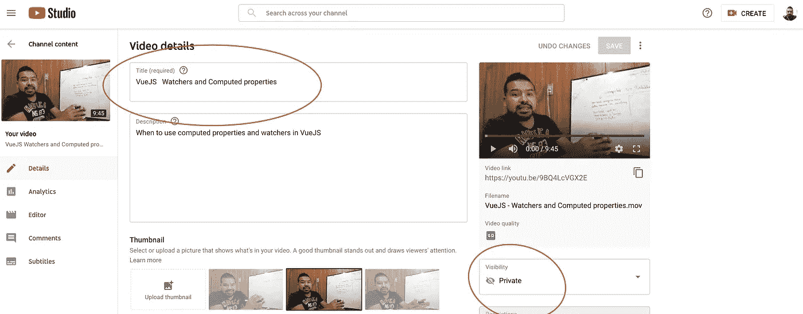

# 我开始使用 Vue.js 或任何 js 框架的 7 天策略

> 原文：<https://betterprogramming.pub/my-7-day-strategy-to-get-started-with-vue-js-or-any-js-framework-56e92778d6ca>

## 以下是我遵循的行动计划

[空中聚焦](https://unsplash.com/@airfocus?utm_source=medium&utm_medium=referral)在 [Unsplash](https://unsplash.com?utm_source=medium&utm_medium=referral) 上拍摄的照片。

您可能知道，前端库和框架转瞬即逝。无论您是否愿意，学习其中一种的需求迟早会到达您的开发之旅。

在不到七天的时间里学习 [Vue.js](https://vuejs.org/) 是我最近面临的挑战之一。起初，我怀疑我是否能够实现它。

在遵循这种务实的方法论和系统的学习新事物的方法之前，我认为那些在不同领域知识渊博的人天生就有一种特殊的能力。我完全错了。

正如有人所说:

> “在你知道如何做之前，任何事情都是困难的。”

在我大学毕业并获得计算机科学硕士学位后，我开始了自学之旅。

在这段旅程中，我意识到超级学习者和其他人的区别基本上在于他们学习的方式。

我对根据你的个人需求构建学习地图一无所知，更不知道如何识别驱动我的是什么(是内部力量还是外部力量)。

虽然听起来很老套，但建立正确的心态在比普通人更少的时间和更少的努力实现你的目标方面起着重要作用。

如果我们现在跳到与 Vue.js 相关的技术和明确的事情上，将有一些关键的事情需要考虑。

选择官方文档和视频课程格式将节省您大量的时间，因此您可以更快地熟悉主要概念。

无论如何，让我们跳到我在不到七天的时间里学习 Vue.js 所遵循的确切行动计划。

*免责声明:这只是一个指南，给你一个在学习新事物时取得成功的关键因素列表。*

*结果可能会因不同的因素而异，比如你的经验水平(在这种情况下，主要是 JavaScript、HTML 和 CSS)。就我而言，我学习了 Vue.js 的基础知识，并获得了不错的代码速度，但只要我继续开发 Vue.js 项目，就能理解更复杂的概念。*

如果你想学得更快，有两个关键阶段你需要关注。

# 规划和战略阶段

你要坚持的计划和策略将在你能多快掌握所有与 Vue.js 相关的概念和元素方面发挥重要作用。

策略胜过速度和力量。

## 构建学习地图

选择一门课程并直接进入其中是我们在学习新东西时经常犯的错误之一。

你想弥补吗？那么就从构建学习地图开始吧。这将有助于你理解所有你想学的东西。

简单来说就是根据自己的需求进行个性化的引导。

好的，所有这些听起来都不错，但是我如何真正建立一个学习地图呢？别担心，我们现在就开始吧。

要建立学习地图来学习 Vue.js，有三个主要的事情你必须考虑，这样你才能提高你的学习速度。

## 1.是什么驱使你去学习？

构建学习地图要做的第一件事是完全诚实地面对是什么驱使你去学习。这是内力还是外力？

如果这是一种内部力量，这意味着你对前端有真正的热情，你可能会完全专注于掌握 Vue.js 框架的每个细节。

外部动机意味着你正在学习它，因为公司需要你为即将到来的项目学习它，或者因为它是一个趋势和随需应变的框架，你想搭上那列火车。

然而你对学习它没有足够的兴趣。

为什么知道动机的类型如此重要？

这很简单。因为可能有一些部分或事情与动机类型无关，所以你可以稍后跳过它们。

清楚地知道是什么驱使你去学习，你现在就可以投入时间和精力去学习。

## 2.建立学习结构

建立学习结构背后的想法是找到掌握一个主题的最快路线。通过这样做，你将加快理解 Vue.js 是如何工作的，以及其中涉及的所有概念。

在构建学习结构时，你需要考虑两件事:概念和事实。

概念是你需要理解的关于 Vue.js 的所有基础和原则，而事实是你必须记住的所有真实的东西。

## 了解 Vue.js 的概念和事实

*   (在撰写本文时)应该学习什么样的版本？Vue 2 还是 3？
*   基于 Vue.js 的一个 app 的常用/流行的技术栈是什么？
*   熟悉最常见和最常用的 Vue.js 概念。

## 事实和困境

让我们先来谈谈你在开始学习 Vue.js 生态系统后可能会偶然发现的一些事情。

## 学习什么样的 Vue 版本才是正确的？

当我开始学习 Vue.js 时，这是一个很快出现的问题，所以你可能也有同样的困境。

稍微研究一下，不要太担心。这个想法是要弄清楚你为什么选择版本 2 或版本 3。

我建议你只是做一个高层次的比较。例如，以下 Reddit 主题将让您深入了解两个版本之间的差异:

*   [学习 Vue 2 或 3](https://www.reddit.com/r/vuejs/comments/g1v72x/start_with_vue_3_or_learn_vue_2_first/)
*   [这个](https://www.reddit.com/r/vuejs/comments/hx0bh1/im_currently_learning_vue_2_and_ive_heard_vue_3/)

## 基于 Vue.js 的一个 app 的常用/流行的技术栈是什么？

知道学什么对提高你的学习速度至关重要。

在构建 Vue.js 应用程序时，您需要了解什么是常见的技术堆栈，这样您就可以将时间和精力投入到这些特定的元素中。

下面是一个常见的 Vue.js 堆栈:

*   框架:Vue 2/3
*   路由:vue-路由器
*   邦德勒:网络包
*   UI 工具包/框架:元素 UI，Vuetify。
*   状态管理:VueX

## 常见概念

现在你对正确的 Vue.js 版本和你想要关注的栈有了更好的理解，是时候跳到属于 Vue.js 的基础、概念和独特的东西了。

*   Vue 实例:每个 Vue.js 应用程序都从创建一个新的`Vue`实例开始。
*   数据和方法:当一个`Vue`实例被创建时，它将在其`data`对象中找到的所有属性添加到 Vue 的`reactivity system`中。
*   实例生命周期挂钩(不同于生命周期挂钩):这是一系列步骤，每当创建`Vue`实例时都会运行(`init`、 `beforeCreate`、`created`等)。).
*   生命周期挂钩(Lifecycle hooks):让用户能够在特定阶段添加自己的代码的功能(`mounted`、`updated`、`destroyed`等)。).
*   模板语法:Vue.js 使用基于 HTML 的模板语法，允许您以声明方式将呈现的 DOM 绑定到底层`Vue`实例的数据。模板语法包括插值、指令和速记(例如`v-bind`、`v-on`)。
*   计算属性:允许你处理复杂的逻辑和操作。它们是将根据其依赖关系进行缓存的计算。
*   Watchers:允许您执行异步或昂贵的操作来响应变化的数据。它们允许您跟踪任何属性，并对其上的任何变化做出反应。
*   类和样式绑定:允许你操作类和内联样式。您可以传递数据以应用特定的类或样式。
*   Conditional rendering: Vue.js 允许您使用不同的指令，比如`v-if`、 `v-else`、`v-show`和`v-for`，来决定是否显示一个块、组件或元素。
*   事件处理:监听来自 DOM 的事件、事件处理程序、内联处理程序、事件修饰符。
*   表单输入绑定:使用`v-model`指令在表单输入上创建双向数据绑定。
*   组件基础:组件是可重用的`Vue`实例，名称类似于`<button-counter>`。
*   用 props 将数据传递给子组件:Props 是可以在组件上注册的自定义属性。传递给子组件的属性成为该子组件的属性。

从 Vue.js 开始，这些概念是最常见或最有用的。

## 3.选择正确的资源

通过建立学习结构，你找到了学习 Vue.js 的最快路线。现在是时候研究其他有效学习者正在使用的正确资源和方法了。正如《T2》一书的作者斯科特·扬所说:

> “花一两个小时找出合适的资源和‘人们如何擅长这个’，是一项非常有用的投资。”

## Vue.js 官方指南(约 3-6 小时)

我建议你从阅读 [Vue.js 官方文档](https://vuejs.org/v2/guide/)开始。由于是第一次使用 Vue.js，你可能无法掌握和消化所有信息。别担心。那很好。

## 选择评价高的视频课程(约 10-15 小时)

同样，在你学习旅程的这一点上，你不应该担心课程中的所有项目。

视频课程将帮助你加快学习过程。这将有助于你在阅读 Vue.js 官方指南后缩小理解差距。

本课程的目标是理解 Vue.js 的基础知识。大概需要 10-15 个小时的有效时间。在这样做的时候，试着使用番茄工作法来避免筋疲力尽。

我建议参加以下 Vue.js 课程。其中有几个是免费的，其他的相当便宜，所以没有任何借口。

课程:

 [## 使用 VueJS 2 开发(完成 Vue.js 路由器和 Vuex 课程)

### Vue.js 是一个非常棒的 JavaScript 框架，用于构建前端应用程序！VueJS 混合了最好的角度+反应！

www.udemy.com](https://www.udemy.com/course/vuejs-2-the-complete-guide/)  [## Vue 掌握

### 尽情享受我们独家收集的全球 Vue 会议讨论。你可能认识格雷格，因为他早年教书…

www.vuemastery.com](https://www.vuemastery.com/) 

免费/试用:

 [## Vue.js 基础

### 课程概述大家好。我是吉姆·库珀，欢迎来到我的 Vue.js 基础课程。我一直在做…

www.pluralsight.com](https://www.pluralsight.com/courses/vuejs-fundamentals) 

# 执行阶段

在这一点上，你有了正确的心态、学习地图和正确的资源来粉碎 Vue.js 路线图。

为了尽可能多地了解 Vue 的世界，你需要遵循一系列步骤。执行计划的时候到了。

*注意:请记住，从第 0 天到第 7 天，以下所有步骤都是必需的。*

## 教给你自己或孩子(费曼技巧的一部分)

如果你能用简单的英语解释你所学到的东西，毫无疑问你已经实现了两件事:

*   你清楚这个主题及其要素。你不能解释你不懂的东西。
*   你将这些知识储存在长期记忆中，而不是工作记忆中。

对于任何令人困惑或不清楚的概念，尽量向自己或孩子解释，不要使用行话或晦涩的词汇。我通常和我四岁的儿子一起练习这个。一点都不容易。但是当他能够明白我在说什么的时候，我明白我也明白了。

## 去 YouTube 上直播

真的吗？别担心。你不需要暴露自己——至少现在不需要。

同样，这是一个衡量你对所学主题理解程度的问题。你不需要在 YouTube 上直播，而是在私人模式下直播。

迷茫？让我解释一下。

每当我学习新东西时，我做的一件有效的事情就是记录自己。我试图解释一个令人困惑或复杂的话题，然后看看我做得如何。

我使用 YouTube 是为了简单和快速访问，但如果你想或使用任何你觉得舒服的方法，你可以使用笔记本电脑的工具记录自己。查看下面的截图。我记录了如何知道何时使用计算属性和观察器。

我在 YouTube 上直播，但是用的是私人视角。如果你认为你的解释足够好，你甚至可以把它发表出来，或者放在那里供将来查阅。

试图解释何时使用 Vue.js 计算属性和观察器。作者截图。

## 写下你所学到的东西

你可能不是一个作家，但这并不意味着你不能把你的学习过程记录下来，最重要的是在你的大脑中建立神经连接，以将知识储存在你的长期记忆中。

事实上，这篇文章是学习 Vue.js 的结果。我记录了这个过程中最重要的经验、概念和元素。

这帮助我很容易记住事情。

把你正在学习的东西写在博客上会在不同的领域有所帮助，而且在某个时候它可能会变成对你有意义的东西。这就是我所经历的——我现在是一名作家。

## 练习，练习，练习

这太明显了。一旦你对 Vue 的生态系统有了更好的了解，你就应该实施一个项目。我建议从基础的开始，到中级的项目。

没有灵丹妙药。你需要反复练习。这是我们开发之旅的一部分。我们永远不会准备充分。我们将需要重新学习和回来几次。

# 结束语

在不到七天的时间里学习 Vue.js 是一次令人惊叹的经历。正如我在这篇文章中概述的，这并不意味着我现在是 Vue.js 的老板。

这意味着我掌握了相关的概念和元素，因为我建立了一个学习地图，加快了我的学习过程。

确定你的学习动机是内在的还是外在的，这是决定哪些资源应该包含，哪些应该省略的关键因素。

前面所有的要点都是关于要遵循的计划和策略。他们将通过 Vue.js 或任何你正在学习的 js 框架或主题来促进你的学习过程。

然而，执行阶段将帮助你粉碎你的学习过程。

当学习 Vue.js 时，尝试向自己或孩子解释令人困惑或复杂的概念，而不要使用密集的词汇或行话。

还有，试着用通俗易懂的英语记录自己或者写下你所学到的东西。当你强迫你的大脑用自己的话解释一个概念时，你就建立了神经连接，帮助你将其储存在长期记忆中。

希望这篇文章对你有帮助。下一集见。感谢阅读。