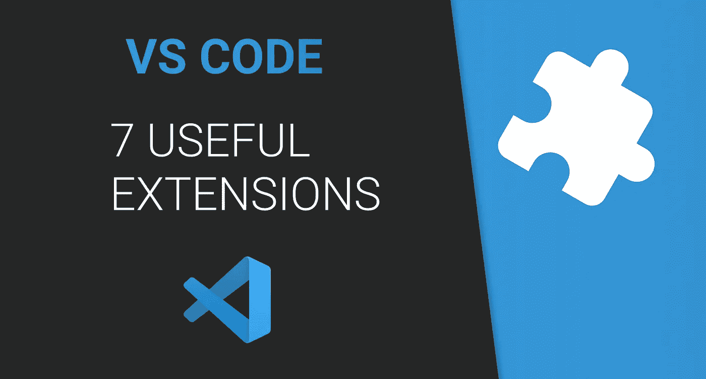
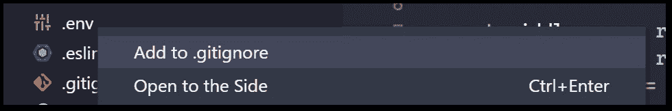
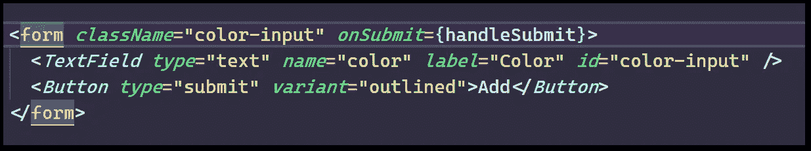
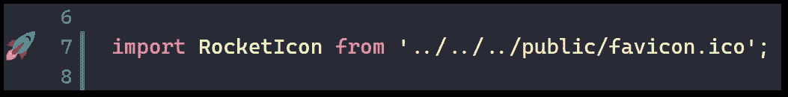
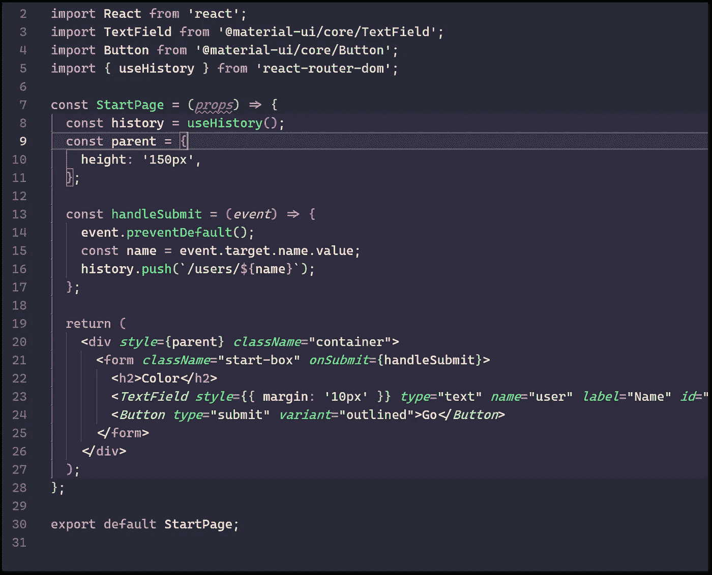
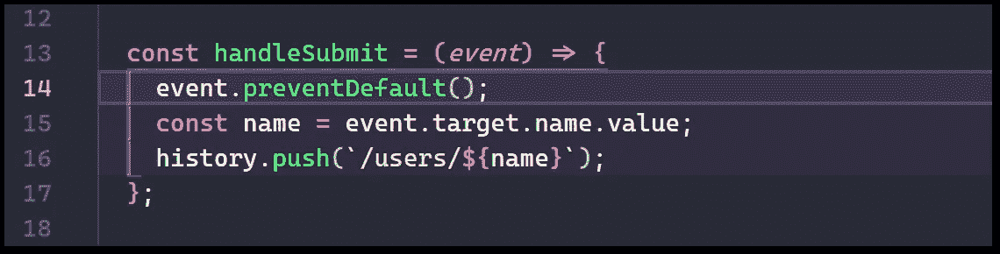
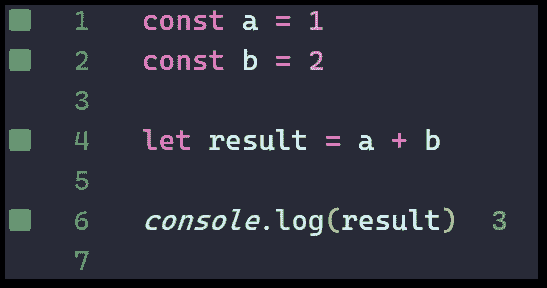
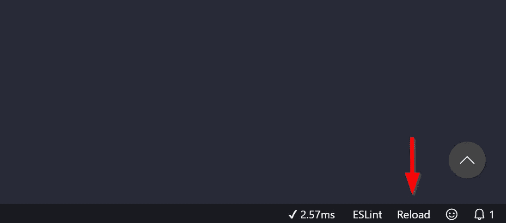

# 我最喜欢的 7 个 VS 代码扩展(还没有提到)

> 原文：<https://betterprogramming.pub/my-7-favorite-vs-code-extensions-that-everyone-hasnt-mentioned-yet-4f3945d82be5>

## 使用这些不太知名的扩展来提高您的工作效率

# VS 代码的扩展

像许多其他人一样，我喜欢定制我的 [VS 代码](https://code.visualstudio.com/)设置。我一直在寻找新的插件、设置、主题、字体和生产力技巧来提升我的体验。

有时，我可能花更多的时间在工作上，而不是完成任何工作。

我总是看到关于 VS 代码的新文章，我可能会阅读所有的文章，但大多数文章总是包含相同的伟大插件。你懂的，[括号对上色器 2](https://marketplace.visualstudio.com/items?itemName=CoenraadS.bracket-pair-colorizer-2) ，[漂亮器](https://github.com/prettier/prettier-vscode)， [GitLens](https://marketplace.visualstudio.com/items?itemName=eamodio.gitlens) ，[自动重命名标签](https://marketplace.visualstudio.com/items?itemName=formulahendry.auto-rename-tag)，[直播服务器](https://marketplace.visualstudio.com/items?itemName=ritwickdey.LiveServer)，[书签](https://marketplace.visualstudio.com/items?itemName=alefragnani.Bookmarks) …

我想大多数人已经知道并使用它们，因为它们非常有用。

因此，我决定创建一个列表，列出一些我最喜欢的 VS 代码扩展，它们不像前面提到的那些那样流行和知名。所以，事不宜迟，让我们开始吧！

# 1.Gitignore

这个[小插件](https://marketplace.visualstudio.com/items?itemName=michelemelluso.gitignore#overview)挺简单的。它只是在你右击一个文件时添加一个`Add to .gitignore`菜单选项。方便，如果你想快速添加它没有任何麻烦。

# 2.突出显示匹配的标签

嗯，它确实如其名。[突出显示匹配标签](https://marketplace.visualstudio.com/items?itemName=vincaslt.highlight-matching-tag)突出显示匹配的结束标签，无论它是在同一行还是在编辑器的远端。

当您在中嵌套了几个选项卡并且有几行代码要处理时，这尤其有用。即使它可能会在类似图片中的情况下得到很好的使用，但它并没有真正给予插件公正…

# 3.图像预览

一个小的[插件](https://marketplace.visualstudio.com/items?itemName=kisstkondoros.vscode-gutter-preview)，它只是在你的编辑器的左侧显示一个预览。

不管是导入语句还是在实际代码中。只要参考图片，都是这样显示的。

# 4.缩进块突出显示

这是我的最新发现——我真的很喜欢它。我不能相信这不是更受欢迎。

它也确实如其名所示。它突出显示您当前正在使用的缩进块。在我的例子中，它突出显示了整个`StartPage`组件。

比方说，我将进入`HandleSubmit`组件，只有那部分会被突出显示。像这样:

# 5.阔卡

Quokka 就像一个 JavaScript(或 TypeScript)的动态便签簿。它为您提供了代码结果的实时预览，无论是错误还是值。如果你正在尝试一些新的概念，或者只是想玩玩，这是很棒的。

# 6.重新加载

我喜欢非常简单的。这只是在你的底部栏增加了一个`[Reload](https://marketplace.visualstudio.com/items?itemName=natqe.reload)`按钮。不会改变生活，但我比我想象的更经常使用它。

# 7.TabOut

开发人员似乎很擅长给他们的应用程序命名。这个[插件](https://marketplace.visualstudio.com/items?itemName=albert.TabOut)本质上允许你使用`tab`来跳出引号或括号。我已经习惯了使用 IntelliJ，现在，我已经离不开它了。

这是我日常使用的七个我最喜欢的 VS 代码扩展。他们可能不是最受欢迎的——他们中的一些人只是愚蠢地简单——但他们完成了工作。