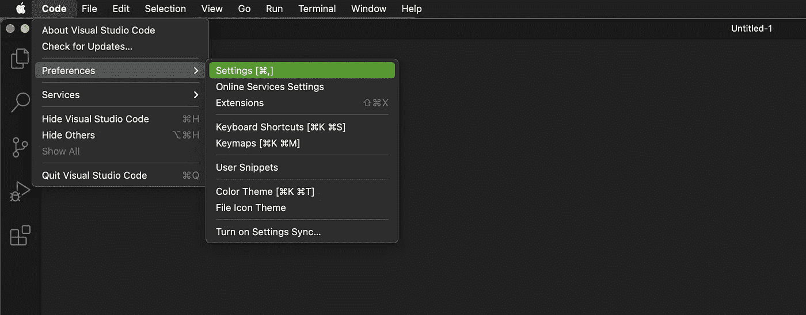
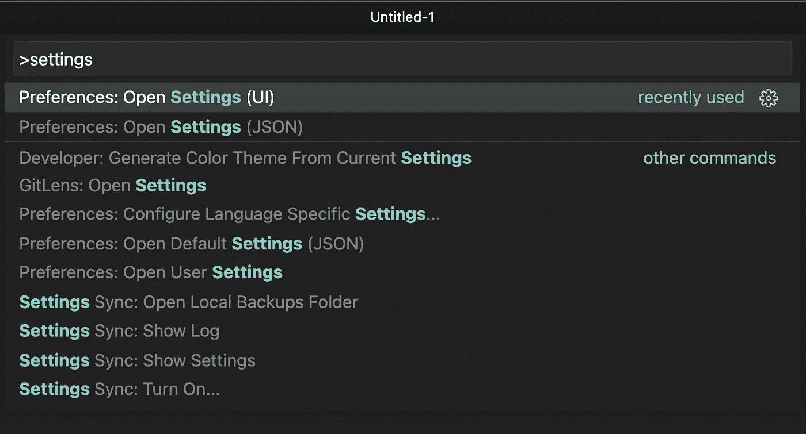
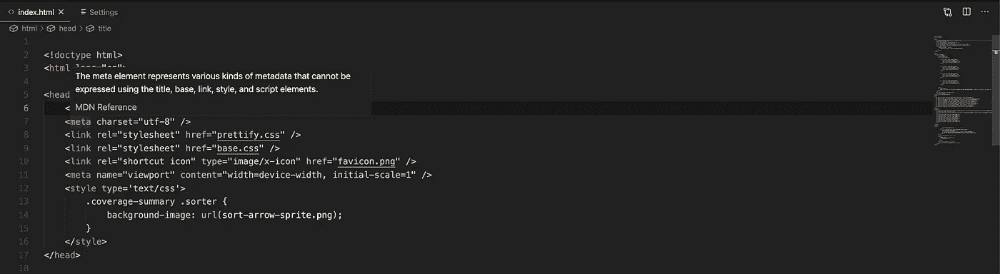
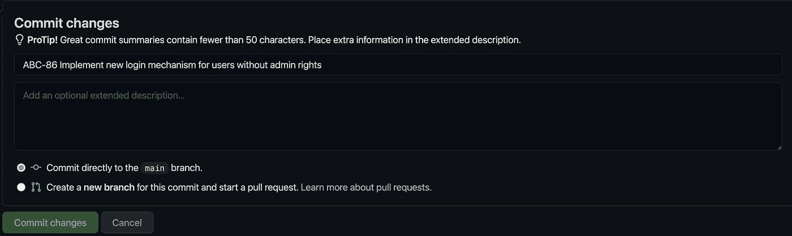
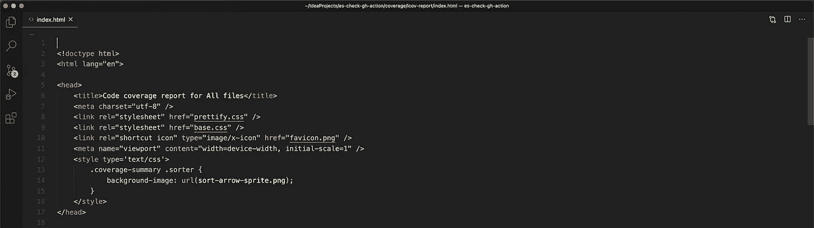

# 我为 Visual Studio 代码推荐的 7 个设置

> 原文：<https://betterprogramming.pub/my-7-recommended-settings-for-visual-studio-code-96fbd9f5e21a>

## 如果我们花这么多时间在 ide 中工作，那么我们至少应该感到舒服

照片由 [Unsplash](https://unsplash.com?utm_source=medium&utm_medium=referral) 上的 [Clément Hélardot](https://unsplash.com/@clemhlrdt?utm_source=medium&utm_medium=referral) 拍摄

在过去几年中，Visual Studio 代码已经成为各类开发人员的热门选择。VS 代码有很多让人喜欢的地方:它支持多种语言；有许多免费的扩展可用；它经常更新，源代码可以在 GitHub 上找到。

在使用 Eclipse 一段时间后，我很快就接受了 IntelliJ IDEA (Ultimate)作为我最喜欢的 IDE。不过，在过去的两年里，我也成为了《T4》VS《代号 T5》的粉丝。作为一个经常使用 VS 代码和 IntelliJ IDEA 的人，我很欣赏它们各自带来的东西。尽管如此，我有时发现自己在调整 VS 代码，以反映 IntelliJ IDEA 的某些行为。

虽然扩展增加了新的功能，但是 VS 代码已经内置了许多功能，可以根据您的喜好进行定制。这些是我在 VS 代码中调整的设置，以改善我的开发者体验。当然，这个列表是高度主观的，因为每个人都有不同的背景和偏好。

*   链接编辑
*   迷你地图
*   自动保存
*   Git 输入验证主题长度
*   窗口标题
*   窗口缩放级别
*   预览编辑器

# 如何更改 VS 代码中的设置

您可以使用菜单或命令面板来访问 VS 代码设置。

通过菜单访问设置

通过命令选项板访问设置

我更喜欢使用命令面板(在 Mac 上，你可以按下 *⇧⌘P* 来打开它)。一方面，我经常用它不仅改变设置，还创建一个新的 Git 分支或重新加载窗口。另一方面，它也允许你以 JSON 的方式打开设置。这很方便，因为它允许您轻松地复制和粘贴设置。

能够搜索 VS 代码设置是非常受欢迎的，因为有很多设置(如果你已经安装了一些扩展，那么你会得到更多的设置)。

事不宜迟，让我们来看看我根据自己的喜好定制的设置。

# **editor.linkedEditing —** 编辑器:链接编辑

控制编辑器是否启用了链接编辑。取决于语言、相关符号(如 HTML 标签)是否在编辑时更新。

我已经把它调到了`true`。作为一个喜欢前端开发的人，我经常使用 HTML 模板。默认情况下，VS 代码会自动关闭 HTML 标签——这是一个很好的便利特性。然而，让我恼火的是，如果我更改了一个标签(例如，将一个`<a>`更改为一个`<button>`)，VS 代码不会同时更新另一个标签。

由于缺少 IntelliJ 内置的这个特性，我最近在网上搜索了一下。我无法想象 VS 代码不支持这个特性。幸运的是，VS 代码也支持这个特性——这使得使用 HTML 更加容易。

# Editor . Minimap . Enabled-Editor Minimap:已启用

控制是否显示小地图。

我已经设置到`false`了。在我看来，它造成了视觉混乱，而不是真正帮助我在一个文件中工作。不过，我很欣赏小地图还能让你快速浏览文件。

VS 代码中的小地图(在右侧)

# **文件.自动保存—** 自动保存

控制脏编辑器的自动保存。

> `off` -禁用自动保存。
> `afterDelay` -经过配置的延迟(默认为 1000 毫秒)后保存文件。
> `onFocusChange` -当焦点移出编辑的脏文件时保存文件。
> `onWindowChange` -当焦点移出 VS 代码窗口时保存文件。

我已经设置到`onWindowChange`了。默认情况下，VS 代码需要一个显式的操作来将您的更改保存到磁盘。我通常不喜欢手动保存——我们都知道忘记保存的模因。在我看来,`onWindowChange`是一个合理的选择，因为只有当焦点移出 VS 代码窗口时，更改才会被保存。例如，您可以通过 VS 代码修改 HTML 元素的样式，并切换到您的浏览器来查看更改，而不必手动保存。只要你有一台快的机器，就感觉有点神奇。

# Git . inputvalidationsubjectlength-Git:输入验证主题长度

控制显示警告的提交消息主题长度阈值。

我把它调到了`72`。一个好的做法是保持提交主题简短，并将细节放入扩展描述中。72 不算特别高也不算太矮。不过，我打算将来把这个数字设置得更低(正如你在下面看到的，当你的提交摘要超过 50 个字符时，GitHub 会警告你)。

在 GitHub 中提交消息主题验证

# Window . Title-窗口:标题

基于活动编辑器控制窗口标题。基于上下文替换变量:

`${activeEditorShort}`:文件名(如 myFile.txt)。
`${activeEditorMedium}`:文件相对于工作区文件夹的路径(如 my folder/my file folder/my file . txt)。
`${activeEditorLong}`:文件的完整路径(如/Users/Development/my folder/my file folder/my file . txt)。
`${activeFolderShort}`:文件所在文件夹的名称(如 myFileFolder)。
`${activeFolderMedium}`:文件所在文件夹的路径，相对于工作区文件夹(如 myFolder/myFileFolder)。
`${activeFolderLong}`:文件所在文件夹的完整路径(如/Users/Development/my folder/my file folder)。
`${folderName}`:文件所在工作区文件夹的名称(如 myFolder)。
`${folderPath}`:文件所在工作区文件夹的文件路径(如/Users/Development/myFolder)。
`${rootName}`:工作区的名称(如 myFolder 或 myWorkspace)。
`${rootPath}`:工作区的文件路径(如/Users/Development/myWorkspace)。
`${appName}`:例如 VS 代码。
`${remoteName}`:例如 SSH
`${dirty}`:如果活动编辑器是脏的，则为脏指示器。
`${separator}`:条件分隔符(“-”)，仅在被带有值的变量或静态文本包围时显示。

我已经设置为`${activeEditorLong}${separator}${rootName}`。我们在窗口标题中有很多空间，所以为什么不用它来显示我们在哪里。

通过显示当前编辑文件的完整路径来利用窗口标题区域中的空间

# **窗口.缩放级别—** 窗口:缩放级别

调整窗口的缩放级别。原始大小为 0，高于(例如 1)或低于(例如-1)的每个增量代表放大或缩小 20%。您也可以输入小数，以更精细的粒度调整缩放级别。

我已经设置为`0.8`。虽然您可以像在任何浏览器中一样放大和缩小(请记住:VS 代码是基于 Electron 构建的，这意味着它基本上是 Chromium)，但您可以通过使用设置以更高的精度调整缩放级别。这个改变的设置让我看代码更舒服。

# **work bench . Editor . Enable Preview—**work bench 编辑器:启用预览

控制打开的编辑器是否显示为预览。预览编辑器不保持打开，并且被重用，直到被明确设置为保持打开(例如，通过双击或编辑)。它们以斜体字体显示。

我已经把它调到了`false`。我明白这个特性背后的想法，但在大多数情况下，我只是不需要它。通过禁用此功能，在文件资源管理器中单击文件时会打开一个普通编辑器。

# 结论

感谢您阅读这篇关于我最喜欢的 VS 代码调整的短文。VS 代码的可扩展性和灵活性是使用 VS 代码的有力理由。我有兴趣听听你最喜欢的 VS 代码设置。请在评论中告诉我。

PS:如果你对我使用的 VS 代码主题感兴趣，那么看看[材质主题](https://marketplace.visualstudio.com/items?itemName=Equinusocio.vsc-material-theme)。